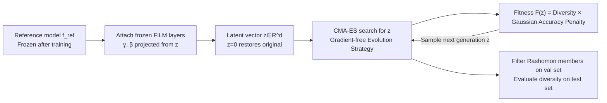

# DIVERSE: Disagreement-Inducing Vector Evolution for Rashomon Set Exploration

**Conference**: ICLR 2026  
**OpenReview**: [https://openreview.net/forum?id=kQjSUHC84V](https://openreview.net/forum?id=kQjSUHC84V)  
**Code**: To be confirmed  
**Area**: Interpretability / Model Multiplicity (Rashomon Set)  
**Keywords**: Rashomon Set, Predictive Multiplicity, FiLM, CMA-ES, Gradient-free search, Model diversity  

## TL;DR
A frozen FiLM modulation layer is attached to a pre-trained network. CMA-ES is then used to perform a gradient-free search in a low-dimensional latent space for variants that are as accurate as the reference model but exhibit different predictive behaviors. This enables the systematic exploration of the Rashomon set of deep networks without retraining.

## Background & Motivation
**Background**: Many machine learning tasks possess a large set of models with similar accuracy but different decision paths—a phenomenon known as the Rashomon effect (also called model multiplicity). These equivalent models may produce different predictions (predictive multiplicity) for the same input, a property utilized for uncertainty estimation, fairness, and interpretability. While the Rashomon set is well-characterized for simple models like decision trees and generalized additive models, it remains under-explored for deep networks.

**Limitations of Prior Work**: The hypothesis space of deep networks is enormous, making it expensive to enumerate diverse models within the "narrow band" of optimal performance. Existing approximation methods have several drawbacks: (1) **Retraining** (changing seeds/hyperparameters/augmentation) allows for global exploration but is costly and does not guarantee equal-performance models; (2) **Adversarial Weight Perturbation (AWP)** requires separate optimization for every (sample, class) pair, making it slower than retraining and infeasible for large models; (3) **Dropout Sampling** is training-free and fast but offers limited diversity, lacks explicit control, and evaluates Rashomon membership directly on the test set, leading to optimistic bias.

**Key Challenge**: How to generate diverse variants "efficiently and controllably" without retraining or gradients, while ensuring that diversity represents true generalization rather than over-optimization of the search process.

**Goal**: To propose a gradient-free framework emphasizing efficiency and explicit diversity control to explore the local Rashomon set of deep networks without retraining.

**Core Idea**: **Shift the search for diverse models from the weight space to a low-dimensional latent space.** By freezing the weights of the original network and attaching randomly initialized, frozen FiLM modulation layers, a shared latent vector $z$ is used to coordinately fine-tune internal activations across the entire network. CMA-ES, which excels in non-separable and non-convex landscapes, is then used to search for this latent vector with the objective of "approximating reference accuracy while maximizing predictive disagreement."

## Method

### Overall Architecture
DIVERSE consists of three steps: (i) obtain a reference model $f_{\text{ref}}$ via standard supervised training to define the Rashomon threshold; (ii) wrap the network into a "modulation space" parameterized by a latent vector $z$ using frozen FiLM layers, where $z=0$ reconstructs the original network; (iii) use CMA-ES to search for $z$ in this low-dimensional space such that the resulting variant $f_z$ remains within the Rashomon set while maximizing disagreement with the reference model. The entire pipeline does not modify original weights or require gradients.

### Key Designs

**1. FiLM Modulation Space: converting "retraining for variants" into "searching a low-dimensional vector."** A FiLM affine transformation $\text{FiLM}(h;z)=\gamma(z)\odot h+\beta(z)$ is inserted into the pre-activations $h$ of the pre-trained network, where $\gamma(z)=1+\tanh(zW_\gamma)$ and $\beta(z)=\tanh(zW_\beta)$. The projection matrices $W_\gamma, W_\beta \in \mathbb{R}^{d\times C}$ are randomly initialized using $\mathcal{N}(0,0.5^2)$ and then **frozen**. The $\tanh$ function limits modulation magnitudes to $\gamma\in[0,2]$ and $\beta\in[-1,1]$ to prevent instability. The point $z=0$ naturally recovers the reference model ($\gamma=1, \beta=0$), serving as the search anchor. Since all FiLM layers share the same $z$, a single vector can coordinately alter internal representations across the network. This compresses the high-dimensional weight space into a reproducible, low-dimensional "modulation space" smoothly controlled by $z$ without additional hyperparameters. The paper suggests three insertion points based on architecture: after dense layers, after convolutional blocks (+BN), and on residual shortcuts.

**2. CMA-ES for Non-separable Latent Spaces: Why use this optimizer.** Each coordinate of $z$ simultaneously affects multiple FiLM layers, leading to strong coupling between dimensions and a non-separable landscape. CMA-ES maintains a full covariance matrix $x_k^{(g)}\sim\mathcal{N}(m^{(g)},\sigma^{(g)2}C^{(g)})$, allowing it to learn correlation structures in any direction and providing rotation invariance, which suits this coupled landscape. Being gradient-free, it fits the setting where weights are frozen. To mitigate the cost of the full covariance matrix at high dimensions, the latent dimension $d$ is kept small ($d\in\{2,\dots,64\}$), with a population size $\text{popsize}=4+3\log d$ and an evaluation budget of $kd$ ($k=80$ per dimension).

**3. Fitness Function: Product of soft accuracy constraints and dual diversity.** The fitness function must balance "not deviating from reference accuracy" with "amplifying predictive disagreement." A relative loss increment is defined as $\Delta(z)=\frac{L_{\text{train}}(z)-L^{\text{ref}}_{\text{train}}}{L^{\text{ref}}_{\text{train}}+10^{-8}}$. A Gaussian penalty $\phi_\epsilon(z)=\exp(-\frac{\Delta(z)^2}{2\epsilon^2})$ centered at 0 is used to **softly** enforce the Rashomon parameter $\epsilon$. Candidates close to the reference are barely penalized, while those deviating significantly are exponentially downweighted rather than hard-rejected, ensuring diverse candidates on the Rashomon boundary are not discarded. Diversity is measured by combining soft disagreement (Total Variation Distance, $\text{TVD}(P,Q)=\frac12\sum_i|P_i-Q_i|$) and hard disagreement (prediction label inconsistency ratio $\text{Dis}$) with $\lambda=0.5$: $\text{Div}_\lambda(z)=\lambda\,\text{TVD}+(1-\lambda)\,\text{Dis}$. The final fitness is the product $F(z)=\text{Div}_\lambda(z)\cdot\phi_\epsilon(z)$. To prevent over-optimization, Rashomon constraints are filtered on the validation set, while diversity results are reported on the held-out test set.

## Key Experimental Results

### Main Results
On MNIST (3-layer MLP), PneumoniaMNIST (ResNet-50 transfer), and CIFAR-10 (VGG-16), compared to retraining and dropout sampling, the runtime (hh:mm:ss) for generating $m$ candidate models is:

| Method | MNIST (m=162) | MNIST (m=640) | Pneumonia (m=162) | Pneumonia (m=640) | CIFAR-10 (m=162) | CIFAR-10 (m=640) |
|------|------|------|------|------|------|------|
| Retrain | 00:29:39 | 01:57:36 | 02:09:00 | 08:16:00 | 03:17:26 | 12:37:27 |
| Dropout | 00:00:30 | 00:01:57 | 00:01:32 | 00:05:47 | 00:01:58 | 00:06:30 |
| **DIVERSE** | 00:00:50 | 00:03:16 | 00:01:49 | 00:07:15 | 00:02:11 | 00:08:42 |

While retraining takes hours, DIVERSE completes in minutes (two to three orders of magnitude faster), only slightly slower than dropout. Regarding diversity: On MNIST, DIVERSE surpasses retraining in discrepancy at larger $\epsilon$ and outperforms dropout across the board (except VPR). On CIFAR-10, it exceeds dropout on all metrics. On PneumoniaMNIST, it exceeds both at high $\epsilon$ but is weaker under strict thresholds.

### Ablation Study

| Ablation Dimension | Setting | Key Findings |
|----------|------|----------|
| Latent dimension $d$ | $\{2,4,8,16,32,64\}$ | On MNIST, all $d$ form sets; diversity gains diminish at high $d$. On CIFAR/Pneumonia, $d\in\{2,4\}$ works for all $\epsilon$, but $d\ge16$ fails to find sets. |
| Initialization | $z=0$ vs $z=1$ vs Gaussian | $z=0$ as an anchor is the most stable; $z=1$ often fails. |
| Step size $\sigma_0$ | $\{0.1,\dots,0.5\}$ | Larger steps provide more diversity for MNIST; smaller steps are more effective for Pneumonia/CIFAR. |
| Mixing weight $\lambda$ | $[0,1]$ | Results are generally insensitive to $\lambda$ as soft/hard disagreement are highly correlated. |

### Key Findings
- **Diversity grows monotonically with $\epsilon$**: Discrepancy and ambiguity increase as Rashomon thresholds are relaxed across all datasets, confirming the discovery of functionally distinct solutions.
- **Localized Layer-wise Sensitivity**: $\Delta$TVD analysis shows only a small subset of FiLM sites drive disagreement. Early layers dominate in MNIST, middle convolutions in VGG-16, and early-to-middle layers in ResNet-50. This suggests future searches could focus only on sensitive layers.
- **Constraints by Complexity**: Maintaining performance is harder in deeper models (lower Rashomon Ratio), but diversity still grows with $\epsilon$.

## Highlights & Insights
- **Compressing the search space from weights to latent vectors** is the core ingenuity. FiLM + shared $z$ allows unified control of "network-wide collaborative fine-tuning" via a $d$-dimensional vector, retaining expressiveness while reducing dimensionality to a range CMA-ES can handle efficiently.
- **Soft constraints + product fitness** design is precise: Using a Gaussian penalty instead of hard rejection preserves highly valuable diverse candidates near the Rashomon boundary. The product form naturally suppresses candidates that fall out of the set.
- **Methodological Rigor**: Filtering members on the validation set and evaluating diversity on the test set explicitly corrects for the optimistic bias found in dropout methods (where the same data is used for both selection and evaluation).

## Limitations & Future Work
- **Latent Dimension Scalability**: Full-covariance CMA-ES becomes expensive at high dimensions. For $d\ge16$ in complex datasets, it rarely finds valid sets, limiting the upper bound of explorable diversity.
- **Local Rashomon Set Limitation**: The modulation space starting from a reference model is inherently a local search and cannot achieve the global coverage of retraining. Absolute diversity under strict $\epsilon$ still trails behind retraining.
- **Dependency on Reference and Manual Placement**: FiLM insertion strategies require manual architectural design, and the entire set remains anchored around a single $f_{\text{ref}}$.
- **Future Work**: Layer-wise sensitivity analysis suggests focusing CMA-ES search on a few high-sensitivity FiLM layers rather than the whole network, which could further reduce costs and scale to larger models.

## Related Work & Insights
- **Rashomon / Model Multiplicity Taxonomy**: The framework builds on Breiman's Rashomon effect, Semenova et al.'s Rashomon sets/ratio, Marx et al.'s predictive multiplicity, and metrics like Rashomon Capacity (Hsu & Calmon) and VPR (Watson-Daniels et al.).
- **Comparison of Approximations**: Retraining (Ganesh; Eerlings et al.), AWP (Hsu & Calmon), and dropout sampling (Hsu et al.) serve as direct points of comparison and improvement for this work.
- **FiLM Adaptation**: Originally for conditional computation (Perez et al.), FiLM-like mechanisms have been used for domain generalization and uncertainty. This work innovatively repurposes FiLM to define a family of modulated models around a fixed reference network.
- **Insight**: Reformulating "model diversity search" as "gradient-free evolution in a low-dimensional latent space" is a paradigm that can be transferred to other scenarios requiring retraining-free generation of diverse models (ensembles, uncertainty, fairness auditing).

## Rating
- Novelty: ⭐⭐⭐⭐ —— Combining FiLM modulation space with CMA-ES for DNS Rashomon exploration is a novel and self-consistent perspective; the soft-constraint fitness design is clever.
- Experimental Thoroughness: ⭐⭐⭐ —— Three datasets and architectures with sufficient ablations on $d, \sigma_0$, and initialization, though limited to CIFAR-10/VGG-16 scale without large-scale validation.
- Writing Quality: ⭐⭐⭐⭐ —— Clear motivation, complete technical details, and solid grounding in metrics and background.
- Value: ⭐⭐⭐⭐ —— Provides a practical tool that is two to three orders of magnitude faster than retraining with explicit diversity control, offering significant utility for multiplicity research scalability.

<!-- RELATED:START -->

## Related Papers

- [\[ICLR 2026\] Inducing Dyslexia in Vision Language Models](inducing_dyslexia_in_vision_language_models.md)
- [\[ICML 2026\] From Rashomon Theory to PRAXIS: Efficient Decision Tree Rashomon Sets](../../ICML2026/interpretability/from_rashomon_theory_to_praxis_efficient_decision_tree_rashomon_sets.md)
- [\[ICLR 2026\] Evolution of Concepts in Language Model Pre-Training](evolution_of_concepts_in_language_model_pre-training.md)
- [\[ICLR 2026\] Hyper-SET: Designing Transformers via Hyperspherical Energy Minimization](hyper-set_designing_transformers_via_hyperspherical_energy_minimization.md)
- [\[ICLR 2026\] GEPA: Reflective Prompt Evolution Can Outperform Reinforcement Learning](gepa_reflective_prompt_evolution_can_outperform_reinforcement_learning.md)

<!-- RELATED:END -->
