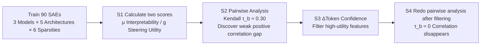

# Does Higher Interpretability Imply Better Utility? A Pairwise Analysis on Sparse Autoencoders

**Conference**: ICLR 2026  
**OpenReview**: [https://openreview.net/forum?id=Q4ooLNOFeR](https://openreview.net/forum?id=Q4ooLNOFeR)  
**Code**: [https://github.com/Xu0615/SAE4Steer](https://github.com/Xu0615/SAE4Steer)  
**Area**: Interpretability & Steering  
**Keywords**: Sparse Autoencoder, LLM Steering, Interpretability-Utility Gap, Feature Selection, Kendall's $\tau$  

## TL;DR
The authors trained 90 SAEs for systematic comparison and found only a weak positive correlation between "more interpretable features" and "better steering utility" ($\tau_b \approx 0.30$). They proposed the **$\Delta$Token Confidence** feature selection criterion, which improves steering scores by 52.52%. On the selected high-efficiency features, the correlation between interpretability and steering utility completely disappeared or even became negative.

## Background & Motivation
**Background**: Sparse Autoencoders (SAEs) decompose LLM hidden states into sparse, human-readable "features" and are current star tools in interpretability research. A default-accepted assumption is that since SAE features are interpretable, they are naturally suitable for "steering" model behavior—injecting a specific feature direction (e.g., the concept of "cake") into the residual stream to precisely control the output. Many SAE-based steering works are built on this assumption.

**Limitations of Prior Work**: This assumption has never been rigorously tested. The training objectives of SAEs are reconstruction and sparsity, rather than downstream steering utility; thus, "interpretable" and "useful" are likely two different things. However, the community generally uses interpretability scores as a proxy for steering utility, lacking quantitative evidence.

**Key Challenge**: **Does higher interpretability truly imply stronger steering utility?** If the correlation between the two is weak, training SAEs guided by interpretability will not help improve control capabilities. If the two are uncorrelated even among "useful features," it indicates that interpretability and utility are fundamentally decoupled dimensions.

**Goal**: Use large-scale pairwise experiments to quantify the rank consistency between interpretability and steering utility, locate truly steering-capable features, and characterize the "interpretability-utility gap."

**Core Idea**: **(1) Pairwise rank consistency analysis**—Train 90 SAEs, measure interpretability with SAEBENCH and steering utility with AXBENCH, use Kendall $\tau_b$ to measure rank consistency, and perform axial conditional analysis to eliminate confounding factors. **(2) $\Delta$Token Confidence feature selection**—Not all interpretable features can steer; use "the change in confidence of the next token distribution after amplifying a single feature" to select truly high-utility features.

## Method

### Overall Architecture
The paper proposes a four-step diagnostic pipeline rather than a new model: first, calculate interpretability and steering scores for each SAE (S1); perform pairwise analysis to discover the "weak positive correlation" gap (S2); suspecting that the conclusion is contaminated by "many features that cannot steer at all," use $\Delta$Token Confidence to filter high-utility features (S3); then redo the pairwise analysis on the filtered features (S4), leading to the counter-intuitive conclusion that the "gap actually widens."

### Key Designs

**1. Pairwise rank consistency analysis: Using Kendall $\tau_b$ to quantify "Can interpretability predict steering utility?"** The authors abandon absolute value comparisons in favor of a more robust question: In a pool of SAEs, if A is more interpretable than B, is A also better for steering? For each SAE $\theta$, a pair of values $(\mu(\theta), g(\theta))$ is recorded, where $\mu$ is the interpretability score and $g$ is the steering score. For any two SAEs, a consistency indicator is defined as $v_{ij}=\mathrm{sign}(\mu(\theta_i)-\mu(\theta_j))\cdot\mathrm{sign}(g(\theta_i)-g(\theta_j))$, and Kendall’s $\tau_b$ rank correlation coefficient with tie correction is used to aggregate the consistency of all unordered pairs, with values in $[-1,1]$. A $\tau_b$ closer to 1 indicates more consistent rankings. Interpretability uses the AutoInterp Score from SAEBENCH (LLM-as-judge predicting average precision of feature activations), and steering utility uses the Steering Score from AXBENCH (harmonic mean of Concept, Instruction, and Fluency scores: $\mathrm{HM}(C,I,F)$).

**2. Axial conditional analysis: Eliminating confounding trends from hyperparameters.** Global rank correlation may be biased by hyperparameters that "simultaneously affect interpretability and utility." The authors split the SAE design space into three orthogonal axes—Architecture (A), Sparsity (B), and Base Model (C). For each axis, they vary only one while fixing others to form matched groups, calculate $\tau_b$ within groups, and then average them to get axial statistics $\psi_i=\frac{1}{|\mathcal{G}_i|}\sum_{G\in\mathcal{G}_i}\tau(\{(\mu,g):\theta\in G\})$. Finally, these are aggregated into an axial control coefficient $\Psi=\frac{1}{n}\sum_i\psi_i$. This avoids cross-axis trends (like architectural shifts) from masking the true local relationships. The result shows a global $\tau_b \approx 0.30$ and an axial-controlled $\Psi \approx 0.25$, both positive but weak, and heavily dependent on architecture (Gated is even negative), sparsity (more consistent when sparser, but flips as features increase), and the model (Qwen is strongest, Gemma-2-2B is weakest).

**3. $\Delta$Token Confidence: Selecting truly steerable features via confidence change.** Drawing from the idea of entropy mechanisms in LLM reasoning, the authors believe that features that "can significantly change the next token distribution after amplification" are high-utility candidates. They define top-k token confidence as $C_k(p)=-\frac{1}{k}\sum_{j\in I_k(p)}\log p_j$ (where $I_k$ is the set of indices for the k most probable tokens; smaller $C_k$ means higher confidence), which characterizes the sharpness of the head distribution more directly than entropy. They then amplify the coefficient of a single SAE feature $f$ by $\alpha$ times while keeping others fixed, and compare the confidence difference before and after intervention: $\Delta C_k(f;\ell,\alpha)=C_k(p^{\mathrm{int}}_{f,\ell,\alpha})-C_k(p^{\mathrm{base}})$. $\Delta C_k < 0$ indicates that amplifying the feature makes the distribution sharper (the model becomes more certain). This can be calculated with just one baseline and one intervention forward pass. Finally, features are ranked by $|\Delta C_k|$ and filtered—the best results are achieved with $k=1$.

**4. Baseline: output-score selector.** For a fair comparison, the authors reproduce the output score method from Arad et al.: use logit-lens to select a representative token set $M$ and compare the aggregated support for $M$ before and after intervention $P(M)=\left(1-\frac{\min_{i\in M}\mathrm{rank}(i)}{|V|}\right)\max_{i\in M}p(i)$. The single-feature steering score is $S_{\mathrm{out}}=P_{\mathrm{int}}(M)-P_{\mathrm{base}}(M)$. This measures whether amplifying a feature raises the rank and probability of representative tokens and is currently the strongest output-oriented selector, serving as the primary competitor for $\Delta$Token Confidence.

## Key Experimental Results

### Main Results: Steering Scores After Feature Selection (Table 2)
Evaluation using CONCEPT100 on three LLMs, comparing no selection, output-score selection, and $\Delta$Token Confidence selection:

| Method | Gemma-2-2B | Qwen-2.5-3B | Gemma-2-9B |
|------|:---:|:---:|:---:|
| SAE-based (No Selection) | 0.133 | 0.171 | 0.142 |
| +Output (Arad et al.) | 0.233 | 0.292 | 0.255 |
| **+$\Delta C_k$ (Ours)** | **0.328** | **0.399** | **0.289** |

$\Delta$Token Confidence comprehensively outperforms the no-selection baseline and the output-score selector across all three models, with an average improvement of **52.52%** over the strongest competitor.

### Pairwise Analysis: Before vs After Selection (Table 1 vs Table 3)

| Stage | Overall $\tau_b$ | Axial Control $\Psi$ | Conclusion |
|------|:---:|:---:|------|
| Before Selection $g_{\mathrm{base}}$ | 0.2979 | 0.2499 | Weak positive correlation, interpretability-utility gap exists |
| After Selection $g_{\mathrm{high}}$ | 0.0823 | 0.0681 | Correlation disappears, statistically identical to 0 |

Axial details (before selection): Architecture $\Psi_A \approx 0.26$ (Gated drags performance down at $-0.20$, JumpReLU is highest at $0.42$); Sparsity $\Psi_B \approx 0.17$ (most consistent at $L_0 \approx 50$ with $0.54$, reverses to $-0.22$ at $L_0 \approx 520$); Model $\Psi_C \approx 0.33$ (Qwen strongest at $0.46$).

### Key Findings
- **Interpretability is a weak proxy for steering utility**: $\tau_b \approx 0.30$, while positive, is far from sufficient to serve as a proxy metric.
- **$\Delta$Token Confidence stably identifies high-utility features**: Among five architectures, BatchTopK shows the most stable and significant improvements.
- **The gap expands rather than shrinks on high-utility features**: Once focused on the most useful features, high interpretability completely fails to predict steering quality ($\tau_b \approx 0$), and may even be negatively correlated.

## Highlights & Insights
- **Debunked a default community assumption**: Interpretability $\neq$ controllability. This is an important warning for the technical path of "using SAEs for safety steering"—interpretability scores should no longer be used as proxies for steering utility.
- **Scalable empirical rigor**: 90 SAEs across 3 models × 5 architectures × 6 sparsities, combined with permutation test p-values, bootstrap confidence intervals, and axial conditional analysis to remove confounding factors, making the conclusions far more credible than small-sample observations.
- **Simple and effective $\Delta$Token Confidence**: Requires only one extra forward pass, no training or labeling, and selects features directly from the change in distribution sharpness. It is both a practical engineering tool and evidence that "utility stems from the actual influence on output distribution rather than semantic readability."
- **Counter-intuitive core finding**: The gap expands after filtering, indicating that interpretability and utility are two orthogonal dimensions; the most useful features are often precisely not the most readable ones.

## Limitations & Future Work
- **Defined utility is limited**: Utility refers only to the steering effect under the AXBENCH protocol and does not cover other downstream tasks (e.g., classification probes, knowledge editing); generalizability of the conclusions should be treated with caution.
- **Fixed intermediate layers and dictionary widths**: SAEs were trained only on a single intermediate layer with a 16k width; the effects of layer selection and width on the gap have not been fully explored.
- **Answers "what" but not "how"**: The paper diagnoses the gap but does not provide a training paradigm that is "both interpretable and high-utility." The authors explicitly leave "leveraging utility-oriented SAE training objectives" for future work.
- **Theoretical basis for $\Delta$Token Confidence is empirical**: Borrowing intuition from entropy mechanisms, the lack of deeper theoretical characterization of why confidence changes predict steering utility remains.

## Related Work & Insights
- **Activation steering**: Injecting directions into residual flows to control behavior is lightweight but coarse due to polysemanticity; this paper mitigates this by using sparse, interpretable SAE features as directions with utility filtering.
- **SAE-based steering**: Using decoder atoms as steering directions; this paper systematically questions the premise that "interpretable means useful."
- **Entropy/Confidence mechanisms** (Fu et al., Wang et al.): Originally used to evaluate LLM reasoning quality, this paper creatively migrates them to SAE feature selection.
- **Insight**: When evaluating interpretability methods, "downstream utility" should be measured as an independent dimension rather than assuming interpretability automatically brings utility; future SAE training may need to explicitly balance reconstruction, interpretability, and utility.

## Rating
- **Novelty**: ⭐⭐⭐⭐⭐ First large-scale quantification of the "interpretability-utility gap," providing the counter-intuitive "widening gap after filtering" conclusion; the problem itself is highly valuable.
- **Experimental Thoroughness**: ⭐⭐⭐⭐⭐ 90 SAEs across 3 models, 5 architectures, and 6 sparsities, with rigorous statistical methods like permutation tests and axial analysis.
- **Writing Quality**: ⭐⭐⭐⭐ Logical clarity, good figures/tables, and complete presentation of formulas and processes; some axial conclusions are dense and require careful reading.
- **Value**: ⭐⭐⭐⭐⭐ Directly challenges the core assumption of SAE-steering, having a directional impact on the interpretability community and safety steering practices, and provides a plug-and-play high-efficiency feature selector.

<!-- RELATED:START -->

## Related Papers

- [\[ICLR 2026\] Temporal Sparse Autoencoders: Leveraging the Sequential Nature of Language for Interpretability](temporal_sparse_autoencoders_leveraging_the_sequential_nature_of_language_for_in.md)
- [\[ICLR 2026\] Toward Faithful Retrieval-Augmented Generation with Sparse Autoencoders](toward_faithful_retrieval-augmented_generation_with_sparse_autoencoders.md)
- [\[ICLR 2026\] AbsTopK: Rethinking Sparse Autoencoders For Bidirectional Features](abstopk_rethinking_sparse_autoencoders_for_bidirectional_features.md)
- [\[ICLR 2026\] On the Limits of Sparse Autoencoders: A Theoretical Framework and Reweighted Remedy](on_the_limits_of_sparse_autoencoders_a_theoretical_framework_and_reweighted_reme.md)
- [\[ICLR 2026\] Sparse Autoencoders Trained on the Same Data Learn Different Features](sparse_autoencoders_trained_on_the_same_data_learn_different_features.md)

<!-- RELATED:END -->
