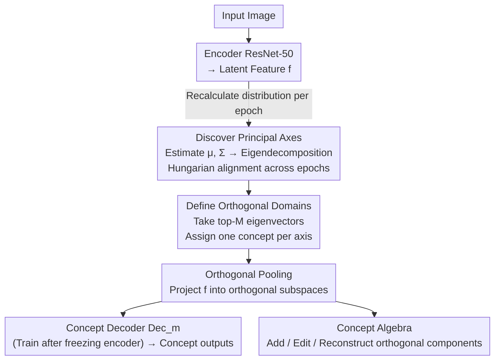

# Domain Expansion: A Latent Space Construction Framework for Multi-Task Learning

**Conference**: ICLR 2026  
**arXiv**: [2601.20069](https://arxiv.org/abs/2601.20069)  
**Code**: To be confirmed  
**Area**: Representation Learning / Multi-Task Learning  
**Keywords**: Multi-task learning, Orthogonal Pooling, Latent space construction, Representation collapse, Composable representations  

## TL;DR
The Domain Expansion framework is proposed to reconstruct the latent space into mutually orthogonal subspaces via Orthogonal Pooling. This structurally prevents gradient conflicts and representation collapse in multi-objective training, enabling interpretable and composable concept algebra.

## Background & Motivation

**Background**: Multi-task learning (MTL) aims to use a single network to satisfy multiple learning objectives simultaneously (e.g., classification + regression). However, conflicting gradients from competing objectives pull shared representations in opposite directions, leading to representation degradation. The authors formalize this as "latent representation collapse"—the feature space is compressed into a suboptimal compromise region for all objectives.

**Limitations of Prior Work**: (a) Gradient-level MTL methods (GradNorm, PCGrad, Nash-MTL, CAGrad, MGDA, etc.) are essentially "reactive"—they mediate conflicts only after they occur, requiring additional gradient computations at each step; (b) These methods do not change the structure of the latent space itself, resulting in representations that remain entangled and uninterpretable. A typical case: under Objective Set 2, baselines like Nash-MTL achieve high classification accuracy but a V-score near 0, indicating the model learns "shortcut" mappings rather than meaningful internal representations.

**Key Challenge**: How to design a representation space where multiple learning objectives naturally do not interfere during the learning process—rather than mediating after interference occurs?

**Goal**: Eliminate inter-task interference at the structural design level of the representation space and construct a "proactive" latent space that inherently supports multiple objectives.

**Key Insight**: By analogy with anamorphosis (e.g., a pattern on a cylinder shown as different shapes from different angles), a high-dimensional latent vector can simultaneously encode multiple independent concepts via projections onto different orthogonal directions.

**Core Idea**: Use orthogonal bases from eigendecomposition to partition the latent space into non-interfering concept subspaces, where gradients flow within subspaces and are zero across them.

## Method

### Overall Architecture
Domain Expansion addresses the latent representation collapse problem in MTL where competing objectives pull shared representations apart. Instead of mediating conflicting gradients after they arise, it reconstructs a set of orthogonal bases in each epoch using current latent feature statistics. The latent space is explicitly partitioned into several mutually orthogonal "concept axes," ensuring each objective learns only on its assigned axis—gradients from one axis naturally do not affect others. The pipeline involves: encoding images to obtain latent features, discovering orthogonal principal axes from the feature distribution and assigning them to concepts, using orthogonal pooling to project features into subspaces for separate decoding, and utilizing these orthogonal components to support downstream concept algebra (addition, subtraction, editing, reconstruction).

### Key Designs

**1. Discovering Principal Axes: Growing Orthogonal Bases from Data**

Manually specifying subspace directions would disconnect them from the data distribution. Thus, this work allows orthogonal bases to emerge naturally. In each epoch, empirical mean $\mu$ and covariance matrix $\Sigma$ are calculated for current latent features, followed by eigendecomposition of $\Sigma$ to obtain a set of orthogonal eigenvectors $V = [v_0, v_1, \ldots, v_{D-1}]$—the principal axes where latent distribution variance is maximized. To handle instability in early training where eigenvector order and signs jump, the Hungarian algorithm is used to align eigenvectors across epochs, ensuring concepts remain bound to consistent axes.

**2. Defining Orthogonal Domains: Assigning Axes to Semantic Concepts**

Once bases are found, semantic meaning is assigned. The eigenvectors corresponding to the top $M$ eigenvalues are selected to form the "domain" $V_M = \{v_m \mid m \in M\}$, with each $v_m$ uniquely assigned to a target concept $\mathcal{C}_m$ (e.g., azimuth, elevation, category, ID). Each axis corresponds to a rank-1 projection operator $\text{Proj}_m = v_m v_m^\top$, grounding "concepts" as specific, mutually orthogonal 1D directions in the latent space.

**3. Orthogonal Pooling: Restricting Gradient Flow to Respective Subspaces**

This is the core operation for eliminating task interference. Mean-centered latent features $f$ are projected into orthogonal subspaces to obtain components $f^{\text{proj},m} = \text{Proj}_m(f - \mu)$. Loss for each concept is then applied only to its corresponding component. The total loss is a weighted sum of independent subspace losses: $\mathcal{L}_{\text{total}} = \sum_m w_m \cdot \mathcal{L}_m(\mathcal{F}_m^{\text{proj}}, \mathcal{C}_m)$. Since projection directions are pairwise orthogonal, the gradient of Concept A's loss with respect to Concept B's subspace is naturally zero. Interference is structurally prevented. This mechanism introduces almost zero overhead as it relies on PCA and projections without additional learnable parameters.

**4. Concept Algebra: Composable and Reconstructible Latent Space**

Orthogonal partitioning grants the latent space algebraic properties. Components are pairwise orthogonal $\mathcal{F}_0^{\text{proj}} \perp \mathcal{F}_1^{\text{proj}} \perp \cdots$, meaning modifying one concept does not affect others. A specific concept can be adjusted via vector arithmetic $f_j = f_i \pm f_\Delta^{\text{proj},m}$ (e.g., changing the pose of the same chair). Any feature can be fully reconstructed from its components: $f_i = \mu + \sum_m f_i^{\text{proj},m}$. This transforms the latent space from an entangled black box into interpretable concept building blocks.

### Loss & Training
Regression concepts (azimuth, elevation, rotation) use Rank-N-Contrast (RNC) loss with temperature $\tau=2.0$ and weight 1.0. Classification concepts (category, ID) use an improved SupCon loss replacing dot product with L2 distance (weight 0.02). Training is two-stage: first training the encoder with dynamic orthogonal basis updates, then freezing the encoder to train linear decoders on orthogonal components.

## Key Experimental Results

### Main Results: ShapeNet (5 targets: Azimuth/Elevation/Rotation + Category/ID)

| Method | Spearman(az/el/rot)↑ | V-score(cat/id)↑ | Composition Sim.↑ |
|------|---------------------|-----------------|-----------|
| Baseline | 0.41/0.34/0.35 | 0.16/0.14 | 0.22 |
| FAMO | 0.49/0.41/0.42 | 0.00/0.00 | 0.28 |
| Nash-MTL | 0.38/0.41/0.42 | 0.00/0.00 | 0.28 |
| IMTL | 0.31/0.16/0.16 | 0.39/0.28 | 0.14 |
| **Ours** | **0.95/0.87/0.85** | **0.99/0.91** | **0.95** |

### Ablation Study & Key Findings

| Key Findings | Evidence |
|------|------|
| Gradient methods learn "shortcuts" | Under Objective Set 2, Nash-MTL has high accuracy but V-score=0 → representation collapse |
| Orthogonal Pooling decouples effectively | Ours improves Spearman from 0.41 → 0.95 and V-score from 0.16 → 0.99 |
| Concept composition is feasible | Composition cosine similarity reaches 0.93-0.95, far exceeding baselines (0.14-0.28) |
| Cross-dataset generalization | Effective on MPIIGaze (gaze estimation) and Rotated MNIST |
| PCA Visualization | Baselines show entangled spaces; Ours shows concepts clearly aligned along orthogonal axes |

## Highlights & Insights
- **"Proactive" vs. "Reactive"** is the core conceptual contribution—eliminating the possibility of conflict via spatial structure rather than mediating it during optimization.
- **High Interpretability**: Each orthogonal axis corresponds directly to a semantic concept, with PCA showing an organized latent space—rare in black-box deep learning.
- **Concept Algebra**: Vector arithmetic enables concept-level manipulation, verifying the compositional reasoning capability of the latent space.
- **Extremely Lightweight**: Orthogonal pooling requires only PCA and matrix projection, involving no extra learnable parameters and nearly zero computational cost.
- **Anamorphosis Analogy**: Intuitive visualization where a single vector "stores" multiple independent views via orthogonal projections.

## Limitations & Future Work
- **Dimensionality Constraints**: Each concept is assigned only a 1D subspace, which may be insufficient for complex concepts (texture, shape combinations).
- **Lacking Generative End**: Can represent "chair + boat" combinations but cannot yet generate corresponding images (integration with VAE/GAN unexplored).
- **Limited Scale**: Verified on ShapeNet/MNIST/MPIIGaze; lacks experiments on large-scale real-world MTL scenarios (e.g., NYUv2, Cityscapes).
- **Eigenvector Instability**: Rapid changes in orthogonal bases during early training require Hungarian alignment; might still be unstable for larger models.
- **Fixed Number of Bases**: $M$ must be pre-specified; adaptive selection mechanisms are not yet explored.

## Related Work & Insights
- **vs GradNorm/PCGrad/IMTL**: These operate in the gradient space (projection/reweighting); Ours operates in the feature space (orthogonal subspace projection), which is a higher-level intervention.
- **vs Nash-MTL/FAMO**: Advanced MTL optimization objectives that do not change representation structure—Ours proves structural changes can be more effective.
- **vs $\beta$-VAE**: $\beta$-VAE achieves loose disentanglement via KL penalties; Ours achieves strict disentanglement through hard orthogonal constraints.
- **Insights**: The orthogonal projection idea could be extended to multi-modal learning, restricting representations of different modalities (text/image/audio) to orthogonal subspaces.

## Rating
- Novelty: ⭐⭐⭐⭐ Creative design of orthogonal pooling and concept algebra.
- Experimental Thoroughness: ⭐⭐⭐ Smaller dataset scale; lacks large-scale validation.
- Writing Quality: ⭐⭐⭐⭐ Rigorous mathematical definitions and intuitive analogies.
- Value: ⭐⭐⭐⭐ Provides a new perspective for representation learning in MTL.

<!-- RELATED:START -->

## Related Papers

- [\[ICLR 2026\] Localizing Task Recognition and Task Learning in In-Context Learning via Attention Head Analysis](localizing_task_recognition_and_task_learning_in_in-context_learning_via_attenti.md)
- [\[ICLR 2026\] Decomposing Representation Space into Interpretable Subspaces with Unsupervised Learning](decomposing_representation_space_into_interpretable_subspaces_with_unsupervised_.md)
- [\[ICLR 2026\] Emotions Where Art Thou: Understanding and Characterizing the Emotional Latent Space of Large Language Models](emotions_where_art_thou_understanding_and_characterizing_the_emotional_latent_sp.md)
- [\[ICML 2026\] What Linear Probes Miss: Multi-View Probing for Weight-Space Learning](../../ICML2026/interpretability/what_linear_probes_miss_multi-view_probing_for_weight-space_learning.md)
- [\[ICLR 2026\] Understanding Task Vectors in In-Context Learning: Emergence, Functionality, and Limitations](understanding_task_vectors_in_in-context_learning_emergence_functionality_and_li.md)

<!-- RELATED:END -->
