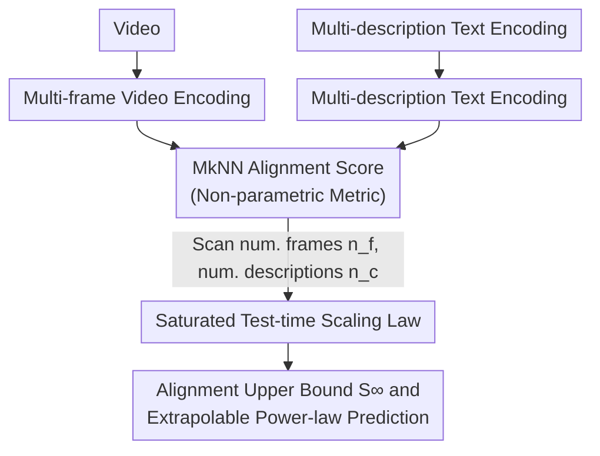

# Dynamic Reflections: Probing Video Representations with Text Alignment

**Conference**: ICLR 2026  
**arXiv**: [2511.02767](https://arxiv.org/abs/2511.02767)  
**Code**: [https://video-prh.github.io](https://video-prh.github.io)  
**Area**: Interpretability / Representation Learning  
**Keywords**: Video representation alignment, Platonic Representation Hypothesis, Test-time scaling laws, Cross-modal alignment, Self-supervised learning

## TL;DR

Ours provides the first expansion of the Platonic Representation Hypothesis (PRH) from static images to the spatiotemporal video-text domain. Through a systematic evaluation of 121 vision and language models, it reveals that increasing the number of frames and descriptions at test-time can nearly double alignment scores, and proposes a saturated scaling law with $R^2 > 0.98$ to quantify this behavior.

## Background & Motivation

The Platonic Representation Hypothesis (PRH) posits that as neural networks scale in capacity, data diversity, and task variety, the internal representations learned by different models converge toward a shared, modality-agnostic statistical model. Previously, Huh et al. (2024) validated this hypothesis in static image-text modalities, finding significant structural similarities between the latent spaces of independently trained vision encoders (e.g., DINOv2) and language encoders.

However, prior validations suffer from two core deficiencies:

1.  **Modality Limitation**: All experiments focused on static modalities (images and text). Motion, causality, and temporal dependencies inherent in video data were entirely ignored in representation alignment research. While PRH is proposed for all modalities, its validity in the temporal domain remained an open question.

2.  **Interpretability of Alignment Scores**: Huh et al. (2024) raised an unresolved question—is a maximum alignment score of only 0.16 high or low? This absolute value is difficult to interpret.

The Core Insight of this work is: the limited alignment reported previously is largely due to **insufficient data provided at test-time** (single frame + single description). By providing multiple video frames and multiple text descriptions, alignment scores can significantly increase to nearly 0.4 without modifying any trained models. This finding establishes "test-time scaling" as a new dimension complementary to training-time scaling.

## Method

### Overall Architecture

Ours does not train new models but builds a "test-time scaling" probe framework: fixing a pair of independently trained video and text encoders, while only varying the volume of data fed into them—expanding videos from single to multiple frames and descriptions from single to multiple entries—and then using a non-parametric alignment metric to measure the similarity between the two latent spaces. Alignment strength follows the Mutual $k$-NN (MkNN) metric from Huh et al. (2024): given $N$ video-text pairs, encoded as embedding matrices $\mathbf{X} \in \mathbb{R}^{N \times p}$ and $\mathbf{Y} \in \mathbb{R}^{N \times q}$, binary $k$-nearest neighbor indicator matrices $\mathbf{M_X}$ and $\mathbf{M_Y}$ are constructed. The alignment score is defined as the proportion of overlapping neighbors:

$$\mathcal{A}^{\text{MkNN}}(\mathbf{X}, \mathbf{Y}) = \frac{1}{kN} \sum_{i=1}^{N} \sum_{j=1}^{N} (\mathbf{M_X} \odot \mathbf{M_Y})_{ij}$$

where $\odot$ denotes the Hadamard product, $k$ is set to 10 (on a 1024-sample dataset), and an optimal layer pair search is conducted across all intermediate layer combinations of both encoders. The Mechanism is a dual-branch structure: videos undergo multi-frame encoding while text undergoes multi-description encoding; the two latent spaces meet at the MkNN metric to produce an alignment score, which is then fitted to a saturated scaling law by scanning the number of frames and descriptions.

### Key Designs

**1. Multi-frame Video Encoding: Integrating temporal information rather than single images**

Prior PRH validations only used single frames, essentially compressing videos into static images and losing motion and causality—a root cause of low alignment scores. For an encoder that natively processes $n_o$ frames, this work extracts target frame counts $n_f$ via uniform linear interpolation. When $n_f > n_o$ exceeds the window, the video is sliced into several sub-clips of length $n_o$, which are encoded separately and averaged, allowing the ingestion of up to $n_f = 80$ frames without model modification. For $n_f = 1$, the setup naturally degrades to the original image-text alignment for comparability. Variants like "first frame only" and "average features across 8 frames" are provided for image-only models to distinguish whether gains stem from temporal modeling or feature smoothing.

**2. Multi-description Text Encoding: Approximating full video semantics via multiple perspectives**

A single description only covers one aspect of a video; single-description settings systematically underestimate the true shared structure of vision and language. Ours concatenates multiple descriptions into a long string for the text encoder (including purely generative LLMs like Gemma 2), extracts intermediate layer features, and averages across the token dimension to obtain a sentence vector of $[\text{layer}, \text{hidden\_dim}]$. VATEX naturally provides 10 independent descriptions per video, enabling direct evaluation. For PVD, which has single long descriptions, Gemini-2.5 Pro is used to split them into 10 short descriptions—experiments show this synthetic split also improves alignment, suggesting gains come from semantic coverage expansion rather than additional human labeling.

**3. Saturated Test-time Scaling Law: Formulating data-driven alignment gains as predictable power laws**

Beyond observing score increases, Ours characterizes the double dependency of alignment scores on frame count $n_f$ and description count $n_c$ using a parametric saturation model:

$$\text{score}(n_f, n_c) = S_{\infty} - (C_f \cdot n_f^{-\alpha} + C_c \cdot n_c^{-\beta})$$

where $S_{\infty}$ is the theoretical saturation score with infinite data, $C_f, C_c$ are error coefficients for frames and descriptions, and $\alpha, \beta$ are their respective power-law decay indices. This forms a dual to the training-time compute-optimal scaling laws of Hoffmann et al. (2022): $S_{\infty}$ represents the ideal alignment upper bound, while the latter two terms are error penalties from finite test data that decay at power-law rates as data increases. The model achieves $R^2 > 0.98$ for both VideoMAEv2 and DINOv2, proving that test-time data augmentation results in highly regular, extrapolable behavior rather than noisy improvements.

## Key Experimental Results

### Main Results: Video-Text Alignment Scores

On VATEX (10s video + 10 labels) and PVD datasets using a 1024-sample test set:

| Vision Model | Type | Text Encoder | Frames/Desc. | MkNN Score |
| :--- | :--- | :--- | :--- | :--- |
| DINOv2 | Image (1-frame) | Best non-Gemma | 1 frame / 1 desc | ~0.18 |
| DINOv2 | Image (1-frame) | Gemma 2 9B-it | 1 frame / 1 desc | ~0.206 |
| DINOv2 | Image→Video (8-f mean) | Gemma 2 9B-it | 8 frames / 1 desc | ~0.223 |
| VideoMAEv2 | Native Video | Gemma 2 9B-it | Multi / Multi | ~0.41 ($S_{\infty}$) |
| DINOv2 | Image→Video | Gemma 2 9B-it | Multi / Multi | ~0.37 ($S_{\infty}$) |

Key finding: Alignment scores increase by over **2x** from the simplest setup (0.18) to full utilization of test-time data (0.41).

### Scaling Law Fitting and Ablation Study

| Fit Parameter | VideoMAEv2 | DINOv2 | Interpretation |
| :--- | :--- | :--- | :--- |
| $S_{\infty}$ (Saturation) | 0.41 | 0.37 | Video models have higher theoretical bounds |
| $C_f$ (Frame Error Coeff) | 0.15 | 0.05 | Video models are **3x** more frame-dependent |
| $C_c$ (Desc Error Coeff) | 0.13 | 0.13 | Similar text-side influence |
| $\alpha$ (Frame Decay Exp) | 0.75 | 1.76 | Video models decay slower; need more frames to saturate |
| $\beta$ (Desc Decay Exp) | 1.30 | 1.40 | Similar description-side decay |
| $R^2$ | 0.9791 | 0.9964 | Extremely high quality of fit |

| Ablation Dimension | Range | Key Observation |
| :--- | :--- | :--- |
| Frame Count $n_f$ | 1 → 80 | Alignment rises steadily; video models benefit far more than image models |
| Desc Count $n_c$ | 1 → 10 | Average alignment gain of **60%**, fastest growth in early stages |
| Downstream Semantic Tasks | — | **Strong positive correlation** with alignment scores |
| Downstream Non-semantic | — | Positive correlation for depth/pose, but not for point tracking |
| Temporal Sensitivity | $k=1,2,3$ | Perfect alignment at $k=3$; LLMs act like bag-of-words at $k=1,2$ |
| Synthetic Descs (PVD) | 1 → 10 synth | Synthesizing short descriptions from long ones also improves alignment |

## Highlights & Insights

*   **First Expansion of PRH to Spatiotemporal Domain**: Systematically evaluated 85 vision × 36 language model combinations, bridging the gap in video modality representation research and proving temporal information provides strong signals for semantic understanding.
*   **Discovery of Test-time Scaling Laws**: Analogous to training-phase compute-optimal scaling laws, the proposed test-time laws with $R^2 > 0.98$ indicate that alignment dependency on data volume is a highly predictable power-law behavior.
*   **Answering Key Open Problems**: Addressing the question by Huh et al. (2024) regarding whether 0.16 is high or low, Ours provides a clear answer: it is an underestimate caused by test-time data scarcity, reaching 0.4+ with sufficient data.
*   **Utility of Zero-shot Metrics**: The strong correlation between video-text alignment and downstream tasks (semantic + non-semantic) suggests it can replace expensive task-specific evaluations to guide video model development.
*   **Potential of SSL Video Models**: VideoMAEv2 surpasses DINOv2's alignment scores without any text supervision, proving that pure video self-supervised training can learn representations highly aligned with language space.

## Limitations & Future Work

1.  **Insufficient Local Task Coverage**: The weak correlation with point tracking suggests the MkNN metric prioritizes global semantics and struggles to capture fine-grained spatiotemporal abilities.
2.  **Gap in Video Foundation Models**: Many native video models show lower alignment than frame-averaged image models, indicating the training paradigms for video encoders still have room for optimization.
3.  **Representation Utilization in Generative Models**: Latent representations of current generative video models (e.g., video diffusion) align weakly with text; leveraging their understanding capability remains an open problem.
4.  **Limited Dataset Diversity**: Primarily uses VATEX and PVD, which may not fully cover long videos or more complex temporal reasoning scenarios.
5.  **Confounding Factors in Descriptions**: Increasing descriptions adds both semantic coverage and viewpoint diversity; the individual contributions of these factors are not yet decoupled.

## Related Work & Insights

Ours sits at the intersection of three directions: (1) Platonic Representation Hypothesis and Emergent Alignment—extending the static works of Huh et al. (2024) and Maniparambil et al. (2024) to the temporal domain; (2) Self-supervised Video Representation Learning—providing a new zero-shot evaluation for models like VideoMAEv2 and V-JEPA; (3) Scaling Laws—forming a dual to the training-time scaling laws of Hoffmann et al. (2022) by opening the direction of "test-time scaling." Furthermore, the finding that Gemma 2, a text-only generative LLM, performs as the optimal encoder echoes Zhang et al. (2025) regarding the importance of LLMs in multimodal alignment.

## Rating

*   Novelty: ⭐⭐⭐⭐ — First extension of PRH to video; novel and predictive test-time scaling laws.
*   Experimental Thoroughness: ⭐⭐⭐⭐⭐ — Extensive coverage of 121 model combinations across multiple datasets with rigorous fitting.
*   Writing Quality: ⭐⭐⭐⭐ — Clear structure and intuitive visualizations; core findings stated precisely.
*   Value: ⭐⭐⭐ — Significant implications for video representation evaluation and multimodal alignment theory.

<!-- RELATED:START -->

## Related Papers

- [\[ACL 2026\] Rhetorical Questions in LLM Representations: A Linear Probing Study](../../ACL2026/interpretability/rhetorical_questions_in_llm_representations_a_linear_probing_study.md)
- [\[CVPR 2026\] Back to the Feature: Explaining Video Classifiers with Video Counterfactual Explanations](../../CVPR2026/interpretability/back_to_the_feature_explaining_video_classifiers_with_video_counterfactual_expla.md)
- [\[ACL 2026\] Probing Semantic Alignment, Lexical Invariance, and Syntactic Influence in LLM Metaphor Processing](../../ACL2026/interpretability/probing_semantic_alignment_lexical_invariance_and_syntactic_influence_in_llm_met.md)
- [\[ICLR 2026\] Beyond Linear Probes: Dynamic Safety Monitoring for Language Models](beyond_linear_probes_dynamic_safety_monitoring_for_language_models.md)
- [\[AAAI 2026\] Probing Preference Representations: A Multi-Dimensional Evaluation and Analysis Method for Reward Models](../../AAAI2026/interpretability/probing_preference_representations_a_multi-dimensional_evaluation_and_analysis_m.md)

<!-- RELATED:END -->
