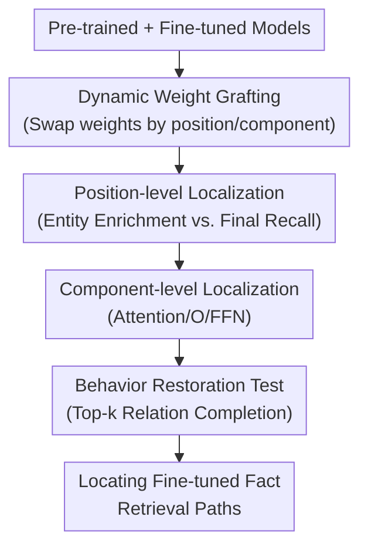

# Dynamic Weight Grafting: Localizing Finetuned Factual Knowledge in Transformers

**Conference**: ICLR2026  
**OpenReview**: [https://openreview.net/forum?id=j5vRSKOHmO](https://openreview.net/forum?id=j5vRSKOHmO)  
**Code**: https://github.com/toddnief/dynamic-weight-grafting  
**Area**: Interpretability / Mechanistic Interpretability / Knowledge Localization  
**Keywords**: Dynamic Weight Grafting, Factual Knowledge Localization, Fine-tuned Knowledge, Transformer Mechanistic Interpretation, Relation Completion  

## TL;DR
This paper proposes Dynamic Weight Grafting to locate the retrieval mechanisms of fine-tuned factual knowledge in LLMs by temporarily replacing weights based on token position and Transformer components during generation. It finds that new knowledge is primarily retrieved via two paths: enrichment at the entity position and recall at the final token.

## Background & Motivation
**Background**: LLMs memorize vast amounts of factual relations during pre-training and can learn new facts (e.g., cast relations in new movies, recent events, or rewritten entity attributes) through supervised fine-tuning (SFT). Mechanistic interpretability seeks to answer a more granular question: when a model generates a fact, does it encode the information into the entity representation early in the sequence, or does it retrieve it just-in-time from parameters before prediction?

**Limitations of Prior Work**: Commonly used techniques like activation patching, ablation, or residual stream replacement show if a specific activation is important, but they carry a critical side effect: patching the residual stream at a certain layer and position overwrites all information that previously flowed into that location. This makes it difficult to distinguish whether a component "actively retrieved the new fact" or merely "carried factual information already computed upstream." For fine-tuned knowledge localization, this distinction is vital for identifying the mechanism itself rather than the truncated information flow.

**Key Challenge**: Fine-tuned factual knowledge may function through multiple concurrent paths: entity tokens might be "enriched" with relational information during processing, and the final token might also recall the relation via attention and FFNs before prediction. Intervention methods that disrupt upstream computation cannot reliably determine which paths are sufficient or necessary, nor can they pin behavior to specific parameter matrices.

**Goal**: The authors aim to address three questions: first, which token positions do fine-tuned factual relations rely on during generation; second, whether entity position enrichment and final token recall are individually sufficient to restore fine-tuned behavior; and third, whether the final token recall path can be further localized to components like attention, output projection, and feedforward networks.

**Key Insight**: Instead of replacing activations, the authors use the pre-trained model as a backbone and temporarily "graft" a small subset of the fine-tuned model's weights at specific token positions. This allows the residual stream to flow according to the original upstream computation while ensuring a specific position or component executes the fine-tuned mechanism. If behavior is restored, it indicates that those weights and positions are sufficient for fine-tuned knowledge retrieval.

**Core Idea**: Replace destructive activation patching with token-wise and component-wise Dynamic Weight Grafting, reframing the question of "where fine-tuned knowledge is used" from an activation problem into a causal localization problem of "which positions and parameters are sufficient to restore fine-tuned behavior."

## Method

### Overall Architecture
The input to Dynamic Weight Grafting is a pair of models sharing the same architecture: pre-trained parameters $\theta^{PRE}$ and supervised fine-tuned parameters $\theta^{SFT}$. During the generation of a prompt, the method performs token-wise forward passes. Based on a pre-defined grafting configuration $\gamma_c(t)$, it temporarily replaces specific component weights from $\theta^{PRE}$ with $\theta^{SFT}$ at certain token positions, restoring them to pre-trained weights after the pass. The output is not a deployable model but a series of behavior restoration experiments: if grafting at specific positions or components yields performance close to the SFT model, those locations are considered candidates for the fine-tuned knowledge retrieval mechanism.

The authors first perform position grafting, using the full SFT weights at certain token positions and PRE weights elsewhere, to judge the sufficiency of entity positions and the final token. This is followed by component grafting, where only components like attention, output projection $O$, or FFNs are replaced to further decompose the final token recall path into specific Transformer sub-mechanisms. The process maintains the KV-cache, allowing different tokens to be generated with different weight configurations while letting subsequent tokens "look back" at keys and values computed under those configurations.

### Key Designs
**1. Dynamic Weight Grafting: Shifting Intervention from Activations to Mechanisms**

The issue with activation patching is not the lack of causal signal, but the entanglement of "replacing an intermediate state" with "cutting off previous information sources." This paper instead replaces parameter matrices temporarily: given corresponding components $\theta^A_c$ and $\theta^B_c$, a mask $\gamma_c(t)$ determines the source for position $t$: $\tilde{\theta}_c(t)=\theta^A_c$ if $\gamma_c(t)=0$, else $\tilde{\theta}_c(t)=\theta^B_c$. Typically, $A$ is PRE and $B$ is SFT.

The key design advantage is that it does not directly overwrite the residual stream. The model computes token-by-token in the same context, but the mechanism at a specific position is switched to the fine-tuned version. Thus, if grafting the "latter-layer FFN + output projection at the final token" restores factual completion, it suggests these components executed the fine-tuned relation extraction mechanism rather than the residual stream merely carrying the answer.

**2. Position-level Grafting: Distinguishing Entity Enrichment from Final Recall**

Grafting is first applied at the token level: a position uses either SFT or PRE weights entirely. Key configurations include grafting only the first entity tokens (FE), the last token (LT), both (FE+LT), or the complement $(FE+LT)^C$. If FE is sufficient, the model writes relational info into the entity representation upon viewing the entity. If LT is sufficient, the model retrieves the fine-tuned relation from a context that hasn't been SFT-enriched.

This design yields the core finding: fine-tuned factual knowledge does not exist on a single path. In some models/templates, the entity enrichment path alone pushes the correct relation to the top; in others, the final token recall path is stronger. Combining both nearly restores full SFT performance, while excluding both results in performance near the pre-trained baseline, providing clearer evidence for "necessary and sufficient" localization than single-point activation patching.

**3. Component-level Grafting: Decomposing Recall into Task-specific Attention and Relation-specific FFN/O**

Position-level results only show that the "final token is important" without identifying the underlying mechanism. Component grafting decomposes the Transformer block into attention, output projection $O$, and FFN. To separate "learning the task format" from "learning specific relations," the authors use task models (trained on similar syntactic structures) and relation models (trained on the relations under test).

Results show the recall path is not a simple "attention-does-all" or "FFN-does-all" scenario. In Gemma and Llama3, the task-specific attention at the final token aligns the query with the entity/structure, while the relation-specific $O$ matrix and later-layer FFNs extract the object and push it to the output distribution. Removing $O$ while keeping FFN significantly hurts performance, suggesting the output projection is a critical interface for triggering relation extraction.

**4. Complementary and Counterfactual Configurations: Ruling out Hidden Paths**

Proving FE+LT is sufficient is not enough, as other positions might also restore the fact. The authors use complement grafting: grafting SFT weights at all positions except FE and LT. If this restores performance, additional paths exist. However, the top-k accuracy of $(FE+LT)^C$ is near PRE levels, proving that most observable relation completion capabilities are indeed concentrated in the entity enrichment and final recall paths.

### Loss & Training
The paper does not propose new objectives but uses controlled fine-tuning to generate pairs for analysis. Models are fine-tuned using next-token prediction. Experiments involve Llama3, Pythia 2.8B, GPT2-XL, and Gemma 1.1. Data consists of synthetic relation tuples: Fake Movies, Real Actors; Fake Movies, Fake Actors; and Real Movies, Real Actors (Shuffled). Around 1,000 tuples were used per category, expanded into ~10,000 samples with article-style and QA templates.

The authors used AdamW, linear LR scheduling ($2.0e-5$), weight decay ($0.01$), and 10 epochs. Evaluation is based on top-k accuracy of the target token, primarily reporting top-5 accuracy.

## Key Experimental Results

### Main Results
Positional experiments show FE+LT nearly restores SFT, while the complement is close to PRE. The relative strength of FE vs. LT varies by model.

| Setting | Target | Representative Result | Conclusion |
|------|----------|----------|----------|
| PRE | Pre-trained Baseline | Near 0 top-k accuracy | New facts are not stably retrievable in PRE |
| SFT | Full Fine-tuned Model | Gemma reaches 100% top-5 | SFT successfully encodes relation completion |
| LT only | Last Token Grafting | Gemma-1.1 reaches 53% top-5 | Final-token recall is sufficient to restore substantial facts |
| FE only | First Entity Grafting | GPT2-XL reaches 28% top-5 | Entity enrichment can independently provide relation info |
| FE+LT | Entity + Last Token | Near full SFT performance | Both paths combined restore fine-tuned behavior |
| $(FE+LT)^C$ | All except FE/LT | Near PRE (zero accuracy) | Other positions cannot independently restore relation completion |

### Component-level Performance
In Gemma and Llama3, the $O$ matrix and FFN jointly restore nearly the same performance as full attention + FFN at the final token.

| Experiment | Model/Setting | Key Trend | Explanation |
|------|-----------|----------------|------|
| Final-token component grafting | Gemma, Llama3 | $O$ + FFN $\approx$ full ATTN + FFN | Recall doesn't require full relation-model ATTN, but needs $O$ interface |
| Remove $O$, keep FFN | Gemma | top-5 accuracy drops 29% | $O$ is critical to trigger relation-specific FFN |
| Remove $O$, keep FFN | Llama3 | top-5 accuracy drops 41% | $O$ has a stronger role in Llama3 |
| Hybrid grafting | Gemma | Task ATTN (FE+LT) + Relation $O$/FFN (LT) = 63% top-5 | Task attention finds structure; relation components extract object |

### Key Findings
- **Dual Paths**: Fine-tuned factual retrieval is not a single mechanism but includes enrichment at the first entity (writing clues into the stream) and recall at the last token (just-in-time extraction).
- **Necessity and Sufficiency**: FE+LT is sufficient, while the complement $(FE+LT)^C$ fails, providing strong localization evidence.
- **Architectural Differences**: The recall path is stronger in Gemma/Llama3, while GPT2-XL/Pythia rely more on enrichment.
- **Component Synergy**: Recall is a collaboration between task-specific attention and relation-specific $O$ + FFN.
- **Generalization**: Results hold for non-templated Wikipedia-style movie articles, though individual paths (FE/LT) are weaker than in templated data.

## Highlights & Insights
- **Parameter over Activation**: Instead of asking where information is in the activation space, it asks which parameter mechanisms execute the computation, avoiding residual stream overwriting.
- **Comprehensive Localization**: Using sufficiency (FE+LT) and necessity ($(FE+LT)^C$) tests provides a more credible mechanistic map.
- **Redundancy Disclosure**: Explains why different localization methods sometimes conflict—the model often has redundant paths (enrichment and recall) to achieve the same result.
- **Task vs. Relation Separation**: Using task models to isolate structural learning from factual content prevents misidentifying syntax capabilities as factual knowledge.

## Limitations & Future Work
- **Task Complexity**: Limited to single-hop relations and synthetic templates. Multi-hop facts or complex reasoning may follow different paths.
- **Evaluation**: Relies on next-token top-k accuracy. If a model "knows" a fact but doesn't output it as the immediate next token, this metric fails to capture it.
- **Grafting Artifacts**: Mixing weights from two models can create out-of-distribution states, sometimes causing the model to revert to high-frequency tokens.
- **Search Space**: The number of grafting combinations is large; this study explores the most interpretable ones but may miss complex feature interactions.
- **Model Scale**: Primarily tested on 1B-3B models. Verification on larger models and RLHF models is needed.

## Related Work & Insights
- **Compared to Activation Patching**: Activation patching is better for information flow; weight grafting is better for identifying active vs. passive components.
- **Compared to Knowledge Editing (ROME/MEMIT)**: While editing focuses on *how* to change weights, grafting focuses on identifying *which* weights are responsible for fine-tuned behavior.
- **Compared to Factual Recall (Geva et al.)**: Prior work emphasizes FFNs and attention; this paper adds that the output projection $O$ is a crucial "trigger" for relation-specific FFN extraction.

## Rating
- **Novelty**: ⭐⭐⭐⭐⭐ A fresh perspective using dynamic, position-dependent weight grafting for localization.
- **Experimental Thoroughness**: ⭐⭐⭐⭐☆ Solid across multiple models and settings, though many values are presented in charts rather than tables.
- **Writing Quality**: ⭐⭐⭐⭐☆ Logical and clear.
- **Value**: ⭐⭐⭐⭐⭐ Highly valuable for mechanistic interpretability and understanding factual knowledge updates in LLMs.

<!-- RELATED:START -->

## Related Papers

- [\[ACL 2026\] Through a Compressed Lens: Investigating The Impact of Quantization on Factual Knowledge Recall](../../ACL2026/interpretability/through_a_compressed_lens_investigating_the_impact_of_quantization_on_factual_kn.md)
- [\[ACL 2025\] Cracking Factual Knowledge: A Comprehensive Analysis of Degenerate Knowledge Neurons in Large Language Models](../../ACL2025/interpretability/degenerate_knowledge_neurons.md)
- [\[ICLR 2026\] Learning to Interpret Weight Differences in Language Models](learning_to_interpret_weight_differences_in_language_models.md)
- [\[ICLR 2026\] Learning to Weight Parameters for Training Data Attribution](learning_to_weight_parameters_for_training_data_attribution.md)
- [\[ICLR 2026\] Localizing Task Recognition and Task Learning in In-Context Learning via Attention Head Analysis](localizing_task_recognition_and_task_learning_in_in-context_learning_via_attenti.md)

<!-- RELATED:END -->
## Related Papers

- [\[ACL 2026\] Through a Compressed Lens: Investigating The Impact of Quantization on Factual Knowledge Recall](../../ACL2026/interpretability/through_a_compressed_lens_investigating_the_impact_of_quantization_on_factual_kn.md)
- [\[ACL 2025\] Cracking Factual Knowledge: A Comprehensive Analysis of Degenerate Knowledge Neurons in Large Language Models](../../ACL2025/interpretability/degenerate_knowledge_neurons.md)
- [\[ICLR 2026\] Learning to Interpret Weight Differences in Language Models](learning_to_interpret_weight_differences_in_language_models.md)
- [\[ICLR 2026\] Learning to Weight Parameters for Training Data Attribution](learning_to_weight_parameters_for_training_data_attribution.md)
- [\[ICLR 2026\] Block Recurrent Dynamics in Vision Transformers](block_recurrent_dynamics_in_vision_transformers.md)

<!-- RELATED:END -->
