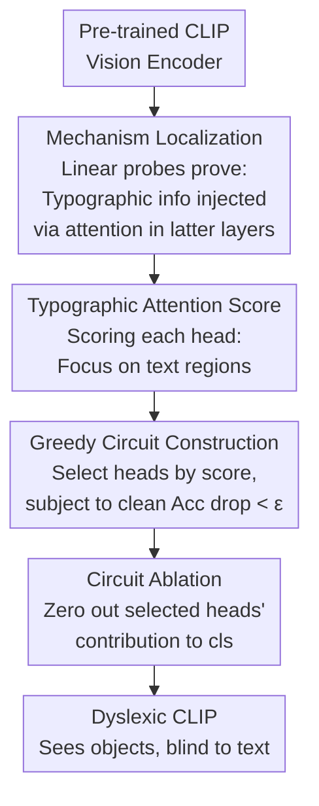

# Dyslexify: A Mechanistic Defense Against Typographic Attacks in CLIP

**Conference**: ICLR2026  
**OpenReview**: [https://openreview.net/forum?id=UI7mbsIZeN](https://openreview.net/forum?id=UI7mbsIZeN)  
**Code**: https://github.com/lowlorenz/dyslexify  
**Area**: Mechanistic Interpretability / Multimodal VLM / Adversarial Robustness  
**Keywords**: CLIP, Typographic Attack, Attention Head Circuits, Circuit Ablation, Mechanistic Interpretability

## TL;DR
The authors discover a small group of attention heads in the latter half of the CLIP vision encoder specialized in "reading text" in images, which inject typographic information into the `cls` token to cause typographic attacks. Dyslexify requires no gradient training; by simply zeroing out the contributions of these heads to the `cls` token (circuit ablation), it improves robustness on ImageNet-100-typo by up to 22.06% with <1% drop in standard accuracy.

## Background & Motivation
**Background**: CLIP has become the de facto standard for general vision-language representations. Zero-shot classification, retrieval, diffusion generation, and large VLMs are all built upon it and deployed in safety-sensitive scenarios like healthcare, remote sensing, and content moderation.

**Limitations of Prior Work**: CLIP is surprisingly vulnerable to "typographic attacks"—simply overlaying text on an image (e.g., writing "Firearm" on a banana photo) misleads the model into classifying it as the text label, potentially bypassing VLM safety filters or triggering jailbreaks. Existing defenses involve fine-tuning the entire model, learning projection matrices, training Defense-Prefix text tokens, or training Sparse Autoencoders (SAEs)—**all of which rely on gradient optimization**, incur high compute costs, and лишь "suppress symptoms" without explaining which part of CLIP is responsible for this behavior.

**Key Challenge**: The root of typographic attacks is an internal "read-write representation" mechanism within CLIP. However, current defenses black-box fit a patch, making them neither interpretable nor easily scalable to billion-parameter models (fine-tuning ViT-bigG is extremely expensive).

**Goal**: (1) Locate exactly which components in CLIP are responsible for injecting typographic information into the final representation; (2) Based on this localization, develop a **gradient-free** defense ready for large-scale models.

**Key Insight**: Using linear probes for mechanistic analysis, the authors found a critical phenomenon: typographic understanding **suddenly emerges in the latter layers** of the model, and this emergence is driven by attention blocks rather than MLP blocks. This suggests "reading text" is performed by a few specific attention heads that can be precisely excised.

**Core Idea**: Rank attention heads that "stare at text in images" using a **Typographic Attention Score**. Zero out their contributions to the `cls` token one by one from highest to lowest score to form and ablate a "typographic circuit." This essentially performs "induced dyslexia" on CLIP, making it see objects but remain "blind" to text.

## Method

### Overall Architecture
Dyslexify takes a pre-trained CLIP vision encoder as input and outputs a "dyslexic CLIP" with unchanged weights, where only the logic for specific attention heads writing to the residual stream is disabled during inference. The pipeline follows three steps: **Mechanism Localization** (using linear probes to confirm text info is injected via attention in the latter half), calculating a **Typographic Attention Score** for each head to measure its focus on text regions, and finally using a **Greedy Circuit Construction** algorithm to select heads based on the "robustness gain vs. clean accuracy loss" trade-off and **ablating** them. The process is zero-gradient and zero-fine-tuning.

### Key Designs

**1. Linear Probe Localization: Proving "reading" happens in latter attention blocks**

This step serves as both motivation and the methodological foundation for deciding "where to cut." The authors transform standard datasets into "-typo" versions: each image $x_i$ is assigned a typographic label $z_i \neq y_i$ (the true label), with text of $z_i$ overlaid at a random position. Two linear probes are trained on the `cls` activation $h^{\ell}_{cls}$ at every layer $\ell$: $P_{img,\ell}$ predicts the object label and $P_{typo,\ell}$ predicts the typographic label. Probes take the form $\hat{y}_\ell(x)=w^\top h^{\ell}_{cls}+b$. Results show that object probe accuracy $Acc(P_{img,\ell})$ **rises gradually**, while typographic probe accuracy $Acc(P_{typo,\ell})$ is low initially and **surges to >0.99 in the latter half**. Decomposing attention and MLP blocks reveals that attention layers consistently "add" linearly decodable information to `cls`, while MLP layers "subtract" information (supported by intrinsic dimension ID drops in the appendix). This evidence locks the target onto "attention heads in the latter layers."

**2. Typographic Attention Score: Quantifying text-focusing heads**

To prune heads, an objective metric is needed. The authors define the Typographic Attention Score $T_{i,\ell}$ as the ratio of spatial attention head $H_{i,\ell}$ places on "text patches" versus all patches. Let $A_{i,\ell}(x)\in[0,1]^{T+1}$ be the attention from `cls` to all tokens. After removing the cls-to-cls term, the spatial attention $A^*_{i,\ell}(x)\in[0,1]^T$ is used:

$$T_{i,\ell}=\sum_{x\in D}\frac{\sum_{t=1}^{T}\mathbf{1}(t)\,A^*_{i,\ell,t}(x)}{\sum_{t=1}^{T}A^*_{i,\ell,t}(x)}$$

where $\mathbf{1}(t)=1$ iff patch $t$ falls in the text region. To obtain $\mathbf{1}(t)$ efficiently, the authors use 10,000 text-free natural images and overlay text at the bottom-center (corresponding to the bottom two rows of the spatial grid). They find that most heads have no spatial preference, with only a few heads scoring $T_{i,\ell}\ge\mu(T)+2\sigma(T)$, occurring **exclusively in the latter half**. Overlapping high-scoring heads with the probe curves shows that typographic probe accuracy surges exactly after passing these heads.

**3. Greedy Circuit Construction: Balancing robustness and clean accuracy**

Indiscriminately pruning all high-scoring heads could harm normal object recognition. The authors formulate head selection as a constrained greedy search (Algorithm 1). Starting with an empty circuit $C\subseteq\Psi$, heads are added in descending order of $T_{i,\ell}$. For each candidate $H$, two values are computed: the drop in clean accuracy $\Delta Acc_{img}=Acc(M,D_{img})-Acc(M_{C\cup H},D_{img})$ and the gain on the attack set $\Delta Acc_{typo}=Acc(M_{C\cup H},D_{typo})-Acc(M_C,D_{typo})$. If $\Delta Acc_{typo}\le 0$, the head is skipped. If $\Delta Acc_{img}<\epsilon$ (within tolerance), it is added to the circuit; otherwise, the search terminates. This yields a sparse circuit—covering at most 10.1% of all heads in experiments while providing >20% robustness gain.

**4. Circuit Ablation: Zeroing cls-writes while preserving spatial paths**

The "surgery" specifically **targets the residual stream of the cls token**. In CLIP, the residual update is $z^{\ell}_{cls}=h^{\ell}_{cls}+\mathrm{MLP}(h^{\ell}_{cls})$ and $h^{\ell+1}_{cls}=z^{\ell}_{cls}+\sum_i H_{i,\ell,cls}(z^{\ell}_{cls})$, where $H_{i,\ell,cls}$ is the contribution of head $i$ to `cls`. Ablation is defined as: $\forall H_{i,\ell}\in C$, set $H_{i,\ell,cls}(z^{\ell}_{cls})\leftarrow 0$, while contributions to **spatial tokens** remain unchanged. This surgical approach cuts the channel for text info into the final representation without damaging the heads' potential normal functions in other positions. Causal verification is performed by "tuning the attention sink": setting the `cls` self-attention weight to $\alpha$ and re-normalizing spatial attention. Larger $\alpha$ leads to less text information flow and suppressed attacks, proving these heads are the causal source of typographic vulnerability.

### Loss & Training
**There is no loss function and no gradient-based training.** Dyslexify is a purely inference-time intervention. Primary hyperparameters are the tolerance threshold $\epsilon$ (set to 0.01) and the maximum consecutive skip count $k=10$. Its zero-gradient nature allows it to scale seamlessly to ViT-bigG models.

## Key Experimental Results

### Main Results
Evaluated across 5 scales (ViT-B/L/H/G/BigG), measuring robustness gains on attack sets and accuracy maintenance on clean sets. Accuracy changes on attack sets (relative to baseline):

| Model | RTA-100 | Disentangling | Paint | IN-100-T | Food-101-T | Aircraft-T |
|------|---------|---------------|-------|----------|-----------|-----------|
| ViT-B | 68.30 ↑12.00 | 85.00 ↑31.11 | 72.73 ↑14.55 | 66.84 ↑19.90 | 78.27 ↑22.64 | 16.23 ↑5.91 |
| ViT-H | 68.30 ↑15.20 | 72.22 ↑26.67 | 70.91 ↑21.82 | 75.34 ↑21.26 | 83.01 ↑28.68 | 29.40 ↑8.07 |
| ViT-G | 62.00 ↑12.00 | 67.22 ↑9.44 | 71.82 ↑16.36 | 68.76 ↑22.06 | 73.05 ↑20.21 | 27.69 ↑3.45 |
| Big-G | 72.90 ↑11.90 | 68.33 ↑20.00 | 69.09 ↑21.82 | 78.64 ↑16.74 | 84.69 ↑25.98 | 41.61 ↑16.29 |

Gains peak at +31% and hold across real typographic attack sets (RTA-100, Disentangling, Paint), indicating the located circuit captures a generalized failure mode. Clean dataset accuracy drops mostly fall within the ±1% tolerance band:

| Model | Aircraft | Food-101 | ImageNet-100 |
|------|----------|----------|--------------|
| ViT-B | 27.72 ↓0.12 | 84.97 ↓0.99 | 75.00 ↑0.64 |
| ViT-L | 34.62 ↓1.74 | 89.31 ↓1.17 | 79.52 ↓0.24 |
| Big-G | 50.47 ↓0.39 | 92.55 ↓0.42 | 84.72 ↓0.34 |

### Key Findings
- Typographic understanding capability "suddenly emerges" in the second half of CLIP, driven by attention blocks; MLP blocks compress information.
- Circuits are extremely sparse (≤10.1% of heads), yet deliver >20% robustness improvement, showing typographic vulnerability is highly localized.
- In medical use cases (WhyLesionCLIP for skin lesion detection), typographic attacks can drop accuracy by 22%. Dyslexify improves under-attack accuracy by up to 19.3% and even **marginally improves baseline accuracy** in 3 out of 4 datasets.

## Highlights & Insights
- **"Mechanistic interpretability as a tool, not just an end"**: Instead of just describing a circuit, this work translates its discovery into a deployable defense—locating text heads, zeroing their writes, and releasing a "dyslexic CLIP" family.
- **Scalability via zero-gradients**: By avoiding training, the method scales to ViT-bigG, bypassing the common issue where defenses only work on small models.
- **Causal control via attention sink**: Treating "reading strength" as a continuous $\alpha$ knob proves causality and suggests a generalizable approach for controllable intervention.
- **Surgical ablation of cls residual stream**: Preserving spatial token paths ensures minimal impact on normal visual capabilities.

## Limitations & Future Work
- **Ours only protects the `cls` token**: Applications like LLaVA or IP-Adapter use spatial tokens where typographic info might still leak into downstream tasks.
- **Lack of adaptive attack evaluation**: Typographic attacks are non-differentiable, making it difficult to construct differentiable adaptive variants to stress-test the defense.
- **Misuse risk**: Identifying "reading heads" could allow attackers to manipulate spatial attention to amplify typographic effects.
- **Dependency**: The greedy search depends on hyperparameters $\epsilon$, $k$, and the scoring dataset (text at fixed bottom-center); generalization to hand-written or non-Latin characters is not fully verified.

## Related Work & Insights
- **vs Defense-Prefix (Azuma & Matsui 2023)**: DP trains a learnable prefix token; Dyslexify is zero-gradient and intervenes on the vision side. This paper shows better performance on most benchmarks and more stable transfer to clean benchmarks.
- **vs Fine-tuning/SAEs (Ilharco 2022; Materzyńska 2022)**: These are black-box and compute-heavy; this work uses causal intervention for the first time.
- **vs Pure Mechanistic Interpretability (Goh 2021; Hung 2024)**: Previous work identified "typographic neurons." This paper adapts those insights (e.g., scoring based on Hung 2024) into a deployable defense, completing the transition from "understanding" to "control."

## Rating
- Novelty: ⭐⭐⭐⭐⭐ First to use causal circuit ablation for zero-gradient typographic defense.
- Experimental Thoroughness: ⭐⭐⭐⭐ Covers 5 scales, multiple datasets, and medical use cases, though lacks adaptive attacks.
- Writing Quality: ⭐⭐⭐⭐⭐ Clear progression from localization to method to verification.
- Value: ⭐⭐⭐⭐⭐ Practical, plug-and-play "dyslexic CLIP" models for safety-sensitive deployment.

<!-- RELATED:START -->

## Related Papers

- [\[ICLR 2026\] Sparse CLIP: Co-optimizing Interpretability and Performance in Contrastive Learning](sparse_clip_co-optimizing_interpretability_and_performance_in_contrastive_learni.md)
- [\[ICML 2026\] In Defense of Information Leakage in Concept-based Models](../../ICML2026/interpretability/in_defense_of_information_leakage_in_concept-based_models.md)
- [\[ICLR 2026\] Formal Mechanistic Interpretability: Automated Circuit Discovery with Provable Guarantees](formal_mechanistic_interpretability_automated_circuit_discovery_with_provable_gu.md)
- [\[ICLR 2026\] When Thinking Backfires: Mechanistic Insights into Reasoning-Induced Misalignment](when_thinking_backfires_mechanistic_insights_into_reason-induced_misalignment.md)
- [\[ICLR 2026\] Task Vectors, Learned Not Extracted: Performance Gains and Mechanistic Insights](task_vectors_learned_not_extracted_performance_gains_and_mechanistic_insights.md)

<!-- RELATED:END -->
