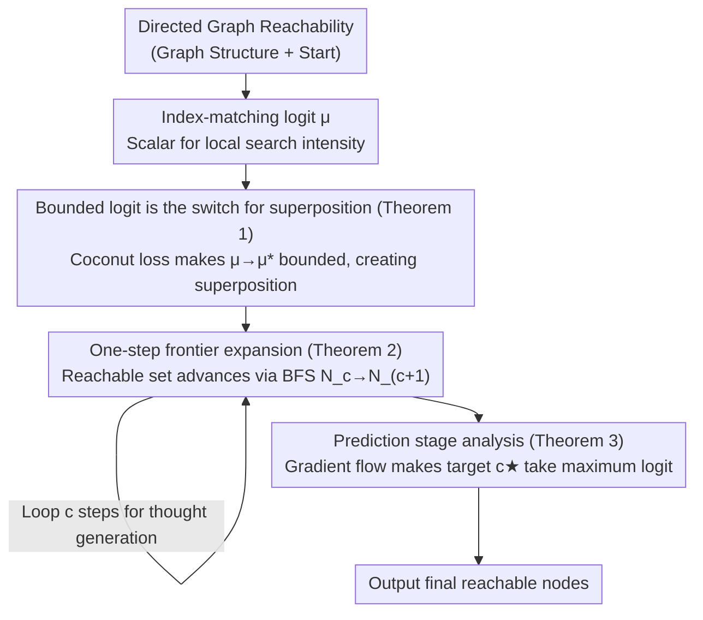

# Emergence of Superposition: Unveiling the Training Dynamics of Chain of Continuous Thought

**Conference**: ICLR 2026  
**arXiv**: [2509.23365](https://arxiv.org/abs/2509.23365)  
**Code**: None  
**Area**: Interpretability / LLM Reasoning Theory  
**Keywords**: Continuous CoT, Superposition, Training Dynamics, Transformer Theory, Graph Reachability

## TL;DR

This work provides a theoretical analysis of the training dynamics of a two-layer Transformer using continuous Chain-of-Thought (Coconut) on directed graph reachability problems. It reveals how the "superposition" mechanism naturally emerges: the index-matching logit grows initially but remains bounded, thereby achieving a balance between exploration and exploitation.

## Background & Motivation

**Empirical Advantages of Continuous CoT**: Coconut (Hao et al., 2024) demonstrates theoretical and experimental advantages across multiple tasks by maintaining reasoning trajectories in a continuous latent space rather than a discrete token space.

**Constructive Proof of Superposition**: Prior work (Zhu et al., 2025) proved that a two-layer Transformer with continuous CoT can efficiently solve graph reachability via a "superposition" mechanism, where the model maintains multiple reasoning trajectories simultaneously when uncertain.

**Core Problem**: Constructive proofs only demonstrate the existence of such parameters but do not explain whether gradient-based training methods can naturally learn the superposition mechanism.

**Comparison with Discrete CoT**: While discrete CoT can only choose one path per step (requiring global planning or backtracking), continuous CoT can maintain multiple paths in parallel (requiring only local search capabilities).

**Goal**: To answer the open question of whether gradient descent naturally leads to the construction of superposition.

## Method

### Overall Architecture

The study consists of a gradient flow analysis centered on a two-layer Transformer using continuous CoT (Coconut) for directed graph reachability. Training is divided into two stages: "thought generation" and "answer prediction." In the former, the model autoregressively expands the current reachable node set by one step; in the latter, the model reads the superposition thoughts to output the final reachable nodes. The core analytical tool is a scalar $\mu$ called the index-matching logit. The theoretical chain proves that gradient flow pushes $\mu$ to a finite positive value, and this "boundedness" is the root cause of the natural emergence of superposition. The logic follows: define $\mu$ $\rightarrow$ prove $\mu$ is bounded (creating superposition) $\rightarrow$ perform step-by-step BFS expansion via superposition $\rightarrow$ prediction head reads the correct answer from the superposition.

### Key Designs

**1. Index-matching logit $\mu$: Characterizing Local Search Intensity with a Scalar**

To compress the model's reliance on local graph structure for edge matching into an analyzable quantity, the authors define the index-matching logit $\mu$. It controls the matching intensity between the "already explored nodes" and "candidate edge source nodes" in the attention mechanism. The magnitude of $\mu$ dictates the behavior: if $\mu$ is too small, attention is nearly uniform, and the model degrades to random guessing; if $\mu$ is too large, attention becomes one-hot, and the model overconfidently focuses on local features (e.g., the neighbor with the highest in-degree), losing the correct path. Under Coconut loss, the evolution of $\mu$ along the gradient flow satisfies $\dot{\mu}(t) = \frac{\alpha}{n\sqrt{K}}\big(d_{p_{c+1}} - F(\mu(t))\big)$. The right side is a demonstration path in-degree term minus a function $F(\mu)$ that increases monotonically with $\mu$. Consequently, $\mu$ does not grow infinitely but converges to a finite value where the two terms balance, providing the foundation for all subsequent conclusions.

**2. Bounded logit is the switch for superposition (Theorem 1)**

Theorem 1 directly links the training objective to the asymptotic behavior of the logit. Under Coconut loss, as long as the target node in-degree $d_\star < d_{max}$, then $\mu(t) \to \mu^\ast < \infty$. Conversely, with Coconut-BFS loss, $\mu(t) \to \infty$, diverging at least at a logarithmic rate. This contrast is the crux of the paper: a bounded $\mu$ allows the softmax to produce a smooth probability distribution, causing the model to assign similar weights to multiple candidate paths when uncertain—this is precisely "superposition." Conversely, a divergent $\mu$ collapses the distribution toward one-hot, forcing the model to commit to a single path prematurely, which prevents recovery from errors. Thus, the emergence of superposition is essentially determined by whether the training loss keeps the logit bounded.

**3. One-step frontier expansion (Theorem 2)**

Proving $\mu$ is bounded is insufficient; one must show that such a $\mu$ can perform BFS-style parallel expansion. Theorem 2 proves that when $\mu > 0$, the token projection of the next thought $\mathbf{U}^\top[t_{c+1}]$ has positive mass only on the one-step expansion set $\mathcal{N}_{c+1}$. Its coefficients $\beta_v$ consist of two parts: carryover (nodes already in $\mathcal{N}_c$ are retained) and one-hop expansion (new nodes added along edges). Effectively, each generated step of continuous thought advances the reachable set cleanly from $\mathcal{N}_c$ to $\mathcal{N}_{c+1}$ without losing old nodes or including unreachable ones, equating "bounded positive $\mu$" with "breadth-first search."

**4. Prediction stage analysis (Theorem 3)**

The final link is proving that the superposition thought can actually be read to yield the correct answer. Theorem 3 analyzes the gradient flow during the answer prediction stage. Among all candidates, only the truly reachable target $c^\star$ possesses both positive residual carryover and candidate lift. Gradient flow causes the logit ratio $(\mu_A(t), \mu_R(t))$ in the prediction head to converge in a direction that allows $c^\star$ to achieve the maximum logit. This closes the end-to-end theoretical chain: training naturally pushes $\mu$ to a bounded positive value $\rightarrow$ boundedness produces superposition $\rightarrow$ superposition performs parallel expansion $\rightarrow$ the prediction head extracts the correct reachable nodes from the superposition.

### Loss & Training

Ours utilizes the Coconut loss $\ell^{coco} = -\log \frac{\exp(\xi_{p_{c+1}})}{\sum_v \exp(\xi_v)}$, which applies cross-entropy only to the next node on a single demonstration path. In contrast, the Coconut-BFS loss $\ell^{BFS} = -\log \frac{\sum_{v \in \mathcal{N}_{c+1}} \exp(\xi_v)}{\sum_v \exp(\xi_v)}$ applies multi-label cross-entropy to all reachable nodes, which causes the logit to diverge. To exploit vertex symmetry, the analysis uses a permutation-averaged dataset loss. Training follows curriculum learning, where stage $c+1$ first generates $c$ steps of continuous thought unsupervised, then trains the expansion for step $c+1$. An intuitive finding here is that although the Coconut loss only supervises a single path, superposition still emerges because it does not force the logit to diverge.

## Key Experimental Results

### Main Results

| Configuration | Model | Test Accuracy |
|------|------|---------|
| GPT-2 style, 2 layers, d=768 | Coconut Training | 96.2% |
| Training Strategy | Stage 1: 150 epochs, 25 epochs each thereafter | 350 epochs total |
| Stage Mixing Prob. | 0.1 (prevents forgetting) | - |

The graph reachability dataset is derived from a subset of ProsQA (Hao et al., 2024), using additional random vertex permutations.

### Ablation Study

| Training Stage | Phenomenon | Theoretical Prediction |
|----------|------|---------|
| Stage 1 (c=1) | Logit difference grows steadily, saturates at ~60 around 125 epochs | Theorem 1: $\mu$ is bounded ✓ |
| Stage 2 (c=2) | Positive $\mu$ established in very few epochs | Reuse of superposition mechanism ✓ |
| Stage 3-4 (c=3,4) | Automatic generalization without explicit training | Length generalization ✓ |

### Key Findings

1. **Coconut loss naturally generates bounded logits**: Even when training data provides only a single demonstration path, superposition emerges—answering the open question posed by Zhu et al. (2025).
2. **Bounded logits are the key mechanism for superposition**: They balance exploration (maintaining multiple possible paths) and exploitation (using local graph structure to identify relevant paths).
3. **Length Generalization**: Once superposition emerges in the early stages, subsequent stages can reuse it quickly, even if never trained on longer sequences.
4. **Comparison with Discrete CoT Theory**: In discrete settings, logits typically grow logarithmically and are unbounded (Tian et al., 2023a; Nichani et al., 2024a). The bounded behavior in the continuous setting represents a fundamental difference.

## Highlights & Insights

- **Filling the Gap between Construction and Dynamics**: While it was previously known that superposition "could exist," this work shows it "emerges automatically."
- **Counter-intuitive Finding**: Even when training data only shows a single path (single demonstration), the model learns to track multiple paths simultaneously—a unique advantage of the continuous latent space.
- **New Perspective on Exploration-Exploitation**: Directly linking the boundedness of attention logits with the exploration-exploitation tradeoff in reasoning provides a new tool for understanding internal LLM reasoning mechanisms.
- **High Consistency between Theory and Experiment**: Experimental curves showing logit growth followed by saturation perfectly validate theoretical predictions.

## Limitations & Future Work

1. The analysis is limited to a simplified setting of two-layer Transformers with linear attention, which differs from actual deep Transformers with softmax attention.
2. It only considers directed graph reachability; generalizing to broader reasoning tasks requires additional work.
3. The "copy" mechanism in the first layer is assumed to be established (citing existing work) and its learning process is not analyzed.
4. The permutation symmetry assumption may not hold strictly in practical LLM training.
5. Experimental scale is limited (2-layer Transformer, simple graph structures) and needs validation on larger models and more complex tasks.

## Related Work & Insights

- **Zhu et al. (2025)**: Direct precursor; provided constructive proof for continuous CoT solving graph reachability—Ours adds training dynamics analysis.
- **Hao et al. (2024) Coconut**: Introduced the continuous CoT concept and curriculum learning—Ours explains the theoretical basis for its success.
- **Nichani et al. (2024a)**: Analyzed induction head training dynamics, but logits diverge in discrete settings—contrasting with the bounded results in Ours.
- **Latent-space reasoning**: Provides theoretical guidance for directions like pause tokens, filler tokens, and planning tokens; the "exploration-exploitation balance" in continuous space might be a common mechanism for these methods.

## Rating

- **Novelty**: ⭐⭐⭐⭐⭐ First to explain the emergence of superposition in continuous CoT from a training dynamics perspective.
- **Experimental Thoroughness**: ⭐⭐⭐ Scale is limited, serving primarily as theoretical validation; lacks large-scale models and real-world reasoning tasks.
- **Writing Quality**: ⭐⭐⭐⭐ Clear mathematical derivations and intuitive illustrations, though it requires significant prior knowledge.
- **Value**: ⭐⭐⭐⭐ Provides a solid theoretical foundation for understanding how continuous CoT works, with broad implications for latent reasoning.

<!-- RELATED:START -->

## Related Papers

- [\[NeurIPS 2025\] Reasoning by Superposition: A Theoretical Perspective on Chain of Continuous Thought](../../NeurIPS2025/interpretability/reasoning_by_superposition_a_theoretical_perspective_on_chain_of_continuous_thou.md)
- [\[ICLR 2026\] Temporal Geometry of Deep Networks: Hyperbolic Representations of Training Dynamics for Intrinsic Explainability](temporal_geometry_of_deep_networks_hyperbolic_representations_of_training_dynami.md)
- [\[ICLR 2026\] From Data Statistics to Feature Geometry: How Correlations Shape Superposition](from_data_statistics_to_feature_geometry_how_correlations_shape_superposition.md)
- [\[ICLR 2026\] Hidden Breakthroughs in Language Model Training](hidden_breakthroughs_in_language_model_training.md)
- [\[ICLR 2026\] Why Low-Precision Transformer Training Fails: An Analysis on Flash Attention](why_low-precision_transformer_training_fails_an_analysis_on_flash_attention.md)

<!-- RELATED:END -->
