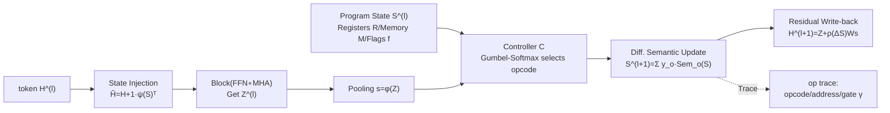

# Emergent Discrete Controller Modules for Symbolic Planning in Transformers

**Conference**: ICLR 2026  
**OpenReview**: [https://openreview.net/forum?id=14dlTHVxDX](https://openreview.net/forum?id=14dlTHVxDX)  
**Code**: To be confirmed  
**Area**: Interpretability / Neuro-symbolic / Algorithmic Reasoning  
**Keywords**: Symbolic Planning, Discrete Controller, Gumbel-Softmax, Length Extrapolation, Control Flow, Program State  

## TL;DR
By embedding a discrete controller selected via Gumbel-Softmax within Transformer blocks, the model explicitly executes program primitives such as `ASSIGN/ADD/COMPARE/BRANCH` while maintaining register states. This achieves provable control flow expressivity, robust length extrapolation, and human-readable execution traces at a cost of only approximately 5–7% FLOPs.

## Background & Motivation
- **Background**: While Transformers are remarkably versatile in sequence modeling, they inherently lack symbolic planning components such as loops, variable assignments, and conditional branching. Neuro-symbolic approaches typically treat symbolic reasoning as a post-processing step or attach external planners/memory networks, leading to heavy architectural complexity.
- **Limitations of Prior Work**: Algorithmic benchmarks like CLRS and ListOps repeatedly expose the fact that standard Transformers fail to extrapolate to longer problem instances. Although Universal Transformers (Adaptive Computation Time) and Compressive Transformers introduce dynamic depth, they lack **discrete control flow semantics**; they regulate "how long to compute" rather than "through what program logic to compute."
- **Key Challenge**: While differentiable discrete operations (Gumbel-Softmax) exist and mechanistic interpretability studies have found that Transformers can accidentally learn symbolic behaviors, these behaviors are neither reliable nor interpretable. **The missing piece is an endogenous, verifiable control flow module that leaves a trace.**
- **Goal**: To endow Transformer layers with verifiable control flow semantics (loops/branches/assignments) and produce step-by-step, human-readable execution traces; states are maintained internally without relying on external planners or large external memories.
- **Core Idea**: **Discrete controllers as program interpreters** — A small controller is attached to each (or every $p$) Transformer block. It utilizes Gumbel-Softmax to perform differentiable selection over a fixed opcode set, executes deterministic semantic updates on a "program state" consisting of registers/flags/optional memory, and writes state changes back into the token stream.

## Method

### Overall Architecture
Beyond standard blocks `Block = FFN ∘ MHA`, the model maintains a program state $S^{(l)}=(R^{(l)}, M^{(l)}, f^{(l)})$ (registers, optional key-value memory, binary flags). Each instrumented layer follows a "state → token → update state → write back" cycle: state embeddings are injected into tokens, tokens pass through attention and feed-forward layers, a summary is pooled from the tokens to feed the controller, the controller selects an opcode and updates the state, and finally, the state delta is written back to the residual stream. During training, traces (opcodes, addresses, branch gates) are recorded only for instrumented layers, with an overhead of ~5–7% FLOPs when $p=2$.

### Key Designs

**1. Gumbel-Softmax Opcode Selector: Turning "instruction selection" into a differentiable discrete decision.** The controller computes opcode logits $\pi^{(l)}=W_o s^{(l)}+b_o$ from the token summary $s^{(l)}=\phi(H^{(l)})$, then samples a near one-hot selection $y^{(l)}=\mathrm{softmax}\big((\pi^{(l)}+g)/\tau\big)$ via Gumbel-Softmax, where $g_k=-\log(-\log u_k)$ is Gumbel noise. The temperature $\tau$ is annealed during training ($\tau(t)=\max(\tau_{\min},\tau_0 e^{-\gamma t})$), gradually tightening from a soft mixture to a hard selection. This is critical for reliable control flow; ablations show a strong negative correlation (Pearson $r\approx-0.81$) between controller decision entropy and extrapolation accuracy. Addressing is also differentiable: read/write distributions $\alpha^{(l)},\beta^{(l)}$ are provided by softmax, completing soft reads/writes to registers alongside value vectors $v^{(l)}=W_v s^{(l)}$.

**2. Differentiable Semantics of Program Primitives: Ensuring deterministic state transformations for each opcode.** The operation set $O=\{\text{ASSIGN, ADD, COMPARE, BRANCH, NOOP}\}$ induces a deterministic mapping on $(R,M,f)$, which is then convexly mixed using $y^{(l)}$ as $S^{(l+1)}=\sum_{o\in O} y^{(l)}_o \,\mathrm{Sem}_o(S^{(l)},r^{(l)},v^{(l)})$. Specifically: ASSIGN overwrites registers with write intensity $\lambda$ as $R^{(l+1)}=(1-\lambda)R^{(l)}+\lambda E(\beta^{(l)})v^{(l)\top}$; ADD performs accumulation $R^{(l+1)}=R^{(l)}+E(\beta^{(l)})v^{(l)\top}$; COMPARE writes to flags using a steep logistic function (sharpness $\kappa\gg1$) $f^{(l+1)}=\sigma(\kappa[A R^{(l)}-B R^{(l)}])$; BRANCH performs soft interpolation between two parameter-sharing micro-MLP sub-programs $S^{(l+1)}=\gamma^{(l)}\Psi_{\text{then}}(S)+(1-\gamma^{(l)})\Psi_{\text{else}}(S)$ via a gate $\gamma^{(l)}=\sigma(w_\gamma^\top f^{(l)}+b_\gamma)$. The elegance of this design lies in flags being written by COMPARE and consumed by BRANCH, naturally replicating imperative "compare-then-jump" control flow.

**3. Bidirectional Coupling with Transformer: State and tokens feed each other without external memory.** An instrumented layer proceeds in four steps: (i) State → Token: the state encoding $b^{(l)}=\psi(S^{(l)})$ is broadcasted and added to each token $\hat H^{(l)}=H^{(l)}+\mathbf{1}b^{(l)\top}$; (ii) Token Update: $Z^{(l)}=\mathrm{Block}(\hat H^{(l)})$; (iii) Token → State: a summary $s^{(l)}=\phi(Z^{(l)})$ is pooled and passed to the controller to update the state; (iv) Residual Write-back: $H^{(l+1)}=Z^{(l)}+\rho(S^{(l+1)}-S^{(l)})W_s$, aligning only the state increment back to the token space. Consequently, the program state remains internal to the network without needing an external memory bank. Instrumented once every $p$ blocks, the relative FLOP overhead is approximately $\frac{1}{2p}(d_s/D)^2$, typically 5–7% for $p=2$.

**4. Provable Expressivity + Multi-objective Training to constrain execution to symbolic semantics.** On the theoretical side, Theorem 1 states: for any "bounded imperative program class" $P_{K,B}$ (straight-line code + conditionals + loops unrolled up to $B$ times, total primitive steps $\le K+B$), there exists a controller-augmented Transformer of depth $L_{\text{net}}=O(K+B)$ that accurately simulates its execution trace in the limit $\tau\to0,\kappa\to\infty$. At finite temperatures, the deviation is bounded by $O(L e^{-c_o m_o})+O(L e^{-c_a m_a})+O(L e^{-\kappa m_f})+O(L\tau)$, vanishing with annealing. The training loss is $L=L_{\text{task}}+\lambda_{op}L_{op}+\lambda_{sem}L_{sem}+\lambda_{ent}L_{ent}+\lambda_{spar}L_{spar}$: besides the main task loss, optional trace supervision $L_{op}$, semantic consistency $L_{sem}$ (penalizing deviations between predicted state transitions and declared semantics, with conservation constraints like $\|\mathbf{1}^\top R^{(l+1)}-\mathbf{1}^\top R^{(l)}\|^2$ for ADD-free steps), entropy annealing $L_{ent}$, and write sparsity $L_{spar}$ (promoting near one-hot writes and small updates) collectively drive the model toward true discrete program execution.

## Key Experimental Results

### Main Results
Algorithmic Reasoning (Sequence-level accuracy %, training length $n\le80$, extrapolation $n\ge160$; mean of 9 runs; B7 is a privileged baseline with intermediate prompts):

| Task / Model | n=80 | n=160 | n=320 | Δlen(80→320) | AUL |
|---|---|---|---|---|---|
| **Sorting** B1 Transformer | 85.4 | 61.2 | 38.7 | −46.7 | 0.69 |
| B6 Soft Modules (Non-discrete) | 93.1 | 78.9 | 66.3 | −26.8 | 0.81 |
| **Ctrl-Transformer (Ours)** | **97.4** | **94.1** | **91.6** | **−5.8** | **0.95** |
| B7 External Planner† (Privileged) | 96.1 | 90.2 | 85.0 | −11.1 | 0.92 |
| **Sum-of-List** B1 | 88.9 | 63.7 | 41.2 | −47.7 | 0.70 |
| B6 Soft Modules | 95.2 | 83.7 | 72.9 | −22.3 | 0.84 |
| **Ctrl-Transformer (Ours)** | **98.1** | **95.6** | **93.8** | **−4.3** | **0.96** |
| **BFS** B1 | 86.3 | 71.4 | 57.9 | −28.4 | 0.78 |
| B6 Soft Modules | 92.1 | 83.5 | 74.2 | −17.9 | 0.86 |
| **Ctrl-Transformer (Ours)** | **95.3** | **90.8** | **83.5** | **−11.8** | **0.90** |

Symbolic QA / Program Synthesis: DROP full set F1 88.0 (B1 81.2), numeric subset F1 +6.8 (85.1 vs 78.3); RobustFill-style program synthesis EM 73.9 (B1 67.8, +6.1 on multi-step compositional test set); Mathematics arithmetic 82.0 (B1 76.1, especially strong on long addition/mixed operators +4–7).

### Ablation Study

| Ablation | Setting | Results |
|---|---|---|
| A1 Discrete vs. Soft | Gumbel → Temp=1 Mixture (B6) | $n\ge160$ extrapolation drops 10–25 pts |
| A2 Inst. Frequency | $p=1/2/3/4$ (Sorting@320) | 92.7/91.6/88.3/84.9, cost +10.1/+6.4/+4.4/+3.2% |
| A4 Semantic Consist. | Remove $L_{sem}$ | Trace alignment drops 7 pts, Sorting@320 −4.5 pts |
| A5 Knockout | Zero out controller output at test | Sorting@320 91.6 → 44.8, DROP numeric F1 85.1 → 79.0 |

### Key Findings
- **Advantage amplifies with length**: Compared to the strongest non-privileged baseline B6, the lead in Sorting expands from +4.3 at $n=80$ to +25.3 at $n=320$; Sum-of-List shows similar monotonic expansion (+2.9 → +20.9). This indicates that gains are not merely uniform shifts but represent a flattening of the "decay curve" in the extrapolation zone.
- **Decay Compression**: The 80→320 decay for Sorting is only 5.8 points (vs. 26.8 for B6 and 46.7 for B1), roughly 0.22× of Soft Modules and 0.12× of vanilla; in terms of error rate, the reduction at $n=320$ relative to B6 is approximately 75–77% (Sorting/Sum-of-List).
- **Winning without privilege**: At $n=320$, Ctrl-Transformer consistently matches or exceeds the External Planner injected with intermediate prompts across three tasks (e.g., Sorting 91.6 vs. 85.0).
- **Execution is genuinely interpretable**: Opcode traces align with ground-truth opcode sequences from deterministic simulators (FIFO BFS + Ascending Order); register roles can be decoded by linear probes (e.g., frontier/parent-pointer registers in BFS); random permutation of registers during testing leads to significant performance drops; targeted knockouts cause localized accuracy loss—proving functional dependence rather than mere surface correlation.

## Highlights & Insights
- **Embedding the "Program Interpreter" within layers**: Unlike NPI/DNC which use external memory/planners, this work makes control flow semantics an endogenous part of the Transformer residual path, eliminating architectural complexity while naturally yielding auditable traces.
- **Theoretical and Empirical Closed-loop**: The exact simulation of Theorem 1 plus finite temperature error bounds is empirically validated by the phenomenon where "decision entropy decreases with annealing while extrapolation accuracy increases ($r\approx-0.81$)," successfully grounding provability in observable metrics.
- **Interpretability "by Design"**: Opcode semantics, register roles, and the flag → branch causal chain are explicitly constructed. Consequently, knockouts and linear probes correspond directly to mechanisms rather than post-hoc attributions.
- **Minimal Cost**: With approximately 5–7% FLOPs and support for sparse instrumentation (once every $p$ layers), "control flow capability" becomes a highly cost-effective plug-and-play module.

## Limitations & Future Work
- **Small Primitive Set**: Currently limited to ASSIGN/ADD/COMPARE/BRANCH/NOOP. Richer domains (e.g., programs with types/data structures) require expanded opcodes and addressing mechanisms.
- **Reliance on Loop Unrolling**: The expressivity proof relies on unrolling loops up to $B$ times and mapping them to depth. Required layers $O(K+B)$ may grow significantly for long programs, raising scalability concerns for extremely long execution paths.
- **Dependence on Synthetic Traces for Partial Supervision**: While trace supervision $L_{op}$ and semantic consistency $L_{sem}$ are effective on synthetic tasks, real-world tasks lack ground-truth opcodes. Whether the same level of interpretability can be maintained under weak supervision remains to be verified.
- **Synthetic/Medium-scale Focus**: Beyond algorithmic suites and DROP/RobustFill, the module has yet to be tested on large-scale pre-trained LLMs to determine if it can coexist with and transfer to existing capabilities.
- **Future Work**: The authors mention introducing type systems, more complex data structures and primitives, and scaling the controller concept to the Large Language Model scale.

## Related Work & Insights
- **Adaptive Depth vs. Control Flow**: While Universal Transformers and Compressive Transformers adjust computation time, this work emphasizes "verifiable control flow semantics + readable traces." The two are orthogonal and potentially combinable.
- **Differentiable Discretization Lineage**: Directly benefits from Gumbel-Softmax / Concrete distributions and straight-through estimators, scaling these techniques from small modules into hierarchical controllers.
- **Neural Programmers / Differentiable Interpreters**: NPI and DNC use external memory for program execution; the difference here is internalizing state within the residual flow and providing expressivity proofs alongside targeted interpretability tools.
- **Insight**: For researchers pursuing "mechanistic interpretability + length extrapolation," this provides a paradigm for "constraining internal computation with differentiable discrete semantics," transferable to scenarios requiring explicit control flow such as retrieval, chains of thought, or tool use.

## Rating
- **Novelty**: ⭐⭐⭐⭐ Endogenizing provable imperative control flow semantics into the Transformer residual path, supported by an interpretability closed-loop of opcode traces/register probes/knockouts, is a novel perspective.
- **Experimental Thoroughness**: ⭐⭐⭐⭐ Covers three types of algorithmic tasks + Symbolic QA + Program Synthesis + Mathematics, 9 runs with significance tests, and detailed ablations on discreteness/frequency/semantic loss/knockouts, though focused on synthetic/medium scales.
- **Writing Quality**: ⭐⭐⭐⭐ Clear hierarchy between method, theory, and experiments. Error bounds and empirical phenomena reinforce each other with high information density in tables.
- **Value**: ⭐⭐⭐⭐ Provides a low-cost, plug-and-play module for "length extrapolation + mechanistic interpretability," offering strong reference value for the algorithmic reasoning and neuro-symbolic communities.

<!-- RELATED:START -->

## Related Papers

- [\[ICLR 2026\] Decoupling Positional and Symbolic Attention in Transformers](decoupling_positional_and_symbolic_attention_in_transformers.md)
- [\[ICLR 2026\] Activation Steering with a Feedback Controller](activation_steering_with_a_feedback_controller.md)
- [\[ICLR 2026\] Persona Features Control Emergent Misalignment](persona_features_control_emergent_misalignment.md)
- [\[ICLR 2026\] Latent Planning Emerges with Scale](latent_planning_emerges_with_scale.md)
- [\[ICLR 2026\] Features Emerge as Discrete States: The First Application of SAEs to 3D Representations](features_emerge_as_discrete_states_the_first_application_of_saes_to_3d_represent.md)

<!-- RELATED:END -->
