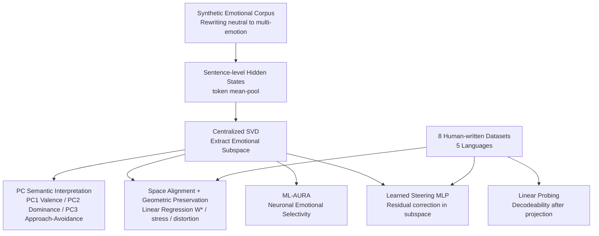

# Emotions Where Art Thou: Understanding and Characterizing the Emotional Latent Space of Large Language Models

**Conference**: ICLR 2026  
**OpenReview**: [https://openreview.net/forum?id=72TN9UAtNI](https://openreview.net/forum?id=72TN9UAtNI)  
**Code**: To be confirmed  
**Area**: Interpretability / Representation Geometry  
**Keywords**: Emotion Representation, Latent Space Geometry, SVD Subspace, Cross-lingual Alignment, Activation Steering  

## TL;DR
This paper systematically characterizes the "emotional latent space" within LLM hidden states using SVD subspaces, geometric alignment, neuronal selectivity (ML-AURA), and learned steering modules. It identifies emotion as a directional, cross-layer, and cross-lingual low-dimensional manifold (generalizing across 8 datasets and 5 languages) that can be precisely manipulated while preserving semantics.

## Background & Motivation
**Background**: NLP research on emotion has long followed two paradigms: sentiment analysis, which proves models can "recognize" emotion without explaining "internal representation," and behavioral perspectives, which observe model outputs in emotional contexts or measure alignment with human judgment. Other works map text to VAD (Valence-Arousal-Dominance) dimensions or generate emotional language on demand.

**Limitations of Prior Work**: Existing approaches treat emotion as a **label or generation condition** rather than an "internal latent representation." They focus on output behavior or classification accuracy, rarely touching the **geometric structure** of emotional encoding in hidden states—classification accuracy does not imply interpretability. Rare probing studies (e.g., finding valence is linearly readable) rely on encoder-only models and fixed lexicons, often "imposing" or "supervising" the emotional space rather than examining if it **spontaneously emerges**.

**Key Challenge**: Psychology disputes whether emotions are "discrete categories" (Ekman’s six basic emotions) or "continuous dimensions" (VAD/Russell’s circumplex model). Neuroscience also debates between "localist" and "distributed/constructionist" views. Whether LLMs internalize an emotional geometry during pure text pre-training without supervision, and whether this geometry is universal across languages and controllable, remains an open question.

**Goal**: To **recover emergent emotional structures** directly from the hidden state geometry of decoder-only LLMs. The study aims to determine if the emotional subspace is low-dimensional and interpretable, if it generalizes across datasets/languages, and if it can be precisely steered while maintaining semantics.

**Core Idea**: Emotion in LLMs is not an isolated label but a **directionally encoded, cross-layer stable, and cross-lingually universal low-dimensional "emotional manifold."** By applying centralized SVD, geometric alignment, probing, neuronal selectivity analysis, and causal steering, this "machine emotional geography" can be fully mapped and controlled.

## Method

### Overall Architecture
The analysis rests on the hypothesis that LLM hidden states reside on a low-dimensional manifold where emotion is a primary linear structural variance. The authors use a **synthetic emotional corpus** (rewriting neutral sentences into various emotions to make emotion the dominant variance) to extract "pure" emotional directions. All downstream evaluations—cross-domain alignment, probing, and causal steering—are validated on 8 **human-written** datasets. Four toolsets are deployed: centralized SVD for subspace extraction and principal component interpretation; geometric alignment and stress/distortion metrics for cross-domain structural consistency; ML-AURA for neuronal selectivity; and a learned MLP module for causal steering.

### Key Designs

**1. Centralized SVD for Subspace Extraction: Emotional Variation as the Main Axis.** For each input, token activations are mean-pooled into a sentence vector. After stacking, the vectors are **centralized and processed via SVD** to obtain orthogonal directions of variation. If emotion is the dominant structural difference (per the synthetic design), the top singular directions align with emotional axes. To interpret semantics, the relative ordering of emotional centroids is examined along each component, flipping signs where necessary to unify polarity for cross-layer comparability.

**2. Spatial Alignment + Multiple Geometric Preservation Metrics: Distinguishing "Directional Alignment" from "Distance Isomorphism."** To determine if the synthetic manifold reflects real emotional encoding, the authors compute a linear mapping $W^* = \arg\min_W \lVert YW - X \rVert_F^2$ to align synthetic and human-written subspaces. They report the Frobenius norm (magnitude) and spectral flatness. However, global direction alignment does not guarantee **relative distance** preservation. Thus, high-dimensional geometric metrics are introduced: Stress-2 measures distance matrix embedding error $\frac{\sum_{i<j}(D^{(H)}_{ij}-D^{(L)}_{ij})^2}{\sum_{i<j}(D^{(H)}_{ij})^2}$; average distortion uses the expansion ratio $\rho_{ij}=\frac{D^{(Y)}_{ij}}{D^{(X)}_{ij}+\varepsilon}$ (ideal $\approx 1$); and $\ell_2$-distortion and $\sigma$-distortion capture anisotropic scaling. This allows for distinguishing between spaces that differ only by global scaling versus those with idiosyncratic deformations.

**3. ML-AURA Neuronal Selectivity: Validating Distributed Encoding.** Each neuron is treated as a threshold detector. Scoring is based on a neuron's maximum activation on a token for a given emotional concept. One-vs-all AUROC measures the ability to distinguish the target emotion. Neurons with AUROC > 0.9 are "expert units." Findings of widely distributed and redundant selective neurons across layers support a constructionist view: emotion emerges from numerous multi-purpose components rather than localized units.

**4. Intra-subspace Learned Steering Module: Precise Control with Semantic Preservation.** Unlike prior work collapsing emotion into binary axes, this study trains a single-layer GELU MLP within the established SVD subspace. For each emotion, layers are selected where adding the centroid direction improves one-vs-all AUROC. Hidden states are projected into the subspace, processed by the MLP to calculate a displacement, and mapped back for **residual addition**. The objective $L_{total}=L_{token}+L_{sem}$ balances goals: semantic preservation $L_{sem}=(1-\cos(h_{base},h_{shifted}))+\gamma\cdot\frac{\lVert h_{base}-h_{shifted}\rVert_2}{\lVert h_{base}\rVert_2+\lVert h_{shifted}\rVert_2}$ ensures minimal distortion; emotional control uses cross-entropy with margin loss $L_{margin}=\max(0, m_1-(\log p_{e_i}-\log p_{s_i}))+\max(0, m_2-(\log p_{s_i}-\log p_{e_j}))$ to force the target emotion token logit above synonyms and other emotions.

## Key Experimental Results
Models: LLaMA-3.1-8B (primary), OLMo-v2, Ministral. Data: 8 datasets across 5 languages (English, Spanish, German, Hindi, French, Italian), including GoEmotions and CARER.

### Main Results (Generality, selected from Table 1)

| Model | Language | Avg Cosine↑ | Stress-2↓ | Avg Distortion↓ | Probe Acc↑ | Avg MSE↓ |
|---|---|---|---|---|---|---|
| Llama-Base | English | 0.84 | **0.15** | **0.97** | 0.47 | 1.81 |
| Llama-Base | Non-Eng | 0.84 | 0.18 | 0.96 | 0.40 | 1.81 |
| Llama-Instruct | English | **0.93** | 0.22 | 0.78 | 0.40 | 0.93 |
| Llama-Instruct | Non-Eng | **0.94** | 0.22 | 1.01 | 0.45 | 0.89 |
| OLMov2-Base | English | 0.88 | 0.59 | 1.46 | 0.42 | 1.90 |
| OLMov2-Instruct | English | 0.90 | 0.32 | 47%* | 0.47 | 1.03 |

(*Asterisk denotes percentage of high-distortion layers). All models show cosine similarities of 0.83–0.93 between real and synthetic directions. Performance in English is only slightly higher than non-English, indicating near-equivalent cross-lingual representation fidelity.

### Ablation Study (Neuronal Selectivity + Principal Component Semantics)

| Analysis Dimension | Key Finding |
|---|---|
| ML-AURA (6 Basic Emotions, AUROC > 0.9) | Avg 75% neurons/layer; sadness (98%) most common, fear (48%) lowest |
| ML-AURA (Non-Ekman: envy, excitement, etc.) | Avg 88% |
| MLP vs Attention Selectivity | 79% vs 76.5% (MLP slightly higher) |
| PC Semantic Interpretation | PC1≈Valence, PC2≈Dominance, PC3≈Approach-Avoidance, PC4≈Arousal |
| Steering Performance (LLaMA-3.1-8B, Top-1 Avg) | 9% → 83% (Semantic loss 0.22) |
| Steering (Weakest Case: Hindi) | ~ +50% absolute improvement |

### Key Findings
- **Alignment $\neq$ Isomorphism**: While global directional alignment is strong (high cosine), stress/distortion reveal that local relative distances are warped in many layers. OLMo-v2-Instruct shows improved global alignment via instruction tuning but higher local geometric distortion.
- **Distributed Redundancy**: Selective neurons are distributed across layers without a monotonic depth trend (peak at layer 26), supporting constructionism.
- **High Controllability**: Most emotions achieve >80% Top-1 accuracy after steering, with minimal semantic drift. Basic emotions (sadness, anger) are easiest to control, while nuanced emotions (envy) and low-resource languages (Hindi) remain less stable.

## Highlights & Insights
- **Upgrading "Emotion" to a Geometric Object**: By using SVD, alignment, and distortion metrics, the paper provides the first systematic mapping of emotional latent space's directionality and cross-lingual universality.
- **Spontaneous Emergence of Psychological Dimensions**: PC1–PC4 spontaneously correspond to Valence, Dominance, Motivation, and Arousal without supervision, providing strong evidence that LLMs internalize classical human emotional constructs.
- **Metric-driven Insights**: Distinguishing "global direction" from "local distance" explains how high similarity scores can coexist with local geometric warping, offering methodological value for representation alignment.
- **Semantic-Preserving Fine-grained Steering**: Controlling a full range of emotional categories rather than a binary axis, while explicitly constraining semantic drift, surpasses the utility of prior binary valence flipping work.

## Limitations & Future Work
- **Dependency on Pre-training Coverage**: Distortion and stress increase in OOD scenarios (19th-century German drama, low-resource Hindi). The geometry "deforms" but does not "collapse."
- **Unimodal Scope**: Future research is needed to extend these findings to multimodal models to see if emotional subspaces are shared across vision, audio, and language.
- **Lack of Training Dynamics**: The study does not investigate how these representations form during the pre-training process.
- **Ethical Risks**: The ability to manipulate internal emotional perception is a double-edged sword; the authors restrict steering to internal states while attempting to maintain semantic integrity.

## Related Work & Insights
This work extends the line of research on low-dimensional manifolds and linear recoverability of semantics in LLMs. It connects sentiment analysis (e.g., valence probes by Hollinsworth et al. 2024) with behavioral VAD mapping. Unlike supervised approaches (Dathathri, Wang & Zong), this study emphasizes **emergence**. The geometric alignment mirrors the "quasi-rigid linear alignment" concepts from Moschella and others. **Key Insights**: (1) The paradigm of "mapping" abstract concepts as geometric objects is reusable. (2) Stress/distortion should be standard metrics for representation alignment. (3) The intra-subspace residual steering template is transferable to other attributes like style, stance, or persona.

## Rating
- **Novelty**: ⭐⭐⭐⭐ Unifies psychological dimensions, neuroscientific debates, and geometric alignment into a system for characterizing emotional latent space.
- **Experimental Thoroughness**: ⭐⭐⭐⭐ Broad coverage (3 models, 8 datasets, 5 languages). Main limitation is relying on classification rates as a proxy for steering instead of extensive human evaluation of generation quality.
- **Writing Quality**: ⭐⭐⭐⭐ Clear structure, well-justified metrics, and a convincing narrative regarding the tension between alignment and isomorphism.
- **Value**: ⭐⭐⭐⭐ Provides a reusable methodology and strong evidence for emotional interpretability and controllable editing.

<!-- RELATED:START -->

## Related Papers

- [\[ICLR 2026\] Neuron-Level Analysis of Cultural Understanding in Large Language Models](neuron-level_analysis_of_cultural_understanding_in_large_language_models.md)
- [\[ICLR 2026\] Internal Planning in Language Models: Characterizing Horizon and Branch Awareness](internal_planning_in_language_models_characterizing_horizon_and_branch_awareness.md)
- [\[ICLR 2026\] The Shape of Adversarial Influence: Characterizing LLM Latent Spaces with Persistent Homology](the_shape_of_adversarial_influence_characterizing_llm_latent_spaces_with_persist.md)
- [\[ICLR 2026\] What Do Large Language Models Know About Opinions?](what_do_large_language_models_know_about_opinions.md)
- [\[ICLR 2026\] Latent Concept Disentanglement in Transformer-based Language Models](latent_concept_disentanglement_in_transformer-based_language_models.md)

<!-- RELATED:END -->
