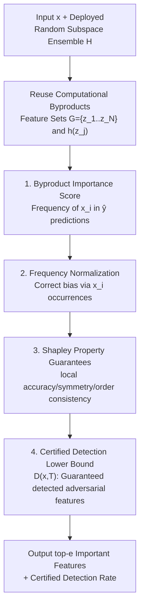

# EnsembleSHAP: Faithful and Certifiably Robust Attribution for Random Subspace Method

**Conference**: ICLR 2026  
**OpenReview**: [https://openreview.net/forum?id=u0UjdCMPLc](https://openreview.net/forum?id=u0UjdCMPLc)  
**Code**: https://github.com/Wang-Yanting/EnsembleSHAP  
**Area**: Interpretability / Feature Attribution / AI Safety  
**Keywords**: Random Subspace Method, Shapley Value, Feature Attribution, Certified Robustness, Explanation-Preservation Attack

## TL;DR
This paper proposes EnsembleSHAP, a feature attribution method specifically designed for the random subspace method. It directly reuses the sub-sampled prediction results already calculated by the ensemble model to provide Shapley-style feature importance with near-zero additional overhead. Furthermore, it provides the first provable robustness guarantee against "explanation-preservation attacks."

## Background & Motivation
**Background**: The random subspace method (also known as attribute bagging) is a model-agnostic ensemble approach that requires only black-box access to a base model. It randomly samples subsets of features from input $x$, obtains predictions from the base model for each subset, and determines the final label via majority voting. Recently, it has become a primary tool in the security field for constructing certifiably robust defenses against $\ell_0$ perturbations (e.g., RanMASK) and protecting LLMs against jailbreak attacks (e.g., RA-LLM, SmoothLLM).

**Limitations of Prior Work**: There is an increasing need to "explain" the outputs of random subspace methods—for example, identifying which words in a jailbreak prompt triggered a "harmful" classification or finding adversarial words that caused misclassification in certified defenses. However, existing top-tier black-box attribution methods (Shapley, LIME) face two major obstacles. The first is computational explosion: these methods require randomly perturbing the input $M$ times, and each perturbed version must be sub-sampled $N$ times by the ensemble model. This results in $M \times N$ base model queries per sample, which is unacceptable in practice as both $M$ and $N$ can exceed 1,000. The second is the lack of security guarantees: against "explanation-preservation attacks" (where an attacker modifies a few features to flip the classification while keeping the explanation unchanged to hide the tampering), existing methods cannot guarantee the detection of these adversarial features.

**Key Challenge**: Random subspace methods are already expensive (requiring $N$ forward passes per prediction), and external attribution methods treat them as black boxes and call them repeatedly, effectively multiplying the high cost. Moreover, existing robust attribution theories focus almost exclusively on "prediction-preservation attacks" (keeping the prediction unchanged while modifying the explanation) and lack provable protection against the more dangerous "explanation-preservation attacks" (modifying the prediction while maintaining the explanation).

**Goal**: Design a feature attribution method that simultaneously satisfies three criteria: computational efficiency, preservation of key attribution properties (such as local accuracy), and certified robustness against explanation-preservation attacks.

**Key Insight**: The key observation made by the authors is that when a random subspace method makes a prediction, it has already calculated base model predictions $h(z_j)$ for a large number of feature subsets $z_j$. These results are exactly the "computational byproducts" needed to calculate Shapley values. Rather than treating the ensemble as a black box and perturbing it further, it is better to **directly reuse these existing sub-sampling results** to estimate the importance of each feature.

**Core Idea**: The importance of a feature $x_i$ is defined as the "probability that a randomly sampled feature group contains $x_i$ and predicts the label $\hat{y}$." This allows attribution using only the computational byproducts of the random subspace method itself, maintaining order consistency with Shapley values and providing a provable detection lower bound against explanation-preservation attacks.

## Method

### Overall Architecture
The objective of EnsembleSHAP is as follows: given a deployed random subspace ensemble model $H$ (base model $h$, sub-sampling size $k$, $N$ samples), for a test input $x=\{x_1, \dots, x_d\}$ and its ensemble prediction $\hat{y}$, output an importance score $\alpha_i^{\hat{y}}$ for each feature $x_i$ to identify the top-$e$ most important features. Furthermore, in an adversarial setting, it provides a certified lower bound for how many modified features will definitely fall within the top-$e$.

The pipeline is: When the ensemble model predicts, it samples a collection of feature groups $G=\{z_1, \dots, z_N\}$ and computes each $h(z_j)$. → EnsembleSHAP reuses these $(z_j, h(z_j))$ pairs directly, estimating importance scores based on the "frequency of containing $x_i$ and predicting $\hat{y}$," and adds a frequency normalization term to eliminate bias under small $N$. → Theoretically, the score is proven to retain Shapley's local accuracy and symmetry while maintaining order consistency with Shapley values. → Under the assumption that an attacker modifies at most $T$ features, a certified detection size $D(x, T)$ is derived, guaranteeing that at least this many adversarial features will be reported in the top-$e$.

### Key Designs

**1. Byproduct Importance Score: Utilizing the intrinsic computation of the random subspace method for Shapley estimation**

Addressing the bottleneck where external attribution requires repeated black-box calls ($M \times N$ queries), the authors no longer perturb the input. Instead, they define importance directly on the feature groups already sampled by the random subspace method. Formally, the importance of feature $x_i$ for the predicted label $\hat{y}$ is defined as:

$$\alpha_i^{\hat{y}}(x,h,k)=\frac{1}{k}\,\mathbb{E}_{z\sim U(x,k)}\big[\mathbb{I}(x_i\in z)\cdot\mathbb{I}(h(z)=\hat{y})\big],$$

Intuitively, this is the probability that "a randomly sampled feature group of size $k$ both contains $x_i$ and is predicted as $\hat{y}$ by the base model." The underlying allocation logic is simple: the ensemble output is the aggregation of all feature group results. For any group $z_j$, each feature within the group shares the contribution equally (each gets $1/k$), while features not in the group get a contribution of 0. Thus, the total contribution of a single feature is the sum of its contributions across all groups. Since each $h(z_j)$ in $G$ is already computed during ensemble prediction, this score adds almost zero overhead (measured at approximately $0.03$ seconds), completely bypassing the $M \times N$ queries.

**2. Frequency Normalization: Correcting the "higher frequency appears more important" bias under small $N$**

The naive Monte Carlo estimate $\frac{1}{k\cdot N}\sum_{j=1}^{N}\mathbb{I}(x_i\in z_j)\mathbb{I}(h(z_j)=\hat{y})$ works fine when $N$ is very large, as each feature appears in a similar number of groups. However, when $N$ is small, the appearance frequency of each feature in sub-sampled groups fluctuates, causing frequently appearing features to be systematically overestimated. Using an identity, the authors rewrite the score as:

$$\alpha_i^{\hat{y}}(x,h,k)=\frac{1}{k}\Pr(x_i\in z)\cdot\Pr(h(z)=\hat{y}\mid x_i\in z)=\frac{1}{d}\Pr(h(z)=\hat{y}\mid x_i\in z),$$

The estimator thus becomes:

$$\alpha_i^{\hat{y}}(x,h,k)\approx\frac{1}{d\cdot\sum_{j=1}^{N}\mathbb{I}(x_i\in z_j)}\sum_{j=1}^{N}\mathbb{I}(x_i\in z_j)\cdot\mathbb{I}(h(z_j)=\hat{y}),$$

This replaces the fixed $N$ in the denominator with the "actual number of occurrences of $x_i$," $\sum_j\mathbb{I}(x_i\in z_j)$. This change measures importance via "conditional probability" rather than "joint frequency," eliminating unfair estimation caused by uneven frequencies. Experiments in Appendix D confirm this stably improves attribution quality.

**3. Shapley Property Guarantees: Trading hard-to-calculate properties for "order consistency"**

To demonstrate that this efficient score is well-founded, the authors prove it inherits two core properties of Shapley values: **local accuracy** (the sum of all feature importances equals the ensemble prediction probability, $\sum_{i\in x}\alpha_i^{\hat{y}}=p_{\hat{y}}(x,h,k)$) and **symmetry** (two features that contribute identically to all subsets receive the same score). Simultaneously, it replaces the other two properties (dummy, linearity) with **order consistency** with Shapley values: EnsembleSHAP gives feature $i$ a higher score than $j$ if and only if the Shapley value considers $i$ more important than $j$ ($\alpha_i^{\hat{y}}\ge\alpha_j^{\hat{y}}\iff\phi_i(p_{\hat{y}})\ge\phi_j(p_{\hat{y}})$). Dummy and linearity are discarded because linearity is impractical in subspace settings, and in practice, users care more about "relative importance ranking" than absolute values. Common evaluation metrics like faithfulness and perturbation curves only rely on ranking. In other words, the authors trade absolute values for affordable computation without losing utility under these metrics.

**4. Certified Detection Lower Bound: First provable protection against "explanation-preservation attacks"**

Addressing explanation-preservation attacks, the authors turn the question of whether an explanation can "catch" adversarial features into a certifiable quantity. Let an attacker modify at most $T$ features to flip the ensemble prediction (perturbation set $B(x, T)$, modified features $x\ominus x'$). The **certified detection size** is defined as:

$$D(x,T)=\arg\max_{r}\ r,\quad \text{s.t.}\ |(x'\ominus x)\cap E(x')|\ge r,\ \forall x'\in B(x,T),\ H(x')\neq H(x),$$

Meaning "no matter how the attacker modifies the input, at least $r$ modified features are guaranteed to fall in the top-$e$ important feature set $E(x')$." Theorem 1 provides optimization conditions for solving $D(x, T)$ (by constructing constraints on upper and lower bounds $\overline{\alpha}, \underline{\alpha}$ of scores and label probability bounds $\overline{p}, \underline{p}$, solved via binary search in practice). The intuition is that to flip the label from $\hat{y}$ to $\hat{y}'$, the attacker must cause more feature groups to predict $\hat{y}'$. However, the attacker can only influence groups that "contain at least one modified feature"—which naturally increases the importance of the modified features themselves, making them easier to detect. This is the first work to establish provable robustness for explanation-preservation attacks.

### Loss & Training
The method itself does not introduce training objectives; it is a post-hoc attribution applied to an existing random subspace ensemble. In the certified defense setting, the base model is a pre-trained BERT fine-tuned on masked samples using AdamW with a learning rate of $1\times10^{-5}$ for 10 epochs to improve certification performance. In the jailbreak defense setting, Vicuna-7B is used as the base model without further training.

## Key Experimental Results

### Main Results
In the certified defense scenario, faithfulness (the proportion of label flips after removing the top-$e$ important words, higher is better) is compared against Shapley, LIME, and ICL:

| Scenario / Dataset | Deletion Ratio | Shapley | LIME | ICL | Ours |
|--------------|---------|---------|------|-----|------|
| Clean · IMDb | 10% | 0.300 | 0.060 | 0.045 | **0.600** |
| Clean · IMDb | 20% | 0.330 | 0.095 | 0.050 | **0.745** |
| Backdoor · IMDb | 10% | 0.520 | 0.120 | 0.120 | **0.810** |
| Backdoor · IMDb | 20% | 0.540 | 0.180 | 0.170 | **0.910** |
| Adversarial · IMDb | 10% | 0.845 | 0.280 | 0.305 | **0.980** |
| Adversarial · IMDb | 20% | 0.840 | 0.335 | 0.365 | **1.000** |

Keyword prediction recall (top-5) for IMDb under backdoor attacks: Ours **0.892** vs. Shapley 0.491. In jailbreak defense scenarios (GCG/AutoDAN/DAN), faithfulness also leads; for example, on DAN with 10% deletion, Ours **0.85** vs. LIME 0.54 vs. Shapley 0.33.

### Ablation Study
| Configuration / Factor | Observed Impact | Description |
|------------|------------|------|
| Frequency Normalization (Design 2) | Attribution quality drops for small $N$ without it | Verified in App. D; corrects uneven occurrence frequencies |
| Sub-sampling number $N$ ↑ | Both faithfulness and keyword prediction improve | Importance estimation becomes more precise |
| Dropout rate $\rho=1-k/d$ very high (e.g., 0.9) | Faithfulness drops; keyword prediction stays stable | High dropout makes the ensemble less sensitive to removing important features |
| Certified Detection: $N$ ↑ or $\rho$ ↑ | Certified detection rate significantly increases | Insensitive to confidence $\beta$ |
| Certified Detection: $T$ ↑ (More modified features) | Detection rate decreases; increases as $e$ ↑ | Reporting more features is more likely to cover adversarial ones |

### Key Findings
- Reusing computational byproducts allows attribution with nearly zero cost: feature attribution takes $\sim 0.03$ seconds, and certified detection takes $<0.5$ seconds, orders of magnitude faster than Shapley/LIME's $M \times N$ queries.
- Gains are most significant on "attacked" samples (backdoor/adversarial/jailbreak), indicating the attribution correctly captures adversarial features causing the misclassification, not just correlations in clean samples.
- The certified detection rate increases with the number of reported features $e$ and decreases with the attack budget $T$, aligning with the intuition that reporting more features makes coverage easier while more modified features are harder to catch entirely. The method generalizes to adversarial patch attacks in the image domain (Appendix H).

## Highlights & Insights
- **Reusing Computational Byproducts Perspective**: Random subspace methods naturally generate a large number of $(z_j, h(z_j))$ pairs. Treating these as data for Shapley estimation avoids repeated black-box calls. This idea—that intermediate results of deployed systems can serve as free explanatory material—is transferable to other bagging/ensemble systems.
- **Replacing Hard Properties with "Order Consistency"**: Realizing that mainstream faithfulness metrics only rely on ranking, the authors courageously discarded dummy/linearity to focus on local accuracy, symmetry, and order consistency. This reduces computation without sacrificing practical utility.
- **First Certification of "Explanation-Preservation Attacks"**: Previous robust attribution theories mostly covered prediction-preservation attacks. This paper establishes a provable lower bound $D(x, T)$ for the more dangerous "modify prediction, hide explanation" setting, turning "explanation security" into a certifiable quantity.

## Limitations & Future Work
- The method is tightly coupled with the specific paradigm of random subspace methods. Its efficiency stems from reusing the byproducts of this specific method and is not directly applicable to general black-box models that do not use sub-sampling (the authors list "provably secure attribution for general models" as future work).
- By relaxing dummy/linearity, the absolute values of the importance scores no longer carry the strict semantics of Shapley values, only guaranteeing order. In applications requiring absolute contribution values, the guarantees are weakened.
- The certified detection bound depends on the attacker modifying at most $T$ features and requires a large $N$ (default $N=10,000$ in experiments) to be significant. Certification strength is linked to the sampling budget; guarantees degrade beyond $T$ or with low budgets.
- Experiments focused on text classification (SST-2/IMDb/AGNews) and jailbreak defense; image domain proof is primarily in the appendix, and cross-modal validation remains limited.

## Related Work & Insights
- **vs. Shapley Values**: Shapley is the gold standard but requires extensive perturbation queries to ensembles and lacks security guarantees. Ours reuses byproducts for near-zero cost, is proven order-consistent with Shapley, and adds certification against explanation-preservation attacks.
- **vs. LIME**: LIME also requires thousands of queries, and its faithfulness on attacked samples is much lower (0.280 vs. Ours 0.980 on IMDb adversarial 10%). Ours leads in both efficiency and faithfulness.
- **vs. Existing Robust Attribution Theory**: Prior works (Wang & Kong 2024, Lin 2023, etc.) are mostly limited to prediction-preservation attacks. This paper is the first to provide certified detection bounds for explanation-preservation attacks.

## Rating
- Novelty: ⭐⭐⭐⭐⭐ Transforming random subspace byproducts into efficient Shapley-style attribution and certifying explanation-preservation attacks is a novel angle.
- Experimental Thoroughness: ⭐⭐⭐⭐ Covers backdoor, adversarial, and jailbreak attacks with certified detection, though many comparison details are in the appendix.
- Writing Quality: ⭐⭐⭐⭐ Definitions and property derivations are clear, though the certification theorem is dense and requires the appendix for full understanding.
- Value: ⭐⭐⭐⭐⭐ Provides an affordable and provable explanation tool for security-critical random subspace defenses, offering high practical utility.

<!-- RELATED:START -->

## Related Papers

- [\[ICLR 2026\] Learning for Highly Faithful Explainability](learning_for_highly_faithful_explainability.md)
- [\[ICML 2026\] Towards Long-Horizon Interpretability: Efficient and Faithful Multi-Token Attribution for Reasoning LLMs](../../ICML2026/interpretability/towards_long-horizon_interpretability_efficient_and_faithful_multi-token_attribu.md)
- [\[ICLR 2026\] Automated Interpretability Metrics Do Not Distinguish Trained and Random Transformers](automated_interpretability_metrics_do_not_distinguish_trained_and_random_transfo.md)
- [\[ICLR 2026\] Toward Faithful Retrieval-Augmented Generation with Sparse Autoencoders](toward_faithful_retrieval-augmented_generation_with_sparse_autoencoders.md)
- [\[ICLR 2026\] Interpretable 3D Neural Object Volumes for Robust Conceptual Reasoning](interpretable_3d_neural_object_volumes_for_robust_conceptual_reasoning.md)

<!-- RELATED:END -->
