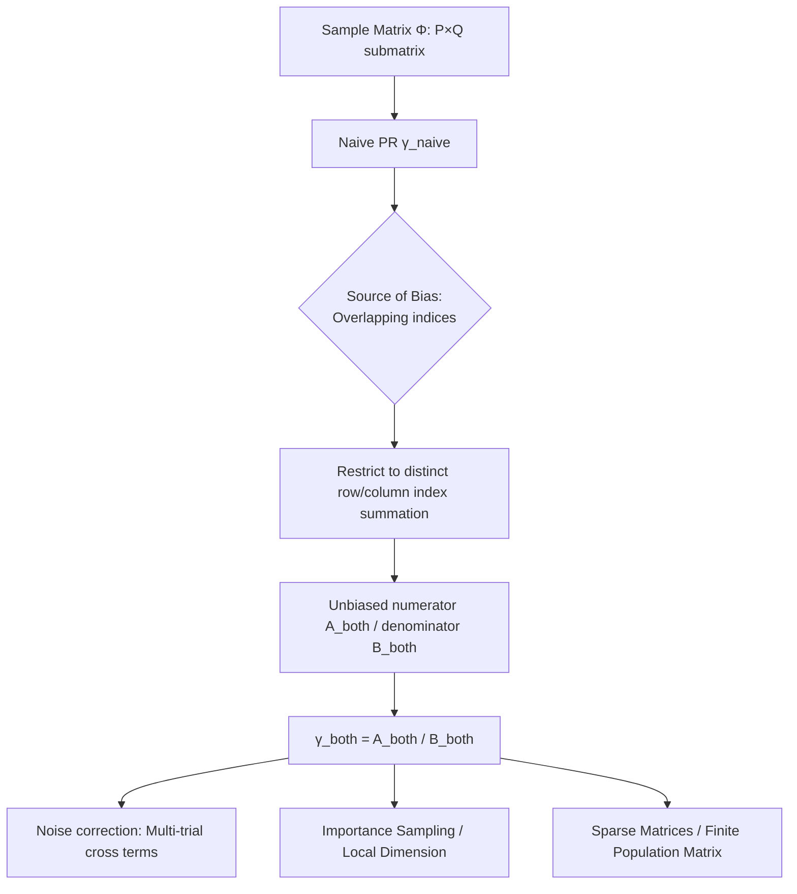

# Estimating Dimensionality of Neural Representations from Finite Samples

**Conference**: ICLR 2026  
**OpenReview**: [https://openreview.net/forum?id=iM4o9a83F7](https://openreview.net/forum?id=iM4o9a83F7)  
**Code**: [github.com/badooki/dimensionality](https://github.com/badooki/dimensionality)  
**Area**: interpretability (neural representation dimensionality estimation / neuroscience + LLM interpretability)  
**Keywords**: dimensionality estimation, Participation Ratio, finite-sample bias, neural manifold, representation geometry

## TL;DR
Addressing the long-standing issue where the Participation Ratio (PR), a global dimensionality metric, is severely biased under finite samples, this paper derives an unbiased estimator $\gamma_{\text{both}}$ that simultaneously debiases for **row sampling, column sampling, and noise**. This allows dimensionality estimates to remain nearly invariant as the number of samples changes and extends to sparse matrices and local dimensionality.

## Background & Motivation
**Background**: Neural representations can be viewed as "neural manifolds" in high-dimensional space. Their global dimension (effective rank) is a core quantity for understanding computation in the brain and deep networks—it correlates with classification/regression performance, linear separability, and BCI decoder design, and serves as an important metric for layer-wise interpretability in LLMs (e.g., linear probes for harmful content). PR is the most widely used "soft-count" measure.

**Limitations of Prior Work**: All global dimensionality estimators are **sensitive to the number of rows $P$ (stimuli) and columns $Q$ (neurons) of the sample matrix**. Experimentally, one can only record a subset of neurons and present a subset of stimuli, yielding a random sub-matrix $\Phi\in\mathbb{R}^{P\times Q}$ of the true infinite matrix $\Phi^{(\infty)}$. Naive estimates of PR systematically shift with $P$ and $Q$. Local dimensionality methods (e.g., TwoNN), though insensitive to sample size, cannot measure global dimension and are extremely sensitive to noise.

**Key Challenge**: A global dimensionality estimator that is **robust to both finite samples and noise** has been missing. Previous debiasing attempts (Dahmen 2020, Pospisil & Pillow 2024) rely on strong distributional assumptions, only correct for row sampling, and maintain bias in their individual numerators and denominators.

**Goal**: To provide a rigorous debiasing of PR using estimation theory, requiring only minimal assumptions, while simultaneously correcting for row sampling, column sampling, and noise biases.

**Core Idea**: Both the numerator and denominator of PR can be written as sums over several indices. The bias arises precisely from terms with **overlapping indices**. By restricting the summation to **mutually unequal indices**, unbiased estimators for both the numerator and denominator can be obtained.

## Method

### Overall Architecture
The true centered dimension is expressed as a ratio $\gamma = A/B$, where both $A$ and $B$ are averages of the tensor $v^{\alpha\beta}_{ijkl}:=\Phi_{i\alpha}\Phi_{j\alpha}\Phi_{k\beta}\Phi_{l\beta}$ over four row indices $\{i,j,l,r\}$ and two column indices $\{\alpha,\beta\}$. The naive estimator $\gamma_{\text{naive}}$ simply replaces the infinite matrix with the sub-matrix, causing each term to be biased. This paper uses "summation over distinct indices only" to construct unbiased $A_{\text{both}}$ and $B_{\text{both}}$, supplemented by three extensions: noise correction, importance sampling, and sparse matrices.

### Key Designs
**1. "Parallel Resistor" Scaling Law for Naive Estimators: Revealing the Bias Structure.** The authors first prove that naive PR satisfies an intuitive scaling law:
$$\mathbb{E}_\Phi\!\left[\frac{1}{\gamma_{\text{naive}}}\right]\approx \frac{1}{P}+\frac{1}{Q}+\frac{1}{\gamma}$$
Thus, $\gamma_{\text{naive}}$ is approximately the **harmonic mean** of $P, Q,$ and $\gamma$ (similar to parallel resistors). This formula directly explains why smaller sample sizes lead to larger $1/P+1/Q$, which pushes the estimated dimension lower.

**2. Unbiased Estimator $\gamma_{\text{both}}$ via Distinct Index Summation: Core Debiasing.** Expanding a term in $A_{\text{naive}}$ into matrix elements shows that for $i\neq j$ and $\alpha\neq\beta$, the term can be **factorized** into the target quantity $\mathbb{E}[\phi^2]^2$ due to the independence of row and column sampling. "Overlapping index" terms cannot be factorized and are the source of bias. Defining an operator that sums only over distinct indices ($\sum^{\#}$ denotes uniquely valued indices):
$$\langle v^{\alpha\beta}_{ijlr}\rangle_{\text{both}}=\frac{1}{\#\text{summands}}\sum^{\#}_{i,j,l,r}\sum^{\#}_{\alpha,\beta} v^{\alpha\beta}_{ijlr}$$
This yields unbiased $A_{\text{both}}$ and $B_{\text{both}}$, and finally $\gamma_{\text{both}}=A_{\text{both}}/B_{\text{both}}$. Note that dividing two unbiased quantities introduces an **unavoidable but negligible** ratio bias. If only rows are sampled (neurons fully observed), one can debias row indices only to obtain $\gamma_{\text{row}}$, and vice versa for $\gamma_{\text{col}}$.

**3. Vectorized Implementation of Distinct Sums: Making the Method Efficient.** Direct summation over distinct indices is not vectorizable. The authors use the inclusion-exclusion principle to expand it into a combination of standard full-index sums. For example:
$$\sum^{\#}_{i,j,k} u_{ijk}\equiv \sum_{ijk}u_{ijk}-\sum_{ij}u_{iij}-\sum_{ij}u_{ijj}-\sum_{ij}u_{iji}+2\sum_i u_{iii}$$
Each term can be computed using `einsum`. For four rows and two columns, there are six sets of distinct constraints; the expansion is longer but follows the same logic. The time complexity of global estimation is $O(\min(P,Q)^2\max(P,Q))$, identical to the naive method.

**4. Three Extensions: Noise / Importance Sampling / Sparsity.** (a) **Noise Correction**: Requires only **two trials** $\Phi^{(1)}, \Phi^{(2)}$ of the same stimulus-neuron set. Redefining $v^{\alpha\beta}_{ijkl}$ as a cross-product $\Phi^{(1)}_{i\alpha}\Phi^{(2)}_{j\alpha}\Phi^{(1)}_{k\beta}\Phi^{(2)}_{l\beta}$ reduces noise bias from $O(1/\sqrt N)$ in naive averages to $O(1/P+1/Q)$. (b) **Importance Sampling / Local Dimension**: When the observed distribution $\rho^{\text{obs}}$ deviates from the target $\rho$, weighting each sample by $s_i$ (using IS weight $r(x)=\rho_X/\rho^{\text{obs}}_X$) yields $\gamma^{S}_{\text{both}}$. By assigning large weights to neighbors and zero to distant samples, one obtains a **noise-robust local (intrinsic) dimension** $\gamma^{\text{local}}_{\text{both}}(r)$, overcoming the noise sensitivity of TwoNN. (c) **Sparse/Finite Population Matrices**: By defining the "number of summands" as the count of terms without missing elements, the method remains unbiased for sparse matrices (e.g., recommendation systems). Corresponding estimators are provided for finite population matrices $R\times C$ under sampling without replacement.

## Key Experimental Results

### Main Results

| Dataset / Setting | Task | $\gamma_{\text{both}}$ Performance | Baseline | Conclusion |
|-------|------|------|------|---|
| Synthetic Linear Model $d=50, \sigma_\epsilon^2=0.2$ | Recover True Dimension | Recovers ≈50 across wide $P, Q$ range | naive/row/col drift severely with samples | Recovers dimension without knowing $\phi$ or distribution |
| Mouse V1 Calcium Imaging (Stringer 2019) | Sub-sampling Invariance | Nearly constant across $P, Q$ | naive is doubly biased | Effective across modalities |
| Macaque IT Microelectrode (Majaj 2015) | Sub-sampling Invariance | Stabilizes at a plateau early | row/col only fix one dimension | Same as above |
| Macaque V4 LFP (Papale 2025) | Sub-sampling Invariance | Least sensitive | naive is most biased | Same as above |
| Human IT fMRI (Hebart 2023) | Sub-sampling Invariance | Constant across $P, Q$ | naive has residual bias | Effective across modalities |
| Llama3 base + FLORES+ (9 languages) | LLM Layer-wise Dim | Reveals fine-grained structure at low samples | naive underestimates overall | Input sampling only; $\gamma_{\text{row}}\approx\gamma_{\text{both}}$ |

### Ablation Study

| Configuration | Phenomenon | Explanation |
|------|------|------|
| Varying $P$, Fixed $Q$ | $\gamma_{\text{row}}$ approx. invariant but biased by $Q$ | Row debiasing only fixes row sampling |
| Varying $Q$, Fixed $P$ | $\gamma_{\text{col}}$ invariant, biased by $P$ | Column debiasing is symmetric |
| LLM (Input Sampling Only) | $\gamma_{\text{col}}$ as poor as naive, $\gamma_{\text{row}}$ same as both | Confirms factorizable source of debiasing |
| Local Dim RFF Synthetic (SNR≈3.33) | $\gamma^{\text{local}}_{\text{both}}$ recovers true $d$ at small radius | TwoNN overestimates due to noise; naive underestimates locally |

### Key Findings
- $\gamma_{\text{both}}$ is the least sensitive to sample size across four neural recording modalities (calcium imaging / LFP / spike / fMRI), approaching the full-sample dimension with significantly fewer samples.
- Layer-wise dimensionality in LLMS exhibits a "rise in middle layers, fall in later layers" peak shape (consistent with Valeriani 2023, Skean 2025), which naive estimation tends to flatten.
- In local dimensionality, the proposed method yields values much lower than TwoNN in the small-radius limit, as TwoNN overestimates due to extreme noise sensitivity.

## Highlights & Insights
- **Precise Attribution of Bias to Index Overlap**: A seemingly engineering-focused "distinct index summation" is backed by a clean factorizability argument, making the theory and implementation elegant.
- **Harmonic Mean/Parallel Resistor Analogy**: This highly insightful analogy quantifies and predicts why smaller sample sizes compress the estimated dimensionality.
- **Unified Framework**: A single mechanism (distinct summation + weighting) naturally covers four realistic scenarios: noise correction, importance sampling, local dimension, and sparse matrices.
- **Zero Extra Cost for Global Estimation**: $\gamma_{\text{both}}$ has the same complexity class as the naive method, effectively offering a "free lunch."

## Limitations & Future Work
- Local dimensionality requires pairwise distances, with time $O(rP^2Q)$ and memory $O(rP(P+Q))$, making it more expensive than TwoNN (though parallelizable).
- Noise correction requires at least **2 trials** of the same stimulus-neuron set, which may not be available in all datasets.
- PR only captures the first and second moments of the spectrum; recovering more spectral information requires higher-order spectral moment estimation.
- Sparse and finite population estimation assumes that missingness is independent of sampling and requires knowledge of $R, C$, which may not always hold in practice.

## Related Work & Insights
- **vs. TwoNN / Local Intrinsic Dimension**: TwoNN is sample-size insensitive but fails to measure global dimension and is fragile to noise; this work adapts a global estimator into a noise-robust local one via weighted sums.
- **vs. Previous PR Debiasing (Dahmen 2020; Pospisil & Pillow 2024)**: Those methods require strong distribution assumptions or only fix row sampling while leaving the denominator biased; this work requires minimal assumptions and addresses rows, columns, and noise simultaneously.
- **vs. Sub-sampling Saturation Curves / Ad-hoc Extrapolation**: Replaces empirical "visual saturation" checks with a theoretically guaranteed unbiased estimator.
- **Insight**: The approach of using distinct index summation combined with multi-trial cross terms could likely be transferred to any "ratio-based spectral statistic" that exhibits sample bias (e.g., spectral entropy-based representation metrics).

## Rating
- Novelty: ⭐⭐⭐⭐ Formulating a strictly unbiased global dimensionality estimator that handles rows, columns, and noise simultaneously under a unified framework is a substantial methodological contribution.
- Experimental Thoroughness: ⭐⭐⭐⭐ Extensive coverage spanning synthetic data, four neural modalities, LLM layer structures, and local dimensionality, though more quantitative comparisons with other modern dimensionality metrics would be beneficial.
- Writing Quality: ⭐⭐⭐⭐ The attribution of bias and the "parallel resistor" analogy are clear; while the tensor index notation is heavy, it remains accessible to the target audience.
- Value: ⭐⭐⭐⭐ Dimensionality estimation is a high-frequency tool in neuroscience and LLM interpretability; providing a near-zero-cost unbiased alternative is highly valuable for the field.

<!-- RELATED:START -->

## Related Papers

- [\[ICLR 2026\] Addressing Divergent Representations from Causal Interventions on Neural Networks](addressing_divergent_representations_causal.md)
- [\[ICLR 2026\] f-INE: A Hypothesis Testing Framework for Estimating Influence under Training Randomness](f-ine_a_hypothesis_testing_framework_for_estimating_influence_under_training_ran.md)
- [\[ICLR 2026\] LORE: Jointly Learning the Intrinsic Dimensionality and Relative Similarity Structure from Ordinal Data](lore_jointly_learning_the_intrinsic_dimensionality_and_relative_similarity_struc.md)
- [\[ICLR 2026\] Provably Explaining Neural Additive Models](provably_explaining_neural_additive_models.md)
- [\[ICLR 2026\] On The Geometry and Topology of Representations: the Manifolds of Modular Addition](on_the_geometry_and_topology_of_representations_the_manifolds_of_modular_additio.md)

<!-- RELATED:END -->
