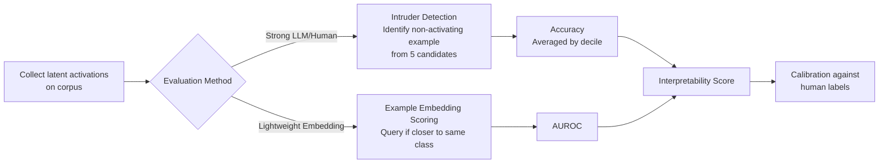

# Evaluating SAE Interpretability Without Generating Explanations

**Conference**: ICLR 2026  
**OpenReview**: [https://openreview.net/forum?id=kHhMs642rR](https://openreview.net/forum?id=kHhMs642rR)  
**Code**: TBD  
**Area**: Interpretability / Machine Learning Interpretability  
**Keywords**: Sparse Autoencoders, SAE Evaluation, Interpretability Metrics, Intruder Detection, Embedding Scoring, Mechanistic Interpretability  

## TL;DR
This paper proposes two evaluation methods for Sparse Autoencoder (SAE) interpretability—intruder detection and example embedding scoring—that **do not require generating natural language explanations**. By basing evaluation directly on latent activation examples, the study verifies that LLM evaluation is highly correlated with human judgment through manual annotation.

## Background & Motivation

**Background**: Sparse Autoencoders and transcoders have become mainstream tools for interpreting Large Language Models (LLMs). They alleviate neuron "polysemanticity" via overcomplete and sparse basis vectors, allowing each latent to learn more specific and interpretable features. However, there is no consensus on how to evaluate the degree of interpretability of these latents.

**Limitations of Prior Work**: Most popular evaluation paradigms follow a two-step process: "generate a natural language explanation for each latent, then use this explanation to predict latent activations in new contexts." This pipeline entangles **explanation generation** and **explanation evaluation** with the inherent interpretability of the latent itself. Factors such as the number and type of examples shown, the use of Chain-of-Thought, token highlighting methods, and the length of explanations significantly affect final scores. Consequently, a low score cannot distinguish whether a latent is uninterpretable or if the explanation was poorly generated.

**Key Challenge**: Explanation-centric paradigms implicitly assume that for a latent to be interpretable, it must possess a meaning that can be expressed concisely in a single sentence. This paper challenges this assumption: **as long as humans can distinguish activating examples from non-activating ones, the latent is interpretable**, regardless of whether an explanation can be written.

**Goal**: To measure interpretability directly based on latent activation examples, bypassing all details of explanation generation, thereby obtaining a more direct and potentially standardized evaluation while verifying if LLM judges can replace humans.

**Core Idea**: **[Bypassing Explanations]** Interpretability is redefined as the "separability between activating and non-activating examples." Evaluation thus reduces to two discriminative tasks that do not require linguistic explanations: identifying "intruder" examples or determining if activating examples cluster in an embedding space.

## Method

### Overall Architecture
The traditional process involves three steps: "Collect activations → Generate explanation → Rate explanation." The explanation acts as an indirect mediator between the latent and the score. This paper compresses it into two steps: "Collect activations → Directly score activations." Two scoring methods are proposed: **intruder detection** (requires strong LLMs or humans, high precision) and **example embedding scoring** (uses lightweight embedding models, fast, suitable for large scales). Both are applicable to human and LLM judges, with human judgment serving as the gold standard for LLM calibration.

### Key Designs

**1. Intruder Detection: Converting Interpretability into "Spot the Difference"**  
Inspired by classic intruder word detection, the authors sample 4 activating examples and 1 "intruder" example that does not trigger the latent (sampled from triggers of other latents) for each latent. These 5 items are presented as a numbered list to the judge, who must identify the intruder. Activating tokens in activating examples are highlighted with `<<` `>>`, while non-activating examples have random tokens highlighted to prevent leakage; each example is truncated to 32 tokens. Latent scores are defined as the accuracy of intruder detection, **sampled and averaged across activation distribution deciles**. This allows for comparing consistency across different activation intensity zones. Expected random accuracy is 20%. Unlike word-level intrusion, this method provides full context.

**2. Intruder Decile Detection: Probing Whether Features are Binary or Scalar**  
A variant where all 5 examples activate the same latent, but the "intruder" comes from a different activation decile than the others. If a latent is a perfect monosemantic binary feature, examples from different deciles should be extremely similar, leading to random accuracy. If it is a scalar feature with "intensity/degree" semantics, adjacent deciles should be hard to distinguish while distant ones are easy. Using Llama 3.1 70b, the resulting matrix was highly asymmetric, **ruling out the hypothesis that most features are both binary and monosemantic**.

**3. Example Embedding Scoring: Clustering Instead of LLM Discrimination**  
To increase speed, the authors use lightweight embedding models to measure "clustering of activating examples." Given a set of activating examples $E^+$, non-activating examples $E^-$, an activating query $q^+$, and a non-activating query $q^-$, the proximity of each query to its own class versus the other is calculated:

$$\Delta^+ = \frac{1}{N}\left(\sum_{e_i^+\in E^+}\frac{q^+\cdot e_i^+}{\|q^+\|\|e_i^+\|} - \sum_{e_i^-\in E^-}\frac{q^+\cdot e_i^-}{\|q^+\|\|e_i^-\|}\right)$$

$$\Delta^- = \frac{1}{N}\left(\sum_{e_i^-\in E^-}\frac{q^-\cdot e_i^-}{\|q^-\|\|e_i^-\|} - \sum_{e_i^+\in E^+}\frac{q^-\cdot e_i^+}{\|q^-\|\|e_i^+\|}\right)$$

The AUROC calculated from $\Delta^+$ and $\Delta^-$ serves as the latent score.

**4. Fine-tuning Embedding Models to Understand Highlights**  
Off-the-shelf embedding models struggled with this task, likely because they do not understand the `<<>>` highlighting. The authors selected `stella_en_400M_v5` and fine-tuned it using Multiple Negatives Ranked Loss on data from a TopK skip transcoder (avoiding overlap with evaluated SAEs) to improve similarity for (query, positive example) pairs.

## Key Experimental Results

Evaluated subjects include 4 self-trained TopK SAEs (SmolLM2 135M, Layers 9/15/21/27, 32k features), Gemmascope (Gemma 2 9b, JumpReLU), Llama 3.1 8b residual stream SAE, and Pythia-160m skip transcoder.

### Main Results: Human vs. LLM Consistency in Intruder Detection

| Judge | Key Results |
|--------|----------|
| Human (105 latents) | Avg. intruder accuracy 64%, top decile avg. 78%; 1/3 score >80%, only 1/7 <30% |
| Claude Sonnet 3.5 | Spearman correlation with humans 0.83, higher than previous SAE metrics |
| Example Embedding Scoring | Correlation with human intrusion score $r=0.78$, comparable to LLM judges |

### Inter-judge Correlations (Intruder Detection, Pearson on 56 latents)

| Judge | Human | Llama 70b | Llama 8b | QwQ 32b | Gemini Flash 2.0 | Claude Sonnet 3.5 |
|--------|-------|-----------|----------|---------|------------------|-------------------|
| Human | 1 | 0.76 | 0.52 | 0.78 | 0.80 | 0.84 |
| Claude Sonnet 3.5 | 0.84 | 0.88 | 0.57 | 0.90 | 0.87 | 1 |
| Llama 3.1 8b | 0.52 | 0.54 | 1 | 0.59 | 0.60 | 0.57 |

Strong models consistently correlate with humans ($>0.80$), while weak models (e.g., Llama 3.1 8b) show significantly lower correlation.

### Key Findings
- **Explanations are not necessary**: Humans can reliably determine latent meanings based solely on activation examples.
- **Activation intensity impacts interpretability**: Accuracy for the top decile is ~20% higher than the bottom decile, but bottom deciles still remain significantly above chance.
- **LLM underestimation**: Humans generally judge latents as more interpretable than LLMs do, suggesting LLMs are not finding "forced" patterns invisible to humans.
- **Features are not purely binary/monosemantic**: The asymmetric decile intrusion matrix suggests complex intensity semantics.
- **Efficient Embedding Scoring**: Example embedding scoring achieves human correlation comparable to strong LLMs using much smaller models.

## Highlights & Insights
- **Conceptual Redefinition**: By decoupling "interpretable" from "describable," the methodology eliminates noise from explanation generation prompts and hyperparameters.
- **Human Gold Standard**: The 0.83 Spearman correlation validates the use of LLMs as reliable proxies for human judgment in this framework.
- **Decile Intrusion Insight**: Using the same framework to probe whether features are binary or scalar effectively disproves the intuition that SAE latents are universally monosemantic.
- **Engineering Value of Embedding Scoring**: Fine-tuned small models significantly reduce evaluation costs for SAEs with tens of thousands of latents.

## Limitations & Future Work
- **Absolute Accuracy is Modest**: Average human accuracy of 64% suggests many latents are only "moderately interpretable"; the method is a relative tool rather than an absolute certification.
- **Limited Embedding Resolution**: AUC for distinguishing deciles via embeddings only reached 0.7, indicating a weak ability to capture "intensity semantics."
- **Dependence on Fine-tuning**: Existing embedding models do not natively understand activation highlights, requiring non-negligible fine-tuning costs for new setups.
- **Lack of Perfect Scalar Evidence**: No clear evidence of "perfect scalar features" was found in current experiments.
- Evaluation was primarily on small-to-mid-sized models; robustness on larger models remains to be verified.

## Related Work & Insights
- **Intrusion Task Genealogy**: Derived from word intrusion in topic models (Chang et al. 2009) and visual two-alternative forced choice (Borowski et al. 2020), this brings discriminative evaluation to SAE latents.
- **Contrast with Explanation-Centric Metrics**: Contrasts with simulation scoring (Bills et al. 2023) and rubric scores (Templeton et al. 2024) by removing the intermediate explanation step.
- **Insights**: Discriminative, non-explanatory paradigms could generalize to other interpretability scenarios (e.g., visual feature maps, neuron probes) and provide a low-coupling scoring primitive for standardized SAE benchmarks.

## Rating
- **Novelty**: ⭐⭐⭐⭐ Redefines interpretability and designs two non-explanatory evaluations; conceptually clear and addresses existing pain points.
- **Experimental Thoroughness**: ⭐⭐⭐⭐ Validated across models/activations with human gold standards and cross-LLM consistency.
- **Writing Quality**: ⭐⭐⭐⭐ Logic from motivation to conclusion is thorough and clear.
- **Value**: ⭐⭐⭐⭐ Provides direct, standardized, and computationally efficient tools for the mechanistic interpretability community.

<!-- RELATED:START -->

## Related Papers

- [\[ICLR 2026\] SAE as a Crystal Ball: Interpretable Features Predict Cross-domain Transferability of LLMs without Training](sae_as_a_crystal_ball_interpretable_features_predict_cross-domain_transferabilit.md)
- [\[AAAI 2026\] Using Certifying Constraint Solvers for Generating Step-wise Explanations](../../AAAI2026/interpretability/using_certifying_constraint_solvers_for_generating_step-wise_explanations.md)
- [\[ICML 2025\] Evaluating Neuron Explanations: A Unified Framework with Sanity Checks](../../ICML2025/interpretability/evaluating_neuron_explanations_a_unified_framework_with_sanity_checks.md)
- [\[ICLR 2026\] Grokking in LLM Pretraining? Monitor Memorization-to-Generalization without Test](grokking_in_llm_pretraining_monitor_memorization-to-generalization_without_test.md)
- [\[NeurIPS 2025\] Towards Interpretability Without Sacrifice: Faithful Dense Layer Decomposition with Mixture of Decoders](../../NeurIPS2025/interpretability/towards_interpretability_without_sacrifice_faithful_dense_layer_decomposition_wi.md)

<!-- RELATED:END -->
