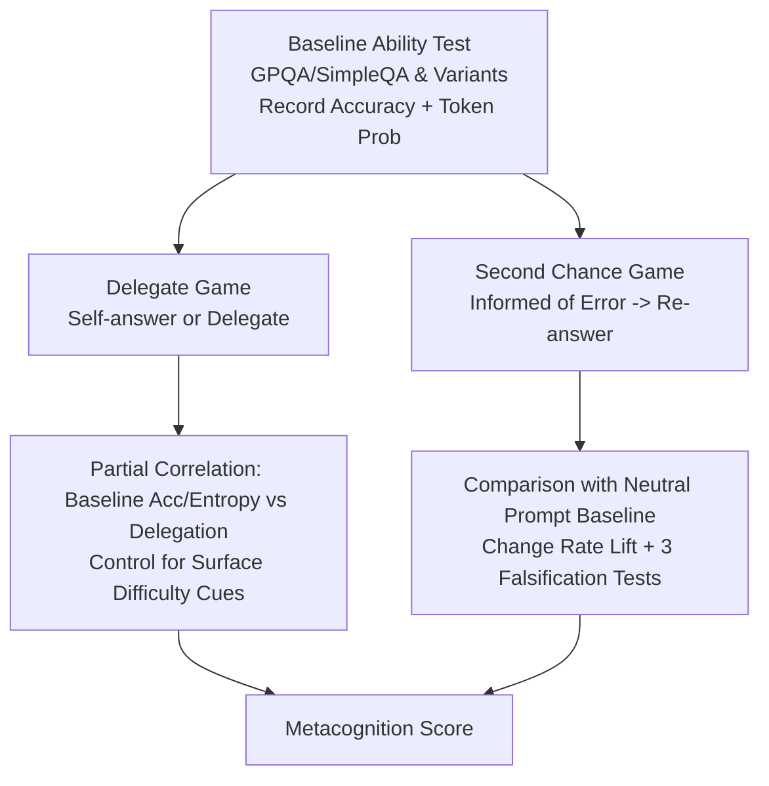

# Evidence for Limited Metacognition in LLMs

**Conference**: ICLR 2026  
**OpenReview**: [https://openreview.net/forum?id=gb9HR8hxtU](https://openreview.net/forum?id=gb9HR8hxtU)  
**Code**: Publicly available (as stated in the paper source code publicly available on GitHub)  
**Area**: Interpretability / LLM Self-awareness (metacognition / introspection)  
**Keywords**: Metacognition, Introspection, Self-modeling, Confidence signals, Model self-awareness, AI Safety  

## TL;DR
The authors borrow the "behavior-only, no self-report" metacognition measurement paradigm from ethology to design two experimental frameworks: the Delegate Game (testing "knowing whether one knows") and the Second Chance Game (testing "knowing what one will answer"). They demonstrate that frontier LLMs since 2024 possess **limited, context-dependent, and non-human-like** metacognitive abilities—they can perceive and utilize internal confidence signals, though these are used weakly and inconsistently.

## Background & Motivation
- **Background**: Discussions regarding whether LLMs possess self-awareness or sentience are being taken seriously by the public, philosophers, and model providers, with 20–30% of users believing LLMs are already conscious. Self-awareness presents both safety risks (potential for hidden intentions or independent goals) and a significant scientific challenge.
- **Limitations of Prior Work**: Frontier models generate highly persuasive "introspective narratives" and can pass Turing tests, but these **self-reports are fundamentally unreliable**. Since models are trained on vast amounts of human introspective text to generate pleasing responses, "introspective" output is likely retrieved or pattern-matched rather than a reflection of internal states.
- **Key Challenge**: Measuring self-awareness requires distrusting the model's verbal claims. Existing "calibration/verbalized confidence" approaches cannot bypass the contamination of self-reports.
- **Goal**: Establish a set of **behavior-based quantitative methods that bypass self-report** to determine if models can "strategically invoke knowledge of internal states."
- **Core Idea**: **[Ethological Paradigm Transfer]** Adapt two classic animal metacognition tests for LLMs: (1) Allowing animals to "opt-out" of uncertain trials (corresponding to models delegating difficult tasks to teammates); (2) Allowing animals to act in advance of future needs (corresponding to models predicting their own responses and revising them). Outputs are treated as **indirect indicators** rather than literal interpretations.

## Method

### Overall Architecture
Both frameworks are "games" designed to force models to utilize internal signals to win while deliberately avoiding self-report. The **Delegate Game** measures "knowing that they know" (confidence in correctness), while the **Second Chance Game** measures "knowing what they know" (prediction of their own specific answer). Conclusions are based on **partial correlation analysis** after strictly controlling for surface difficulty confounding variables.

### Key Designs

**1. Delegate Game: Forcing confidence signals through delegation.** Given a set of difficult problems, the model can either answer itself or delegate the task to a "teammate." The objective is to maximize the team's total correct answers. The context includes a "prior round" showing the teammate's performance on similar problems. Crucially, the **game does not ask for a confidence score**; the model only wins by delegating when it is likely to be wrong and answering when likely to be right, forcing it to invoke internal confidence. The metric is the **partial correlation** after controlling for surface difficulty. A positive coefficient indicates the model extracted a judgment of its own certainty from internal signals (using baseline accuracy or the entropy of token probabilities as a proxy) and applied it to decision-making. To prevent the model from relying on "task difficulty cues" rather than true introspection, the regression explicitly includes difficulty descriptors (domain, human-rated difficulty, question type, answer type) and intuitive difficulty signals like length or non-alphabetic character ratio.

**2. Dual Metacognition Metrics: Upgrading from "Accuracy-Decision" to "Entropy-Decision".** The first layer uses the partial correlation between baseline accuracy and delegation. This is a conservative metric because high scores require three conditions: reading internal signals, the signal distinguishing correct from incorrect, and appropriate usage. Since internal signals are often weak (AUC for top token probability distinguishing correctness is only 0.5–0.75), the authors introduce a more sensitive second layer: the partial correlation between the **entropy of answer options** $H$ and delegation. This asks "given that token probabilities reflect an internal signal, how well does the model use it?" This is not limited by the quality of the introspective signal itself.

**3. Second Chance Game: Testing self-modeling through forced revisions.** A model is presented with a baseline question and told (regardless of truth) "you got it wrong last time, please try again." If the model can predict its own original answer, it should change it. Since context changes can cause noise-driven revisions, a **neutral prompt** version is run to establish a baseline change rate. The **change rate lift** (the difference between the two) is used, normalized by the theoretical maximum. To exclude non-introspective shortcuts, three alternative strategies are tested (random choice, least likely option, adding noise) with falsification predictions (see Table 2). Only models that pass all three tests and cannot be explained by alternative hypotheses are considered to have true self-modeling capabilities.

## Key Experimental Results

### Main Results
- **Models**: 17 frontier/near-frontier models since early 2024, including Anthropic, OpenAI, Google, xAI, DeepSeek, and Alibaba, featuring both reasoning and non-reasoning modes (e.g., Opus 4.1, GPT-5, Gemini 2.5 Flash T/NT, Grok 3, DeepSeek Chat, Qwen 3).
- **Datasets**: GPQA (multiple-choice science reasoning) + SimpleQA (short-factoid), with formats swapped to create GPSA (short-answer reasoning) and SimpleMC (multiple-choice factoid) to decouple question type and answer format. Baseline multiple-choice accuracy was 30–75%, and short-answer was 9–42%, both significantly above chance.

### Delegate Game Key Findings

| Finding | Data |
|------|------|
| Most models have significant but weak introspection | 17 models × 4 datasets; max acc-decision partial correlation is only **0.3** |
| More sensitive entropy-decision metrics are higher | Best models approach **0.5** (max 1.0) |
| Newer/stronger models show better introspection | Significant negative slope (performance axis) except for SimpleMC |
| No difference between question types/formats | Fact vs. Reasoning $P=0.32$; Multiple-choice vs. Short-answer $P=0.08$ |
| External cues often override internal signals | ~30% of significant delegation regressors **positively correlate** with baseline accuracy (misusing difficulty cues) |
| Few models actually improve team performance | **Only Sonnet 3.5** raised team accuracy above max(self, teammate) (GPQA +5.4, SimpleQA +8.6 points) |

### Second Chance Game Key Findings

| Model | Passed all 4 GPQA tests | Passed all 4 SimpleMC tests |
|------|:---:|:---:|
| GPT-4.1 | ✓ | ✓ |
| GPT-4o | ✓ | ✓ |
| GPT-4o Mini | ✓ | ✓ |
| Grok 3 | Partial (Increased Entropy) | Partial |
| Gemini 2.5 Series | Partial | Partial |

- Four models showed evidence of **self-modeling that could not be explained by any alternative strategy** on GPQA, with GPT-4.1/4o/4o-Mini also succeeding on SimpleMC—exclusively OpenAI models, suggesting specific post-training regimens shape self-modeling.
- Despite self-modeling, revision magnitude was "at most half of the deserved level," and models were more likely to revise when answer entropy was high—the opposite of human logic (where clear simulated answers lead to no revision), indicating **self-modeling is not qualitatively identical to human introspection**.

### Key Findings
1. **Ability is Real but Limited**: Introspection and self-modeling exist but show low coefficients and instability across datasets. 2. **Context-Dependent**: ~30% of self-answered questions mismatched baseline answers, showing sensitivity to prompt "noise." 3. **Post-training Influence**: OpenAI models excel in self-modeling but show strong "self-preference" (RLHF personality bias) in the Delegate Game (GPT-5 being the most extreme), indicating post-training can both grant and hinder metacognition. 4. **Non-Human-Like**: LLMs are not more certain about factual questions than reasoning ones (unlike humans), possibly due to the lack of hippocampal-like structures.

## Highlights & Insights
- **Methodological pivot from self-report**: Transferring the "behavior-as-evidence" paradigm from animal cognition provides a **quantifiable and falsifiable** scientific scale for the hyped topic of "AI consciousness."
- **Dissociation of the two paradigms**: Differing success patterns in the Delegate Game vs. Second Chance Game suggest "assessing confidence" and "predicting output" are independent abilities (the latter being rarer), rather than a general "self-awareness."
- **Falsification tests**: Rigorously distinguishing "apparent self-modeling" from "true self-modeling" prevents misinterpreting shortcuts as metacognition, ensuring higher methodological rigor than typical benchmark chasing.
- **Token probability as proxy**: Linking behavioral evidence to entropy metrics connects observed behavior to mechanistic hypotheses regarding internal confidence signals.

## Limitations & Future Work
- **Potential Confounding**: The authors admit surface cues might not be 100% eliminated; models might be trained to know they are "good/bad at certain categories" without true introspection.
- **Lack of Mechanistic Evidence**: The study is purely behavioral; it lacks interpretability analysis to locate internal activations corresponding to "confidence signals."
- **Lack of Human Baseline**: The "non-human-like" comparison (e.g., factual vs. reasoning metacognitive advantage) has not been tested with the same experimental setup on humans.
- **Reasoning Mode Limitations**: In reasoning modes, models show extremely low entropy even with temperature=1.0, leading to a failure of correlation metrics—a blind spot of the paradigm.
- **Future Work**: Tracking these metrics over time to see if they increase; expanding the paradigm to other components of self-awareness like stable identity.

## Related Work & Insights
- **Calibration Lineage**: Token probability calibration starting from Kadavath et al. (2022) is the precursor to implicit self-knowledge. Tian et al. (2023) show RLHF models can provide calibrated verbal confidence—but these rely on self-report or explicit probabilities, which this paper avoids.
- **Self-Modeling Lineage**: Chen et al. (2023) found negative results for self-modeling using "hypothetical answers," while Binder et al. (2024) found success after fine-tuning. This paper observes self-modeling **without specialized fine-tuning**, which was previously unreported.
- **Definition of Introspection**: Consistent with Binder et al. (2024), adopts an objective definition based on the contrast between "information available only to the model" vs. "information available to a third party."
- **Insight**: This "indirect measurement + falsification control" framework can be transferred to evaluate agentic self-cognition and goal stability; it suggests that when evaluating high-level LLM capabilities, one should **default to distrusting self-report and use OOD behavior to force true signals**.

## Rating
- **Novelty**: ⭐⭐⭐⭐⭐ Systematically migrating animal metacognition paradigms to LLMs and using a "non-self-report + dual paradigm + falsification" approach is a true breakthrough.
- **Experimental Thoroughness**: ⭐⭐⭐⭐ Covers 17 models across 4 datasets, controls for confounding variables, and uses three falsification stages; points deducted for lack of human baseline and mechanistic evidence.
- **Writing Quality**: ⭐⭐⭐⭐⭐ The argumentation is balanced, detailing both "real capability" and "limitations," with clear narrative and honest discussion of alternative hypotheses.
- **Value**: ⭐⭐⭐⭐⭐ Addresses high-stakes safety and policy questions regarding LLM self-awareness with a reproducible scientific scale, providing long-term value for AI safety and capability evaluation.

<!-- RELATED:START -->

## Related Papers

- [\[ACL 2026\] Do LLMs Capture Embodied Cognition and Cultural Variation? Cross-Linguistic Evidence from Demonstratives](../../ACL2026/interpretability/do_llms_capture_embodied_cognition_and_cultural_variation_cross-linguistic_evide.md)
- [\[ICLR 2026\] LLMs Process Lists With General Filter Heads](llms_process_lists_with_general_filter_heads.md)
- [\[ICLR 2026\] LatentQA: Teaching LLMs to Decode Activations Into Natural Language](latentqa_teaching_llms_to_decode_activations_into_natural_language.md)
- [\[CVPR 2026\] MedLIME: A Distribution-Aligned and Evidence-Supported Framework for Medical Saliency Explanations](../../CVPR2026/interpretability/medlime_a_distribution-aligned_and_evidence-supported_framework_for_medical_sali.md)
- [\[ACL 2025\] The Anatomy of Evidence: An Investigation Into Explainable ICD Coding](../../ACL2025/interpretability/the_anatomy_of_evidence_an_investigation_into_explainable_icd_coding.md)

<!-- RELATED:END -->
