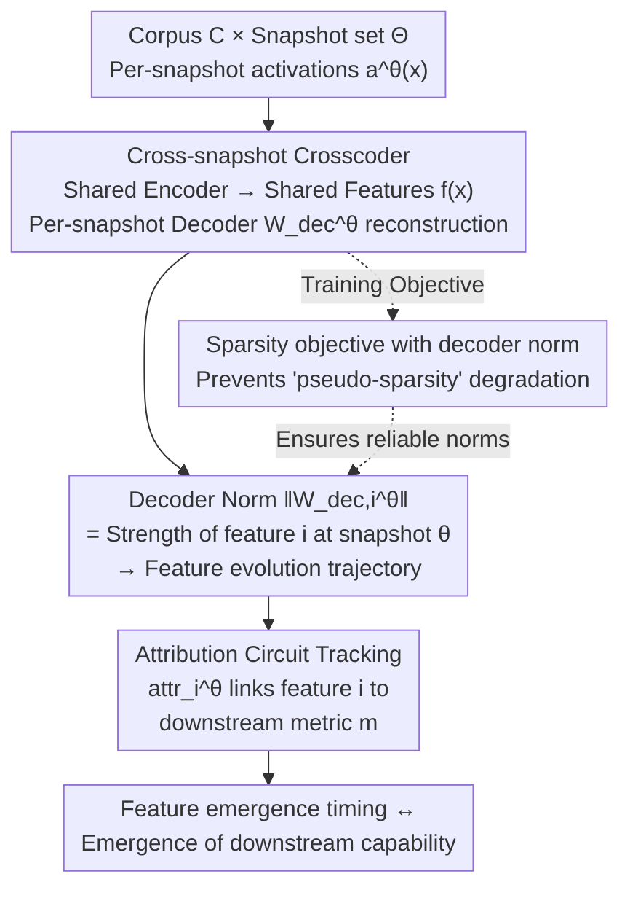

# Evolution of Concepts in Language Model Pre-Training

**Conference**: ICLR 2026  
**arXiv**: [2509.17196](https://arxiv.org/abs/2509.17196)  
**Code**: [GitHub](https://github.com/OpenMOSS/Language-Model-SAEs)  
**Area**: Interpretability  
**Keywords**: Mechanistic Interpretability, crosscoders, sparse autoencoders, training dynamics, feature evolution, pre-training, Pythia

## TL;DR

This work applies crosscoders (cross-snapshot sparse dictionary learning) for the first time to track the emergence and evolution of features during language model pre-training. It discovers a "statistical learning → feature learning" phase transition and causally links micro-feature evolution with macro downstream task metrics through attribution analysis.

## Background & Motivation

- **Pre-training remains a black box**: While scaling laws reveal macro relationships between computation, data, and loss, the internal reorganization process of model parameters remains unclear.
- **Limitations of prior work**: Theoretical frameworks such as NTK, Information Bottleneck, and Singular Learning Theory provide high-level explanations for generalization and grokking but fail to answer "how models develop specific capabilities during pre-training."
- **Static limitations of SAE**: Sparse Autoencoders (SAEs) have proven effective at extracting interpretable features from fully trained models; however, almost all analyses focus on final models, leaving the process of how features emerge and evolve unexplored.
- **New opportunities with Crosscoders**: Originally proposed by Lindsey et al. for cross-layer feature alignment, this paper innovatively adapts crosscoders for cross-snapshot analysis.

## Method

### Overall Architecture

The core problem addressed is that scaling laws only describe macro relationships, while the specific steps and sequence of feature development remain a black box. The core idea is to repurpose crosscoders (originally used for cross-layer alignment) into "cross-snapshot" dictionaries. The mechanism involves processing activations from the same corpus across multiple pre-training snapshots simultaneously. A **shared encoder** projects these activations into a unified feature space, while **per-snapshot decoders** reconstruct the activations for each specific snapshot. This enables the "same feature" to be compared across different training steps. The trajectory of feature emergence and evolution is captured by the variation of decoder norms across snapshots. Finally, an **attribution circuit tracking** layer is added to causally link the rise and fall of these micro-features to downstream task performance.

### Key Designs

**1. Cross-snapshot Crosscoder: Unified feature space via snapshot-specific decoders**

Static SAEs can only dissect a fully trained model. Given a corpus $\mathcal{C}$ and a set of snapshots $\Theta$, the encoder aggregates activations from all snapshots to produce shared feature activations $f(x) = \sigma\!\left(\sum_{\theta \in \Theta} W_{\text{enc}}^{\theta} a^{\theta}(x) + b_{\text{enc}}\right)$. Conversely, the decoders $W_{\text{dec}}^{\theta}$ are unique to each snapshot, independently performing reconstruction $\hat{a}^{\theta}(x) = W_{\text{dec}}^{\theta} f(x) + b_{\text{dec}}^{\theta}$. The shared encoder ensures that the "same feature" refers to the same concept across all snapshots, while the per-snapshot decoders allow the intensity of that feature to vary. A key proxy metric is the decoder norm $\|W_{\text{dec},i}^{\theta}\|$, which directly reflects the strength and existence of feature $i$ at snapshot $\theta$. When a feature only exists in certain snapshots, sparsity penalties naturally push the decoder norms of unrelated snapshots toward zero.

**2. Sparsity objective with decoder norm: Preventing degradation under $L_0$ approximation**

The training objective is the sum of reconstruction and sparsity terms:

$$\mathcal{L}(x) = \sum_{\theta \in \Theta} \|a^{\theta}(x) - \hat{a}^{\theta}(x)\|^2 + \lambda_{\text{sparsity}} \sum_{\theta \in \Theta} \sum_{i} \Omega\!\big(f_i(x) \cdot \|W_{\text{dec},i}^{\theta}\|\big)$$

Where $\Omega(\cdot)$ is a differentiable surrogate for $L_0$. The design motivation is to multiply the decoder norm $\|W_{\text{dec},i}^{\theta}\|$ into the sparsity term. Under imperfect $L_0$ approximations, a model might "fake sparsity" by reducing activation values $f_i(x)$ while inflating decoder norms. Including the norm in the penalty prevents this degradation and ensures the "norm as feature strength" proxy is reliable. The activation function utilizes JumpReLU with a learned threshold, which outperforms traditional ReLU+L1 in the reconstruction-sparsity trade-off.

**3. Attribution circuit tracking: Linking features to downstream tasks**

To prove features drive model behavior, the authors calculate a contribution score for each feature regarding a task metric $m$: $\text{attr}_i^{\theta}(x) = f_i(x) \cdot \frac{\partial m(a^{\theta}(x))}{\partial f_i(x)}$. For tasks with clean/corrupted input pairs (e.g., Subject-Verb Agreement), attribution patching is used: $\text{attr}_i^{\theta}(x, \tilde{x}) = [f_i(x) - f_i(\tilde{x})] \cdot \frac{\partial m(a^{\theta}(x))}{\partial f_i(x)}$, measuring the causal impact of switching a feature from a corrupted state to a clean state. Integrated Gradients (IG) are used for better linear approximation. This attribution allows tracking how key features for a task take turns dominating during training, aligning feature emergence with the appearance of downstream capabilities.

The experimental setup analyzes Pythia-160M (Layer 6) and Pythia-6.9B (Layer 16). 32 snapshots were strategically selected from 154 public releases (all 20 for the first 10K steps + 12 uniform samples later). Dictionary sizes are up to 98,304 (160M) and 32,768 (6.9B), trained on the SlimPajama corpus.

## Key Experimental Results

### Main Results

**Crosscoder Reconstruction Quality (Pythia-160M)**

| Feature Count | Explained Variance | L0 Norm |
|---------------|-------------------|---------|
| 32,768        | ~92%              | ~40     |
| 65,536        | ~95%              | ~35     |
| 98,304        | ~97%              | ~30     |

Increasing dictionary size yields Pareto improvements in both explained variance and sparsity. Crosscoder Pareto frontiers are slightly superior even to SAEs trained only on the final snapshot.

**Feature Evolution Patterns**

| Feature Type | Emergence Time | Persistence |
|--------------|----------------|-------------|
| Initialization Features | Exist at random init | Sharp drop at step 128 then recovery, then gradual decay |
| Emergent (Simple) | ~Step 1,000 | Most persist across 60%+ snapshots |
| Emergent (Complex) | Steps 10,000–100,000 | Most persist across 60%+ snapshots |

**Feature Types and Emergence Timing (Pythia-6.9B)**

| Feature Type | Emergence Time Range |
|--------------|----------------------|
| Previous Token Features | Steps 1,000–5,000 |
| Induction Features | Steps 10,000–100,000 |
| Context-sensitive Features | Steps 10,000–100,000 |

### Ablation Study

**Subject-Verb Agreement (SVA Across-PP) Attribution Analysis**

Key contributing features ordered by emergence:
1. Features 18341, 47045: Capture plural nouns (47045 specializes in plural subjects).
2. Feature 68813: Marks compound subjects and post-modifiers.
3. Features 50159, 69636: Identify the end of post-modifiers (69636 has higher accuracy).

Only a few dozen features are required to consistently disrupt or restore downstream performance across all training snapshots.

### Key Findings

**1. Universal direction turning point**

Nearly all features undergo a drastic directional shift at ~step 1,000, where directions before and after are nearly orthogonal. Subsequently, features rotate slowly, with the final snapshot direction maintaining significant cosine similarity to the early post-step-1,000 directions.

**2. Emergence timing correlates with complexity**

Using an LLM (Claude Sonnet 4) to rate feature complexity (1-5), a moderate positive correlation (Pearson $r = 0.309, p = 0.002$) was found between emergence time and complexity. More complex features tend to emerge later.

**3. Statistical learning → feature learning phase transition**

| Metric | Early Training | Post-transition |
|--------|----------------|-----------------|
| Unigram/Bigram KL Divergence | Converges rapidly to low values | Already converged |
| Training Loss | Approaches theoretical unigram/bigram entropy lower bounds | Continues to decrease |
| Total Feature Dimensionality Rate | Initial compression | Expansion to ~70% |

Early training is almost entirely dedicated to learning unigram and bigram distributions (Zipf’s law), after which the model enters the superposition learning phase of sparse features.

## Highlights & Insights

1. **Methodological Innovation**: Relocates crosscoders from cross-layer analysis to cross-snapshot analysis, enabling fine-grained tracking of feature evolution.
2. **Feature-level Evidence for Two-stage Learning**: Supports the "fitting → compression" two-stage hypothesis from Information Bottleneck theory via KL divergence and feature dimensionality changes.
3. **Hierarchy of Feature Emergence**: The sequence of Previous Token → Induction → Context-sensitive features is consistent with their causal dependencies.
4. **Micro-Macro Causal Connection**: Explains downstream task performance using only dozens of features and reveals how models evolve circuits through iterative component updates.
5. **Decoder Norm as a Proxy**: This simple observation provides an efficient quantitative tool for tracking feature evolution.

## Limitations

1. **Limited Model Scope**: Validated only on the Pythia suite; while there is prior evidence of feature universality, generalization across different architectures/data remains to be confirmed.
2. **Simple Downstream Tasks**: SVA, Induction, and IOI are relatively basic tasks, limited by the capabilities of Pythia models and the current state of circuit tracking.
3. **Discrete Snapshot Constraints**: Crosscoder training requires activations from discrete snapshots; memory and compute costs scale linearly with the number of snapshots, limiting observational granularity.
4. **Moderate Complexity Correlation**: The Pearson correlation between emergence time and complexity is only 0.309, suggesting complexity is not the sole determinant of emergence timing.

## Related Work & Insights

- **Relationship with SAE Research**: Extends SAE from static analysis to dynamic tracking; the unified feature space of crosscoders is the key enabler.
- **Echoes Information Bottleneck Theory**: The transition from statistical learning to feature learning aligns closely with the experimental findings of Shwartz-Ziv (2017).
- **Relationship with Grokking**: Sharp changes in feature emergence imply potential links to phase transitions and grokking.
- **Implications for Pre-training Optimization**: Knowing when features emerge could guide pre-training strategies such as learning rate scheduling and curriculum learning.
- **Implications for Interpretability**: Crosscoders provide causal-level insights into why a model learns a specific concept.

## Rating

- **Novelty**: ⭐⭐⭐⭐⭐ First implementation of feature evolution tracking across training snapshots; significant methodological contribution.
- **Experimental Thoroughness**: ⭐⭐⭐⭐ Validated across multiple scales (160M/6.9B), including quantitative and qualitative analysis.
- **Value**: ⭐⭐⭐½ Primarily oriented toward understanding and explanation; limited direct application but provides insights for pre-training.
- **Writing Quality**: ⭐⭐⭐⭐⭐ Clear structure, excellent visualizations, and sufficient technical detail.
- **Overall**: ⭐⭐⭐⭐½ Excellent work in mechanistic interpretability, opening a feature-level window into pre-training dynamics.

<!-- RELATED:START -->

## Related Papers

- [\[ICLR 2026\] Hidden Breakthroughs in Language Model Training](hidden_breakthroughs_in_language_model_training.md)
- [\[ICLR 2026\] Learning to See Before Seeing: Demystifying LLM Visual Priors from Language Pre-training](learning_to_see_before_seeing_demystifying_llm_visual_priors_from_language_pre-t.md)
- [\[ICLR 2026\] Fresh in Memory: Training-order Recency is Linearly Encoded in Language Model Activations](fresh_in_memory_training-order_recency_is_linearly_encoded_in_language_model_act.md)
- [\[ICLR 2026\] Priors in Time: Missing Inductive Biases for Language Model Interpretability](priors_in_time_missing_inductive_biases_for_language_model_interpretability.md)
- [\[ICLR 2026\] Concepts' Information Bottleneck Models](concepts_information_bottleneck_models.md)

<!-- RELATED:END -->
