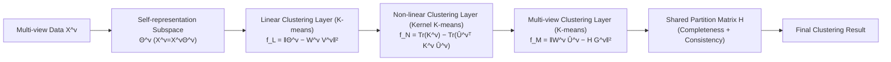

# Explainable K-means Neural Networks for Multi-view Clustering

**Conference**: ICLR 2026  
**OpenReview**: [https://openreview.net/forum?id=ljM1HTSH9c](https://openreview.net/forum?id=ljM1HTSH9c)  
**Code**: To be confirmed  
**Area**: Explainability / Multi-view Clustering / Representation Learning  
**Keywords**: Multi-view clustering, K-means, Kernel K-means, Explainable neural networks, Subspace learning, Three-layer optimization  

## TL;DR
Decomposes multi-view clustering into three layer optimization sub-problems: "linear clustering → non-linear clustering → multi-view fusion." Each layer is implemented by K-means / Kernel K-means objectives, assembled into an EKNN network where the **function of each layer is explainable**, thereby achieving a balance across effectiveness, efficiency, completeness, and consistency.

## Background & Motivation
**Background**: Multi-view clustering aims to cluster data points from different views (different features/modalities). Classic K-means has low computational cost but can only handle linearly separable clusters; non-linear methods such as Kernel K-means and spectral clustering identify arbitrary-shaped clusters by calculating similarities between all point pairs. While effective, they incur high space/time overhead and are impractical for large-scale data.

**Limitations of Prior Work**: ① Most methods focus solely on effectiveness (clustering quality), with no significant improvement in efficiency; ② Non-linear methods represent a cluster using all data points, leading to high overhead, while "multi-center" approximations are sensitive to center selection; ③ In multi-view scenarios, consistency and completeness are recognized as two major principles, yet existing work **cannot simultaneously balance effectiveness, efficiency, consistency, and completeness**.

**Key Challenge**: To achieve good results for non-linearly separable clusters, one must calculate all-pair similarities (expensive); to achieve efficiency, one must use linear approximations (inaccurate). In a multi-view setting, these two must be balanced alongside cross-view consistency and completeness, resulting in four mutually constraining objectives.

**Goal**: To balance effectiveness, efficiency, completeness, and consistency within an **explainable** framework for non-linear multi-view clustering on large-scale data.

**Key Insight**: **[Key Observation]** Different clusters in complex datasets are **non-linearly separable in the global geometric space but linearly separable in the local geometric space**—that is, "several small linearly separable clusters compose one non-linearly separable cluster." **[Three-layer Decomposition]** Based on this hypothesis, multi-view clustering is explicitly decomposed into three sub-problems: 1) Linear clustering of raw data (to reduce scale and maintain efficiency); 2) Non-linear clustering on the set of linear clusters (to maintain effectiveness); 3) Integrating partition matrices across views for multi-view clustering (to maintain completeness and consistency). **[Mechanism]** Each sub-problem is defined by K-means / Kernel K-means objectives, where K-means plays the role of convolution in a CNN. This constructs the EKNN, where each layer has a known physical meaning and the whole system is explainable.

## Method

### Overall Architecture
EKNN models multi-view clustering as a **three-layer optimization problem**, chaining three K-means-style layers for each view $v$: first, self-representation produces a subspace representation $\Theta^v$, followed sequentially by a linear clustering layer, a non-linear clustering layer, and a multi-view clustering layer. Finally, a **shared partition matrix $H$** binds the results of all views. The joint objective of the three layers is solved alternatingly using a K-means-style iterative algorithm. Since the inputs, variables, and losses of each layer have clear physical meanings, the network is explainable.

### Key Designs

**1. Linear Clustering Layer: Compressing data with local linear clusters to embed "efficiency" into the framework.** For each view, self-representation subspace learning is first performed, constrained by $X^v = X^v\Theta^v$ to obtain a subspace representation $\Theta^v$ that reveals the underlying cluster structure. Then, K-means is applied: $f_{Lv} = \lVert \Theta^v - W^v V^v \rVert_F^2$, where $W^v \in \mathbb{R}^{n\times p}$ is the partition matrix from data points to $p$ linear clusters, and $V^v$ is the cluster center matrix. A key constraint is that the **number of linear clusters $p$ is much larger than the true number of clusters $k$**. This step compresses $n$ points into $p$ local linear clusters ("several linear clusters form one non-linear cluster"). Subsequent non-linear clustering only operates on $p$ clusters instead of $n$ points, yielding efficiency. The authors note this layer actually comprises two sub-layers: one for $X^v = X^v\Theta^v$ and one for the reconstruction loss.

**2. Non-linear Clustering Layer: Performing Kernel K-means on the set of linear clusters to embed "effectiveness" into the framework.** The second layer performs Kernel K-means on the linear cluster centers $V^v$: $f_{Nv} = \lVert \Phi(V^v) - U^v Z^v \rVert_F^2 = \mathrm{Tr}(K^v) - \mathrm{Tr}\big((\hat U^v)^\top K^v \hat U^v\big)$, where $U^v \in \mathbb{R}^{p\times k}$ partitions $p$ linear clusters into $k$ non-linear clusters, $K^v$ is the Gaussian kernel matrix of $V^v$, and $\hat U^v = U^v (D^v)^{-1/2}$ is the normalized partition. Because the kernel operation acts only on $p$ linear clusters rather than all $n$ points, it preserves the non-linear ability to identify arbitrary-shaped clusters while reducing the heavy $n \times n$ cost of Kernel K-means to $p \times p$. This is the pivotal compromise for "both effectiveness and efficiency."

**3. Multi-view Fusion Layer + Shared $H$: Using reconstruction to embed "completeness" and "consistency" into the framework.** The third layer aligns the linear + non-linear partition $W^v\hat U^v$ of each view via a linear mapping $G^v$ to a **partition matrix $H \in \mathbb{R}^{n\times k}$ shared by all views**: $f_{Mv} = \lVert W^v\hat U^v - HG^v \rVert_F^2$. When $W^v\hat U^v$ is fixed, this term degrades to classic K-means. "Forcing each view to reconstruct the same $H$" indirectly achieves **consistency**, while $H$ aggregating information from all views brings **completeness**. The three layers are combined into a weighted total objective $\min_H F = \sum_v \alpha f_{Lv} + \beta f_{Nv} + \gamma f_{Mv}$, plus a self-representation reconstruction term $\eta\lVert X^v - X^v\Theta^v\rVert_F^2$ and a nuclear norm regularization $\mu\lVert\Theta^v\rVert_*$ (for noise suppression and intra-class homogeneity preservation), optimized alternatingly via K-means iteration.

**4. Explainability and Subspace Extension: Grounding "explainable" in model design rather than post-hoc explanation.** Unlike most XAI using post-hoc methods (visualization/text/feature correlation) to explain black boxes, EKNN's explainability stems from the **model design itself**, expressed in two levels of transparency: **model decomposability** (inputs are raw data, learned variables have clear physical meanings, losses are K-means/Kernel K-means) and **algorithmic transparency** (dynamic behavior and error surfaces are mathematically derivable). K-means and Kernel K-means are special cases of EKNN. The authors further extend EKNN to **multi-view subspace learning**: introducing a shared subspace representation $\Theta^C$ based on $H$ (constrained by $H = H\Theta^C$), solving it using ADMM with auxiliary variables $R'$ and multipliers $Y'$, and finally running spectral clustering on the learned $\Theta^C$—more complex mappings yield better results.

## Key Experimental Results

### Main Results Table (ACC% ± STD%)
Across 7 datasets (COIL20/ORL/BBCSport/Reuters/Football/ANIMAL/NoisyMNIST), compared with COMIC, DMF, MVEC, BMVC, DiMSC, RMSL, and SSSL-M.

| Dataset | RMSL | SSSL-M | Ours (EKNN) | Ours (Extended) |
|---|---|---|---|---|
| COIL20 | 82.19 | 84.36 | 80.17 | **85.22** |
| ORL | 88.10 | 91.56 | 86.28 | **91.73** |
| BBCSport | **97.61** | 93.25 | 92.00 | 94.21 |
| Reuters | 54.04 | 59.46 | 42.17 | **60.55** |
| Football | **92.29** | 89.78 | 80.15 | 90.25 |
| ANIMAL | 73.19 | **77.49** | 70.76 | 79.00 |
| NoisyMNIST | 84.28 | 85.91 | 72.30 | **86.20** |

The extended version (EKNN for multi-view subspace learning) achieved the highest ACC on 5 out of 7 datasets; F-score and RI trends remained consistent (extended version mostly optimal).

### Ablation Study
- **Number of linear clusters $p$**: Scanned in $\{20, \dots, 200\}$; ACC/NMI increased with $p$ before plateauing once a certain value was reached, though computational cost increased simultaneously; $p=160$ was chosen.
- **Convergence**: On COIL20/ORL/BBCSport, the objective function decreased monotonically and converged within ~50 iterations.
- **Running Time**: Benefiting from "linear clustering for data compression," EKNN and its extended version take significantly less time than RMSL and SSSL-M.

### Key Findings
- **Extended > Basic**: The introduction of latent representation and shared subspace representation yields consistently better results, suggesting that more complex mappings lead to superior outcomes.
- **Three-layer Decomposition is Effective**: Using linear clustering as a layer can **reduce overfitting of the final clustering** to some extent, indirectly boosting performance.
- **Efficiency Stems from Structure**: Compressing $n$ points into $p$ clusters via the linear layer first, allowing expensive kernel operations to act only on $p \times p$ instead of $n \times n$, is the fundamental reason for significantly lower time costs compared to RMSL/SSSL-M.
- **Robustness**: Performance is stable across various data types and metrics (ACC/F-score/RI/NMI), validating the universality of the three-layer decomposition.

## Highlights & Insights
- **The "locally linear, globally non-linear" hypothesis is elegant**: It directly converts the geometric intuition that "non-linear clusters = an assembly of several linear clusters" into a computable three-layer structure, decoupling efficiency (linear layer compression) and effectiveness (kernel layer shape recognition) at the structural level.
- **Explainability comes from design rather than post-hoc**: EKNN does not provide explanations for a black box; instead, every layer's loss and variable have physical meanings. K-means and Kernel K-means are its special cases. This "white-box" explainability is more trustworthy in practical deployment.
- **K-means ≈ Convolution Analogy**: Analogizing K-means components to CNN convolutions and component connections to network connections provides a unified narrative for "building neural networks with classic clustering."

## Limitations & Future Work
- **Competitiveness of Basic EKNN is Average**: On several datasets, the basic ACC is significantly lower than RMSL/SSSL-M (e.g., only 42.17 vs. 59.46 on Reuters). The version that truly beats the SOTA is the **Extended version** with subspace learning and spectral clustering, indicating that the gain of the three-layer framework partially relies on additional components.
- **High Number of Hyperparameters**: $\alpha, \beta, \gamma, \eta, \mu, \eta', \mu'$ and the number of linear clusters $p$ all require tuning. While the framework is explainable, the tuning burden is notable.
- **Solver and Complexity Details in Appendix**: Iterative algorithms and complexity analysis are not expanded in the main text; optimization quality under discrete constraints ($w, u, h \in \{0, 1\}$) deserves further scrutiny.
- **Scalability**: Although efficiency is emphasized, the experimental datasets are limited in scale. Performance in ultra-large or online multi-view scenarios remains to be verified.

## Related Work & Insights
- **K-means / Kernel K-means / Spectral Clustering**: This work reuses these classic objectives as "network layers," continuing the subspace multi-view clustering lineage of LMSC, DiMSC, RMSL, and SSSL-M, but reorganized with three-layer decomposition. Kernel K-means provides the non-linear capacity to recognize arbitrary shapes, while spectral clustering performs the final partition on the shared subspace representation $\Theta^C$ in the extended version.
- **Self-representation Subspace Clustering** (Elhamifar & Vidal): Revealed cluster structure through a self-representation coefficient matrix $\Theta^v$ with the constraint $X^v = X^v\Theta^v$. This is the basis for allowing the linear layer to cluster "refined data points" rather than raw noisy features.
- **Multi-view Consistency / Completeness Principles**: Current work often achieves consistency by "maximizing correlation between views." This paper instead achieves it indirectly by "forcing each view to reconstruct the same shared $H$," and ensures completeness by letting $H$ aggregate information from all views—a new implementation of these two classic principles.
- **Explainable AI (XAI)**: The authors clearly distinguish between post-hoc explanations (visualization/text/feature correlation) and design-time transparency, arguing that the latter (model decomposability + algorithmic transparency) is more practical—providing a clear methodological reference for "explainable clustering/explainable representation learning."

## One-sentence Evaluation
A multi-view clustering framework that engineers the "local linear assembly into non-linear" geometric intuition into a three-layer K-means network: the logic is elegant, explainability is solid, and true competitiveness comes from the extended version with subspace learning and spectral clustering.

## Rating
- **Novelty**: ⭐⭐⭐⭐ The three-layer optimization decomposition of "local linear to non-linear" + the networked narrative of "each layer is a type of K-means, explainable overall" is a fresh perspective.
- **Experimental Thoroughness**: ⭐⭐⭐ Covers 7 datasets × multiple metrics + relatively complete $p$/convergence/time analysis, but the basic version is weaker than comparison methods in several places, with highlights mainly supported by the extended version.
- **Writing Quality**: ⭐⭐⭐ The framework and motivation are clearly explained, but the formulas are dense, solution details are moved to the appendix, and some expressions and formatting are slightly unrefined.
- **Value**: ⭐⭐⭐⭐ Provides a structural framework for "explainable + efficiency/effectiveness decoupling" in multi-view clustering, offering reference value for applications requiring white-box clustering.

<!-- RELATED:START -->

## Related Papers

- [\[ICLR 2026\] Bayesian Neural Networks for Functional ANOVA Model](bayesian_neural_networks_for_functional_anova_model.md)
- [\[ICLR 2026\] FAME: Formal Abstract Minimal Explanation for Neural Networks](fame_formal_abstract_minimal_explanation_for_neural_networks.md)
- [\[ICLR 2026\] Discovering Alternative Solutions Beyond the Simplicity Bias in Recurrent Neural Networks](discovering_alternative_solutions_beyond_the_simplicity_bias_in_recurrent_neural.md)
- [\[ICLR 2026\] Addressing Divergent Representations from Causal Interventions on Neural Networks](addressing_divergent_representations_causal.md)
- [\[NeurIPS 2025\] SpEx: A Spectral Approach to Explainable Clustering](../../NeurIPS2025/interpretability/spex_a_spectral_approach_to_explainable_clustering.md)

<!-- RELATED:END -->
