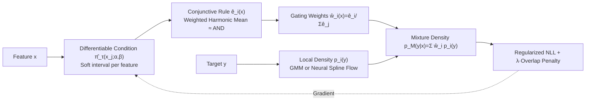

# Explainable Mixture Models through Differentiable Rule Learning

**Conference**: ICLR 2026  
**OpenReview**: [https://openreview.net/forum?id=vBEbUTS81u](https://openreview.net/forum?id=vBEbUTS81u)  
**Code**: <https://eda.group/prj/xmm/>  
**Area**: Explainable AI / Density Estimation  
**Keywords**: Mixture models, explainability, differentiable rule learning, conditional density estimation, subgroup discovery  

## TL;DR
Each component of a mixture model is bound to a "conjunctive rule readable on descriptive features." These rules, along with mixture weights, are learned via differentiable rule learning and gradient descent. This approach accurately models multimodal distributions like GMM while directly identifying "under what conditions or for which population each peak occurs."

## Background & Motivation
**Background**: Mixture models (e.g., GMM) are classic tools for decomposing multimodal distributions into simple sub-distributions. When descriptive features like Age or BMI are available, researchers aim to understand "under what conditions different sub-distributions appear." Conditional Density Estimation (CDE) methods, such as Mixture Density Networks (MDN) and Kernel Mixture Networks (KMN), address this by parameterizing mixture weights and components as functions of features.

**Limitations of Prior Work**: Black-box neural networks in MDN/KMN act as gating mechanisms, providing predictions without explaining "when a component is activated." Tree-based methods (CADET, CDTree) offer transparency but often produce deep trees with excessive leaves, leading to overfitting and poor readability while failing to support overlapping regions. Subgroup discovery, focused on explainability, is inherently "local," identifying interesting subsets rather than modeling the entire population.

**Key Challenge**: A trade-off exists between statistical expressivity (precise density fitting) and human readability (simple rules). Existing methods fail to simultaneously provide global coverage, support for overlapping regions, and precise control over the number of components.

**Goal**: Propose a framework where each mixture component is a flexible data-driven density characterized by a human-readable rule, collectively fitting the global conditional distribution $p(y\mid x)$.

**Core Idea**: **[Explainable Components]** Define components as the conditional distributions induced by samples satisfying a rule $e_i(x)=1$. **[Rules as Gating]** Use rule activation as MoE-style gating weights. **[Differentiable Rule Learning]** Parameterize rule thresholds and feature importance as differentiable variables, learning many rules in parallel via gradient descent followed by pruning.

## Method

### Overall Architecture
XMM replaces black-box gating with the activation of a set of readable rules. Each component $i$ is assigned a conjunctive rule $e_i(x)$ (e.g., "18 < Age < 65 and BMI > 25"). The conditional mixture weight is defined as $w_i(x)=e_i(x)/\sum_j e_j(x)$, and the induced density is $p_M(y\mid x)=\sum_i w_i(x)\,p_i(y)$, where $p_i(y)$ is the local density fitted on the subset where the rule holds. During training, hard threshold conditions are relaxed into a differentiable form. A large number of rules are initialized (using k-means++ anchors), optimized via regularized negative log-likelihood (NLL), and simplified through "inverted interval" pruning and BIC model selection.

### Key Designs

**1. Conditional XMM and Homogeneous Partitioning: Avoiding degenerate solutions via conditional likelihood.** The authors define marginal XMM (weights $w_i=\mathbb{E}[e_i(X)]/\sum_j\mathbb{E}[e_j(X)]$) and prove that if rules partition the feature space ($\sum_i e_i(x)=1$), the induced density equals the true marginal density. However, setting all rules to constants $e_i(x)=1$ perfectly fits the marginal likelihood, rendering learned rules meaningless. Thus, the focus shifts to Conditional XMM—where weights vary with features $w_i(x)=e_i(x)/\sum_j e_j(x)$ (Eq. 3-4). They prove that the true conditional density is recovered only when rules partition the space into "regions homogeneous with respect to $Y$" (where $p_{Y\mid X}(y\mid x)=p_i(y)$). This stronger constraint eliminates degenerate solutions: maximizing conditional NLL $\mathrm{NLL}(M)=-\sum_l\log\sum_i w_i(x^{(l)})p_i(y^{(l)})$ forces the model to find true boundaries where distributions switch.

**2. Differentiable Conjunctive Rules: Making "thresholds + logical AND" differentiable.** A single condition $\mathbb{1}[\alpha_j<x_j<\beta_j]$ is relaxed into the product of two sigmoids: $\hat\pi_\tau(x_j;\alpha_j,\beta_j)=\sigma\!\big(\tfrac{x_j-\alpha_j}{\tau}\big)\,\sigma\!\big(\tfrac{\beta_j-x_j}{\tau}\big)$. The temperature $\tau$ is annealed to 0 during training to transition from soft to hard intervals. Multiple conditions are combined using a **weighted harmonic mean**:

$$\hat e(x;\theta)=\frac{\sum_j a_j}{\sum_j a_j\,\hat\pi_\tau(x_j)^{-1}},\quad a_j\ge 0.$$

This approximates a logical AND—if any condition approaches 0, its reciprocal becomes extremely large, lowering the overall activation. $\hat e(x)\approx 1$ only when all conditions are high. Non-negative weights $a_j$ represent feature importance; setting $a_j=0$ effectively removes the condition, allowing the optimizer to prune useless features and keep rules concise. This avoids exponential combinatorial search and allows parallel gradient-based learning.

**3. Overlap Penalty: Balancing "precise partitioning" and "broad readability."** While perfect partitioning enables precise fitting, generalized rules with slight overlap are often preferred. The authors introduce an overlap penalty $R(M)=\tfrac{1}{n}\sum_l\big(1-\sum_i w_i(x^{(l)})^2\big)$. Since weights sum to 1, the squared term is maximized (and penalty minimized) when exactly one rule is active, pushing weights toward sparsity. The total objective is $\min_M \mathrm{NLL}(M)+\lambda R(M)$, where $\lambda$ controls the allowed overlap. Experiments show that for XMM-GMM, $\lambda=0.3$ reduces rule count by 16% with almost no loss in likelihood.

**4. Over-parameterization—Pruning—BIC Selection: Letting the number of components emerge.** Leveraging parallel differentiable optimization, the authors **purposely over-parameterize the initial rule count $k$** to ensure coverage, using k-means++ centroids as anchors. Pruning occurs naturally: useless rules often learn "inverted intervals" ($\alpha_{ij}>\beta_{ij}$), resulting in zero activation and vanishing gradients. These "dead" rules are periodically removed, and redundant rules are merged. Finally, $\mathrm{BIC}(M)=2\cdot\mathrm{NLL}(M)+|\Theta|\log n$ balances expressivity and complexity—notably, $|\Theta|$ counts only rule parameters, not the data-induced local density parameters—to select the optimal $k$ without manual tuning.

## Key Experimental Results

### Main Results Table (Test NLL, lower is better, selected)
Comparison of explainable versus black-box methods across 16 UCI datasets.

| Dataset | XMM-GMM | XMM-GMM(BIC) | XMM-NSF | CDTree | CADET | CVAE | KMN | MDN |
|---|---|---|---|---|---|---|---|---|
| SkillCraft | **-4.11** | -4.19 | -3.58 | -4.03 | 2.23 | 1.61 | -0.94 | 2.73 |
| abalone | **-2.73** | -2.72 | -1.06 | -2.20 | 4.32 | 1.92 | 1.89 | 1.88 |
| insurance | 9.06 | 9.06 | 8.83 | 9.11 | 20.66 | 8.03 | 8.72 | 8.03 |
| obesity | **-4.86** | -4.53 | -3.66 | -3.45 | - | -0.18 | -1.78 | 2.76 |
| wine | **-4.91** | -4.89 | -4.15 | -4.61 | - | 1.15 | -1.37 | 3.29 |
| **Avg Rank** | **4.20** | 4.47 | 5.60 | 5.20 | 9.73 | 4.80 | 6.60 | 4.73 |

XMM-GMM achieved the best overall rank (4.20) among both explainable and black-box methods. The BIC variant ranked second (4.47) with fewer, shorter rules. Among tree methods, CDTree outperformed CADET.

### Ablation Study

| Dimension | Setting / Phenomenon | Conclusion |
|---|---|---|
| True Components (Synth) | 5/10/20 components | XMM variants maintained high NMI; rule counts after pruning matched ground truth; CADET rule counts exploded. |
| Noise Robustness | Feature / Target noise | XMM was nearly unaffected by feature noise; CADET and KMN were significantly weaker. |
| Overlap Penalty $\lambda$ | 0→1 | XMM-GMM reduced rules by 16% at $\lambda=0.3$ with negligible likelihood loss; primarily recommended for GMM variant. |
| Over-parameterized $k$ | $k$ far exceeding truth | XMM-GMM remained stable without redundant rules; XMM-NSF was more flexible but prone to keeping redundant rules. |

### Key Findings
- **Simpler Estimators Perform Better**: XMM-GMM consistently outperformed the more flexible XMM-NSF in accuracy. The inductive bias of restricted model classes allowed the likelihood objective to prune redundant rules more cleanly.
- **Material Science Case Study**: On Gold Nanocluster HOMO-LUMO gap data, XMM rediscovered known physical laws (e.g., odd-atom clusters having smaller gaps) and identified finer distinctions related to planarity and cluster size. Compared to CDTree, which required 64 components to achieve worse fitting, XMM used only 19.7 rules to get lower NLL (−1.706 vs −1.683) and was nearly two orders of magnitude faster (29s vs 1782s).

## Highlights & Insights
- **Upgrading Subgroup Discovery to Global Mixture**: Each component is a subgroup characterized by a rule, but they collectively cover the full conditional distribution, bridging the gap between local explainability and global density estimation.
- **Overcoming Combinatorial Explosion**: Using sigmoid intervals and harmonic mean approximations of AND, combined with "inverted interval pruning," replaces traditional greedy recursive partitioning with parallel gradient optimization.
- **Theoretical and Practical Alignment**: By proving "homogeneous partitioning ⇔ exact conditional density," the framework justifies switching the objective to conditional likelihood, fundamentally preventing degenerate "all-one" rules.

## Limitations & Future Work
- **Performance Loss in High Overlap**: When component densities overlap heavily, XMM’s NMI decreases, and it may be surpassed by CDTree’s many small leaves, as rectangular rule boundaries have limited expressivity for highly overlapping structures.
- **NSF Variant Trade-offs**: While non-parametric Neural Spline Flows are flexible, their accuracy was lower than GMM, and they were more prone to retaining redundant rules while being computationally expensive.
- **Restricted Rule Form**: The current implementation uses axis-aligned conjunctive interval rules, which may not adequately cover oblique/non-rectangular subgroups or complex interactions between categorical features.

## Related Work & Insights
- **MDN / KMN**: These also model mixture weights as feature functions but use black-box gating. XMM directly replaces gating with readable rules.
- **Explainable CDE Trees** (CADET, CDTree): Use decision trees for partitioning but suffer from deep, fragmented trees. XMM controls complexity via "Mixture + Differentiable Rules + BIC."
- **Subgroup Discovery**: XMM extends single-rule learning (e.g., Xu et al. 2024) to a mixture of multiple rules optimized jointly.
- **Insight**: Using "inverted intervals to cause gradient death" is a clever and generalizable technique for structural learning that requires "over-parameterization followed by slimming."

## Rating
- **Novelty**: ⭐⭐⭐⭐ — Successfully integrates mixture models, subgroup discovery, and differentiable rule learning with theoretical backing.
- **Experimental Thoroughness**: ⭐⭐⭐⭐ — Systematic evaluation across synth data dimensions (components, noise, overlap) and 16 UCI datasets plus a scientific case study.
- **Writing Quality**: ⭐⭐⭐⭐ — Logical progression from definitions to propositions and algorithms; clear visualization.
- **Value**: ⭐⭐⭐⭐ — Provides SOTA-level density estimation while offering readable rules, highly attractive for high-stakes fields like medicine and insurance.

<!-- RELATED:START -->

## Related Papers

- [\[ICLR 2026\] GAVEL: Towards Rule-Based Safety through Activation Monitoring](gavel_towards_rule-based_safety_through_activation_monitoring.md)
- [\[ICLR 2026\] Inferring the Invisible: Neuro-Symbolic Rule Discovery for Missing Value Imputation](inferring_the_invisible_neuro-symbolic_rule_discovery_for_missing_value_imputati.md)
- [\[ACL 2026\] Investigating More Explainable and Partition-Free Compositionality Estimation for LLMs: A Rule-Generation Perspective](../../ACL2026/interpretability/investigating_more_explainable_and_partition-free_compositionality_estimation_fo.md)
- [\[ICLR 2026\] Understanding Cross-Layer Contributions to Mixture-of-Experts Routing in LLMs](understanding_cross-layer_contributions_to_mixture-of-experts_routing_in_llms.md)
- [\[ICLR 2026\] Mixture of Cognitive Reasoners: Modular Reasoning with Brain-Like Specialization](mixture_of_cognitive_reasoners_modular_reasoning_with_brain-like_specialization.md)

<!-- RELATED:END -->
