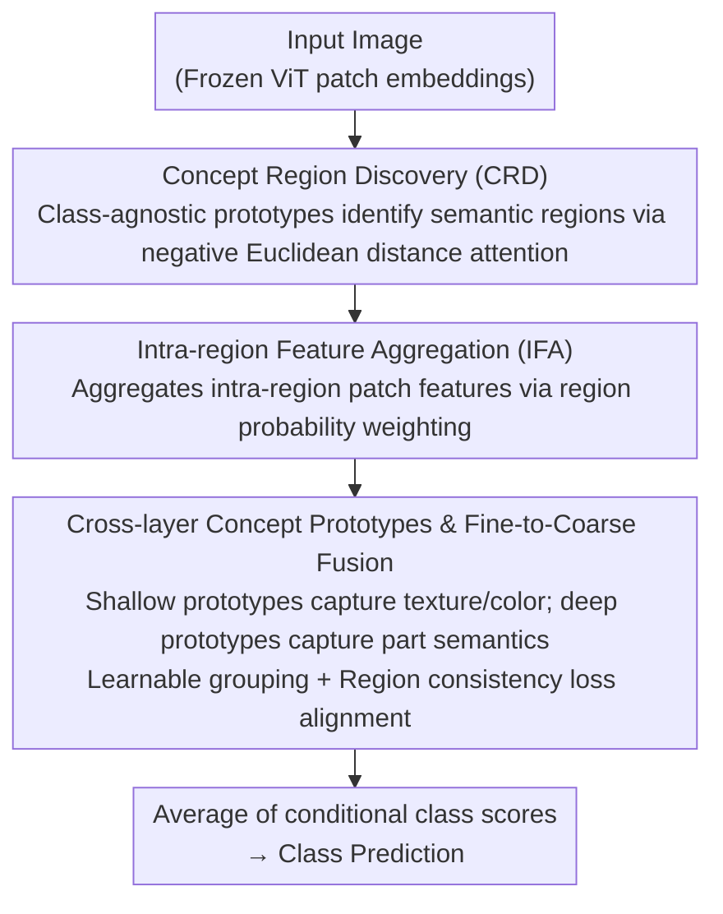

# Exploring Interpretability for Visual Prompt Tuning with Cross-layer Concepts

**Conference**: ICLR 2026  
**arXiv**: [2503.06084](https://arxiv.org/abs/2503.06084)  
**Code**: [github.com/ThomasWangY/IVPT](https://github.com/ThomasWangY/IVPT)  
**Area**: Interpretability  
**Keywords**: Visual Prompt Tuning, Interpretability, Concept Prototypes, Cross-layer Fusion, Fine-grained Classification

## TL;DR
Proposed IVPT (Interpretable Visual Prompt Tuning), which links abstract visual prompts to human-understandable semantic regions through cross-layer class-agnostic concept prototypes. While maintaining the advantages of parameter-efficient fine-tuning, it realizes visual prompt interpretability for the first time, simultaneously improving explanation consistency (+8.4%) and accuracy on fine-grained classification benchmarks like CUB-200.

## Background & Motivation

**Background**: Visual Prompt Tuning (VPT) has become a mainstream method for adapting pre-trained vision models to downstream tasks by inserting a small number of learnable tokens into the Transformer input layer for parameter-efficient fine-tuning. Existing methods like VPT-Deep, E2VPT, and Gated Prompt Tuning perform excellently, but the prompts remain black-box vectors.

**Limitations of Prior Work**: These prompts are unconstrained abstract embeddings that cannot provide human-understandable decision explanations. In safety-critical fields such as medical diagnosis and autonomous driving, the lack of interpretability severely limits the reliability of AI systems. Existing interpretable methods (e.g., ProtoPNet, TesNet) only focus on the last layer of features and cannot explain multi-layer prompts.

**Key Challenge**: Prompts in VPT methods are learned across multiple Transformer layers, yet existing prototype methods can only explain single-layer features; existing methods learn class-specific prototypes and cannot analyze concepts shared across categories.

**Goal**
   - Link abstract prompt embeddings to human-understandable visual concepts.
   - Achieve cross-layer interpretability for prompts across multiple network layers.
   - Learn class-agnostic shared concept prototypes.

**Key Insight**: Define each prompt as the aggregated feature of a specific semantic region in the image (rather than an arbitrary vector). This region is discovered by concept prototypes through an attention mechanism, using more prototypes in shallow layers to capture fine-grained features and fewer prototypes in deep layers to capture coarse-grained semantics.

**Core Idea**: Replace black-box prompt vectors with cross-layer class-agnostic concept prototypes. Each prompt is bound to an interpretable semantic region in the image through concept region discovery and intra-region feature aggregation mechanisms.

## Method

### Overall Architecture

IVPT addresses a specific problem: the prompts inserted by VPT across Transformer layers are a set of unconstrained abstract vectors that cannot inform humans which part of the image they are "looking" at. The Mechanism of IVPT is to freeze the pre-trained ViT and use a set of cross-layer concept prototypes to "re-ground" the prompts at each layer. First, concept prototypes discover their respective semantic regions (CRD) on the image. Then, patch features within these regions are aggregated into corresponding prompt embeddings (IFA), and shallow fine-grained prompts are progressively fused into deep coarse-grained prompts. Finally, each concept provides a conditional class score, and the average is taken as the prediction. Consequently, every prompt corresponds to a visualized semantic region, making interpretability intrinsic to the prompt construction process rather than a post-hoc addition.

### Key Designs

**1. Concept Region Discovery (CRD): Anchoring abstract prompts to a semantic region in the image**

The original prompts in VPT are black-box vectors without explanation. CRD allows each concept prototype $\mathbf{q}_k$ to "stake a claim" on the image: it calculates the negative Euclidean distance attention between the prototype and each patch embedding. After Softmax normalization and adding a learnable spatial bias $b_{k,ij}$, the concept attention map $\mathbf{A}$ for that prototype is obtained:

$$a_{k,ij} = \frac{\exp(-\|\mathbf{e}_{ij} - \mathbf{q}_k\|^2)}{\sum_l \exp(-\|\mathbf{e}_{ij} - \mathbf{q}_l\|^2)} + b_{k,ij}$$

Each patch is assigned to the concept with the highest attention, forming the region map $\mathbf{R}$. These prototypes are **class-agnostic**, so they capture semantic concepts shared across categories (e.g., "wings" of different birds, "wheels" of different cars), which reveals the model's learning of general visual concepts better than class-specific prototypes and makes concept regions comparable across different images.

**2. Intra-region Feature Aggregation (IFA): Making prompts "representatives" of a region rather than arbitrary vectors**

With the region map, IFA aggregates the patch features falling into that concept region to serve as the prompt embedding corresponding to that concept—using the weighted mean of patch features by region probability:

$$\mathbf{p}_k = \frac{\sum_{i,j} \mathbf{z}_{k,ij}}{\sum_{i,j} r_{k,ij}}$$

The resulting prompts are no longer arbitrary vectors learned freely by the optimizer but are summaries of features from a specific semantic region in the image, making them naturally interpretable. Subsequent experiments show that these region-conditioned features are more discriminative than global features.

**3. Cross-layer Concept Prototypes & Fine-to-Coarse Fusion: Simulating human local-to-global visual reasoning**

Existing prototype methods only explain the last layer, whereas VPT prompts are distributed across multiple layers. IVPT places different numbers of prototypes in different Transformer layers—more in shallow layers (e.g., 17) and fewer in deep layers (e.g., 8). Shallow layers use more prototypes to capture low-level, fine-grained attributes like texture and color, while deep layers use fewer prototypes to capture high-level semantics like parts and the whole. Layers are connected through a learnable grouping layer (linear layer + Gumbel-Softmax) that groups fine-grained prompts, takes the mean within groups, and processes them via an MLP to obtain deep prompts. To ensure "local combinations" truly correspond to "global regions," a concept region consistency loss $\mathcal{L}_{con}$ (KL divergence) is introduced to constrain the alignment between the combination of fine-grained regions and coarse-grained regions. This fine-to-coarse path provides the largest gain in ablation studies.

### Loss & Training
- Total Loss: $\mathcal{L} = \lambda_{cls}\mathcal{L}_{cls} + \lambda_{ps}\mathcal{L}_{ps} + \lambda_{con}\mathcal{L}_{con}$
- $\mathcal{L}_{cls}$: Classification cross-entropy (average of each concept's conditional score).
- $\mathcal{L}_{ps}$: Part-shaping loss (ensures non-overlapping regions, foreground coverage, connectivity, etc.).
- $\mathcal{L}_{con}$: Cross-layer region consistency loss (KL divergence).
- All $\lambda$ are set to 1. The Backbone is frozen, and only prompt-related parameters are trained.

## Key Experimental Results

### Main Results (CUB-200-2011, DinoV2-B backbone)

| Method | Con. | Sta. | Acc. |
|------|------------|------------|------------|
| ProtoPNet | 27.6 | 57.0 | 85.8 |
| Huang et al. | 68.6 | 71.4 | 89.9 |
| VPT-Deep | 14.6 | 39.5 | 89.1 |
| VPT-Deep (w/ Proto.) | 70.2 | 72.5 | 90.3 |
| **IVPT** | **75.3** | **75.9** | **90.8** |

IVPT is optimal across all three dimensions (interpretability + accuracy).

### Ablation Study (DinoV2-B, CUB-200)

| Configuration | Con. | Sta. | Acc. |
|------|------|------|------|
| Baseline (Last layer only, global attention) | 62.7 | 64.3 | 88.4 |
| + Spatial Bias Map | 63.5 | 66.7 | 88.7 |
| + Intra-region Feature Aggregation (IFA) | 65.4 | 68.3 | 89.8 |
| + Cross-layer Prototypes | 70.4 | 70.9 | 90.5 |
| + Fine-to-Coarse Prompt Fusion | **75.3** | **75.9** | **90.8** |

### Key Findings
- **Cross-layer structure contributes most**: Adding cross-layer prototypes + fusion increased consistency from 65.4 to 75.3 (+9.9), the largest gain among all components.
- **IFA contributes most to accuracy**: Adding IFA increased accuracy from 88.7% to 89.8% (+1.1%), indicating that region-conditioned features are more discriminative than global features.
- **Good generalization on PartImageNet and PASCAL-Part**: IVPT achieved consistency scores of 63.2 and 72.6, respectively, significantly outperforming ProtoPool and Huang et al.
- **Human Evaluation**: Evaluation by 20 people showed 97.5% concept labeling accuracy, with detail retention at 4.7/5, semantic abstraction at 4.8/5, and transition naturalness at 4.8/5.
- **Medical Imaging Applicability**: On the Gleason-2019 prostate cancer grading dataset, IVPT effectively identified key grading features such as glandular lumens and cancerous acini.

## Highlights & Insights
- **First interpretable paradigm for VPT**: Transforming prompts from "black-box vectors" into "semantic representatives of image regions" is an elegant and practical approach. Previously, VPT interpretability relied on post-hoc analysis (e.g., attention maps); IVPT builds interpretability into the prompt construction process.
- **Advantages of class-agnostic prototypes**: Concepts shared across categories (e.g., "wings" of different birds, "tails" of different planes) not only improve explanation consistency but also discover visual concepts universal across domains, which is valuable for AI-assisted knowledge discovery.
- **Fine-to-coarse fusion simulates human cognition**: Capturing textures/colors in shallow layers and parts/wholes in deep layers, while establishing inter-layer relationships through learnable grouping, aligns with the human visual reasoning process from detail to whole.

## Limitations & Future Work
- Concept prototypes rely on intra-domain learning; retraining is required when migrating to significantly different new domains.
- On small backbones like DinoV2-S, consistency is slightly lower than Huang et al. (-2.2%), indicating that small model capacity may be insufficient to maintain both interpretability and accuracy.
- The fixed number of prototypes per layer (17/14/11/8) is a manually set hyperparameter; automatically determining the optimal number of prototypes might further improve performance.
- **Future Directions**: Extend IVPT to multimodal text-vision prompts (e.g., CLIP), using text semantics to assist in concept discovery.

## Related Work & Insights
- **vs. VPT-Deep (Jia et al., 2022)**: VPT-Deep has high accuracy but a consistency of only 14.6; IVPT offers a 5x improvement in interpretability while achieving higher accuracy (90.8 vs. 89.1).
- **vs. Huang et al. (2023)**: The strongest traditional prototype method; IVPT exceeds its consistency by +6.7% on CUB-200 with DinoV2-B. Moreover, IVPT is parameter-efficient (frozen backbone), whereas Huang et al. requires full model fine-tuning.
- **vs. Prompt-CAM (Chowdhury et al., 2025)**: Prompt-CAM learns class-specific prompts, lacks the ability to analyze shared concepts across categories, and does not possess a cross-layer semantic structure.

## Rating
- Novelty: ⭐⭐⭐⭐⭐ First to build interpretability into the VPT framework; the concept prototype → prompt design is entirely new.
- Experimental Thoroughness: ⭐⭐⭐⭐ Comprehensive coverage of backbones, datasets, ablations, and human evaluations, though verification in general classification scenarios is limited.
- Writing Quality: ⭐⭐⭐⭐ Clear method descriptions, complete formula derivations, and rich visualizations.
- Value: ⭐⭐⭐⭐ Opens a new direction for VPT interpretability with practical significance for AI applications in safety-critical domains.

<!-- RELATED:START -->

## Related Papers

- [\[ICLR 2026\] Understanding Cross-Layer Contributions to Mixture-of-Experts Routing in LLMs](understanding_cross-layer_contributions_to_mixture-of-experts_routing_in_llms.md)
- [\[ICLR 2026\] Concepts' Information Bottleneck Models](concepts_information_bottleneck_models.md)
- [\[NeurIPS 2025\] Understanding Prompt Tuning and In-Context Learning via Meta-Learning](../../NeurIPS2025/interpretability/understanding_prompt_tuning_and_in-context_learning_via_meta-learning.md)
- [\[ACL 2026\] Evian: Towards Explainable Visual Instruction-tuning Data Auditing](../../ACL2026/interpretability/evian_towards_explainable_visual_instruction-tuning_data_auditing.md)
- [\[ICLR 2026\] Cross-Modal Redundancy and the Geometry of Vision-Language Embeddings](cross-modal_redundancy_and_the_geometry_of_vision-language_embeddings.md)

<!-- RELATED:END -->
