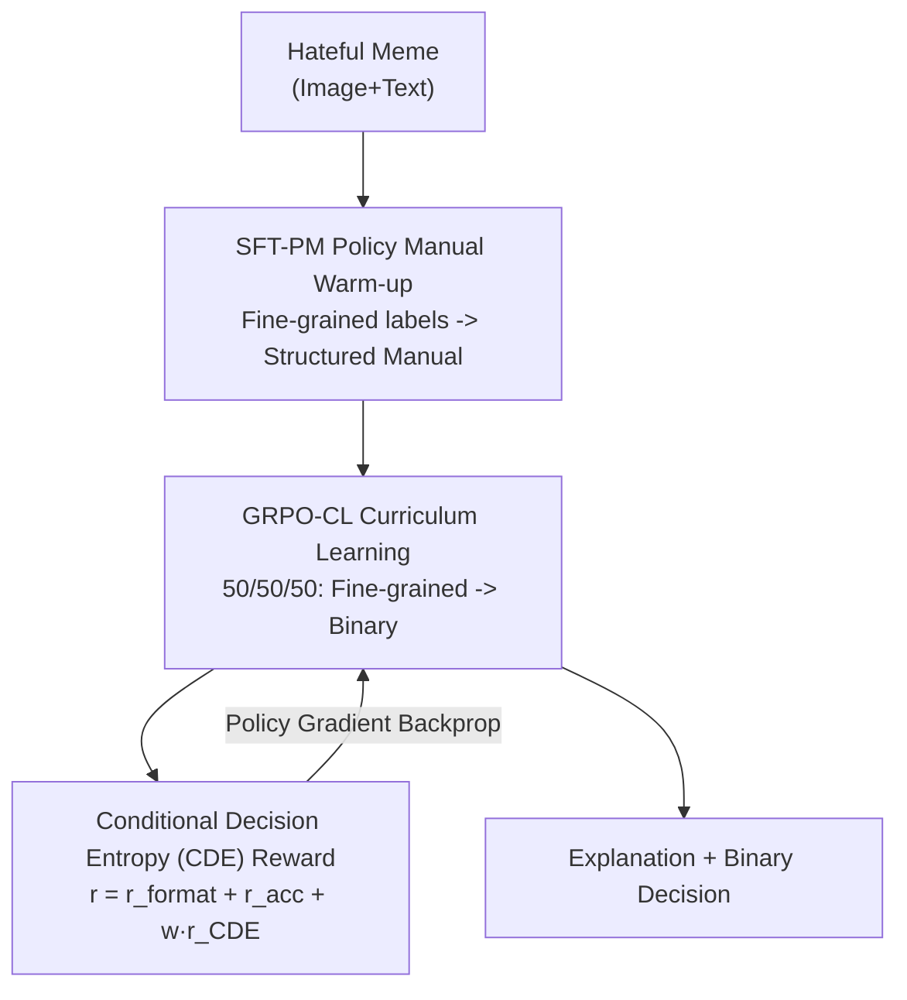

# ExPO-HM: Learning to Explain-then-Detect for Hateful Meme Detection

**Conference**: ICLR 2026  
**arXiv**: [2510.08630](https://arxiv.org/abs/2510.08630)  
**Code**: [GitHub](https://github.com/JingbiaoMei/ExPO-HM)  
**Area**: Interpretability  
**Keywords**: Hateful meme detection, multimodal, GRPO, curriculum learning, conditional decision entropy, interpretability

## TL;DR

ExPO-HM is proposed, which is inspired by the human auditor training process. By combining Policy Manual SFT (SFT-PM) warm-up, GRPO Curriculum Learning (GRPO-CL), and Conditional Decision Entropy (CDE) rewards, this work represents the first Explain-then-Detect hateful meme detection system to comprehensively outperform direct detection baselines across binary classification, fine-grained classification, and reasoning quality, achieving F1 gains of up to 15-17%.

## Background & Motivation

Hateful meme detection is a highly challenging task in online content moderation. Existing methods primarily follow two paradigms:

**Direct Detection**: Outputs only binary results (hateful/benign). Representative works like CLIP-based RA-HMD perform well but cannot provide explanations, failing to meet real-world moderation requirements.

**Explain-then-Detect**: Generates a natural language explanation before performing classification. However, current systems of this type (e.g., LOREHM, U-CoT+) using CoT prompting or agent frameworks **underperform even simple SFT baselines**. Post-training methods like standard GRPO also fail to bridge this gap.

The authors identify two key problems:

**Model explanations omit critical clues**: Policy-related information such as attack targets and types are not considered by the model as potential explanatory hypotheses.

**Binary reward signals are insufficient to guide reasoning**: Just as human annotators cannot learn solely from yes/no labels, models require finer-grained feedback.

The core analogy, derived from the **human auditor training process**—learning detailed moderation policy manuals first, then practicing from fine-grained categories to binary judgments—inspired the design of ExPO-HM.

## Method

### Overall Architecture

ExPO-HM addresses the challenge where Explain-then-Detect hateful meme systems "explain first, then decide, yet fail to beat direct detection." It migrates the human auditor's growth path into the training workflow: when a hateful meme is input, the model first undergoes Policy Manual SFT (SFT-PM) to understand moderation rules and learn to generate fine-grained judgments as a warm-up. This is followed by GRPO Curriculum Learning (GRPO-CL), which gradually transitions reasoning from fine-grained categories to final binary classification. Simultaneously, Conditional Decision Entropy (CDE) rewards are introduced during training to specifically score whether the "explanation truly supports the decision," ultimately outputting results that are both accurate and interpretable. These three steps correspond to the "learn manual, practice classification, monitor reasoning quality" training curve.

### Key Designs

**1. SFT-PM Policy Manual Warm-up: Injecting moderation rules rather than just labels**

A root cause for Explain-then-Detect underperforming simple SFT is that the model does not know that policy dimensions like "attack target" or "attack type" should be considered as hypotheses for explanation. Instead of making the model memorize yes/no, ExPO-HM organizes the dataset's fine-grained labels into a structured policy manual within the input prompt. Each policy item is accompanied by a textual description from annotation guidelines. During training, the language modeling loss is optimized to let the model output fine-grained labels $d^*$ as target responses guided by the manual. An anti-intuitive choice here is that the authors avoid using human-written gold explanations $\mathbf{e}^*$ for supervision, as this constitutes off-policy supervision that forces the model to mimic text outside its own distribution, which actually degrades performance. Enabling the model to learn "reasoning by the manual" within its own output distribution proves to be a more stable warm-up strategy.

**2. GRPO-CL Curriculum Learning: Transitioning reasoning from fine-grained to binary via 50/50/50**

Running GRPO directly on binary data results in sparse reward signals, causing the model to degenerate into "guessing labels." Standard GRPO on binary classification yields an average response length of only 28 tokens, showing almost no reasoning. The curriculum learning approach is straightforward: the first 50% of training steps use only fine-grained data, as fine-grained categories naturally force the model to explore "why this type of attack," encouraging longer reasoning chains. The latter 50% of steps mix binary data at a 50/50 ratio, allowing learned reasoning capabilities to transfer to the final task (different schedules were tested, concluding that as long as "fine-grained precedes binary," performance is similar). This curriculum nearly doubles the binary response length to 52 tokens, implying the model performs substantial reasoning when making final judgments.

**3. Conditional Decision Entropy (CDE): A differentiable proxy reward for reasoning quality**

Another flaw of binary rewards is that they only check decision accuracy while ignoring explanation quality. In hateful meme tasks, reliable reward models are hard to train due to scarce explanation corpora and subjective human judgments. ExPO-HM observes that a good explanation should make the decision clear and certain, while a poor one leaves confusion. Thus, Conditional Decision Entropy is defined: given explanation $\mathbf{e}$ and input $\mathbf{x}$, the entropy of decision $d$ conditioned on the explanation is:

$$H(d \mid \mathbf{e}, \mathbf{x}) = -\mathbb{E}_{d \sim \pi_\theta(\cdot|\mathbf{e},\mathbf{x})}[\log \pi_\theta(d \mid \mathbf{e}, \mathbf{x})]$$

Low entropy indicates the explanation "locks in" the decision, while high entropy indicates ambiguity. In practice, Monte Carlo estimation is used by sampling $K=16$ explanations per sample and calculating the entropy of the decision distribution. However, low entropy does not always mean "good"—being confidently wrong is most dangerous. Therefore, the CDE reward considers both accuracy and certainty: $r_{\text{CDE}}(h, \delta) = \delta \cdot f_{\text{correct}}(h) + (1-\delta) \cdot f_{\text{wrong}}(h)$, where $\delta = \mathbf{1}[d = d^*]$ marks prediction correctness. Correct and confident (low CDE) responses are rewarded to encourage "thinking before concluding"; incorrect but confident responses are heavily penalized by coefficient $\rho$ to suppress "hallucinating with certainty"; incorrect but uncertain responses are tolerated to allow the model space to correct itself. Thus, CDE translates the abstract "reasoning credibility" into a scalar for the RL objective.

### Loss & Training

The final reinforcement learning reward combines three components: $r = r_{\text{format}} + r_{\text{acc}} + w \cdot r_{\text{CDE}}$, where $r_{\text{format}} \in \{0,1\}$ checks formatting, $r_{\text{acc}} \in [0,1]$ measures accuracy, and the CDE reward is added with weight $w$ to prevent it from dominating. Optimization follows the standard GRPO clipped surrogate loss with KL regularization. Default hyperparameters are $a=0.1, b=0.5, w=0.2, \rho=0.25$. Both CDE weight and error penalty are kept small to improve reasoning quality signals without destroying overall policy entropy.

## Key Experimental Results

### Main Results

Evaluated on HatefulMemes, MAMI, and PrideMM datasets using Qwen2.5-VL-3B and 7B as base models.

**Results for Qwen2.5-VL-7B on HatefulMemes:**

| Method | Binary F1 | Attack F1 | Target F1 | LLM Judge | CDE ↓ |
|--------|-----------|-----------|-----------|-----------|-------|
| Zero-shot | 65.9 | 44.7 | 64.5 | 5.0 | 0.33 |
| SFT | 74.5 | 58.4 | 69.4 | 5.0 | 0.33 |
| DPO | 73.6 | 63.2 | 66.6 | 4.9 | 0.32 |
| GRPO | 74.5 | 61.2 | 64.5 | 5.2 | 0.26 |
| RA-HMD (Prev. SOTA Direct) | 80.2 | — | — | 5.5 | — |
| **ExPO-HM** | **81.1** | **75.6** | **77.2** | **6.2** | **0.03** |

ExPO-HM marks the first time an Explain-then-Detect system has comprehensively outperformed the direct detection SOTA (RA-HMD) while significantly leading in reasoning quality.

**Cross-dataset Consistency** (7B model):

| Dataset | GRPO Binary F1 | ExPO-HM Binary F1 | Gain |
|---------|---------------|-------------------|------|
| HatefulMemes | 74.5 | 81.1 | +6.6 |
| MAMI | 76.8 | 82.3 | +5.5 |
| PrideMM | 73.2 | 78.7 | +5.5 |

### Ablation Study

| # | SFT-PM | GRPO-CL | CDE | Binary F1 | Attack F1 | Target F1 | LLM ↑ | CDE ↓ |
|---|--------|---------|-----|-----------|-----------|-----------|-------|-------|
| 1 | - | - | - | 74.5 | 61.2 | 64.5 | 5.2 | 0.263 |
| 2 | ✓ | - | - | 75.8 | 70.8 | 70.2 | 5.6 | 0.092 |
| 3 | ✓ | ✓ | - | 78.4 | 74.3 | 76.1 | 5.8 | 0.056 |
| 4 | ✓ | ✓ | ✓ | **81.1** | **75.6** | **77.2** | **6.2** | **0.026** |

All three components contribute: SFT-PM significantly boosts fine-grained metrics, GRPO-CL provides further comprehensive improvements, and CDE markedly improves reasoning quality (LLM Judge 5.8 to 6.2).

### Key Findings

1. **Explain-then-Detect surpasses Direct Detection**: For the first time, such a system outperforms SFT baselines.
2. **CDE correlates strongly with LLM-Judge**: Pearson $r=-0.78$, Spearman $\rho=-0.81$ ($p<0.001$).
3. **SFT warm-up strategy is critical**: Binary-only SFT performs worse in the RL phase than a no-warm-up baseline.
4. **CDE does not cause policy entropy collapse**: Overall policy entropy remains comparable to baselines without CDE.
5. **Human evaluation verification**: ExPO-HM achieves 100% logical consistency vs. GRPO's 96%, with a helpfulness score of 2.2 vs. 1.6.

## Highlights & Insights

1. **Precise analogy to human auditor training**: The progressive flow of Policy Manual → Fine-grained Practice → Binary Judgment is highly effective.
2. **CDE as a superior proxy for reasoning quality**: The definition is concise (conditional entropy), correlates highly with human evaluation, and serves as a differentiable reward signal.
3. **Key Finding: Good SFT does not guarantee good RL**: Binary SFT performs best during SFT but worst after RL.
4. **Three-dataset consistency**: The method generalizes well across different types of hateful content.
5. **Comprehensive experiments**: Includes ablation, warm-up strategy comparisons, CDE analysis, calibration analysis, and human evaluation.

## Limitations & Future Work

1. **Limited dataset scale**: Annotated hateful meme data (especially with explanations) is scarce.
2. **Single-turn interaction**: Only evaluates single-turn reasoning, not multi-turn moderation dialogues.
3. **Cultural dependency**: Moderation policies are highly dependent on cultural contexts; cross-cultural applicability is not verified.
4. **Base model constraints**: Validated only on Qwen2.5-VL 3B/7B.
5. Scalability to other content moderation tasks (e.g., disinformation detection, cyberbullying identification).

## Related Work & Insights

- **RA-HMD** (Mei et al., 2025): Previous SOTA direct detection method, now outperformed by ExPO-HM.
- **LOREHM** (Huang et al., 2024): Reasoning agent framework based on LLaVA-Next-34B.
- **GRPO** (Shao et al., 2024): ExPO-HM builds upon this with CDE rewards and curriculum learning.
- Insight: The "reasoning quality proxy" concept of CDE can be extended to other tasks requiring interpretable reasoning.

## Rating

- **Novelty**: ⭐⭐⭐⭐ — CDE concept is novel; curriculum learning strategy is well-designed.
- **Technical Depth**: ⭐⭐⭐⭐ — Complete mapping from human training to algorithmic design.
- **Experimental Thoroughness**: ⭐⭐⭐⭐⭐ — Extremely comprehensive across three datasets, multiple baselines, and human evaluation.
- **Writing Quality**: ⭐⭐⭐⭐ — Clear motivation and well-organized experiments.
- **Value**: ⭐⭐⭐⭐ — Directly applicable to content moderation.
- **Overall Recommendation**: ⭐⭐⭐⭐ (4/5)

<!-- RELATED:START -->

## Related Papers

- [\[ICLR 2026\] Learning Nonlinear Causal Reductions to Explain Reinforcement Learning Policies](learning_nonlinear_causal_reductions_to_explain_reinforcement_learning_policies.md)
- [\[ICLR 2026\] InputDSA: Demixing, then comparing recurrent and externally driven dynamics](inputdsa_demixing_then_comparing_recurrent_and_externally_driven_dynamics.md)
- [\[ICLR 2026\] Sparse CLIP: Co-optimizing Interpretability and Performance in Contrastive Learning](sparse_clip_co-optimizing_interpretability_and_performance_in_contrastive_learni.md)
- [\[ICLR 2026\] Learning Pseudorandom Numbers with Transformers: Permuted Congruential Generators, Curricula, and Interpretability](learning_pseudorandom_numbers_with_transformers_permuted_congruential_generators.md)
- [\[CVPR 2026\] Language Models Can Explain Visual Features via Steering](../../CVPR2026/interpretability/language_models_can_explain_visual_features_via_steering.md)

<!-- RELATED:END -->
