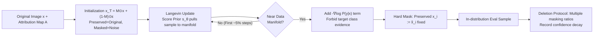

# Faithfulness Under the Distribution: A New Look at Attribution Evaluation

**Conference**: ICLR 2026  
**OpenReview**: [https://openreview.net/forum?id=FF14TqjU3e](https://openreview.net/forum?id=FF14TqjU3e)  
**Code**: [https://github.com/LMBTough/FUD](https://github.com/LMBTough/FUD)  
**Area**: Interpretability / Attribution Evaluation  
**Keywords**: Attribution Methods, Faithfulness Evaluation, Out-of-Distribution (OOD), Score-based Diffusion Models, Langevin Dynamics  

## TL;DR
Existing attribution evaluation metrics (Insertion/Deletion, Infidelity) rely on "zeroing out/masking" to remove features, which pushes samples out of the data distribution and introduces artifactual information. This paper proposes **FUD**, which utilizes score-based diffusion models to reconstruct masked regions back into "in-distribution" samples on the data manifold, providing a more credible assessment of attribution faithfulness.

## Background & Motivation
- **Background**: Attribution methods (Integrated Gradients, AGI, etc.) map model predictions back to input pixels and are primary tools for black-box interpretability. However, different attribution methods often yield vastly different explanation maps for the same prediction. Consequently, metrics to "evaluate attribution quality" are needed, with **faithfulness** serving as the core standard—high faithfulness implies that removing regions labeled as important should cause a significant change in model output.
- **Limitations of Prior Work**: Most mainstream evaluation metrics (AEM) are built on the "feature removal" operation. Insertion/Deletion progressively insert/remove pixels according to attribution scores and record changes in confidence; Infidelity uses noisy perturbations to calculate the mean squared error between attribution values and output changes; Sensitivity-N randomly masks top-N features to observe output correlation. All these implicitly hold a flawed assumption: **"Removing a feature = Setting it to zero"**.
- **Key Challenge**: In images, 0 often represents the **specific semantics** of black. Setting pixels to zero does not remove information but rather **injects new information**—painting a region black when distinguishing between a black cat and a white cat may actually strengthen the "black cat" evidence, causing confidence to rise instead of fall. This directly contradicts the expectation that "removing important features should disable the model." Even worse, samples with half the image painted black **never appear in real data**: models are only responsible for the training distribution $P(x)$. Using out-of-distribution (OOD) sample behavior to judge in-distribution attribution causes anomalous confidence curves that are non-smooth or increase when important features are removed. This paper empirically demonstrates these OOD flaws using Energy OOD detectors and image quality metrics.
- **Goal**: Construct evaluation samples that **remain on the data manifold**, **precisely preserve features to be evaluated**, and **do not introduce new evidence supporting the target class**.
- **Core Idea (Distribution-Aware Reconstruction)**: **Leveraging the score function $\nabla_x \log P(x)$ learned from the real distribution, use Langevin dynamics to "pull" OOD samples generated by masking back onto the data manifold**, while using hard masks to fix preserved regions and a reverse classifier gradient term to prevent the generation of new class evidence—this requires no additional training and can directly apply off-the-shelf diffusion models.

## Method

### Overall Architecture
FUD reformulates "feature removal for attribution evaluation" as a **constrained diffusion-based inpainting**: starting from an initial sample where "preserved region = original image, masked region = noise," it uses a score network to gradually denoise and pull the sample back to the data manifold. During this process, preserved pixels are rigidly locked, and a bias term "forbidding new target class evidence" is added once the sample approaches the manifold. Finally, a deletion-style protocol (gradually removing features deemed unimportant by the attribution) records confidence decay. Smoother decay and higher confidence when the same proportion of important features are kept indicate higher faithfulness.

### Key Designs

**1. Pulling samples back to the distribution using score functions + Langevin dynamics.** FUD does not directly construct OOD samples like $\tilde x = M\odot x+(1-M)\odot 0$. Instead, it initializes $x_T = M\odot x + (1-M)\odot\epsilon, \epsilon\sim\mathcal N(0,I)$—retaining the original image in the preserved area and filling the masked area with noise—then uses Langevin updates to push it toward high-density regions: $x_{t-1} = x_t + c\,\nabla_{x_t}\log P(x_t) + \sqrt{2c}\,\epsilon$. The true score $\nabla_{x_t}\log P(x_t)$ is approximated by a score network $s_\theta$ trained with the standard SGM objective $\theta^*=\arg\min_\theta\sum_t\lambda(t)\,\mathbb E[\|s_\theta(x_t)-\nabla_{x_t}\log P_{\sigma_t}(x_t)\|_2^2]$ (DDPM can also be used). This step ensures intermediate samples always move toward the data manifold rather than stopping at "artificial" blacked-out images.

**2. Triple-component target distribution: Prior + Anti-class gradient + Hard mask.** The target distribution FUD samples from is $P(x_t\mid z,\tilde x,M)\propto P(x_t)\,P(z\mid x_t)\,P(\tilde x\mid x_t,M)$, whose log-gradient splits into three terms: $\nabla_{x_t}\log P(x_t)-\nabla_{x_t}\log P(y\mid x_t)+\nabla_{x_t}\log P(\tilde x\mid x_t,M)$. The first is the image prior (provided by $s_\theta$). The second is the input gradient of the classifier under evaluation, introducing an event $z$ "forbidding new class evidence," defined by a gradient opposite to $\nabla P(y\mid x_t)$ (i.e., $\nabla_{x_t}\tilde P(y\mid x_t)=-\nabla_{x_t}P(y\mid x_t)$). This prevents the reconstruction from secretly filling the image with content supporting the target class. The third term uses $P(\tilde x\mid x_t,M)=\prod_{M_i=1}\delta(x_t^i-\tilde x_i)$ to **rigidly lock** preserved pixels, implemented by setting $x_t^i:=\tilde x_i$ where $M_i=1$. These three terms are integrated into a single Langevin update to maintain fidelity without polluting the evaluation signal.

**3. Delayed activation of anti-class gradient (Warm-up scheduling).** The initial sample $x_T$ is far from the manifold, where the classifier's gradient $\nabla\log P(y\mid x_t)$ is meaningless (the classifier is only reliable in-distribution). Forcing its use would require retraining the classifier for noisy samples, sacrificing performance and generalizability to arbitrary pre-trained models. FUD's solution is to **first use only prior + mask constraints** to sample $P(x_t\mid\tilde x,M)\propto P(x_t)P(\tilde x\mid x_t,M)$, pulling the sample into the distribution (experiments show samples enter in-distribution regions after ~5% remaining steps before new class features are generated), and **then switch to the full target distribution** $P(x_t\mid z,\tilde x,M)$. This scheduling ensures the classifier gradient only contributes when it is "trustworthy."

**4. Retaining "important features" direction + Hard mask superiority.** FUD abandons the dual insertion/deletion scores and uses only a deletion-style protocol: removing unimportant features progressively, generating corresponding samples with FUD, and tracking confidence—more accurate attribution yields higher confidence when the same proportion of features is preserved. It does not evaluate the "retaining only unimportant features" direction because keeping background grass for black/white cat classification is non-informative, and the $-\nabla\log P(y\mid x_t)$ term would amplify adversarial effects, destabilizing the metric. For mask constraints, **hard constraints** ($\delta$ function locking pixels) are preferred over soft constraints (adding Gaussian noise $\tilde x\sim\mathcal N(M\odot x_t,\sigma^2 I)$ with score $\frac{M\odot(\tilde x-x_t)}{\sigma^2}$)—soft constraints introduce incoherent noise in preserved areas, significantly reducing fidelity (e.g., PSNR/SSIM 34.03/0.948 for hard vs 27.63/0.830 for soft at 50% mask with IG).

## Key Experimental Results

**Setup**: ResNet-50 and ViT-B/16 (ImageNet-1k with frozen weights); 1,000 random images from the ImageNet validation set; 11 attribution baselines (IG/GIG/BIG/SM/AGI/MFABA/AttExplore/ISA/EG/FIG/LA); compared against INS/DEL, Sensitivity-N, and Infidelity. FUD uses an unconditional diffusion generator `256x256_diffusion_uncond.pt` + classifier guidance (scale 4.0). Results are averaged over 11×2×9=198 runs.

### Main Results: OOD Degree of Intermediate Samples (Energy Detector, values closer to 0.5 are more "in-distribution")

| Evaluation Metric | ResNet-50 AUROC ↓ | ResNet-50 FPR95 ↑ | ViT-B/16 AUROC ↓ | ViT-B/16 FPR95 ↑ |
|---|---|---|---|---|
| INS/DEL | 0.8974 | 0.3603 | 0.8784 | 0.4761 |
| Sensitivity-N | 0.8773 | 0.5450 | 0.8781 | 0.5660 |
| INFID | 0.7801 | 0.7720 | 0.8181 | 0.7390 |
| **FUD (Ours)** | **0.6863** | **0.8317** | **0.6450** | **0.9404** |

FUD's intermediate samples are the hardest for the OOD detector to identify (AUROC closest to random guess 0.5), whereas samples from other metrics show clear OOD characteristics.

### Perceptual/Structural Fidelity of Intermediate Samples (Average of 7 Image Quality Metrics)

| Evaluation Metric | PSNR ↑ | SSIM ↑ | MS-SSIM ↑ | FSIM ↑ | GMSD ↓ | HaarPSI ↑ | VSI ↑ |
|---|---|---|---|---|---|---|---|
| INS/DEL | 10.49 | 0.27 | 0.48 | 0.58 | 0.271 | 0.292 | 0.780 |
| Sensitivity-N | 13.63 | 0.13 | 0.62 | 0.53 | 0.214 | 0.444 | 0.732 |
| INFID | 16.64 | 0.22 | 0.72 | 0.63 | 0.169 | 0.550 | 0.810 |
| **FUD (Ours)** | **25.20** | **0.75** | **0.78** | **0.86** | **0.124** | **0.663** | **0.946** |

FUD's PSNR is +8.6 dB higher than the runner-up (INFID), SSIM improves by ~0.53, and the distortion metric GMSD decreases by >25%.

### Ablation Study: Smoothness of Evaluation (Kendall's τ, higher is more monotonic/smooth)

| Model | Eval | FIG | GIG | IG | SM | MFABA | BIG |
|---|---|---|---|---|---|---|---|
| ResNet-50 | INS/DEL | 0.2006 | 0.2128 | 0.2176 | 0.2833 | 0.6774 | 0.6379 |
| ResNet-50 | **FUD** | **0.8529** | **0.6845** | **0.6905** | **0.6728** | **0.9259** | **0.9129** |
| ViT-B/16 | INS/DEL | 0.3767 | 0.4523 | 0.4615 | 0.6015 | 0.7406 | 0.7354 |
| ViT-B/16 | **FUD** | **0.8654** | **0.7741** | **0.7803** | **0.7472** | **0.9206** | **0.9046** |

### Ablation Study: Hard vs Soft Mask Constraints (IG at 50% mask)

| Constraint | PSNR ↑ | SSIM ↑ | MS-SSIM ↑ | FSIM ↑ | GMSD ↓ |
|---|---|---|---|---|---|
| **Hard (Ours)** | **34.03** | **0.948** | **0.985** | **0.970** | **0.0352** |
| Soft | 27.63 | 0.830 | 0.951 | 0.916 | 0.0811 |

### Key Findings
- **Traditional metrics systematically produce OOD samples**: Intermediate samples of INS/DEL/Sen-N/INFID are easily identified by OOD detectors, leading to non-smooth or rising confidence curves. FUD samples are statistically in-distribution and perceptually faithful.
- **Substantial improvement in smoothness**: Gradient methods like IG/GIG, which had $\tau\approx0.22$ under INS/DEL, rose to 0.69–0.85 under FUD, showing monotonic confidence decay as features are removed, making the evaluation signal more reliable.
- **FUD yields "significantly different" judgments**: The authors emphasize that attribution rankings produced by FUD differ markedly from old metrics and are more reliable, suggesting that many previous conclusions based on OOD samples might be distorted.

## Highlights & Insights
- **Thorough diagnosis of the "feature removal" problem**: Clearly distinguishes two heuristic errors—zeroing as information injection (the black cat example is very intuitive) and removed samples being OOD—supported by both OOD detection and image quality evidence rather than just intuition.
- **Model-centric OOD definition**: OOD is relative to the "manifold of the model being evaluated" rather than human visual naturalness. This stance is self-consistent with the goal of "evaluating the faithfulness of the original model" and explains why FUD samples might not look natural under extreme masking but remain on the manifold.
- **Plug-and-play with zero extra training**: Incorporates the target classifier directly into an existing score function, avoiding classifier retraining for noisy samples and allowing evaluation of any pre-trained model.
- **Triple decomposition + warm-up scheduling**: Elegantly unifies "fidelity / no pollution / locked preserved region" constraints into a single Langevin update.

## Limitations & Future Work
- **High computational cost**: Generating a sample for every masking level for every image via diffusion takes several seconds per image, much slower than near-instant zero-masking. While score network training costs can be amortized, large-scale evaluation remains heavy.
- **Dependence on score model quality**: The reliability of faithfulness evaluation is shifted to how well the diffusion/score model fits the data distribution. Inaccurate distribution modeling could introduce new biases, a risk not explored in depth.
- **Deletion-only evaluation**: Forgoing the insertion direction is justified (adversarial amplification, low information), but it sacrifices some completeness in evaluation perspective.
- **Limited task/modality scope**: Experiments are focused on ImageNet classification + two backbones, not yet covering detection, NLP, or multimodal scenarios.
- **Sensitivity to hyperparameters**: The robustness of classifier guidance scale and switching timing (~5% steps) across different datasets needs more evidence beyond the empirical results provided.

## Related Work & Insights
- **Attribution Methods**: Integrated Gradients, Guided/Boundary IG, AGI, and adversarial path variants (MFABA/AttExplore/ISA/LA)—FUD acts as the "judge" for these rather than a new attribution method.
- **Attribution Metrics**: Insertion/Deletion (Petsiuk 2018), Infidelity (Yeh 2019), Sensitivity-N (Ancona 2017), Optimized Masking (Fong & Vedaldi)—FUD addresses their shared distribution shift flaw.
- **Generative In-filling Evaluation** (Chang 2019, Agarwal & Nguyen 2020): Also uses generative models for pixel replacement but **lacks classifier-input gradients**, which might fill in evidence supporting the target class. FUD's $-\nabla\log P(y\mid x)$ anti-class term specifically addresses this.
- **Score-based Diffusion Modeling**: Song 2020 (SGM) and Ho 2020 (DDPM) are the methodological foundations. FUD’s innovation lies in adapting Langevin sampling into "constrained inpainting with hard masks + anti-class bias."
- **Insight**: Interpretability evaluation itself needs "distribution awareness"—any evaluation protocol involving input intervention should first ask, "Is the intervened sample still within the distribution the model is responsible for?" Otherwise, it may be measuring OOD behavior rather than faithfulness.

## Rating
- **Novelty**: ⭐⭐⭐⭐ — Reformulating "attribution evaluation" as "in-distribution constrained diffusion reconstruction" and using anti-class gradients to prevent information pollution is a fresh and profound perspective; slightly docked as core components (SGM/Langevin/Guidance) are existing.
- **Experimental Thoroughness**: ⭐⭐⭐⭐ — 198 runs across 2 models, 11 attributions, and 9 masking levels. Includes OOD detection, 7 image quality metrics, Kendall's τ, and mask ablations; however, limited to ImageNet classification and lacks cross-modal or human alignment validation.
- **Writing Quality**: ⭐⭐⭐⭐ — Motivations are clearly illustrated with the black cat example, derivations are step-by-step, and charts are professional; minor notation inconsistencies exist.
- **Value**: ⭐⭐⭐⭐ — Directly challenges the credibility of widely used metrics like INS/DEL and provides a reproducible open-source alternative; impact is high for the interpretability community, though limited by computation costs.

<!-- RELATED:START -->

## Related Papers

- [\[ACL 2025\] Normalized AOPC: Fixing Misleading Faithfulness Metrics for Feature Attribution Explainability](../../ACL2025/interpretability/normalized_aopc_faithfulness_metrics.md)
- [\[AAAI 2026\] Distribution-Based Feature Attribution for Explaining the Predictions of Any Classifier](../../AAAI2026/interpretability/distribution-based_feature_attribution_for_explaining_the_predictions_of_any_cla.md)
- [\[ICML 2026\] Optimal Attention Temperature Improves the Robustness of In-Context Learning under Distribution Shift in High Dimensions](../../ICML2026/interpretability/optimal_attention_temperature_improves_the_robustness_of_in-context_learning_und.md)
- [\[ICLR 2026\] The Potential of CoT for Reasoning: A Closer Look at Trace Dynamics](the_potential_of_cot_for_reasoning_a_closer_look_at_trace_dynamics.md)
- [\[ICLR 2026\] Joint Distribution–Informed Shapley Values for Sparse Counterfactual Explanations](joint_distributioninformed_shapley_values_for_sparse_counterfactual_explanations.md)

<!-- RELATED:END -->
