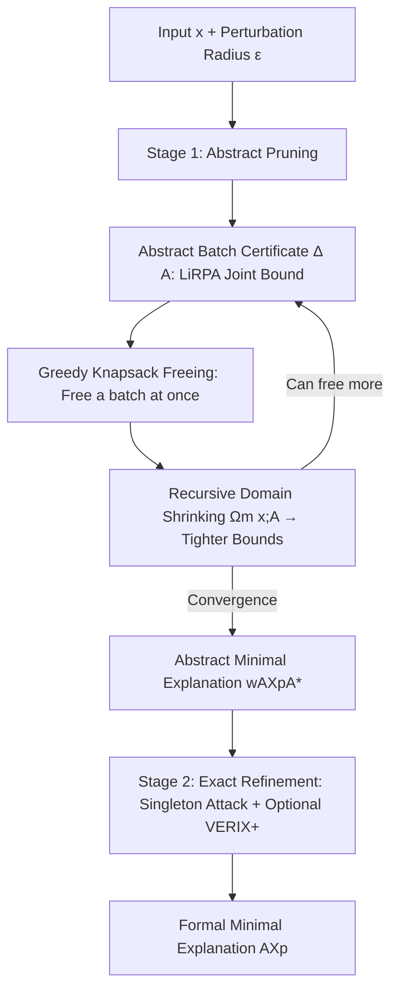

# FAME: Formal Abstract Minimal Explanation for Neural Networks

**Conference**: ICLR 2026  
**OpenReview**: [https://openreview.net/forum?id=VJkNqJJAhV](https://openreview.net/forum?id=VJkNqJJAhV)  
**Code**: DECOMON (https://github.com/airbus/decomon), the paper has not released a separate FAME repository  
**Area**: Formal Explainability / Provably Abductive Explanations  
**Keywords**: Abductive Explanation (AXp), Formal XAI, Abstract Interpretation, LiRPA/CROWN, Perturbation Domain, Neural Network Verification  

## TL;DR
FAME establishes "Abductive Explanations" on the foundation of abstract interpretation. By using LiRPA bounds to prove and prune a batch of irrelevant features simultaneously, it overcomes the bottleneck of traditional formal XAI’s dependence on "feature traversal order." This scales provable minimal explanations to large networks like ResNet for the first time.

## Background & Motivation
**Background**: Neural network decision processes are opaque. Formal XAI uses verifiers to provide "provably correct" explanations. The most classic form is the Abductive Explanation (AXp)—a feature subset that, if fixed to their original values, guarantees the model's prediction remains unchanged regardless of how the remaining features vary within the perturbation domain $\Omega(x)$. Finding the smallest AXp is preferred, and VERIX+ is the current SOTA.

**Limitations of Prior Work**: 
1. Existing methods rely on **exact solvers** like Marabou. Since solving for each feature/batch is NP-hard and limited to the CPU, they cannot scale to large networks.
2. They **heavily depend on traversal order**. Deciding a good order requires knowing feature importance, which is exactly what the explanation aims to reveal, creating a **circular dependency**. Deletion/insertion algorithms are inherently serial, with verifier calls growing linearly with the number of features, making parallelism difficult.

**Key Challenge**: While it is desirable to "free" (determine as irrelevant) a batch of features in parallel, **freeing cannot be simply parallelized**. Two features might appear irrelevant individually, yet their joint interaction could be critical. In contrast, "adding" (determining as necessary) features can be trivially parallelized. The authors identify this as the "asymmetry of parallel feature selection."

**Goal**: To provably and parallelly free a large batch of irrelevant features without relying on a traversal order, and to scale the method to large networks.

**Core Idea**: **Use linear bounds produced by abstract interpretation (LiRPA/CROWN) as "batch certificates."** Instead of treating the verifier as a binary black box that only outputs SAT/UNSAT, the proof objects (linear upper/lower bounds) are extracted. A joint worst-case contribution bound $\Delta(A)$ is calculated for a candidate set $A$. If $\Delta(A) \le 0$, it is **mathematically guaranteed** that freeing all features in $A$ simultaneously is sound.

## Method

### Overall Architecture
FAME is a two-stage pipeline. **Stage 1 (Abstract Pruning)** utilizes LiRPA bounds within a "cardinality-constrained perturbation domain" to iteratively free batches of irrelevant features, obtaining an abstract minimal explanation $\text{wAXp}^{A*}$. **Stage 2 (Exact Refinement)** addresses the remaining features using singleton attacks or a single run of VERIX+ to converge to the true minimal explanation. Two metrics are tracked throughout: explanation size (cardinality) and execution time.

### Key Designs

**1. Abstract Batch Certificate: Consolidating batch freeing into a single inequality.** This is the foundation of FAME and the reason it escapes traversal order dependence. For a target class $i \ne c$, LiRPA provides a linear lower bound on the output margin: $f_i(x')-f_c(x') \ge \overline{W}_i \cdot x' + w_i$. The batch certificate is defined as:

$$\Delta(A;\Omega)=\max_{i\ne c}\Big(\overline{b}_i(x)+\sum_{j\in A}c_{i,j}\Big),$$

where $\overline{b}_i(x)$ is the worst-case marginal bias and $c_{i,j}=\max\{\overline{W}_{i,j}^{\ge 0}(\overline{x}_j-x_j),\,\overline{W}_{i,j}^{\le 0}(\underline{x}_j-x_j)\}$ measures the worst-case contribution of feature $j$ once freed. If $\Delta(A;\Omega) \le 0$, it proves that $F \setminus A$ is a weak abductive explanation (Proposition 4.2). Unlike "binary check-per-feature" approaches, the certificate explicitly accounts for joint interactions via $\sum_{j \in A} c_{i,j}$, avoiding the unreliable parallel freeing trap identified in Proposition 4.1.

**2. Greedy Knapsack Freeing: Maximizing freed count under certificate constraints.** Given the certificate, the goal is to find the largest set $A$ that can be freed. This is naturally a 0/1 multi-dimensional knapsack problem (MKP): for each feature, a binary variable $y_j$ is used to maximize $\sum_j y_j$ subject to $\sum_j c_{ij}y_j \le -\overline b_i(x)$ for every class $i \ne c$. To ensure scalability, FAME uses a greedy heuristic (Algorithm 1): at each step, it selects the feature $j^*$ with the minimum normalized cost $\max_{i \ne c} c_{i,j}/(-\overline b_i)$ across all classes. These costs can be calculated in parallel via one backpropagation pass ($O(L \cdot N)$), making it GPU-friendly.

**3. Cardinality-Constrained Perturbation Domain + Recursive Refinement: Breaking circular dependency.** Instead of using a traversal order $\pi$ to define sub-domains, FAME uses a cardinality-constrained domain:

$$\Omega_m(x)=\{x':\|x-x'\|_\infty \le \varepsilon,\ \|x-x'\|_0 \le m\},$$

which allows at most $m$ features to change simultaneously without prior knowledge of order. Once a set $A$ is freed, the domain shrinks to $\Omega_m(x;A)$, where $m$ variations are allowed only on $F \setminus A$. Soundness is guaranteed by $\Omega_m(x;A) \subseteq \Omega_{m+|A|}(x)$. Smaller domains lead to smaller over-approximation errors in LiRPA, resulting in tighter bounds that unlock even more features. This recursive strategy (Algorithm 2) iteratively recalculates CROWN bounds and frees features until convergence.

**4. Distance to Minimality: Quantifying the gap between "Abstract Minimal" and "True Minimal."** An abstract minimal explanation is only minimal relative to the chosen LiRPA relaxation. Irrelevant coordinates may still exist that the abstract method cannot prove. The authors define the absolute distance $d(X^A, X^{A*}) = |X^A \setminus X^{A*}|$ and use adversarial attacks (where larger domains make finding counterexamples easier, opposite to abstract interpretation) combined with optional VERIX+ refinement to approximate the true minimum.

## Key Experimental Results
Evaluations were conducted on MNIST and GTSRB using four FC/CNN models, comparing explanation size (cardinality) and runtime against the SOTA VERIX+. Experiments ran on an Apple M2 Pro with 16GB RAM; CROWN was provided by DECOMON, and VERIX+ utilized Marabou internally.

### Main Results (VERIX+ vs. FAME-accelerated VERIX+, Size / Time s)

| Model | VERIX+ Size | VERIX+ Time | FAME Iter-Greedy Size | FAME Iter-Greedy Time | Final $\|AXp\|$ | Final Time |
|---|---|---|---|---|---|---|
| MNIST-FC | 280.16 | 13.87 | 225.14 | 8.78 | 224.41 | 13.72 |
| MNIST-CNN | 159.78 | 56.72 | 122.09 | 5.6 | 113.53 | 33.75 |
| GTSRB-FC | 313.42 | 56.18 | 332.74 | 5.26 | 332.66 | 9.26 |
| GTSRB-CNN | 338.28 | 185.03 | 322.42 | 7.42 | 322.42 | 138.12 |

### Ablation Study (Single-round Greedy vs. MILP, Abstract Batch Freeing)

| Model | MILP Size | MILP Time | Greedy Size | Greedy Time | Gain |
|---|---|---|---|---|---|
| MNIST-FC | 441.05 | 4.4 | 448.37 | 0.35 | ~12× |
| MNIST-CNN | 181.24 | 5.59 | 190.29 | 0.51 | ~11× |
| GTSRB-FC | 236.85 | 9.68 | 243.18 | 0.97 | ~10× |
| GTSRB-CNN | 372.66 | 12.45 | 379.34 | 1.35 | ~9× |

### Key Findings
- **Smaller and Faster**: On GTSRB-CNN, FAME's non-minimal set (322.42 features, 7.4s) is already smaller than VERIX+'s minimal set (338.28, 185.03s), achieving a 25x speedup.
- **Greedy is Near-Optimal**: The greedy approach is 9–12x faster than MILP with an average overhead of < 9 features.
- **Scalability**: Success on ResNet-2B (CIFAR-10) from VNN-COMP provides the **first** formal abductive explanation for such a complex architecture, where exact methods are infeasible.
- **Hybrid Nature**: When the abstract domain is effective, $\text{wAXp}^A$ is smaller than VERIX+'s AXp; if the abstract domain fails, it degrades into a binary search without Marabou, which might yield slightly larger results—a clear trade-off.

## Highlights & Insights
- **Upgrading Verifiers**: Shifts the view of verifiers from "binary black boxes" to "proof object providers." Using linear bounds themselves for batch certificates is a fundamental cognitive shift to avoid traversal order.
- **Asymmetry of Freeing/Adding**: Clearly identifies and formalizes why naive parallel freeing is unreliable (Proposition 4.1).
- **Adaptive Abstraction**: The "Cardinality-constrained domain + recursive tightening" creates an elegant loop: freeing features shrinks the domain, which tightens bounds, enabling more freeing.
- **Complementarity**: Adversarial attacks (effective in large domains to find necessary features) and abstract interpretation (effective in small domains to free features) complement each other perfectly.

## Limitations & Future Work
- **Abstract Minimal $\neq$ True Minimal**: FAME's minimality is relative to the LiRPA relaxation. Converging to the true global minimum still requires expensive exact solvers.
- **Degenerate Cases**: Poor perturbation domain selection can lead to vacuum bounds ($\overline b_i \ge 0$), where no features can be freed.
- **Dataset Scale**: Main experiments are limited to 100 samples from MNIST/GTSRB with fixed $\varepsilon$. More extensive verification on diverse datasets is needed.

## Related Work & Insights
- **Abductive Explanation (AXp)** and Prime Implicants are the roots of formal XAI; FAME adopts the wAXp definition but integrates it with abstract interpretation.
- **VERIX / VERIX+**: The direct SOTA benchmarks. They use stronger traversal strategies but remain dependent on Marabou and sequential processing. FAME’s value lies in GPU-based acceleration and removing order dependency.
- **Insight**: Reformulating "explanation" as "knapsack optimization under abstract bound constraints" suggests that formal XAI can scale by leveraging differentiable and parallelizable verification relaxations rather than treating verifiers as pure black boxes.

## Rating
- **Novelty**: ⭐⭐⭐⭐⭐ — First to build AXp on abstract interpretation, removing traversal order through batch certificates.
- **Experimental Thoroughness**: ⭐⭐⭐ — Clear SOTA comparison and ablation, though the ResNet portion is primarily a demo and the evaluation set is small.
- **Writing Quality**: ⭐⭐⭐⭐ — Logical progression of definitions and algorithms; clear pipeline visualization.
- **Value**: ⭐⭐⭐⭐ — Scaling provable explanations to ResNet levels with 25x speedups is highly significant for trustworthy AI in high-stakes scenarios.

<!-- RELATED:START -->

## Related Papers

- [\[ICLR 2026\] Bayesian Neural Networks for Functional ANOVA Model](bayesian_neural_networks_for_functional_anova_model.md)
- [\[ICLR 2026\] Explainable K-means Neural Networks for Multi-view Clustering](explainable_k_-means_neural_networks_for_multi-view_clustering.md)
- [\[ICLR 2026\] Discovering Alternative Solutions Beyond the Simplicity Bias in Recurrent Neural Networks](discovering_alternative_solutions_beyond_the_simplicity_bias_in_recurrent_neural.md)
- [\[ICLR 2026\] Addressing Divergent Representations from Causal Interventions on Neural Networks](addressing_divergent_representations_causal.md)
- [\[ICLR 2026\] Formal Mechanistic Interpretability: Automated Circuit Discovery with Provable Guarantees](formal_mechanistic_interpretability_automated_circuit_discovery_with_provable_gu.md)

<!-- RELATED:END -->
