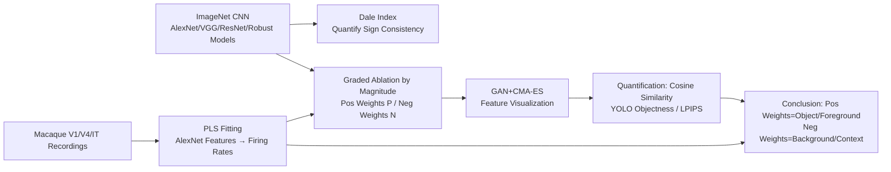

# Feature Segregation by Signed Weights in Artificial Vision Systems and Biological Models

**Conference**: ICLR 2026  
**OpenReview**: [https://openreview.net/forum?id=lnTX3GoeTY](https://openreview.net/forum?id=lnTX3GoeTY)  
**Code**: To be confirmed  
**Area**: Mechanistic Interpretability / Computational Neuroscience  
**Keywords**: Signed weights, Dale's Law, feature visualization, ablation analysis, ventral visual pathway, adversarial robustness  

## TL;DR
This study discovers that ImageNet-trained CNNs spontaneously assign "object/foreground" features to positive weights and "background/contextual texture" features to negative weights, even without enforcing the biological Dale's Law. This homologous "feature segregation by sign" strategy is further validated in neural models of the macaque ventral visual cortex (V1/V4/IT).

## Background & Motivation
**Background**: Both biological and artificial neural networks rely on signed connections—excitatory/inhibitory in biology (Dale’s Law: a neuron's output is either entirely excitatory or entirely inhibitory) and positive/negative weights in artificial networks. CNN representations increase in complexity from V1 to IT, serving as prominent computational models for the primate ventral visual pathway.

**Limitations of Prior Work**: Artificial networks do not enforce Dale's Law; positive and negative weights can be mixed arbitrarily in a neuron's input. Consequently, it remains unclear how deep networks "partition visual information along signs." Previous work (Li et al., 2023) only examined segregation based on **absolute weight strength**, leaving a gap regarding whether semantic features like "foreground objects vs. background context" are systematically separated by **sign**.

**Key Challenge**: In biological vision, inhibitory neurons are responsible for sharpening selectivity and contextual modulation (center-surround receptive fields). In contrast, the functional role of negative weights in artificial networks lacks a corresponding explanation—do both systems converge toward a shared "segregation by sign" representation strategy?

**Goal**: Systematically test the hypothesis that "CNNs segregate visual information into positive/negative inputs" across diverse ImageNet CNNs, and transfer these findings to neural encoding models of the macaque cortex to generate testable neuroscientific predictions.

**Core Idea** (**Function by Sign**): A Dale Index is developed to quantify "Dale-likeness" and characterize "sign consistency." Through targeted ablation of positive/negative weights followed by closed-loop feature visualization, it is revealed that positive weights carry object/shape/low-frequency information, while negative weights carry background/context/texture information. This ablation protocol is then applied to biological neuron models for in vivo validation.

## Method

### Overall Architecture
The methodology consists of three supporting analysis chains: first, the **Dale Index** measures the sign consistency of output channels and correlates it with classification accuracy; second, **graded ablation by cumulative magnitude** is performed on positive/negative weights of the output (and intermediate) layers, followed by feature visualization using **GAN latent codes + gradient-free CMA-ES optimization** to quantify changes in representation and objectness; finally, the same "encoding model fitting → ablation → visualization" protocol is applied to multi-electrode recordings from macaque V1/V4/IT to validate model predictions in vivo.

### Key Designs

**1. Dale Index: Translating "Sign Consistency" into a Metric Correlated with Accuracy.** To measure how closely artificial networks adhere to Dale's Law, the authors define a Dale Index $D = \max(p_+, p_-)$ for each output channel, where $p_+, p_-$ are the proportions of positive and negative output weights, respectively. The value ranges from $[0.5, 1]$—0.5 indicates an even split (least "Dale-like"), and 1 indicates all weights have the same sign (perfectly excitatory or inhibitory). A key finding is that $D$ is near 0.5 at random initialization but increases during training. Furthermore, top-1 accuracy on ImageNet correlates positively with the average Dale Index of the output layer; $D$ increases with depth and is higher in VGG models with BatchNorm. This suggests that high-performance networks **spontaneously** develop sign-consistent output channels, translating a biological question into a measurable phenomenon in AI.

**2. Graded Ablation by Cumulative Magnitude: A Continuous Knob for "Turning Off" Signs.** To determine what positive and negative weights represent, one must cleanly isolate them. Given a weight matrix $W$, the authors separate positive weights $P=\{w>0\}$ and negative weights $N=\{w<0\}$, sorting each set by absolute value in descending order. The ablation strength $\alpha\in[0,1]$ is defined as the "fraction of cumulative magnitude removed": find the smallest $k$ such that $\sum_{i=1}^{k}|w_i| / \sum_{w\in S}|w| \ge \alpha$, and set these $k$ largest weights to zero. Since $\alpha$ is a normalized cumulative magnitude, sweeping from 0 to 1 smoothly transitions from "no change" to "total removal" of a specific sign. This design enables the comparison of positive vs. negative ablation curves and generalizes to any layer using gradient-based contributions.

**3. Closed-loop Feature Visualization via GAN + Gradient-free CMA-ES: Aligning Artificial and Biological Experiments.** Since gradient ascent is impossible when recording from live neurons, the authors forgo pixel-based gradients in favor of optimizing GAN latent codes to generate "maximal activation images." Two generators, AlexNet-fc6 DeePSiM (specializing in texture/objects) and BigGAN (specializing in photo-realistic objects), are used to expand the stimulus space. CMA-ES, a zero-order evolutionary strategy, searches the latent space to generate 20 visualizations per unit per ablation condition. The core value of this **zero-order closed-loop** protocol is its **cross-system compatibility**: the same ablation + visualization pipeline can be run on CNN output units and macaque neuron models fitted via PLS regression, strictly aligning "model prediction" with "in vivo validation."

**4. Multidimensional Quantification of Ablation Effects: Cosine Similarity + Objectness + Spectra.** Beyond qualitative visual inspection, the authors use complementary metrics: an ensemble of readout CNNs calculates the **mean pairwise cosine similarity** between images before and after ablation (lower = greater representational change); a YOLOv7 detector evaluates **objectness scores** to measure if objects "disappear"; and LPIPS and **spatial frequency analysis** provide cross-validation. The results are consistent and robust across 100 ImageNet classes: ablating positive weights drastically reduces similarity and objectness while destroying low-frequency structures; ablating negative weights causes only slight changes, primarily affecting background and color context. This сидя sitting quantifies "positive=object, negative=context" as a statistical conclusion.

## Key Experimental Results

### Main Results: Functional Differences in Positive/Negative Weight Ablation

| Ablation Target | Visualization Change | Representational Cosine Similarity | YOLO Objectness | Primary Affected Frequency |
|---|---|---|---|---|
| Positive Weights (P) | Object structure destroyed, unrecognizable | Sharp decline | Significantly reduced | Low frequency |
| Negative Weights (N) | Object identity preserved, background/color change | Minimal change | Nearly unchanged | High frequency/Texture |

- The ratio of positive to negative input weights per unit is approximately 1:1 (Table 2), indicating both polarities encode relevant information; the difference lies in "what" is encoded rather than "how much."
- Ablating positive weights significantly suppresses the maximum activation achievable in feature visualization, whereas ablating negative weights slightly increases it.
- Conclusions were replicated across 100 classes and alternative metrics like LPIPS, demonstrating universality.

### Ablation Study: Mechanism Dependence on ReLU and Robust Training

| Setting | Sign Segregation Presence | Description |
|---|---|---|
| Supervised ReLU Networks | Strong | Standard case; positive weight ablation is most destructive. |
| Unsupervised Pre-training (SimSiam) | Yes (Slightly weaker) | Object features disappear at lower ablation intensities. |
| Tanh Non-rectified Activation | Vanished | Positive and negative ablations cause similar representational shifts. |
| Adversarially Robust ResNet50 | Enhanced | Negative weight ablation often renders backgrounds as white. |

- Higher robustness leads to greater sensitivity to ablation: the Spearman correlation between $\Delta$(Cosine Similarity) and the robustness radius is significant at most intensities (e.g., at $\alpha=0.7$, $\rho=-0.51, p=9\times10^{-6}$ for positive weights; $\rho=-0.52, p=6\times10^{-6}$ for negative weights).
- Sign segregation is not limited to the output layer: from the first layer of AlexNet (positive = high-freq achromatic edges, negative = low-freq color blobs) to the final conv layer (positive = local fragments like snouts/eyes, negative = backgrounds like sky/grass), segregation develops along the network depth.

### Key Findings (Biological Verification)
- Using PLS regression to map AlexNet penultimate layer (4096 units) features to V1/V4/IT neuron firing rates, the same ablation was applied to the neuron models: **ablating positive weights significantly decreased both predicted and measured firing rates**, whereas ablating negative weights had minimal impact. This pattern holds at both single-neuron and population levels (59 models).
- Prediction using only positive weights reduced both training and testing accuracy, indicating that neuron models require both positive and negative inputs.
- **In vivo background manipulation**: Clearing the background around a neuron's preferred feature (reducing hypothesized inhibitory drive) increased the neuron's response—providing functional evidence that "negative/inhibitory inputs handle contextual modulation."

## Highlights & Insights
- **Translates a biological principle (Dale's Law) into a measurable artificial network phenomenon** and uses AI to generate neuroscientific predictions that can be tested in macaque cortex, forming an elegant bidirectional "model ↔ brain" loop.
- The clean functional dichotomy of **positive = object/low-frequency/shape** and **negative = background/texture/context** provides a mechanistic explanation for why "background contributes to classification," as observed by Xiao et al. (2020).
- Reveals that **ReLU rectification is a necessary condition for sign segregation** (which vanishes under Tanh), linking representational geometry to activation function non-linearity, echoing theories by Alleman et al. (2023) and extending them to practical scales.
- Proposes that "ablation by sign" could serve as a potential means of **controlling brain population activity**—images generated by positive weight ablation indeed suppressed cortical population responses.

## Limitations & Future Work
- Main conclusions are based on output layer units; due to computational constraints, only 100 classes per network were tested rather than the full 1,000. The authors believe larger simulations will further confirm the findings.
- Neural recordings used only 160 images for regression; a larger, more diverse set might improve model fitting.
- Mapping conclusions directly to excitatory/inhibitory neurons still requires networks to strictly obey Dale's Law; the paper does not claim a perfect mapping.
- The fundamental "shape vs. texture, foreground vs. background" division is not fully resolved; the complete boundaries of sign segregation require more work.

## Related Work & Insights
- **Mechanistic Interpretability**: Continues the circuit dissection and sparse dictionary learning trajectory of Olah et al. (2020), but is the first to systematically study sign-based partitioning across the full magnitude range.
- **Feature Visualization**: Evolves from Hubel & Wiesel’s manual exploration to pixel-based gradient ascent, and finally to in vivo gradient-free black-box optimization (Ponce et al., 2019; Wang & Ponce, 2022). This paper applies gradient-free visualization of color images to both CNNs and primate recordings.
- **Robustness and Non-linearity**: Incorporates adversarial training (Salman et al., 2020) and ReLU/Tanh representational alignment theories (Alleman et al., 2023) into the framework of sign segregation.
- **Insight**: Introduces "sign consistency of connections" as a **biologically grounded primitive** for the mechanistic interpretability toolbox, suggesting that biological constraints like Dale's Law may emerge spontaneously from functional requirements.

## Rating
- **Novelty**: ⭐⭐⭐⭐⭐ First to systematize the "segregation of foreground/background features by weight sign" and link AI to macaque cortical validation.
- **Experimental Thoroughness**: ⭐⭐⭐⭐ Covers multiple architectures, supervised/unsupervised, robust/standard, and ReLU/Tanh, with in vivo verification, though not all classes were exhaustive.
- **Writing Quality**: ⭐⭐⭐⭐ Clear hypothesis-testing-verification logic with well-supported quantitative metrics.
- **Value**: ⭐⭐⭐⭐⭐ High interdisciplinary value, providing both interpretability primitives for AI and testable predictions for visual neuroscience.

<!-- RELATED:START -->

## Related Papers

- [\[ICLR 2026\] Inducing Dyslexia in Vision Language Models](inducing_dyslexia_in_vision_language_models.md)
- [\[ICLR 2026\] MICLIP: Learning to Interpret Representation in Vision Models](miclip_learning_to_interpret_representation_in_vision_models.md)
- [\[ICLR 2026\] Linear Mechanisms for Spatiotemporal Reasoning in Vision Language Models](linear_mechanisms_for_spatiotemporal_reasoning_in_vision_language_models.md)
- [\[ICLR 2026\] Watch the Weights: Unsupervised Monitoring and Control of Fine-tuned LLMs](watch_the_weights_unsupervised_monitoring_and_control_of_fine-tuned_llms.md)
- [\[ICLR 2026\] Low-Pass Filtering Improves Behavioral Alignment of Vision Models](low-pass_filtering_improves_behavioral_alignment_of_vision_models.md)

<!-- RELATED:END -->
