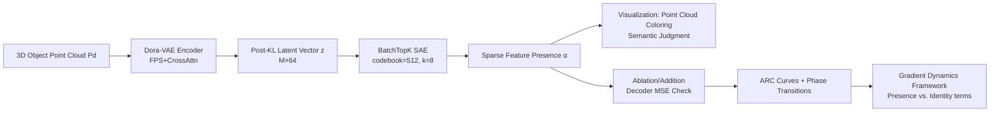

# Features Emerge as Discrete States: The First Application of SAEs to 3D Representations

**Conference**: ICLR 2026  
**OpenReview**: [https://openreview.net/forum?id=UcaSiq18Tb](https://openreview.net/forum?id=UcaSiq18Tb)  
**Code**: [https://feature3d.github.io/Dora-SAE/](https://feature3d.github.io/Dora-SAE/)  
**Area**: Interpretability / Mechanistic Interpretability / 3D Representations  
**Keywords**: Sparse Autoencoder, Feature Decomposition, 3D VAE, Discrete State Space, Phase Transition, Superposition Interference  

## TL;DR
The first application of Sparse Autoencoders (SAEs) to the latent space of 3D reconstruction VAEs reveals that 3D models encode continuous positions into "discrete states + phase transitions." A proposed framework based on gradient dynamics provides a unified explanation for positional encoding preferences, S-shaped ablation-loss curves, and the bimodal distribution of phase transition points.

## Background & Motivation
**Background**: SAEs have become a primary tool for mechanistic interpretability in large models, using dictionary learning to decompose internal activations into human-readable "features." They have identified semantically clear feature vectors in tasks like LLM arithmetic, protein features, and vision-language relations, supported by the "superposition" hypothesis—models can pack more features into low-dimensional latent spaces than the number of dimensions, at the cost of mutual interference.

**Limitations of Prior Work**: Feature decomposition research has two main shortcomings. First, the **data domain is almost entirely focused on text**, and the universality of SAEs has never been rigorously tested outside text. Second, **existing research is mostly "descriptive"**—listing which features contribute to performance without answering "why and how the model selects these features." In other words, there is a lack of a cross-modal framework identifying how features are learned and organized.

**Key Challenge**: 3D point cloud data naturally originates from an **unordered, continuous** space. Intuition suggests models should represent positions using continuous features (e.g., three coordinate axes). If SAEs reveal discrete, binarized features in 3D, the "continuous concept space" narrative requires reassessment—where does discreteness come from? This is harder to expose in text, as 3D feature semantics are visually intuitive.

**Goal**: To apply SAEs to the 3D domain for the first time, not only to catalog interpretable features but to explain their **learning dynamics**—why they appear as discrete states and why phase transition points follow specific distributions.

**Key Insight**: **[Discrete State Space]** Latent space feature activations are treated as a discrete state space driven by "phase transitions"; **[Gradient Dynamics Breakdown]** Optimization steps are decomposed into two independent terms: "feature presence" and "feature identity," explaining counter-intuitive phenomena through their interplay.

## Method

### Overall Architecture
The authors train a **BatchTopK SAE** on the post-KL latent vectors of a pre-trained **Dora-VAE** (which encodes point clouds into $M$ latent vectors for diffusion-based occupancy reconstruction). After obtaining features, two tasks are performed: 1) **Visualization**—mapping latent vectors back to original sampling points and coloring them by feature presence for semantic judgment; 2) **Causal Intervention**—modifying latent vectors along feature directions via ablation/addition and measuring reconstruction changes through the decoder to quantify true impact. Finally, they derive a dynamics framework from the theoretical decomposition of gradient steps.

### Key Designs

**1. BatchTopK SAE on Dora-VAE Latent Space: Turning "Sampling as Data Augmentation" into an Infinite Dataset**  
The SAE is attached after the Dora-VAE KL reparameterization. Since latent vectors $z_{i,j}=\mu_{i,j}+\sigma_{i,j}\cdot\epsilon,\ \epsilon\sim\mathcal{N}(0,1)$, each epoch can re-sample 217 million new latent vectors from recorded pre-embeddings, effectively providing an infinite training set. The SAE follows $\text{Enc}(z)=\text{TopK}(W_{Enc}z+b_{Enc})$ and $\hat z=W_{Dec}\text{Enc}(z)+b_{Dec}$, using $W_{Dec}$ as an overcomplete dictionary to approximate the feature set $E$. A dead feature auxiliary loss $L=L_{recon}(z,\hat z)+\beta L_{recon}(z,\hat z_{dead})$ is added to mitigate feature death. Crucially, each latent vector maps to a point in the original cloud, allowing features to be interpreted by where they activate—a 3D-specific visualization advantage.

**2. Feature Ablation/Addition via Decoder Weights: Proving "Causality" over "Correlation"**  
To rule out features being artifacts of coordinate correlations, the authors modify latent vectors along the SAE decoder weight directions. To scale feature $j$ presence by $(1-t)$, ablation is $z_i'\approx z_i-t\cdot\text{Enc}(z_i)_j w_j^{dec}$, while addition is $z_i'\approx z_i+\alpha_j' w_j^{dec}$. A key observation: ablating a positional feature causes the shape to **disappear at the original site and reappear elsewhere** rather than moving smoothly—proving features represent **discrete regions** rather than continuous ranges. Moving a shape from one Y-axis region to another by removing feature 363 and adding feature 426 demonstrates these are authentic, composable causal representations.

**3. Gradient Dynamics Breakdown: Presence vs. Identity**  
This is the theoretical core. When computing gradients for encoder parameters, the derivative of the latent vector with respect to parameters is split into two terms:
$$\frac{\partial z}{\partial\theta_f}=\sum_{j=1}^{n}\frac{\partial\alpha_j}{\partial\theta_f}\cdot e_j+\alpha_j\cdot\frac{\partial e_j}{\partial\theta_f}$$
The first term $\nabla_{\theta_f}\alpha_j$ adjusts the **magnitude and frequency of activation (presence)**, while the second $\nabla_{\theta_f}e_j$ adjusts the **information carried (identity)**. The key insight: the learning signal for identity is **scaled** by presence $\alpha_j$. Thus, models naturally prefer learning features that already have high presence. When presence is low, the identity signal is diluted by other high-presence features, leading to features that are either strongly present or absent—discrete binarization.

**4. Explaining Phase Transitions (Unimodal vs. Bimodal) via Presence/Identity**  
The "phase transition point" is defined as $t$ where normalized MSE reaches 0.5 on the ablation-response curve (ARC). For $\nabla_{\theta_f}\alpha_j$, updates are scaled by $\partial L/\partial z$, which peaks near the phase transition.  
- **High-impact features**: The model is incentivized to push on/off states away from the transition point. Averaged across features, the transition points cluster symmetrically at the center $t\approx0.5$ (unimodal).  
- **Low-impact features**: Individual features are unimodal, but a "polarization shift" pushes peaks away from the center. Aggregated, they appear bimodal. The authors attribute this to **inference-time interference redistribution**—the model picks auxiliary features to absorb interference, sacrificing low-impact feature stability to protect high-impact ones.

## Key Experimental Results

### Main Results

| Item | Setting |
|------|------|
| Base Model | Dora-VAE (Pre-trained on Objaverse subset) |
| Data | 53k Objaverse-XL objects, M=4096 latent vectors/object |
| SAE | BatchTopK, codebook n=512, k=8, β=0.125 |
| Training | Batch size 327,680, Adam lr=1e-3, 10 epochs, ~2 hours on single A100 |
| Intervention Scale | 848k independent feature ablations (16 random features per object, t∈{0,0.05,…,1.0}) |

### Key Findings Table

| Phenomenon | Observation | Framework Explanation |
|------|------|----------|
| Positional Discretization | Features show stripe-like binary activation, like positional encodings. | Identity signal scaled by presence; preference for high presence. |
| S-shaped ARC | MSE is non-linear with $t$, showing two inflections and a jump at transition. | Discrete states switch at the phase transition point. |
| Impact vs. Discreteness | Larger ∆L results in clustering of MSE at extremes; outlier max slopes. | High-impact features act as pure binary switches. |
| Bimodal Phase Transitions | Phase transition points for all ARCs show symmetric bimodality. | High-impact unimodal center + low-impact polarization shift. |
| Impact Correlation | ∆L correlates positively with feature density and average presence. | Features with higher presence are more important. |

### Key Findings
- **Features are discrete**: During ablation, shapes "teleport" or flash rather than moving smoothly, confirming they represent discrete spatial regions.
- **Explainable learning dynamics**: Discretization, S-shaped ARCs, and phase transition distributions are unified by the presence/identity decomposition.
- **Inference-time interference redistribution**: The bimodal distribution for low-impact features suggests the model actively offloads superposition interference to protect high-impact features—a new addition to the superposition hypothesis.

## Highlights & Insights
- **First application of SAE to 3D**, utilizing 3D's visual clarity and continuous-unordered nature to expose discretization hidden in text.
- **Moving from "Description" to "Explanation"**: Instead of just listing features, the presence/identity decomposition provides a potentially cross-modal framework for feature learning dynamics.
- **VAE sampling as infinite augmentation**: Using KL reparameterization to sample 217M latent vectors per epoch eliminates data bottlenecks in SAE training.
- **Causality over correlation**: Using decoder weights for ablation/addition and the shape "teleportation" evidence upgrades "meaningful features" from correlation to causality.

## Limitations & Future Work
- **Single model/architecture**: Conclusions are currently validated only on Dora-VAE. Generalization is speculative and requires replication on PointNet++, LION, etc.
- **Interference redistribution is a hypothesis**: The bimodal shift is attributed to "dynamic redistribution" via visualization/exclusion; direct causal evidence (like toy model gradient probes) is still needed.
- **Lack of quantitative interpretability metrics**: Semantic assessment relies heavily on visualization; there is no formal interpretability score or quantitative comparison between SAE variants.
- **Future directions**: Cross-domain validation, using attribution graphs to track feature flow, and integrating feature decomposition as meta-learning modules during training.

## Related Work & Insights
- **SAE and Dictionary Learning**: Inherits from LLM interpretability lines (Bricken et al. 2023, Templeton et al. 2024) but extends to 3D.
- **Superposition Hypothesis**: Builds on Elhage et al. 2022, introducing the perspective of "inference-time dynamic interference redistribution."
- **BatchTopK SAE**: Adopts TopK selection (Bussmann et al. 2024) and dead feature auxiliary loss (Gao et al. 2025).
- **Inspiration**: For representation learning researchers, this suggests "discrete states + phase transitions" may be a universal cross-modal perspective.

## Rating
- **Novelty**: ⭐⭐⭐⭐⭐ (First SAE in 3D, original dynamics framework).
- **Experimental Thoroughness**: ⭐⭐⭐⭐ (Solid scale with 848k ablations; limited to one model).
- **Writing Quality**: ⭐⭐⭐⭐ (Progressive narrative from phenomena to framework).
- **Value**: ⭐⭐⭐⭐ (Opens the 3D domain for mechanistic interpretability; provides tools for feature learning analysis).

<!-- RELATED:START -->

## Related Papers

- [\[ICLR 2026\] Emergent Discrete Controller Modules for Symbolic Planning in Transformers](emergent_discrete_controller_modules_for_symbolic_planning_in_transformers.md)
- [\[ICLR 2026\] Interpretable 3D Neural Object Volumes for Robust Conceptual Reasoning](interpretable_3d_neural_object_volumes_for_robust_conceptual_reasoning.md)
- [\[ICLR 2026\] Persona Features Control Emergent Misalignment](persona_features_control_emergent_misalignment.md)
- [\[ICLR 2026\] AbsTopK: Rethinking Sparse Autoencoders For Bidirectional Features](abstopk_rethinking_sparse_autoencoders_for_bidirectional_features.md)
- [\[ICLR 2026\] Sparse Autoencoders Trained on the Same Data Learn Different Features](sparse_autoencoders_trained_on_the_same_data_learn_different_features.md)

<!-- RELATED:END -->
