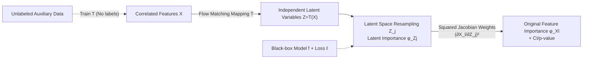

# Flow-Disentangled Feature Importance

**Conference**: ICLR 2026  
**OpenReview**: [https://openreview.net/forum?id=Fx8AtzGlTS](https://openreview.net/forum?id=Fx8AtzGlTS)  
**Code**: To be confirmed  
**Area**: Interpretable Machine Learning / Feature Importance  
**Keywords**: Feature Importance, Flow Matching, Disentangled Representation, Semiparametric Inference, Correlation Distortion  

## TL;DR
FDFI utilizes flow matching to learn an invertible mapping that disentangles correlated features into independent latent variables. It calculates the importance of each direction in the latent space and "returns" the scores to original features using squared Jacobian weights. This generalizes DFI, which is restricted to $\ell_2$ loss, to any differentiable loss (including classification) and provides semiparametrically efficient estimation with valid confidence intervals and hypothesis testing.

## Background & Motivation
**Background**: Quantifying feature importance is at the core of interpretable machine learning. Prevailing model-agnostic methods fall into three categories: removal-based LOCO (risk increment after removing a feature), resampling-based CPI (error increment after resampling a feature from conditional distribution), and game-theoretic Shapley/SHAP. The paper first proves a unification result: under $\ell_2$ loss, LOCO, CPI, and SCPI are completely equivalent (Lemma 2.2), all equaling $\mathbb{E}[\mathbb{V}(f(X)\mid X_{-j})]$.

**Limitations of Prior Work**: These three categories are all susceptible to feature correlation. When two features $X_1\approx X_2$ are highly correlated, removing either results in almost no performance drop (as the other provides redundant information), leading to near-zero importance for both—this contradicts the fact that "both are critical," a phenomenon known as **correlation distortion**. Furthermore, many methods only provide point estimates without uncertainty quantification, making them unable to perform confidence intervals or hypothesis testing.

**Key Challenge**: Recent DFI (Disentangled Feature Importance) mitigates correlation distortion by mapping correlated features to an independent latent space via Optimal Transport (OT), calculating importance in the latent space, and mapping it back. However, DFI has two rigid constraints: (i) it relies on Gaussian OT mapping, which is inflexible and computationally expensive for complex high-dimensional non-Gaussian distributions; (ii) its latent importance is defined by conditional variance, essentially **locking it to $\ell_2$ loss**, rendering it unusable for tasks like classification.

**Goal**: While maintaining the "disentangle then attribute" paradigm, this work aims to relax DFI in two directions: flexible mappings (arbitrary distributions) and general losses (any differentiable loss), while maintaining the ability to perform statistical inference throughout.

**Core Idea**: **Replace Optimal Transport with Flow Matching + Replace conditional variance with "conditional expected loss increment."** The former allows the disentangled mapping to handle arbitrary feature distributions, and the latter detaches the importance definition from $\ell_2$ to accommodate general losses. Semiparametric efficiency theory is then used to prove the asymptotic normality of the estimator, providing valid CIs and p-values.

## Method

### Overall Architecture
FDFI decomposes feature importance attribution into a three-step pipeline: first, a flow matching-learnt invertible mapping $T$ disentangles correlated features $X$ into approximately independent latent variables $Z=T(X)$; next, the "expected loss increment after resampling $Z_j$" is calculated in the latent space as the latent importance $\phi^{\text{FDFI}}_{Z_j}$; finally, the latent importance is aggregated back to each original feature $X_l$ using squared Jacobian weights $(\partial X_l/\partial Z_j)^2$ to obtain $\phi^{\text{FDFI}}_{X_l}$. This process is plug-and-play for any black-box predictor $f$ and loss $\ell$, and the training of the disentangled mapping does not require labels, allowing estimation via large-scale unlabeled auxiliary data.

### Key Designs

**1. Latent Importance under General Loss: Replacing "Conditional Variance" with "Conditional Expected Loss Increment."** DFI defines latent importance as conditional variance $\mathbb{E}[\mathbb{V}(f(X)\mid Z_{-j})]$, a form that only has an importance interpretation under $\ell_2$ loss. FDFI switches to a quantity valid for any differentiable loss: for a latent coordinate $Z_j$ resampled from its marginal distribution as $Z^{(j)}$, define a pointwise score $\omega(O;T)=\tfrac12[\ell(Y,f(T^{-1}(Z^{(j)})))-\ell(Y,f(T^{-1}(Z)))]$, where latent importance is the expectation $\phi^{\text{FDFI}}_{Z_j}=\mathbb{E}[\omega(O;T)]$. Intuitively, it measures "how much disturbing this disentangled direction increases the loss on average," and it is proven to degenerate precisely to the conditional variance of DFI under $\ell_2$ loss, making it a strict generalization. The theoretical section also provides a precise decomposition of the difference between LOCO and CPI (Theorem 2.1), attributing their divergence to the model interaction effect EMIE and approximation error $E_{\text{approx}}$, bounded by M-smoothness assumptions.

**2. Learning Disentangled Mappings with Flow Matching instead of Gaussian OT.** The role of the mapping $T$ is to transform correlated $X$ into coordinate-independent $Z$. DFI uses Gaussian OT, assuming a specific distribution shape. FDFI turns to flow matching: performing linear interpolation $U_t=(1-t)U_0+tU_1$ between a source distribution $\rho_0$ (simple reference, e.g., standard Gaussian) and target distribution $\rho_1$ (data $X$), it learns a velocity field $v_t$ such that the ODE $\frac{d}{dt}U_t(u)=v_t(U_t(u))$ flows from one end to the other. The unique solution is the conditional expectation $v_t(u)=\mathbb{E}[U_1-U_0\mid U_t=u]$. The resulting flow mapping $T:=U_1$ can fit arbitrary distributions without requiring Optimal Transport. A practical side effect is that flow training only uses covariates $X$ and no labels $Y$, allowing the use of larger independent unlabeled datasets to estimate $T$ without consuming labeled samples.

**3. Attribution Rule with Squared Jacobian Weights.** Latent scores must be mapped back to original features for interpretability. FDFI follows the geometric intuition of DFI: the intensity of the "intrinsic signal" of $Z_j$ acting on $X_l$ via the inverse mapping is characterized by local sensitivity $\partial X_l/\partial Z_j$. Thus, original feature importance is defined as $\phi^{\text{FDFI}}_{X_l}=\sum_{j=1}^d \mathbb{E}\big[\mathbb{E}[\omega(O;T)\mid Z_{-j}]\,(\partial X_l/\partial Z_j)^2\big]$—aggregating the universal loss intrinsic signal of each latent direction to $X_l$ after weighting by the squared inverse Jacobian. The term $H_{jl}(Z)=[\nabla T^{-1}(Z)]^2_{jl}$ is purely a geometric property of mapping $T$ and is unrelated to the loss, naturally accommodating loss generalizations. This rule provides a transparent mechanism for how importance is distributed across original features according to the correlation structure.

**4. Semiparametric Efficient Estimation and Statistical Inference.** For CIs and hypothesis testing, the estimator must be asymptotically normal with estimable variance. FDFI uses cross-fitting to construct $\hat\phi^{\text{FDFI}}_{Z_j}$ and $\hat\phi^{\text{FDFI}}_{X_l}$, proving (Theorem 3.1, Proposition 3.2) that if the velocity field estimation error satisfies $\sqrt{\int_0^1\|v_t-\hat v_t\|^2_{L^2}dt}=o_P(n^{-1/4})$, the estimator is asymptotically linear, $\sqrt n$-consistent, and semiparametrically efficient. Key is Neyman orthogonality: the estimator is insensitive to first-order errors in the nuisance mapping $T$, simplifying the Efficient Influence Function (EIF) of the latent score to $\varphi_{Z_j}=\omega(O;T)-\phi^{\text{FDFI}}_{Z_j}$, equivalent to the EIF when $T$ is known. This allows for valid inference even with slow-rate nonparametric $\hat T$. The EIF for the original feature score contains a second-order correction $\mathrm{Cov}(\omega_j,\mathrm{IF}_{H_{jl}})$, which is negligible $O_P(m^{-1/2})$ when the auxiliary sample size $m$ is large.

## Key Experimental Results

### Main Results (Synthetic Data, Section 4.1)
Nonlinear response model $y=\arctan(X_0+X_1)\mathbf{1}_{X_2>0}+\sin(X_3X_4)\mathbf{1}_{X_2<0}+\epsilon$ with $d=50$ features divided into equicorrelated blocks. Features are categorized into: $C_1$ active features, $C_2$ correlated null features (correlated with $C_1$ but no predictive power), and $C_3$ independent null features. Comparing LOCO / CPI / DFI / FDFI(SCPI) / FDFI(CPI) using Random Forest.

| Metric | LOCO / CPI | DFI / FDFI |
|------|-----------|------------|
| Type-I error ($C_3$ independent null, nominal 5%) | Controlled | Controlled |
| AUC ($C_1\cup C_3$) | Lower, degrades with correlation↑ | High and robust to correlation |
| Power ($C_1$ active features) | Lower, degrades with correlation↑ | High and stable |
| Power ($C_1\cup C_2$ incl. correlated null) | Low (diluted by correlation) | High |

Conclusion: All methods maintain Type-I error at 5% for independent nulls; however, FDFI/DFI consistently outperform LOCO/CPI in AUC and statistical power, remaining robust as correlation increases, whereas LOCO/CPI significantly degrade. Between FDFI variants, **FDFI(CPI)** shows higher finite-sample power in low-sample/low-correlation regions and is chosen as the representative.

### High-dimensional RNA-seq Validation (Section 4.2)
Two high-dimensional highly correlated datasets: TCGA-PANCAN-HiSeq ($n=801, d=20531$, five-type tumor classification) and single-cell RNA-seq ($n=632, d=23257$, tumor core vs. periphery). Comparing prediction accuracy of top features against DFI and ad-hoc "hierarchical clustering + CPI/LOCO." FDFI consistently outperforms DFI and ad-hoc methods, selecting gene sets that are more predictive and biologically representative.

### Clinical Case Study (CTG Dataset, Section 4.3)
Cardiotocography data ($n=2126, d=21$), classification of fetal state using binary cross-entropy loss. Nonlinear correlations cause LOCO/CPI to identify only a few key features, while FDFI achieves significantly higher statistical power. The squared Jacobian heatmap reveals strong block-diagonal relationships among FHR histogram features (LB, Mean, Mode, Median), demonstrating how importance flows among correlated features. For top-k selection, FDFI/DFI accuracy is higher than ad-hoc clustering, with FDFI consistently better than DFI, validating the advantage of flexible flow mapping over Gaussian assumptions.

### Key Findings
- Disentanglement itself is the key to resisting correlation distortion, which is the root of FDFI/DFI advantages.
- FDFI(CPI) and FDFI(SCPI) are equivalent under $\ell_2$, but the CPI variant has better finite-sample power.
- Flow matching mapping provides stable gains over Gaussian OT in real high-dimensional non-Gaussian data.

## Highlights & Insights
- **Liberating the "Disentangle-Attribute" paradigm from $\ell_2$ to any differentiable loss**: Replacing conditional variance with conditional expected loss increment is a critical step for allowing classification tasks to benefit from correlation distortion resistance, while remaining theoretically consistent.
- **Dual benefits of Flow Matching**: It fits arbitrary distributions (removing Gaussian assumptions) and, since disentanglement only uses covariates, it can leverage large unlabeled datasets to improve mapping quality—especially useful in label-scarce biomedical contexts.
- **"Free Lunch" from Neyman Orthogonality**: The estimator is insensitive to first-order errors of the nuisance mapping, permitting $\sqrt n$-efficient, valid CI/testing scores even with slow nonparametric $\hat T$, achieving both flexibility and statistical rigor.
- **Interpretable Attribution Mechanism**: Squared Jacobian heatmaps visualize how intrinsic signals flow to related original features, directly corresponding to clinically interpretable fetal heart rate feature clusters in the CTG case.

## Limitations & Future Work
- **Dependency on Flow Mapping Quality**: Theoretical guarantees require the velocity field error to reach $o_P(n^{-1/4})$. In high dimensions, training flow matching and stable estimation of the inverse Jacobian remain engineering challenges.
- **Omission of Second-order Correction in Practice**: The second-order term in the original feature EIF is ignored assuming a "sufficiently large auxiliary sample." Inferences may be less accurate when unlabeled data is limited.
- **Computational Cost**: Compared to simple perturbations in LOCO/CPI, FDFI requires training flows, calculating inverse Jacobians, and performing cross-fitting/resampling, incurring significant overhead.
- **Attribution is Relative to Mapping $T$**: The importance is defined relative to the unique flow mapping. Comparability and robustness under different disentanglement choices warrant further study.

## Related Work & Insights
- **DFI (Du et al., 2025)** is the direct predecessor, nonparametricizing classic $R^2$ decomposition (Genizi, 1993) and using OT for disentanglement but limited to $\ell_2$; this work is its flexible and universal upgrade.
- **LOCO (Lei et al., 2018) / CPI (Strobl et al., 2008) / SCPI (Reyero-Lobo et al., 2026) / SHAP (Lundberg & Lee, 2017)** are analyzed and surpassed; the paper proves their equivalence under $\ell_2$ and shared vulnerability to correlation distortion.
- **Flow Matching (Lipman et al., 2022; Liu et al., 2022)** as a generative tool is borrowed to act as a disentangled mapping—transferring the "arbitrary distribution transformation" capability of generative models to statistical attribution.
- **Semiparametric Efficiency / EIF / Cross-fitting** and Neyman orthogonality provide a general recipe for combining flexible machine learning estimation with valid statistical inference.

## Rating
- Novelty: ⭐⭐⭐⭐ Introducing flow matching for disentanglement and generalizing DFI to universal differentiable losses is novel with clear motivation.
- Experimental Thoroughness: ⭐⭐⭐⭐ Systematically covers synthetic data, two high-dimensional RNA-seq, and a clinical CTG case; however, real data is skewed toward biomedicine.
- Writing Quality: ⭐⭐⭐⭐ Clear theoretical logic; formulas are dense but appropriate, though the threshold for non-statistical readers is high.
- Value: ⭐⭐⭐⭐ Provides a robust measure for feature importance under correlation with valid inference, highly relevant for high-stakes biomedical contexts.

<!-- RELATED:START -->

## Related Papers

- [\[NeurIPS 2025\] OrdShap: Feature Position Importance for Sequential Black-Box Models](../../NeurIPS2025/interpretability/ordshap_feature_position_importance_for_sequential_black-box_models.md)
- [\[ACL 2026\] Follow the Flow: On Information Flow Across Textual Tokens in Text-to-Image Models](../../ACL2026/interpretability/follow_the_flow_on_information_flow_across_textual_tokens_in_text-to-image_model.md)
- [\[ICLR 2026\] Missingness Bias Calibration in Feature Attribution Explanations](missingness_bias_calibration_in_feature_attribution_explanations.md)
- [\[ICCV 2025\] VITAL: More Understandable Feature Visualization through Distribution Alignment and Relevant Information Flow](../../ICCV2025/interpretability/vital_more_understandable_feature_visualization_through_distribution_alignment_a.md)
- [\[ICLR 2026\] From Data Statistics to Feature Geometry: How Correlations Shape Superposition](from_data_statistics_to_feature_geometry_how_correlations_shape_superposition.md)

<!-- RELATED:END -->
