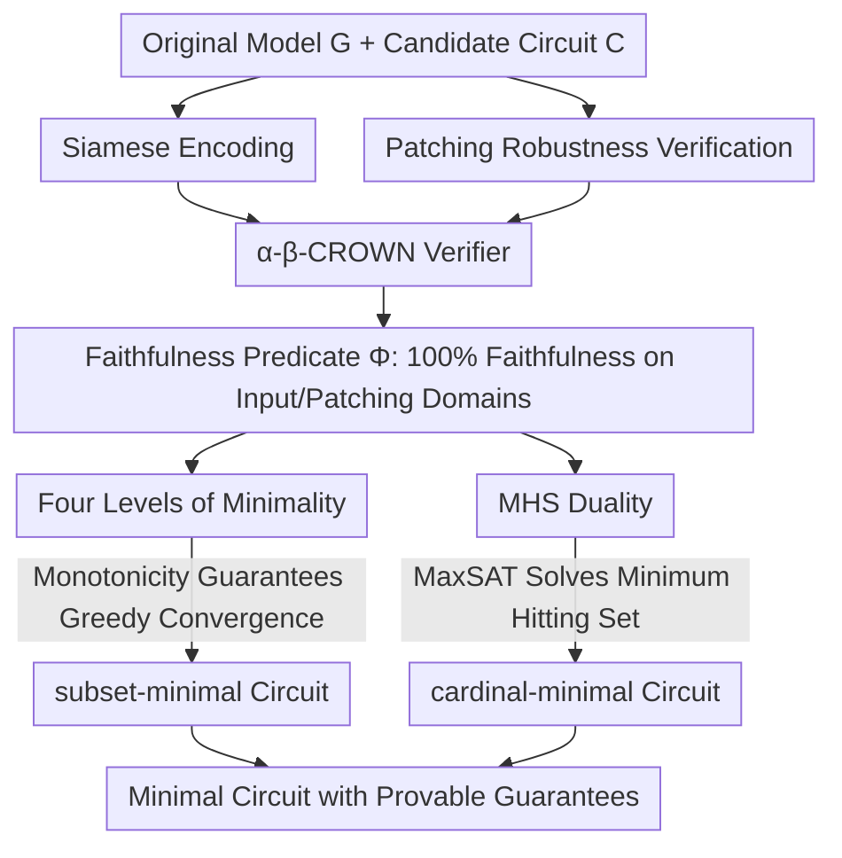

# Formal Mechanistic Interpretability: Automated Circuit Discovery with Provable Guarantees

**Conference**: ICLR 2026  
**arXiv**: [2602.16823](https://arxiv.org/abs/2602.16823)  
**Code**: None  
**Area**: AI Safety / Interpretability  
**Keywords**: Mechanistic Interpretability, Circuit Discovery, Neural Network Verification, Provable Guarantees, Minimality

## TL;DR
This work introduces neural network (NN) verification into mechanistic interpretability, proposing the first circuit discovery framework with provable guarantees. It ensures circuit faithfulness across continuous input domains (input robustness) and continuous patching domains (patching robustness), and formalizes a hierarchy of four minimality levels (quasi → local → subset → cardinal), unifying these guarantees through monotonicity theory.

## Background & Motivation
**Background**: Circuit discovery in mechanistic interpretability (MI) aims to identify subgraphs (circuits) that drive specific model behaviors. Methods like ACDC and edge attribution patching have made progress but rely on heuristics or sampling approximations.

**Limitations of Prior Work**: Evaluating circuit faithfulness via sampling has fundamental flaws—even if a circuit is faithful at all sampled points, small input perturbations can break consistency. This is unacceptable in safety-critical scenarios. Furthermore, the definition of "minimality" is vague; different algorithms achieve different levels of minimality without formal discussion.

**Key Challenge**: Circuit discovery must guarantee faithfulness across continuous domains (rather than discrete points) while keeping the circuit as small as possible (interpretable). Simultaneously, the choice of patching strategies (zero/mean/sampling) introduces inherent uncertainty.

**Goal**: (1) How to guarantee circuit faithfulness across continuous input domains? (2) How to guarantee circuit consistency across continuous patching domains? (3) How to formalize and pursue different levels of minimality?

**Key Insight**: Leveraging tools from the neural network verification field, such as $\alpha$-$\beta$-CROWN, the circuit and the original model are placed in parallel via Siamese encoding to transform circuit faithfulness into verifiable input-output constraints.

**Core Idea**: Replace samplers with neural network verifiers to prove the faithfulness of circuits over continuous domains, and use monotonicity theory to unify input robustness, patching robustness, and minimality guarantees.

## Method

### Overall Architecture
This paper addresses a long-neglected reliability issue in circuit discovery: existing methods (ACDC, edge attribution patching) only verify whether a circuit is faithful to the original model at limited sampled points, which cannot cover continuous domains—a circuit might be correct at every sample point but fail under minor perturbations. The approach integrates circuit discovery into an NN verification framework: first, "circuit faithfulness" is formalized into provable guarantees (faithfulness over continuous input and patching domains); then, Siamese encoding translates these guarantees into input-output constraint queries acceptable by verifiers like $\alpha$-$\beta$-CROWN, yielding a faithfulness predicate $\Phi$ valid over the entire domain. Finally, using $\Phi$ as the criterion, a greedy algorithm (leveraging monotonicity) approximates subset-minimality, while MHS duality is used to find cardinal-minimality, progressively shrinking the circuit. In summary: encode as verification queries → verify continuous domain faithfulness predicate → search for the minimal circuit according to minimality levels.

### Key Designs

**1. Siamese Encoding: Transforming "Circuit Faithfulness" into Verifiably Answerable Questions**

Circuit faithfulness essentially asks whether "for all $z \in \mathcal{Z}$, the circuit output and the original model output are sufficiently close." This is a universal proposition across a continuous domain that sampling cannot resolve. Siamese encoding places the circuit $C$ and the full model $G$ in parallel to form a joint network $G \sqcup C'$ with a shared input layer. Activations of non-circuit components are fixed to patching values $\alpha$, input constraints $\psi_{in}$ restrict $z$ to a neighborhood $\mathcal{Z}$, and output constraints $\psi_{out}$ check if $\|f_C(z|\bar{C}=\alpha) - f_G(z)\|_p \leq \delta$. Thus, "circuit faithfulness" becomes a standard verification query for $\alpha$-$\beta$-CROWN. Once verified, the result is a 100% hard guarantee across the entire domain $\mathcal{Z}$, not just "probabilistic faithfulness" in a sampling sense.

**2. Patching Robustness Verification: Closing the Out-of-Distribution Gap in Zero-Patching**

Verifying input robustness alone is insufficient—circuit faithfulness also depends on the values used to fill ablated components. Fixed values like zero or mean patching are often criticized for being out-of-distribution (OOD) and unrepresentative of real activations. This design ensures that the circuit remains faithful under any "reachable" patching value, rather than just one specific fill value. The Siamese encoding is modified: $G$ and $C'$ receive different inputs, and the non-circuit activations of $C'$ are directly connected to the corresponding activations of $G$ in another neighborhood $\mathcal{Z}'$, incorporating "any reachable patching value" into the verifier's constraints. Consequently, the circuit's faithfulness guarantee is no longer limited by manually selected patching strategies.

**3. Four Levels of Minimality: Defining "Minimal" via Monotonicity and Ensuring Convergence**

Previous algorithms claimed to find "minimal" circuits, but the degree of minimality was never formalized. This paper decomposes minimality into four levels of increasing strength: **quasi-minimal** (removing any one component from a specific set breaks faithfulness), **locally-minimal** (every individual component is necessary), **subset-minimal** (removing any subset of components breaks faithfulness), and **cardinally-minimal** (globally smallest circuit). The key theory connecting these levels is **monotonicity**: when the faithfulness predicate $\Phi$ is monotonic—meaning expanding the circuit does not break faithfulness—the greedy algorithm is guaranteed to converge to a subset-minimal circuit. Proposition 5 further proves that as long as $\mathcal{Z} \subseteq \mathcal{Z}'$ and the activation space is closed, the predicate composed of input + patching robustness automatically satisfies monotonicity. Thus, monotonicity supports two things simultaneously: the convergence of subset-minimality and the composability of the two types of robustness guarantees.

**4. MHS Duality: Approximating the Globally Smallest Circuit with Minimum Hitting Sets**

The strongest level, cardinally-minimal (global minimum), is typically NP-hard and cannot be reached by greedy methods. This design uses a dual relationship to approximate it: Proposition 7 proved that the minimum hitting set (MHS) of all circuit blocking-sets is exactly equal to the cardinally-minimal circuit. Thus, finding the globally minimal circuit is transformed into an MHS problem, which can be solved efficiently using MaxSAT solvers, turning an otherwise unreachable global optimum into a computable target.

## Key Experimental Results

### Input Robustness Comparison

| Dataset | Method | Circuit Size | Robustness | Time (s) |
|--------|------|---------|--------|---------|
| CIFAR-10 | Sampling | 16.5 | **46.5%** | 0.23 |
| | **Provable** | **19.2** | **100%** | 2970 |
| MNIST | Sampling | 12.6 | **19.2%** | 0.31 |
| | **Provable** | **15.8** | **100%** | 612 |
| GTSRB | Sampling | 28.9 | **27.6%** | 0.11 |
| | **Provable** | **29.6** | **100%** | 991 |

### Patching Robustness Comparison

| Dataset | Zero Patching Rob.% | Mean Patching Rob.% | **Provable Rob.%** |
|--------|--------------------|--------------------|-------------------|
| CIFAR-10 | 46.4 | 33.3 | **100** |
| MNIST | 58.0 | 55.7 | **100** |
| TaxiNet | 57.1 | 63.3 | **100** |

### Key Findings
- Sampling methods achieve only 9.5-58% robustness across datasets, while provable methods reach 100%, albeit with 100-10,000x increased computation time.
- Regarding circuit size, provable methods are only slightly larger than sampling (+10-20%), suggesting that robustness guarantees do not require a massive increase in circuit complexity.
- MHS lower bounds never exceed the circuit size and match exactly in some cases, validating the effectiveness of the MHS duality.
- The quasi-minimal algorithm is the fastest but produces the largest circuits, while cardinally-minimal is the slowest but yields the smallest circuits, consistent with theoretical predictions.

## Highlights & Insights
- **First Fusion of NN Verification × MI**: Bridges two rapidly evolving but previously independent fields. Verification tools provide formal guarantees for MI, while MI provides new application scenarios for verification tools.
- **Unified Role of Monotonicity Theory**: A concise property ($\Phi$ is monotonic) simultaneously ensures subset-minimality convergence and the composability of input+patching robustness.
- **Pragmatic Utility of Four Minimality Levels**: Allows researchers to choose the appropriate level of minimality based on computational budgets—from quasi (fastest) to cardinal (strongest)—instead of making vague "minimal" claims.

## Limitations & Future Work
- Scalability limits of NN verification: Current experiments are on vision models (MNIST/CIFAR-10 level) and cannot be directly applied to Transformers/LLMs. The framework can scale automatically as verification tools improve.
- Computational costs are 100-10,000x higher, making it impractical for real-time MI analysis.
- Verification is limited to vision models; circuit discovery in NLP/language models (e.g., IOI circuit) is not yet addressed.
- Minimality guarantees depend on the choice of faithfulness predicate $\Phi$; different $\delta$ thresholds may lead to different results.

## Related Work & Insights
- **vs ACDC (Conmy et al., 2023)**: ACDC uses sampling + KL divergence thresholds for greedy search and serves as the sampling baseline. This work's provable method improves robustness from ~40% to 100% with comparable circuit sizes.
- **vs Adolfi et al. (2025)**: They proposed quasi-minimality as a criterion. This work extends this to a four-level hierarchy and proves stronger guarantees and algorithm convergence.
- **vs AlphaSteer/ASIDE**: These methods manipulate behavior at the activation/embedding level, while this work understands behavior at the circuit level. AlphaSteer's null-space constraints can be viewed as a soft definition of a "circuit."

## Rating
- Novelty: ⭐⭐⭐⭐⭐ First to introduce NN verification into MI; the four-level minimality hierarchy and monotonicity theory are original theoretical contributions.
- Experimental Thoroughness: ⭐⭐⭐⭐ 4 datasets × 3 types of guarantees × multiple algorithm comparisons, though limited to small vision models.
- Writing Quality: ⭐⭐⭐⭐⭐ Rigorous theoretical derivations, clear structure (Definition-Proposition-Algorithm), and intuitive Siamese encoding diagrams.
- Value: ⭐⭐⭐⭐⭐ Establishes a formal foundation for MI and represents a significant theoretical advancement in the field of circuit discovery.

<!-- RELATED:START -->

## Related Papers

- [\[ICML 2026\] Certified Circuits: Stability Guarantees for Mechanistic Circuits](../../ICML2026/interpretability/certified_circuits_stability_guarantees_for_mechanistic_circuits.md)
- [\[ICLR 2026\] Automated Interpretability Metrics Do Not Distinguish Trained and Random Transformers](automated_interpretability_metrics_do_not_distinguish_trained_and_random_transfo.md)
- [\[ICLR 2026\] FAME: Formal Abstract Minimal Explanation for Neural Networks](fame_formal_abstract_minimal_explanation_for_neural_networks.md)
- [\[ACL 2025\] Position-aware Automatic Circuit Discovery](../../ACL2025/interpretability/position-aware_automatic_circuit_discovery.md)
- [\[ICLR 2026\] Small Transformers Don't Need LayerNorm at Inference Time: Scaling LayerNorm Removal to GPT-2 XL and Implications for Mechanistic Interpretability](small_transformers_dont_need_layernorm_at_inference_time_scaling_layernorm_remov.md)

<!-- RELATED:END -->
