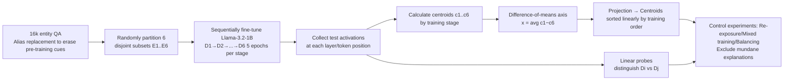

# Fresh in Memory: Training-order Recency is Linearly Encoded in Language Model Activations

**Conference**: ICLR 2026  
**OpenReview**: [https://openreview.net/forum?id=Tn6famjSxN](https://openreview.net/forum?id=Tn6famjSxN)  
**Code**: TBD  
**Area**: Interpretability / Internal Model Mechanisms  
**Keywords**: Training order, Linear probe, Activation direction, Temporal encoding, Knowledge recency, Sequential fine-tuning  

## TL;DR
By sequentially fine-tuning Llama-3.2-1B on six disjoint entity datasets, the authors discovered a **linear direction in the language model's activation space that sorts the centroids of data from different stages according to their training order**. This suggests that models implicitly "timestamp" learned information. This temporal signal can be extracted by linear probes (>90% accuracy in distinguishing early vs. late entities), explicitly reported by the model itself (~80% accuracy), and remains resilient even after 30 epochs of shuffled mixed-data training.

## Background & Motivation
**Background**: Interpretability research has identified that LLM activations linearly encode various semantic attributes (sentiment, truthfulness, refusal tendency, etc.). Recently, Ferrando et al. (2024) identified a binary knowledge detection direction for "seen vs. unseen during training." However, a more granular question remained unanswered: Does the model distinguish **when** a piece of knowledge was acquired?

**Limitations of Prior Work**: Training-based "belief editing" techniques assume that newly injected knowledge overrides the old. If models internally perceive the acquisition time of information and handle conflicting data accordingly, the behavior of these editing techniques needs re-evaluation. However, direct evidence for "temporal encoding of training order" was previously lacking, primarily because the chronological order of real-world pre-training data is difficult to control, preventing clean causal experiments.

**Key Challenge**: To prove that "training order is encoded," one must exclude numerous mundane explanations. For instance, is it simply that recent data has larger activation magnitudes? Lower loss? Higher model confidence? If these statistics alone explain the success of a probe, "temporal encoding" would be a trivial byproduct.

**Goal**: Construct an experimental environment where the training order is **known and controllable**, test for a linear training-order direction in activations, and strictly rule out simple statistical explanations like magnitude or confidence.

**Core Idea**: **[Controlled Sequential Fine-tuning + Difference-of-Means Direction]** 16,000 entities are randomly divided into six disjoint subsets. Random aliases (e.g., `sjdhf`) are used to erase pre-training cues, followed by sequential fine-tuning across six stages. Activation centroids are then calculated based on the stage in which an entity was learned to determine if a linear direction neatly sorts these six centroids.

## Method

### Overall Architecture
The methodology consists of an experimental paradigm: "Creating a known training order → Locating the temporal direction in activations → Systematically ruling out mundane explanations." First, alias replacement and sequential fine-tuning transform training chronology into a controllable ground truth. Next, a candidate temporal axis is constructed using the difference-of-means to project activation centroids, and linear probes provide quantitative verification of separability. Finally, a series of control experiments—including re-exposure, mixed training, and distribution balancing—confirm that this direction encodes "exposure recency" rather than activation magnitude or confidence.

### Key Designs

**1. Controlled data with alias replacement and position alignment transforms "training order" into a clean independent variable**: The primary design challenge is ensuring that "training chronology" is the sole variable and is not contaminated by the entities' pre-existing knowledge. The authors replaced each celebrity entity with a unique random alias—synthetic versions use three-token strings like `sjdhf`, while natural versions use five-token phrases like `prickly cyan mouse`. This ensures the model acquires information about these aliases solely during fine-tuning. Crucially, because all aliases have the same token count, all test samples are **token-aligned**, allowing activations to be collected by `(layer, token)` without positional noise. Partitioning is reshuffled for each random seed to ensure signals track the "training stage" rather than entity-specific traits.

**2. Difference-of-means temporal axis: Constructing a linear direction aligned with training order using $c_1 - c_6$**: For a given `(layer, token)`, test activations are averaged by stage to obtain six centroids $c_1, \dots, c_6$. The training order axis is defined by the average $(c_1 - c_6)$ vector across multiple runs and prompts. When the six centroids are projected onto this axis, they **align almost perfectly in a line according to the training order $D_1 \to D_6$**. This alignment is consistent across independent runs with different seeds and data styles, showing it is a robust direction rather than a fluke of a specific fine-tuning instance. Notably, the result is robust to axis selection: using $c_2 - c_5$ or even $c_5 - c_6$ as the axis still correctly sorts the centroids. The fact that $c_5 - c_6$ can recover the order of earlier stages hints at the possibility of reverse-engineering pre-training data order if fine-tuning access is available.

**3. Generalizable linear probes: Verifying the readability of temporal directions on held-out entities**: Linear sorting of centroids only suggests "average separability." To check if full distributions overlap, the authors trained logistic regression probes to distinguish between stages. Critically, the training and evaluation entities for the probes were **disjoint** (80:20 split), forcing the probe to learn a general pattern rather than memorizing specific entities. Results showed >90% accuracy in distinguishing the earliest vs. latest stages ($D_1$ vs. $D_6$). Accuracy increased with the temporal distance between stages, and recent stages were easier to distinguish (e.g., $D_5$ vs. $D_6$ was easier than $D_1$ vs. $D_2$). The signal was strongest at the final token of the alias and the token before the answer, specifically between layers 8–16.

**4. Re-exposure and mixed training: Interpreting the direction as "exposure recency" and testing its persistence**: To determine if the direction encodes "first exposure" or "most recent exposure," a dataset from an early stage was re-trained as a 7th stage. The centroid for that dataset immediately shifted to the "most recent" end, proving the axis predominantly reflects the **time of the last exposure**. Training volume also influenced position; training for 15 epochs instead of 5 pushed centroids further toward the "recent" end. Surprisingly, in robustness experiments where models were trained for an additional 30 epochs on a mixed, shuffled dataset of $D_1 \cup \dots \cup D_6$, the centroids maintained their original order. The $D_1$ vs. $D_6$ probe accuracy only dropped from >90% to ~63% (synthetic) / ~60% (natural), remaining significantly above the 50% chance level. The authors hypothesize that gradient descent lacks the incentive to erase distinctions that do not interfere with the training objective.

**5. Systematically excluding mundane explanations: Joint distribution balancing**: This is the most rigorous control in the paper. Addressing concerns that the "temporal direction" is a proxy for activation magnitude or confidence, the authors selected three groups of statistics: six activation stats (L2 norm, max, mean, std, skewness, kurtosis), seven logit stats (entropy, max logit, logsumexp, 4th moment), and multi-token stats. They performed **joint distribution balancing**: samples were binned in a $k$-dimensional statistical space, and downsampled so that $D_1$ and $D_2$ samples appeared in equal numbers in every bin (controlling not just individual stats but their interactions). If the signal were derived from these stats, probe accuracy on the balanced subset should drop to 50%. However, accuracy remained close to the random downsampling baseline and far above 50%, with only minor impacts on 2 out of 10 late-stage tokens. Combined with cases where samples at token position 12 had identical magnitude distributions yet retained ~70% accuracy, this confirms the temporal direction is a **subtle direction approximately orthogonal to the primary modes of variation**.

## Key Experimental Results

### Main Results: Probing for Training Stages (layer 13/16, final token)

| Comparison | Accuracy | Notes |
|------------|----------|-------|
| $D_1$ vs. $D_6$ (Earliest vs. Latest) | **>90%** | Max temporal distance, easiest to distinguish |
| $D_5$ vs. $D_6$ (Adjacent recent) | ~70% | Recent adjacent stages remain separable |
| $D_1$ vs. $D_2$ (Adjacent distant) | Slightly above chance | Distant adjacent stages are hardest to distinguish |
| Model explicitly reports stage ($D_1$ vs. $D_2$) | **79.8%** | On held-out aliases; proves info is accessible to the model |

Accuracy on **held-out entities** proves the model learns a general temporal pattern rather than memorizing entities.

### Ablation Study: Robustness to Mixed Training

| Setting | Result |
|---------|--------|
| Multi-stage Mixed Training (30 epochs, Synthetic) | $D_1$ vs. $D_6$ accuracy 90%+ → **~63%** (still well above chance) |
| Multi-stage Mixed Training (30 epochs, Natural) | 80% → ~60% |
| 1-epoch per stage (No data repetition, same total tokens) | Probe performance **identical** to the 5-epoch setting |
| Optimizer: Lion / Adafactor | Strongest signal |
| Optimizer: AdamW / RMSprop | Comparable strength after more training rounds |
| Optimizer: Vanilla SGD | Signal largely disappears (no generalization across prompts/runs) |

### Key Findings
- **Generalization across models**: Findings were replicated on Qwen2.5 (0.5B/1.5B/3B), and Llama-3.1-8B/Qwen2.5-32B using LoRA, proving the effect is not an artifact of full-parameter fine-tuning or small models.
- **The "seen vs. unseen" axis also sorts training order**: The binary knowledge detection direction from Ferrando et al. (2024) can recover the full training sequence, suggesting a shared underlying mechanism (likely related to "confidence" encoding).
- **Entity-level vs. Datapoint-level recency**: Entity-level signals are stubborn (surviving mixed training), whereas signals for specific training samples are fragile (disappearing after mixed training).
- **Vanilla SGD as an outlier**: While momentum and second-moment scaling aren't strictly necessary for other optimizers, vanilla SGD consistently fails to produce these encodings for reasons currently unknown.

## Highlights & Insights
- **Clean Causal Design**: By using alias replacement and random stage partitioning, the authors turned "training order" into a fully controllable independent variable. This is the foundation for the strong conclusion that training order is linearly encoded.
- **Rigorous Exclusion of Mundane Explanations**: The combination of joint distribution balancing, counter-examples with identical magnitudes, and the lack of separation in the top PCA components effectively shuts down the argument that this is merely a proxy for confidence or magnitude.
- **Cognitive Safety and "Playing the Training Game"**: An ~80% accuracy in explicit self-reporting suggests that if distinguishing training stages helps the model minimize loss, it might spontaneously learn to utilize this latent variable for strategic behavior during training—a significant implication for alignment and trustworthiness.
- **Persistence of Signals**: The discovery that 30 epochs of shuffled training cannot erase the signal reveals a "laziness" in gradient descent (not deleting harmless distinctions), offering insights into catastrophic forgetting and the durability of knowledge editing.

## Limitations & Future Work
- **Precision of Direction Semantics**: The authors acknowledge that "exposure recency" conflicts slightly with the persistence observed in mixed training. Alternative explanations like "average training time" are also not fully supported, leaving the exact mechanism for future work.
- **Scale and Data Restrictions**: Experiments focused on 1B-scale models and synthetic QA. While 32B LoRA runs were performed, there is still a gap between this and the scale/temporal complexity of real-world web pre-training data. Reversing the order of real pre-training data remains unverified.
- **Failure of SGD**: The absence of encoding when using vanilla SGD is noted but lacks a mechanistic explanation, potentially pointing to misunderstood dynamics in encoding formation.
- **Datapoint-level Fragility**: The observation that entity-level signals are robust while sample-level signals are fragile remains an observation without a deep mechanistic theory.

## Related Work & Insights
- **Linear Representation Hypothesis / Probing**: Extends the work on difference-of-means steering (Panickssery et al. 2023) and semantic encoding into the new dimension of **temporality**.
- **Binary Knowledge Detection** (Ferrando et al. 2024): This paper shows that "seen vs. unseen" directions are likely projections of the same mechanism that tracks training order, unifying these research lines.
- **Knowledge Editing**: Provides critical context for techniques like training-based belief editing (Wang et al. 2025). If models perceive when knowledge was acquired, they may handle conflicts differently than previously assumed.
- **Continuous Learning**: The persistence results shed light on catastrophic forgetting, suggesting that gradient descent does not actively remove distinctions that are "harmless" to the current objective.

## Rating
- **Novelty**: ⭐⭐⭐⭐⭐ First direct evidence that training order is linearly encoded in LLM activations, introducing "temporal timestamps" to interpretability.
- **Experimental Thoroughness**: ⭐⭐⭐⭐⭐ Replicated across model families (Llama, Qwen), fine-tuning methods (Full, LoRA), and various data styles. The use of joint distribution balancing is exceptionally rigorous.
- **Writing Quality**: ⭐⭐⭐⭐ Logic is progressive and honest about conflicting interpretations. Very high information density in charts.
- **Value**: ⭐⭐⭐⭐ Significant implications for knowledge editing, alignment safety, and understanding the dynamics of neural network training.

<!-- RELATED:START -->

## Related Papers

- [\[ICLR 2026\] Hidden Breakthroughs in Language Model Training](hidden_breakthroughs_in_language_model_training.md)
- [\[ICLR 2026\] Evolution of Concepts in Language Model Pre-Training](evolution_of_concepts_in_language_model_pre-training.md)
- [\[ICLR 2026\] REAL: Reading Out Transformer Activations for Precise Localization in Language Model Steering](real_reading_out_transformer_activations_for_precise_localization_in_language_mo.md)
- [\[NeurIPS 2025\] Steering Information Utility in Key-Value Memory for Language Model Post-Training](../../NeurIPS2025/interpretability/steering_information_utility_in_key-value_memory_for_language_model_post-trainin.md)
- [\[ICLR 2026\] LatentQA: Teaching LLMs to Decode Activations Into Natural Language](latentqa_teaching_llms_to_decode_activations_into_natural_language.md)

<!-- RELATED:END -->
