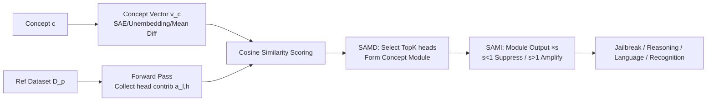

# From Concepts to Components: Concept-Agnostic Attention Module Discovery in Transformers

**Conference**: ICLR 2026  
**OpenReview**: [https://openreview.net/forum?id=Va2tLzb1NX](https://openreview.net/forum?id=Va2tLzb1NX)  
**Code**: [facebookresearch/Concept-Agnostic-Attention-Module-Discovery-in-Transformers](https://github.com/facebookresearch/Concept-Agnostic-Attention-Module-Discovery-in-Transformers)  
**Area**: Mechanistic Interpretability / Model Attribution  
**Keywords**: attention head attribution, concept localization, residual stream, scalar intervention, jailbreak, multilingualism  

## TL;DR
By abstracting any complex "concept" into a vector and using its cosine similarity with the output of each attention head to identify TopK heads as a "concept module," the authors demonstrate that scaling the output intensity of these modules with a single scalar can localize and amplify/suppress concepts like safety, reasoning, multilingualism, and image recognition in language and vision Transformers.

## Background & Motivation
**Background**: Attribution in interpretability research aims to localize specific model behaviors to concrete components. Current mainstream approaches focus on **MLP neurons**, as established work suggests MLPs store facts like a "memory" (Geva et al. 2021), leading researchers to investigate where knowledge resides within them.

**Limitations of Prior Work**: The authors identify three long-neglected gaps. First, **attention mechanisms are overlooked**—multi-head self-attention is the defining feature of Transformers but is rarely included in attribution analysis. Second, **concepts are too simplistic**—existing research handles low-complexity concepts like numeracy, syntax, or factual associations ("Paris is in France"), but struggles with abstract concepts like "reasoning" or "safety." Third, **lack of a universal pipeline**—previous methods rely on manual inspection of circuits, lacking a concept-agnostic pipeline applicable to diverse concepts.

**Key Challenge**: Researchers aim to analyze attention across arbitrarily complex concepts; however, "concepts" themselves are difficult to represent uniformly, and the sheer number of attention heads (dozens of layers × multiple heads) makes manual inspection impossible.

**Goal**: To provide an attention head attribution and intervention pipeline that scales to **any Transformer and any concept**.

**Key Insight**: **In the residual stream perspective, every attention head adds a linear contribution.** Thus, determining which heads are responsible for a concept is equivalent to finding which heads' contribution vectors most closely align with the concept vector. Attribution is simplified to a cosine similarity ranking during a single forward pass, and intervention is simplified to scaling the output of these heads by a scalar.

## Method

### Overall Architecture
The method consists of two steps: **SAMD (Scalable Attention Module Discovery)** identifies the attention module corresponding to a concept, and **SAMI (Scalar Attention Module Intervention)** controls the intensity of that module. The prerequisite is representing a concept as a vector $v_c$ (derived from SAE decoder vectors, rows of the ViT unembedding matrix, or the mean difference of positive/negative datasets). Following the **residual stream decomposition** of Elhage et al. (2021), each attention block is decomposed into independent contributions from individual heads, allowing the calculation of "head-to-concept" alignment.

### Key Designs

**1. Residual Stream Decomposition: Breaking blocks into the "head" granularity for additive contributions.** The residual stream in Transformers linearly accumulates contributions: $r_l = r_{l-1} + \sum_{h=1}^{H} a_{l,h} + m_l$, where $a_{l,h}$ is the contribution of the $h$-th head in layer $l$, and $m_l$ is the MLP contribution. The authors explicitly decompose multi-head self-attention into $H$ individual head contributions $a_{l,h}$. This step is the foundation of the method, enabling the comparison, localization, and independent intervention of single heads.

**2. SAMD: Scoring heads via cosine similarity to define the module.** For a concept $c$, the average cosine similarity between each head's contribution and the concept vector is calculated over a reference dataset $D_p$. The TopK heads are selected to form the module:

$$\text{module} = \arg\text{TopK}_{(l,h)} \; \frac{1}{|D_p|} \sum_{p \in D_p} \cos\angle\big(a_{l,h}(p),\, v_c\big).$$

The assumption is that higher cosine similarity equates to higher semantic similarity. This design is **minimalist and concept-agnostic**: it requires only one forward pass per input to retrieve all head contributions without gradients or manual circuit inspection. Heatmaps show a clear gap between TopK values and other heads, so $K$ is typically set to 3–10 (e.g., 5 for SAE concepts, 10 for safety), confirming that "knowledge is sparsely encoded in a few heads."

**3. SAMI: Scalar scaling of module outputs for concept amplification or suppression.** Once a module is identified, intervention involves multiplying the contributions of heads within the module by a scalar $s$, leaving other heads unchanged:

$$r_l = r_{l-1} + \sum_{h:\,a_{l,h}\notin\text{module}} a_{l,h} + \sum_{h:\,a_{l,h}\in\text{module}} s\,a_{l,h} + m_l.$$

$s>1$ provides positive intervention (amplifying the concept), while $s<1$ (including negative values) provides negative intervention (suppressing/reversing the concept). This is **equivalent to scaling the corresponding columns of the attention output projection matrix by $s$**. It requires no pre-computation, involves no significant weight changes, and touches only ~0.1% of parameters.

## Key Experimental Results

Experiments span four domains: SAE features, reasoning, safety alignment, and visual recognition, using models like GEMMA, LLAMA, QWEN, and ViT-B/32.

### Main Results

**Jailbreaking (HarmBench ASR, negative intervention on safety module)**:

| Defender | DR | GCG | ORTHO | Safety Module (Ours) |
|---|---|---|---|---|
| LLAMA-2 7B | 0.0 | 34.5 | 22.6 | **71.1** |
| QWEN 7B | 7.0 | 79.5 | 79.2 | 78.0 |
| GEMMA 7B | 8.2 | 53.5 | 73.0 | **84.3** |

Relative to DR on LLAMA-2, this is a **+72.7%** improvement. It outperforms white-box optimized GCG and the vector-based ORTHO method while being prompt-agnostic and computationally efficient.

**Reasoning (GSM8K, positive intervention on reasoning module)**:

| Model | Baseline | CoT Module (Ours) |
|---|---|---|
| LLAMA3.1-8B-Inst | 84.61 | 85.44 |
| GEMMA-7B-Base | 54.36 | 56.71 |

GSM8K performance improves by approximately **+1.6%** (GEMMA) and generalizes to OOD tasks like MATH (40.58 vs 39.78).

**Multilingualism (FQuAD, 3188 French questions, negative intervention on multilingual module)**: The French response rate dropped from 85.35% to **1.66%**, outperforming the best SAE steering result (3.98%) without requiring extensive searches for intervention coefficients.

**Vision (ViT-B/32 + ImageNet)**: Negative intervention on a specific target label module reduces accuracy for that label to **0%**, while other labels remain largely unaffected.

### Ablation Study / Side Effects

| Check Item | LLAMA3.1-8B / GEMMA-7B Change |
|---|---|
| Commonsense QA | -0.08% / +0.41% |
| HumanEval+ | +0.6% / +0.0% |
| MBPP+ | -1.8% / +1.0% |
| MT-bench (LLAMA) | -0.07 |

Amplifying reasoning modules **hardly damages** general knowledge, coding, or conversational abilities, indicating highly precise localization and localized intervention.

### Key Findings
- **Sparsity**: Various concepts can be localized using only 3–10 heads, suggesting knowledge is sparsely encoded.
- **Support for "Surface-Level Alignment Hypothesis"**: Module locations remain **unchanged** before and after post-training, suggesting conceptual knowledge is primarily acquired during pre-training.
- **Multilingual Mechanism**: Multilingual modules are concentrated in late layers (layers 15–26), supporting the theory that "LLMs think in English and translate in later layers." French and Spanish concepts reside in **identical** modules, and results generalize to Chinese, German, and Arabic.
- **Positive Intervention → Concept Echoing**: Amplifying the "safety" module leads to repetitive outputs like "safety/saf/cert," suggesting a spurious correlation between abstract safety and the literal word "safety."

## Highlights & Insights
- **Unified and Concept-Agnostic**: The first general algorithm for attention head attribution across "arbitrarily complex concepts + large Transformers," with zero-shot transfer across vision/language and different models.
- **Extreme Simplicity**: Attribution requires one forward pass and cosine ranking; intervention requires one scalar. Yet, it achieves success in jailbreaking, reasoning enhancement, language control, and recognition disabling.
- **Intervention as Weight Modification**: SAMI is equivalent to scaling columns of the output projection matrix, affecting only ~0.1% of weights with minimal deployment cost.
- **Mechanistic Research Tool**: The stability of module locations provides quantitative evidence for hypotheses like "surface-level alignment" and "late-layer translation," moving interpretability from "explaining single inputs" to "localizing conceptual components."

## Limitations & Future Work
- **Monosemanticity Issues**: Negative intervention on "San Francisco" causes untruthful answers (e.g., claiming NYC is in California), likely due to feature splitting or polysemy in SAEs.
- **Concept Vector Ceiling**: The method relies heavily on the quality of $v_c$; high-quality, interpretable SAE feature sets are currently scarce.
- **Empirical Selection of TopK and $s$**: $K$ is determined by heatmap gaps and $s$ via grid search; automated selection criteria are lacking.
- **Double-Edged Sword of Jailbreaking**: Improving jailbreak success by modifying only 0.1% of weights highlights the vulnerability of attention-level safety mechanisms.
- **Outlook**: Combining module discovery with more monosemantic feature dictionaries and automating $K/s$ selection.

## Related Work & Insights
- **MLP Attribution (ROME/MEMIT, Meng et al.)**: This work takes the opposite path, proving attention heads are effective carriers for knowledge localization, filling a gap in a field biased toward MLPs.
- **Residual Stream / Logit Lens (Elhage et al. 2021)**: The idea of comparing partial residual streams with concept vectors directly stems from these foundational works.
- **Vector Steering (Arditi et al. 2024)**: SAMI uses scalar scaling instead of static pre-computed vectors, proving stronger in jailbreaking and being prompt-agnostic.
- **Multilingual Mechanisms / Surface-Level Alignment**: Provides new quantifiable evidence for late-layer translation mechanisms and the pre-training origin of knowledge.

## Rating
- **Novelty**: ⭐⭐⭐⭐⭐ A simple, universal pipeline for "Concept → Vector → TopK Heads → Scalar Intervention."
- **Experimental Thoroughness**: ⭐⭐⭐⭐ Validated across four domains and multiple modalities, though it lacks extensive quantitative comparison with alternative attribution baselines.
- **Writing Quality**: ⭐⭐⭐⭐ Logical progression from residual streams to SAMI is clear and well-illustrated.
- **Value**: ⭐⭐⭐⭐⭐ A practical tool for control (reasoning, language) and a significant contribution to AI safety by revealing attention-level vulnerabilities.

<!-- RELATED:START -->

## Related Papers

- [\[ICLR 2026\] Decoupling Positional and Symbolic Attention in Transformers](decoupling_positional_and_symbolic_attention_in_transformers.md)
- [\[ICLR 2026\] Concept-TRAK: Understanding how diffusion models learn concepts through concept attribution](concept-trak_understanding_how_diffusion_models_learn_concepts_through_concept_a.md)
- [\[ACL 2025\] Separating Tongue from Thought: Activation Patching Reveals Language-Agnostic Concept Representations in Transformers](../../ACL2025/interpretability/separating_tongue_from_thought_activation_patching_reveals_language-agnostic_con.md)
- [\[ICLR 2026\] Concepts' Information Bottleneck Models](concepts_information_bottleneck_models.md)
- [\[ICLR 2026\] Adaptive Concept Discovery for Interpretable Few-Shot Text Classification](adaptive_concept_discovery_for_interpretable_few-shot_text_classification.md)

<!-- RELATED:END -->
