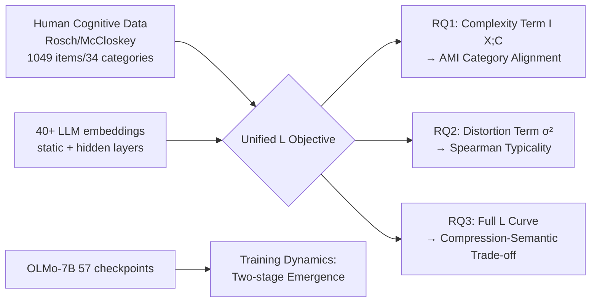

# From Tokens to Thoughts: How LLMs and Humans Trade Compression for Meaning

**Conference**: ICLR 2026  
**OpenReview**: [https://openreview.net/forum?id=rkthPeHvAX](https://openreview.net/forum?id=rkthPeHvAX)  
**Code**: TBD (Authors have released the digitalized cognitive science datasets)  
**Area**: interpretability and explainable AI  
**Keywords**: Information Bottleneck, Rate-Distortion Theory, Conceptual Representation, Cognitive Science Alignment, Compression-Semantic Trade-off, LLM embedding analysis  

## TL;DR
Using an Information Bottleneck/Rate-Distortion framework to measure embeddings from 40+ LLMs and classic human taxonomic cognitive data on a unified "compression ↔ semantics" scale, this work reveals that LLMs achieve more "information-theoretically optimal" aggressive compression than humans, but at the cost of fine-grained semantics (typicality structures). The seemingly "inefficient" human conceptual organization instead serves as a source of adaptive flexibility.

## Background & Motivation
**Background**: Humans organize knowledge into compact conceptual categories—a "bird" compresses information from thousands of species while retaining key semantics (flying, feathers, egg-laying) and forming hierarchies like robin → bird → animal. This represents an exquisite balance between efficiency and semantic fidelity. While LLMs demonstrate striking linguistic capabilities and seem to "understand" concepts, whether they weigh "compression vs. semantics" similarly to humans remains without a quantitative answer.

**Limitations of Prior Work**: Two research trajectories have long remained separated. On one side is LLM conceptual analysis (relational knowledge, interpretable concept extraction, sparse activation, embedding geometry), which lacks rigorous information-theoretic quantification of the "compression-semantic trade-off" against rich human cognitive benchmarks. On the other side is cognitive science applying information theory to human concept learning (e.g., the IB framework for color naming), which is rarely applied to modern LLMs and often restricted to single domains. Furthermore, modern evaluations rely heavily on noisy crowdsourced data, lacking expert-level high-quality human category benchmarks.

**Key Challenge**: Is "statistically optimal compression" equivalent to "understanding"? If LLMs compress more aggressively and optimally in an information-theoretic sense but discard the "inefficient" semantic redundancies found in human concepts, they may be performing surface-level imitation rather than true understanding.

**Goal**: To answer three questions within a unified information-theoretic framework: RQ1, whether emergent LLM concepts align with human category boundaries; RQ2, whether LLMs possess human-like "typicality" structures (e.g., a robin being more "bird-like" than a penguin); and RQ3, how both trade off compression ↔ semantic fidelity.

**Key Insight**: **Unified Framework** = Adapting Rate-Distortion Theory (RDT) and Information Bottleneck (IB) into an objective $\mathcal{L}$ that does not require an external relevant variable $Y$, characterizing both "complexity (compression) + $\beta$ · distortion (semantic dispersion)." **Data Contribution** = Digitalizing three foundational cognitive science datasets (Rosch 1973/1975, McCloskey & Glucksberg 1978) to synthesize a machine-readable benchmark of 1,049 items across 34 categories.

## Method

### Overall Architecture
The paper utilizes a unified metric to compare human categories with the embedding clusters of 40+ LLMs. A "conceptual system" is viewed as a lossy compression $C$ (clustering) of items $X$, measuring both how much information is compressed (complexity) and how much semantic consistency is retained (distortion). The three research questions are answered by different parts of the framework: the complexity term addresses RQ1 (alignment), the distortion term addresses RQ2 (internal structure), and the complete $\mathcal{L}$ objective addresses RQ3 (trade-off). Additionally, training dynamics are traced using 57 checkpoints of OLMo-7B.

### Key Designs

**1. Fusing RDT and IB into an unsupervised $\mathcal{L}$ objective**: The challenge lies in defining relevance without an external $Y$. Standard IB compresses $X$ to $Z$ while retaining information about $Y$ via $\min I(X;Z) - \beta I(Z;Y)$, but no ready-made $Y$ exists for conceptual representations. The authors internalize "relevance" as "intra-cluster semantic consistency"—requiring categories to maintain internal similarity. This merges RDT’s geometric distortion and IB’s information-theoretic compression:

$$\mathcal{L}(X, C; \beta) = \underbrace{I(X; C)}_{\text{Complexity: bits required}} + \beta \cdot \underbrace{\frac{1}{|X|}\sum_{c \in C}\sum_{e_i \in c}\|e_i - \bar{e}_c\|^2}_{\text{Distortion: semantic dispersion}}$$

$\beta$ regulates the relative importance of compression versus consistency. This objective requires no labels and allows for an apples-to-apples comparison between human categories and LLM clusters.

**2. Measuring "how much is compressed" via Complexity**: Complexity is defined as $I(X;C)$. The intuition is: if knowing which cluster an item belongs to tells you almost nothing about which specific item it is, the compression is aggressive (low complexity). Given $|X|$ items partitioned into clusters of sizes $\{|C_c|\}$:

$$\text{Complexity}(X, C) = I(X; C) = \log_2 |X| - \frac{1}{|X|}\sum_{c \in C} |C_c| \log_2 |C_c|$$

This quantifies the reduction in uncertainty about an item's identity given its cluster. Uniform large clusters minimize complexity (maximum compression), while singleton clusters maximize it (no compression). This directly addresses RQ1 by comparing $I(X; C_{\text{Human}})$ and $I(X; C_{\text{LLM}})$.

**3. Measuring "semantic preservation" via Distortion**: Distortion measures whether a cluster keeps semantically similar items close, calculated as the average squared distance from items to their cluster centroids:

$$\text{Distortion}(X, C) = \frac{1}{|X|}\sum_{c \in C} |C_c| \cdot \sigma_c^2, \quad \sigma_c^2 = \frac{1}{|C_c|}\sum_{e_i \in c}\|e_i - \bar{e}_c\|^2$$

Low distortion means items like "robin" and "sparrow" are tightly grouped, while "bat" is not forced in. This serves RQ2; the authors further test whether "typical items are closer to the centroid while atypical ones are peripheral," a hallmark of human prototype organization.

**4. Two-level embedding extraction + layer scanning**: To control for human judgment of isolated words, two types of representations are extracted: (i) input-layer static embeddings (matrix E) and (ii) contextual embeddings from hidden layers (controlled prompts). AMI is calculated per layer, with the peak layer used for RQ1 and RQ2. This reveals that the "layer best for category partitioning" and the "layer best for intra-group structure" are often distinct—suggesting that the architecture encodes different semantics at different depths.

## Key Experimental Results

### Main Results (RQ1/RQ2, static embeddings vs. human categories)

| Dimension | Metric | Key Result |
|------|------|----------|
| RQ1 Category Alignment | AMI | All 40+ models significantly higher than random; static mean ≈0.45, contextual peak ≈0.55 |
| RQ1 Arch vs. Scale | AMI | **BERT-large (340M) AMI=0.60**, matching or exceeding decoder models 100× larger; Word2Vec/GloVe perform near modern LLM peaks |
| RQ2 Typicality | Spearman ρ | Most decoders ρ<0.15; **BERT ρ=0.38** (p<0.05); representational models ρ≈0.25–0.40 |

### Ablation Study (RQ3 Trade-off / Training Dynamics)

| Phenomenon | Data |
|------|------|
| Higher Human Cluster Entropy | Human categories have significantly higher entropy than LLMs at the same K (statistically less compact, more internally diverse) |
| Lower LLM $\mathcal{L}$ | LLM clusters have lower $\mathcal{L}$ than human categories across all K (more "information-theoretically optimal") |
| Encoder Superiority | Encoders (BERT/ViT/static) show lower distortion for a given complexity than decoders |
| Compression ≠ Ability | $\mathcal{L}$ shows zero correlation with MMLU downstream performance (r=−0.20, p=0.51) |
| Two-stage Training | OLMo-7B: ①1K–100K steps: rapid category formation (80% alignment reached at 10% training); ②100K–500K steps: architectural reorganization (semantic processing shifts from layer 29 to layer 23) |

### Key Findings
- **Capturing boundaries, missing internals**: LLMs align well with category boundaries (compression) but fail to capture typicality (internal semantic structure)—marking a fundamental divergence in representation strategies.
- **Architecture > Scale**: Encoders and representational models outperform decoders 100× their size in human alignment, suggesting "understanding" and "generation" may rely on different mechanisms.
- **Mutual exclusivity of optimal layers**: The layer best for category partitioning (RQ1) is often the worst for intra-group structure (RQ2), indicating depth-dependent semantic encoding.
- **Statistical optimality ≠ Understanding**: The zero correlation between $\mathcal{L}$ and downstream ability suggests that the "inefficiency" of human concepts serves cognitive flexibility rather than being a defect.

## Highlights & Insights
- **Digitalization of classic cognitive data**: The conversion of Rosch (1973/1975) and McCloskey & Glucksberg (1978) expert-level ratings into machine-readable benchmarks (1,049 items / 34 categories) is a lasting contribution, offering higher quality than crowdsourced data.
- **Unified unsupervised objective**: Complexity, distortion, and $\mathcal{L}$ provide a clean mapping to RQ1, RQ2, and RQ3, respectively.
- **"Inefficiency as Intelligence"**: Reinterpreting the statistical sub-optimality of human concepts as an optimization for adaptation, generalization, and causal reasoning provides a falsifiable information-theoretic characterization of "understanding."
- **Two-stage training dynamics**: Multiple independent metrics (AMI, attention sparsity, effective rank, $\mathcal{L}$) converge to show "fast formation followed by slow reorganization."

## Limitations & Future Work
- **Dependency on open-source embeddings**: The analysis requires access to hidden states; frontier closed-source models like GPT-5 or Claude cannot be included.
- **Prototype theory bias**: The typicality framework is based on prototype theory; alternative accounts (e.g., exemplar theory) might yield different interpretations.
- **English-centric categories**: The items are concentrated in common daily semantic categories in English; generalizability to cross-linguistic or abstract concepts is unverified.
- **Normative ambiguity of $\mathcal{L}$**: Whether a lower $\mathcal{L}$ is "better" depends on the objective. As it does not correlate with downstream capability, it serves as a diagnostic tool rather than an optimization target.
- **Future Work**: Encourages the design of models that retain "beneficial redundancy" and suggests using this framework to monitor the "compression ↔ semantics" balance during training.

## Related Work & Insights
- **Information Bottleneck / Rate-Distortion**: Tishby et al.'s IB and Shannon's RDT provide the skeleton; Zaslavsky et al.'s application of IB to human color naming and animal taxonomy are cognitive precedents.
- **LLM Conceptual Geometry**: Complements studies on hierarchical representation (Park et al.), sparse activation (Li et al.), and interpretable concept extraction by measuring global trade-offs rather than individual structures.
- **Human-AI Abstraction Transfer**: Unlike behavioral modeling (e.g., Wu et al., 2025), this work directly quantifies information retention and distortion within the LLM embedding space under controlled clustering.
- **Insights**: ① The distinction between understanding and generation mechanisms provides cognitive evidence for encoder resurgence or hybrid architectures; ② $\mathcal{L}$ can monitor representation quality during training; ③ Digitalizing classic cognitive benchmarks is a viable path for leveraging historical psychological data.

## Rating
- **Novelty**: ⭐⭐⭐⭐⭐ First rigorous intersection of classic cognitive data, the IB framework, and 40+ LLM representation analyses; "inefficiency as intelligence" is a counter-intuitive, falsifiable insight.
- **Experimental Thoroughness**: ⭐⭐⭐⭐ Covers 40+ models across architectures and scales, plus human benchmarks and training dynamics; slight deduction for the exclusion of closed-source models and English-centric data.
- **Writing Quality**: ⭐⭐⭐⭐⭐ Clear progression from RQ1 to RQ3; clean mapping between the framework and questions; strong narrative.
- **Value**: ⭐⭐⭐⭐⭐ Provides reusable machine-readable cognitive benchmarks and a diagnostic framework while offering quantitative evidence for fundamental questions regarding compression and understanding.

<!-- RELATED:START -->

## Related Papers

- [\[ICLR 2026\] Learning is Forgetting: LLM Training As Lossy Compression](learning_is_forgetting_llm_training_as_lossy_compression.md)
- [\[ICLR 2026\] Attention Sinks and Compression Valleys in LLMs are Two Sides of the Same Coin](attention_sinks_and_compression_valleys_in_llms_are_two_sides_of_the_same_coin.md)
- [\[ICLR 2026\] How Do Transformers Learn to Associate Tokens: Gradient Leading Terms Bring Mechanistic Understanding](how_do_transformers_learn_to_associate_tokens_gradient_leading_terms_bring_mecha.md)
- [\[ICML 2026\] Discovering Differences in Strategic Behavior Between Humans and LLMs](../../ICML2026/interpretability/discovering_differences_in_strategic_behavior_between_humans_and_llms.md)
- [\[ICLR 2026\] The Achilles' Heel of LLMs: How Altering a Handful of Neurons Can Cripple Language Abilities](the_achilles_heel_of_llms_how_altering_a_handful_of_neurons_can_cripple_language.md)

<!-- RELATED:END -->
