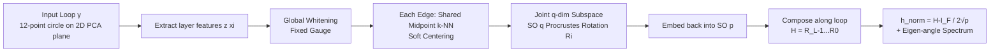

# Gauge-invariant Representation Holonomy

**Conference**: ICLR 2026  
**OpenReview**: [https://openreview.net/forum?id=czJqKToDGq](https://openreview.net/forum?id=czJqKToDGq)  
**Code**: To be confirmed (authors promised open-source code + seeded configs)  
**Area**: Representation Learning / Interpretability / Representation Geometric Diagnostics  
**Keywords**: representation holonomy, gauge invariance, parallel transport, Procrustes alignment, representation geometry, robustness diagnostic  

## TL;DR
The authors define "the cumulative rotation of features along a closed input loop" as **representation holonomy**—a gauge-invariant scalar used to characterize "path-dependent geometry" invisible to pointwise similarities like CKA/SVCCA, and link it to the adversarial/corruption robustness of models.

## Background & Motivation

**Background**: To compare the internal representations of two networks, common tools are **pointwise similarities** such as CKA, SVCCA, PWCCA, and RSA. These compare the degree of subspace overlap between two sets of activations on a fixed dataset. Since they are insensitive to neuron permutations and basis transformations, they are widely used as benchmarks for whether representations are similar.

**Limitations of Prior Work**: These metrics are inherently **path-agnostic**. They only examine "how similar two representations are at each point" while completely ignoring "how features rotate or distort when the input moves along a natural direction (pose, lighting, texture)." Consequently, two models can appear almost identical under CKA (similarity 0.987) but behave drastically differently under adversarial perturbations or corruption sequences because their intermediate features rotate differently along the input path.

**Key Challenge**: Pointwise similarity measures "static overlap," whereas robustness concerns the "dynamic geometry of features on the input manifold." The former is a blind spot for the latter—no matter how stable a metric is, it cannot answer "how curved this representation field actually is."

**Goal**: To create a **cheap, scalable, and gauge-invariant** diagnostic measure to quantify the "path-dependent geometry (curvature)" that pointwise similarities miss, and to verify its correlation with robustness.

**Core Idea**: Instead of treating "alignment" as a preprocessing step for comparison, the authors promote it to a **discrete connection**. Specifically, the representation of a layer is viewed as a vector field over the input space. "Optimal rotation" is used to parallel transport local feature clouds between adjacent inputs. By **multiplying** these rotations along a small closed loop, the degree to which the net rotation deviates from the identity matrix defines the holonomy. This follows the classic Ambrose–Singer theorem construction in differential geometry connecting "small-loop holonomy" to "curvature"—non-zero holonomy implies non-integrable transport and hidden curvature in the representation field.

## Method

### Overall Architecture

Given a representation $z:\mathbb{R}^d\to\mathbb{R}^p$ and a small closed loop $\gamma=(x_0,\dots,x_{L-1},x_L{=}x_0)$ in the input space, the method proceeds in four steps: first, **global whitening to fix the gauge** to eliminate second-order anisotropy; then, estimating a **rotation matrix** $R_i\in SO(p)$ for each edge that aligns the local feature clouds at both ends; composing these rotations along the loop to obtain the holonomy $H(\gamma)=R_{L-1}\cdots R_1 R_0$; and finally reporting the normalized scalar $h_{\text{norm}}=\|H-I\|_F/(2\sqrt{p})\in[0,1]$ and the eigen-angle spectrum $\{\theta_j\}$ of $H$. Intuitively, if the representation is "perfectly flat" on $\gamma$ (globally linear with controlled gauge), this product is the identity matrix; the deviation from $I$ measures the path-dependency of learned features.

### Key Designs

**1. Global Whitening to Fix the Gauge (Basis Invariance)**: The "gauge freedom" of a representation refers to the fact that activations in the same layer can undergo an arbitrary orthogonal basis transformation $z\mapsto Qz+b$ ($Q\in O(p)$) without changing the network function. Two such networks are "representationally equivalent." Without fixing the gauge, the measured holonomy would be contaminated by arbitrary basis choices. The authors use ZCA-corr / z-score on a **model-agnostic pool** ($N_{\text{pool}}=2048$) for global whitening $\tilde z(x)=\Sigma^{-1/2}(z(x)-\mu)$ to eliminate second-order anisotropy. This yields several structural properties: when whitened features are re-parameterized by any $U\in O(p)$, $\hat H'=U\hat H U^\top$, hence $\|\hat H'-I\|_F$ and the eigen-angle spectrum remain unchanged (**gauge invariance**). For any invertible affine transformation $Az+b$ of the original features, it is equivalent to an orthogonal transformation after whitening, thus also remaining invariant (**affine invariance**). Note that this is **global** whitening—ablation shows that switching to per-neighborhood local whitening introduces "stepwise gauge drift," inflating $h$ by $1.59\times10^{-7}$.

**2. Shared Midpoint k-NN + Soft Centering (Eliminating Index Mismatch Bias)**: For each edge $(x_i,x_{i+1})$, a naive approach would be taking neighbors separately for alignment, but this causes inconsistent point sets, creating spurious rotation. The authors take a **single** k-NN index set $I_i$ (in whitening space) at the **midpoint** $m_i=\tfrac12(\tilde z(x_i)+\tilde z(x_{i+1}))$ of the edge; both ends share these points. Soft-weighted centering $w_j^{(i)}\propto\exp(-\|\tilde Z_{j:}-m_i\|/\sigma_i)$ is then used to align to a common centroid. This step is crucial: as shown in the ablation, if "independent k-NNs" are used, holonomy **explodes catastrophically** ($+2.22\times10^{-1}$), becoming five or six orders of magnitude larger than the signal. Shared midpoints suppress the "index mismatch term $\mathrm{TV}(I_i,I_i^\star)$" in the error decomposition (Eq. 4).

**3. SO(q) Subspace Procrustes Rotation Only (Avoiding Reflection Flips)**: Denoting the local clouds as $X_i=Y_i=\tilde Z_{I_i}-\bar\mu_i$ on shared rows, the top $q$ right singular vectors $B_i\in\mathbb{R}^{p\times q}$ of the stacked cloud $[X_i;Y_i]$ are taken. The orthogonal Procrustes problem is solved in the low-dimensional $\mathbb{R}^q$: $U_i\Sigma_i V_i^\top=\mathrm{SVD}((X_iB_i)^\top W_i(Y_iB_i))$, yielding $R_i^{(q)}=U_iV_i^\top$ with the **constraint $\det=+1$** (limiting to $SO(q)$ rather than $O(p)$). This is embedded back: $\hat R_i=B_iR_i^{(q)}B_i^\top+(I-B_iB_i^\top)\in SO(p)$. Why SO instead of O? Allowing reflections introduces $\pi$-flips, creating a non-vanishing bias floor as $r\to0$. Ablation shows that $O(p)$ inflates $h$ by $5.37\times10^{-7}$. Restricting to a low-rank shared subspace improves both numerical stability (Davis–Kahan/Wedin truncation error control) and computational efficiency (thin SVD of $(2k)\times p$, complexity $O_c(kpq)$).

**4. Provable Structural Guarantees (Linear Null & Linear Decay)**: The method is not purely empirical. **Linear Null**: If $z(x)=Bx+c$ is affine, then $X_i=Y_i$, $\hat R_i=I$, and $\hat H(\gamma)=I$—flat representations yield strictly zero holonomy, establishing "non-zero = curvature" as a valid interpretation. **Small Radius Limit**: Assuming $z$ is $C^2$ with a Lipschitz Jacobian, $\|\hat R_i-I\|_F=O_c(r)$ for each edge. Compounding over $L=O_c(1)$ edges results in $h_{\text{norm}}(\gamma_r)=O_c(r)$, meaning holonomy **vanishes linearly** with the loop radius (Theorem 1). The error decomposition $\|\hat R_i-R_i^\star\|_F\le C_1k^{-1/2}+C_2\frac{\|\Pi_i^\perp\Sigma_i^{1/2}\|_F}{\lambda_q(\Sigma_i)^{1/2}}+C_3\mathrm{TV}(I_i,I_i^\star)+C_4\|J_z(x_{i+1})-J_z(x_i)\|_2$ explicitly separates "finite samples / subspace truncation / index mismatch / curvature"—the first three are controllable estimation errors, while the fourth is the target signal.

## Key Experimental Results

Datasets/Models: MNIST + 2-layer MLP (512), CIFAR-10/100 + ResNet-18 (3×3 stem, no max-pool). Input loops are 12-point circles on the 2D PCA plane spanned by 512 pixel-neighbors. Radii: MNIST $\{0.01\sim0.20\}$, CIFAR $\{0.02\sim0.20\}$. Defaults: $(k,q)$ MNIST=(128,64), CIFAR layer2=(192,96), 5 seeds.

### Main Results: Holonomy Growth with Radius/Depth & Robustness Correlation

| CIFAR-10 layer2, r=0.10 | n | Pearson r | Spearman ρ | Partial r \| clean | Adj R² |
|---|---|---|---|---|---|
| FGSM acc | 20 | **0.805** | 0.565 | 0.223 | 0.950 |
| PGD-10 acc | 20 | **0.809** | 0.501 | 0.276 | 0.987 |
| Corruption acc | 20 | **−0.785** | −0.421 | 0.027 | 0.977 |

- Holonomy **increases monotonically with loop radius** (MNIST Hidden1/2 slopes $1.54/6.10\times10^{-6}$, deeper is larger), consistent with the $O(r)$ prediction of Theorem 1 (CIFAR layer2 small-radius fitted slope $1.44\times10^{-7}$).
- Holonomy is **positively correlated** with adversarial robustness (FGSM/PGD) and negatively correlated with clean/corruption accuracy, characterizing the robustness–accuracy trade-off frontier.

### Ablation Study

| Regime (CIFAR-10 layer2) | h@r=0.10 | Clean | FGSM | Corrupt |
|---|---|---|---|---|
| ERM | 3.46e−7 | 82.37 | 36.54 | 57.11 |
| LabelSmooth | 3.04e−7 | 81.32 | 34.81 | 58.27 |
| Mixup | 3.19e−7 | 74.11 | 22.51 | 49.54 |
| **AdvPGD** | **4.74e−7** | 12.24 | **67.85** | 11.96 |

Regime means: $h$ vs (clean/FGSM/corrupt) ≈ (−0.96 / 0.94 / −0.96). **Adversarially trained models exhibit the largest holonomy**, aligning with the intuition that "robust feature geometry is more curved."

| Ablation / Guardrail | Impact on h |
|---|---|
| SO(p) → O(p) (Allowing reflection) | +5.37e−7 |
| Global → Local Whitening | +1.59e−7 |
| **Shared Midpoint → Independent k-NN** | **+2.22e−1 (Explosion)** |
| $(k,q)$ grid (9 combinations) | Only 7.20e−7 variation (Insensitive) |
| $N_{\text{pool}}$ from 1e3→8e3 | Only 6.49e−9 variation |
| Random Plane vs PCA Plane | −1.92e−8 |

### Key Findings
- **CKA's Blind Spot Exposed**: After orthogonal Procrustes alignment of MNIST Hidden1 activations, CKA reaches 0.987 and Frobenius mismatch is $2.19\times10^{-8}$, yet holonomy remains non-zero—pointwise near-identical representations can have entirely different path geometries.
- **Honest Negative Results**: While correlations at the regime mean level are extremely strong (≈0.94–0.96), the **partial correlation conditioned on clean accuracy** across seeds drops to $r\approx0.22$–$0.28$ (FGSM/PGD) and nearly zero for corruption—the authors report limited incremental signal.
- **Controllable Numerical Floor**: Under self-loops ($r\approx10^{-4}$), $h$ falls to the $10^{-8}$ noise floor, proving that the remaining signal is true curvature once guardrails are in place.

## Highlights & Insights
- **Promoting "Alignment" from Tool to Object**: CKA treats alignment as preprocessing. This work treats alignment as a connection, allowing the novel question: "is the representation field curved?" The perspective shift is elegant.
- **Rigorous Theory-Empirical Loop**: Gauge/Affine invariance, Linear Null, and $O(r)$ decay are all proven, and every property is verified by numerical floors in experiments (linear networks, self-loops both collapse to $10^{-8}$).
- **Clear Design Motivation**: The cost of removing each of the three "bias guards" (global whitening, shared midpoint, SO-only) is quantified. The $10^5$-fold explosion caused by "independent k-NN" is particularly persuasive, highlighting the non-triviality of the estimator.
- **Orthogonal to Existing Metrics**: The diagnostic is cheap (small SVD), scalable (JL projection to 1024D), and tracks with existing backbones, positioning it as a complement to, rather than a replacement for, CKA.

## Limitations & Future Work
- **Weak Incremental Signal**: Partial correlation drops to the 0.2 range after controlling for clean accuracy, suggesting that holonomy has limited "independent predictive power" for robustness and currently acts more as a descriptive indicator.
- **Limited Scale and Diversity**: Experiments use small models/data (MNIST/MLP, CIFAR/ResNet-18). ImageNet-scale backbones, Transformers, or full CIFAR-10-C corruptions were not explored.
- **Loop Construction Dependency**: Circles are sampled on 2D planes spanned by 512 pixel-neighbors. It is not directly verified if these "input paths" correspond to meaningful semantic transforms (pose/lighting).
- **Strong Theoretical Assumptions**: The small-radius theorem requires $C^2$ continuity and Lipschitz Jacobians, which ReLU networks (non-smooth) do not strictly satisfy. Future work could extend holonomy to LLMs or use it as a regularizer in robust training.

## Related Work & Insights
- **Pointwise Similarity (CKA/SVCCA/RSA)**: This work fills their blind spot—they look at subspace overlap, while this looks at path rotation.
- **Local Equivariance Testing (Lie-derivative)**: Measures infinitesimal sensitivity but lacks global path dependency through closed-loop composition. This paper demonstrates "locally near-equivariant but globally non-zero holonomy."
- **Equivariant Architectures (Gauge-equivariant CNNs)**: These bake connections into the model so transport is naturally integrable. This work does the opposite: **measuring** transport emerging in standard models as a diagnostic.
- **Mathematical Foundations**: Procrustes/Kabsch, Davis–Kahan/Wedin, ZCA whitening, and Ambrose–Singer are skillfully assembled into a computable estimator, serving as a template for grounded ML diagnostics via differential geometry.

## Rating
- **Novelty**: ⭐⭐⭐⭐⭐ Systematically translating holonomy/connection/curvature into a computable representation diagnostic for the first time is highly original.
- **Experimental Thoroughness**: ⭐⭐⭐ Theoretical verifications (linear null, self-loop) are rigorous and ablations are effective, but the model/data scale is small, and the weak incremental signal after controlling variables reduces overall persuasiveness.
- **Writing Quality**: ⭐⭐⭐⭐ Intuition, formalization, proof pointers, and error decomposition progress logically. Honestly reporting negative results improves readability.
- **Value**: ⭐⭐⭐⭐ Provides a cheap, gauge-invariant geometric diagnostic dimension orthogonal to CKA. It has methodological value for representation geometry but requires validation on large models to become a practical predictive tool.

<!-- RELATED:START -->

## Related Papers

- [\[ICLR 2026\] The Deleuzian Representation Hypothesis](the_deleuzian_representation_hypothesis.md)
- [\[ICLR 2026\] The Geometry of Reasoning: Flowing Logics in Representation Space](the_geometry_of_reasoning_flowing_logics_in_representation_space.md)
- [\[ICLR 2026\] On the Predictive Power of Representation Dispersion in Language Models](on_the_predictive_power_of_representation_dispersion_in_language_models.md)
- [\[ICLR 2026\] MICLIP: Learning to Interpret Representation in Vision Models](miclip_learning_to_interpret_representation_in_vision_models.md)
- [\[ICLR 2026\] Decoupling Dynamical Richness from Representation Learning: Towards Practical Measurement](decoupling_dynamical_richness_from_representation_learning_towards_practical_mea.md)

<!-- RELATED:END -->
