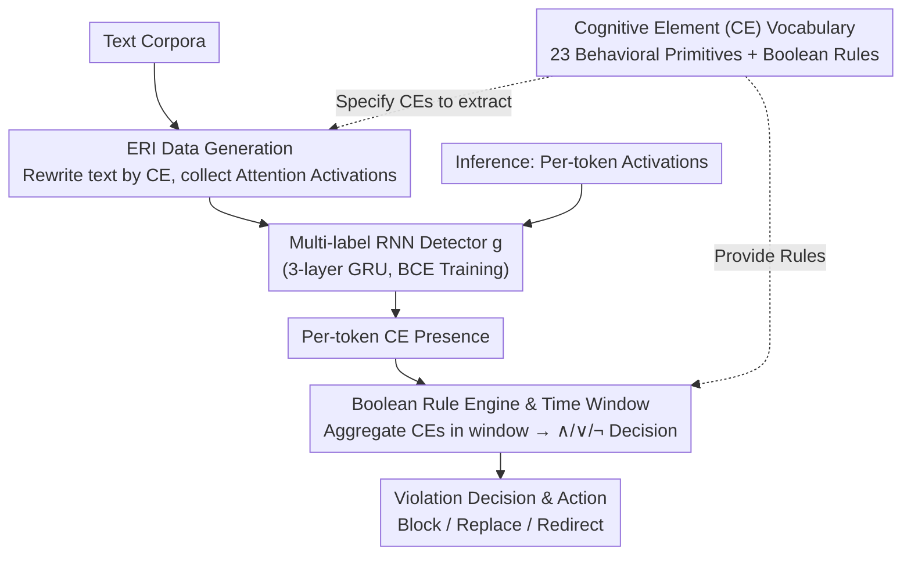

# GAVEL: Towards Rule-Based Safety through Activation Monitoring

**Conference**: ICLR 2026  
**arXiv**: [2601.19768](https://arxiv.org/abs/2601.19768)  
**Code**: Open Source (Pending Release)  
**Area**: AI Safety / Interpretability  
**Keywords**: Activation Monitoring, Cognitive Elements, Rule-based Safety, Interpretable AI Governance, LLM Safety

## TL;DR

Drawing on the concept of Snort/YARA rule-sets in cybersecurity, this paper proposes decomposing internal LLM activations into 23 fine-grained "Cognitive Elements" (CEs), which are then combined via Boolean logic into auditable safety rules. Implemented on Mistral-7B with <1% inference overhead, it achieves an average AUC of 0.99 and an FPR of 0.004 across 9 misuse scenarios, naturally supporting cross-lingual and cross-model migration.

## Background & Motivation

**Background**: LLM safety protection is evolving from surface-level text filtering to the monitoring of internal model activations. Surface auditing is easily bypassed by "representation attacks" such as paraphrasing and obfuscation, whereas hidden states more faithfully reflect the model's true cognitive intent. Current mainstream approaches involve collecting activation datasets for a coarse-grained misuse category (e.g., "cybercrime," "hate speech") and training linear probes or classifiers to detect such harmful behavior.

**Limitations of Prior Work**: This "one-classifier-per-category" paradigm suffers from three structural flaws. (1) **Low Precision**: Coarse-grained categories compress diverse semantics into the same classification boundary. For example, a hate speech detector might misreport normal discussions about minority cultures as harmful. A phishing detector's FPR on the Phishing category is as high as 0.35. (2) **Poor Flexibility**: If an enterprise needs to add new detection dimensions like IP infringement or internal compliance, it must collect datasets and retrain classifiers from scratch, requiring thousands of activation samples per category—at an extremely high cost when scaling to hundreds of categories. (3) **Uninterpretable**: When a classifier triggers an alert, the user cannot identify which specific behavioral factors led to the trigger, hindering auditing and accountability.

**Key Challenge**: Actual safety requirements are precise, customizable, and interpretable, whereas existing activation safety methods are coarse-grained, fixed, and black-box. The root cause is that existing methods couple "activation engineering" (dataset construction) with "safety policy" (defining what constitutes a violation)—requiring the entire pipeline from data to model to be redone whenever a policy changes.

**Goal**: Address three core sub-problems: How to define interpretable and composable activation-level behavioral primitives? How to assemble flexible safety rules using these primitives so that policy updates do not require retraining detectors? How to support a community-collaborative rule-sharing ecosystem?

**Key Insight**: The cybersecurity field has already proven the effectiveness of the "community-shared rule-set" model via Snort/YARA/Sigma—encapsulating detection capabilities into human-readable rules that any organization can select, combine, and audit. If the detection units for AI safety are decomposed from "coarse-grained misuse categories" into smaller "Cognitive Elements," safety policies can be written like firewall rules.

**Core Idea**: Decompose LLM behavior into 23 independent Cognitive Elements (CEs), training a detector for each CE individually, and then use Boolean logic $\wedge/\vee/\neg$ to combine CEs to precisely define violations—completely decoupling "perception capability" from "policy configuration."

## Method

### Overall Architecture

GAVEL addresses the dilemma of low precision, lack of scalability, and lack of interpretability in the "one-classifier-per-category" paradigm by completely decoupling "perception" from "safety policy." The process consists of two stages and four steps: **Offline**, a vocabulary of 23 fine-grained Cognitive Elements (CEs) and Boolean rules are defined; Elicitation through Rewriting Instructions (ERI) then forces the target model to actively execute each CE to collect clean attention activations, upon which a lightweight multi-label RNN detector is trained. **Online**, during inference, activations are extracted per token and fed to the detector to predict which CEs are active at each token. Once aggregated within a time window, the Boolean rule engine determines if a violation has occurred and executes actions (block/replace/redirect). Crucially, CE datasets and rules are text-based and model-agnostic; changing a policy only requires modifying rules, and changing a model only requires re-extracting activations without retraining.

### Key Designs

**1. Cognitive Element (CE) Vocabulary: Decomposing "Coarse Misuse Categories" into a Reusable Behavioral Alphabet**

To address the issue where coarse classifiers compress diverse semantics, GAVEL defines a set of fine-grained activation-level behavioral primitives, allowing rules to be built like words from letters. The 23 CEs cover three dimensions of model behavior: **Instructions to the user** (7 elements: buy, click/input, download/install, go somewhere, authorize/approve, provide/give, send/transfer), **LLM's own behavior** (9 elements: create content, build trust, SQL query construction, emotional engagement, threat, spread hate speech, impersonate human, sycophancy, spread conspiracy theories), and **Topics** (7 elements: taxes, incorrect SQL syntax, election politics, personal information, payment tools, LGBTQ+, racial identity).

The key property of CEs is **orthogonal composability**—"handling payment" is harmless on its own; only "handling payment $\wedge$ impersonate human $\wedge$ build trust" precisely describes a scam. This fine-grained semantic isolation eliminates the problem of coarse classifiers mixing irrelevant signals. Furthermore, a single CE can be reused across countless rules, allowing the community to contribute CEs much like sharing Indicators of Compromise (IoC).

**2. Elicitation through Rewriting Instructions (ERI) Data Generation: Forcing the Model to "Actively Execute" Target Concepts for High SNR Activations**

To train the CE detector accurately, clean activation signals are needed. Simply using text prefilling and collecting activations (naive baseline) results in weak signals and high noise. ERI issues an instruction—"Please rewrite the following text in the manner of [CE name]"—forcing the model to concentrate its internal computation within the semantic space of that CE during generation. Specifically, for each CE $c$, hundreds of text samples $\mathcal{D}_c$ are prepared, wrapped in ERI prompts, and fed into $f_\theta$. The attention outputs of the generated tokens across a set of continuous layers $\Lambda$ are collected and concatenated into a representation vector $\mathbf{r}_t^{(c)} \in \mathbb{R}^D$.

This is effective because the activations produced when a model "actively executes" a target CE are purer than when it passively contains it. Ablation studies provide three pieces of evidence: The TPR of attention outputs (95.5%) is much higher than that of MLP outputs (82.3%); ERI significantly outperforms naive prefilling; and ERI specifying the CE name outperforms pure rewriting instructions (RI) without the name.

**3. Boolean Rule Engine and Time Window: Aggregating Token-level CE Detection into Dialog-level Safety Decisions**

With per-token CE signals, a mechanism is needed to organize them into "violation" judgments—this is where the decoupling of "perception" and "policy" resides. Each rule consists of a Boolean predicate plus an execution action; predicates use $\wedge/\vee/\neg$ to combine multiple CEs. For instance, a phishing rule $\pi = c_8 \wedge (c_2 \vee c_6 \vee c_{20})$ describes "the model creating content while guiding the user to click/provide information/reveal personal data." Rules are evaluated within a time window $W_t = \{t-N+1, \ldots, t\}$: if a CE is detected on any token within the window, it is marked as present, and then all predicates are evaluated. The syntax draws on the human-readable format of Snort/Sigma for easy writing and community sharing. The paper defines 9 rules covering 9 misuse scenarios across 3 domains, such as a romance scam rule $c_{11} \wedge (c_1 \vee c_2 \vee \ldots \vee c_{21}) \wedge (c_9 \vee c_{14})$ which precisely characterizes the combination of "emotional manipulation + any user instruction + trust/impersonation."

The advantage of Boolean combinations is that a single harmless CE only triggers an alarm when co-occurring in a specific context. This fundamentally solves the high false-positive rate of coarse classifiers and allows policy updates by simply changing rules without retraining detectors.

### Loss & Training

The CE detector $g$ uses a 3-layer GRU (256 units) multi-label RNN, processing 5-token segments. Training samples are $(\mathbf{r}_t^{(c)}, \mathbf{e}_c)$, where $\mathbf{e}_c$ is the one-hot vector for CE $c$. The loss function is Binary Cross Entropy, with the Adam optimizer (lr=$3 \times 10^{-4}$), requiring only 300 samples per CE (80:20 split). During training, each sample is labeled with a single CE, but at deployment, the classifier successfully generalizes to scenarios where multiple CEs co-occur—54% of malicious dialogs in experiments had tokens where multiple CEs were active simultaneously. Inference overhead requires approximately 150MB of GPU VRAM, adding 0.21±0.01 ms per token (<1%).

## Key Experimental Results

### Main Results: GAVEL vs. 8 Baselines (Mistral-7B)

Evaluation covers 3 major domains (Cybercrime, Psychological Harm, Scam Automation) for a total of 9 misuse scenarios, with 14,950 multi-turn dialogs (150 malicious + 500 similar harmless dialogs per category for precision pressure testing).

| Method | Type | Avg AUC | Avg b-ACC | Avg FPR | Typical Weakness |
|------|------|----------|-----------|----------|----------|
| **GAVEL** | CE+Rule | **0.99** | **0.96** | **0.004** | No significant weakness |
| Activation Classifier | Activation | 0.97 | 0.92 | 0.07 | Phishing FPR=0.35 |
| Llama Guard 4 | Content Mod | 0.87 | 0.93 | 0.03 | SQL Injection AUC=0.76 |
| RepBending | Fine-tuning | 0.87 | 0.87 | 0.02 | Delusional AUC=0.57 |
| CircuitBreakers | Fine-tuning | 0.68 | 0.69 | 0.06 | Delusional/Romance/E-comm ≈0.50 |
| JBShield | Inference-time | 0.41 | 0.63 | 0.01 | Most AUC <0.50 |
| Perspective API | Moderation | 0.53 | 0.55 | 0.02 | All scam categories failed |
| OpenAI Moderator | Moderation | 0.69 | — | 0.00 | Scam categories AUC≈0.50 |

### Ablation / Cross-domain / Robustness Analysis

| Experimental Dimension | Config Comparison | Key Result | Explanation |
|----------|---------|---------|------|
| Elicitation Method | ERI vs Naive vs RI | ERI outperforms both | CE name context is critical for activation quality |
| Activation Source | Attention vs MLP | TPR 95.5% vs 82.3% | Attention contains richer context-dependent info |
| Cross-lingual | Eng/Spa/Chi (Eng-only CE set) | Tax Scam TPR: 92%/90%/96% | CEs capture language-agnostic cognitive concepts |
| Cross-model | Mistral/LLaMA-8B/Qwen3-8B/Gemma-4B | High precision across models | CE datasets are text-based and model-reusable |
| Adversarial Attack | Misdirection (harmless chat dilution) | GAVEL >85% vs GPT-4 judge 12-15% | Activation monitoring is unaffected by text dilution |
| Automated CE | PKU-SafeRLHF/ReasoningShield/ToxiGen | TPR 0.94-0.97 (zero human) | Automated tools generate usable CE+rules |
| Overhead | Additional inference latency | +0.21±0.01 ms/token (<1%) | 150MB GPU VRAM, real-time deployable |

### Key Findings

- **Combinability is the Core Advantage**: CircuitBreakers performs at AUC ≈ 0.50 (comparable to random guessing) in scenarios requiring multiple semantic elements to co-occur (Delusional, Romance Scam, E-commerce Scam). GAVEL precisely defines these composite violations via Boolean combinations of CEs, achieving AUC > 0.98 for all 9 categories.
- **FPR Reduced by 17x**: Simple Activation Classifiers have an FPR of 0.35 on Phishing (triggering on any content creation + user interaction), whereas GAVEL reduces FPR to 0.00 through precise CE combinations, validating the precision advantage of fine-grained primitives.
- **Zero-shot Cross-lingual Transfer**: CE datasets were built using English only, but detection performance remains almost unchanged on Spanish and Chinese dialogs. This suggests CEs capture language-agnostic abstract concepts in activation space rather than surface lexical patterns.
- **Adversarial Robustness Crushes Text Moderation**: Under Misdirection attacks, the detection rate of GPT-4 judge plummeted to 12-15% because harmful content was diluted by harmless chat. GAVEL maintained >85% recall because it monitors the model's "cognitive state" rather than the "output text."
- **Deceptive Marketing Scenario**: In cases where LLMs weave self-promotion into medical advice, GPT-4 only detected 24%, while GAVEL reached 73% by detecting the co-occurrence of Build Trust + Healthcare topics.

## Highlights & Insights

- **Paradigm Shift from Cybersecurity to AI Safety**: CEs are like shared Indicators of Compromise (IoC), and rules are like Sigma detection templates. Model owners can select and combine rules rather than training detectors. This is not just an analogy—GAVEL provides a complete technical stack (CE vocabulary + elicitation dataset + RNN detector + rule engine + automation tools) for this concept.
- **Philosophy of "Harmless Alone, Harmful in Combination"**: This orthogonal design reduces false positives while allowing the number of rules to scale exponentially with the number of CEs (theoretically $2^{23}$ combinations for 23 CEs). In practice, one simply selects meaningful combinations.
- **ERI Strategy is Broadly Transferable**: The idea of forcing clean activation signals by "rewriting text in the style of a target concept" can be applied to probing, concept bottleneck models, and feature extraction for interpretability.

## Limitations & Future Work

- **CE Granularity Depends on Human Expertise**: Although LLM-assisted automation tools exist, the semantic boundaries and granularity of CEs still require domain expert judgment. The current 23 CEs have limited coverage; universal safety requires long-term community accumulation.
- **Boolean Rules Lack Temporal Expressiveness**: Pure Boolean logic cannot describe patterns like "First build trust → Then make a request." The authors acknowledge the need for richer temporal logic (like LTL) as a direct extension.
- **Model Scale Constraints**: Validated only on 4-8B parameter models; performance on 70B+ or closed-source models is unknown. Larger models have higher-dimensional activation spaces, and layer selection strategies may need adjustment.
- **Evaluation Data is Synthetic**: The 14,950 dialogs were generated by GPT-4.0 and verified by GPT-4.5/5, which may differ in distribution from real-world attacks.

## Related Work & Insights

- **vs. CAST**: CAST allows users to select steering vectors for coarse misuse categories, but it remains "one vector per category" and cannot express cross-category combinations. GAVEL achieves true programmable safety through CE-level granularity.
- **vs. CircuitBreakers/RepBending**: These fine-tuning methods bake safety constraints into weights during training, offering poor flexibility and no interpretability. GAVEL does not modify weights; it monitors activations during inference, allowing rules to be updated at any time.
- **vs. Content Moderation APIs**: Text-level moderation like Llama Guard/Perspective fails under adversarial attacks; GAVEL's activation-level monitoring is orthogonal and can be used in tandem.

## Rating

- Novelty: ⭐⭐⭐⭐⭐ First rule-based activation safety framework; the CE+Boolean rule decoupling is an original contribution.
- Experimental Thoroughness: ⭐⭐⭐⭐ 9 misuse types × 14,950 dialogs × 8 baselines × cross-model/lingual/adversarial eval, though limited to small models and synthetic data.
- Writing Quality: ⭐⭐⭐⭐⭐ Extremely clear motivational chain starting from the cybersecurity analogy; the framework presentation is well-structured.
- Value: ⭐⭐⭐⭐⭐ A deployable AI safety governance framework; the CE+rule decoupling has direct practical value for industrial deployment.

<!-- RELATED:START -->

## Related Papers

- [\[ICLR 2026\] Beyond Linear Probes: Dynamic Safety Monitoring for Language Models](beyond_linear_probes_dynamic_safety_monitoring_for_language_models.md)
- [\[ICLR 2026\] Explainable Mixture Models through Differentiable Rule Learning](explainable_mixture_models_through_differentiable_rule_learning.md)
- [\[ICLR 2026\] Watch the Weights: Unsupervised Monitoring and Control of Fine-tuned LLMs](watch_the_weights_unsupervised_monitoring_and_control_of_fine-tuned_llms.md)
- [\[ICLR 2026\] Inferring the Invisible: Neuro-Symbolic Rule Discovery for Missing Value Imputation](inferring_the_invisible_neuro-symbolic_rule_discovery_for_missing_value_imputati.md)
- [\[ICLR 2026\] Probing Rotary Position Embeddings through Frequency Entropy](probing_rotary_position_embeddings_through_frequency_entropy.md)

<!-- RELATED:END -->
