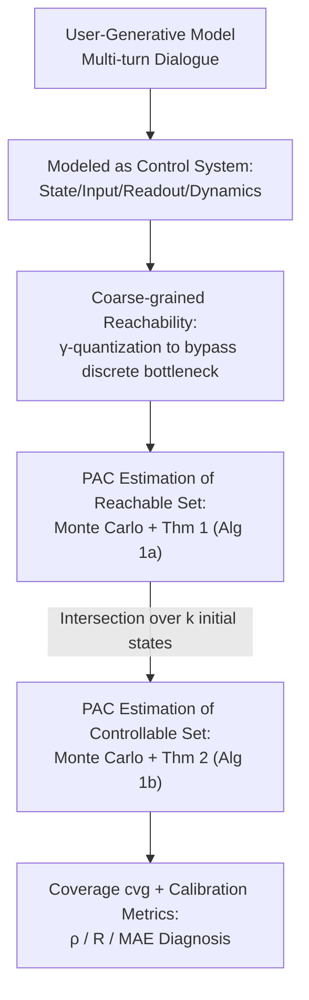

# GenCtrl — A Formal Controllability Toolkit for Generative Models

**Conference**: ICLR 2026  
**OpenReview**: [https://openreview.net/forum?id=HJTFgDYoLO](https://openreview.net/forum?id=HJTFgDYoLO)  
**Code**: https://github.com/apple/ml-genctrl  
**Area**: Interpretability / Control Theory / Generative Model Analysis  
**Keywords**: Controllability, Reachability, PAC Bounds, Control Theory, Black-box Generative Models

## TL;DR
This paper models the "user-generative model dialogue" as a discrete-time nonlinear control system. It proposes a Monte Carlo algorithm to estimate the **reachable set** and **controllable set** of the model, providing distribution-agnostic PAC (probably-approximately-correct) error bounds that require only an assumption of bounded outputs. This allows for the first formal answer to whether a generative model is controllable. Experiments reveal that the controllability of modern LLMs and text-to-image models is surprisingly fragile and highly dependent on the task setting.

## Background & Motivation
**Background**: With the proliferation of generative models, controlling their output has become a core requirement. Various methods have emerged, from prompt engineering (in-context, CoT) and fine-tuning (RLHF, DPO) to representation engineering (activation steering) that directly manipulates activations. The field is focused on competing over "how to control models better."

**Limitations of Prior Work**: All these methods implicitly rely on a premise that has never been verified—**that the model is controllable in the first place**. This breaks down into three hidden assumptions: ① Reachability: using a certain control method + an initial prompt, the target output set can indeed be reached; ② Universal Controllability: the target output can be reached from **any** initial state; ③ Calibration: the output is a direct function of the control variable (adjusting the input results in a predictable output change). However, the academic community lacks tools to verify if these three premises actually hold.

**Key Challenge**: While researchers have been "trying to control," they have rarely asked "whether the system is controllable in principle." Although reachability and controllability are core concepts in control theory, past attempts to migrate them to machine learning were either limited to analyzing reinforcement learning/training dynamics, relied on unverifiable assumptions for black-box models (such as Lipschitz continuity), or returned continuous reachable set estimates—whereas the reachable sets of LLMs/text-to-image models are **countable** (discrete bottleneck), causing continuous estimates to be "vacuously large" and uninformative.

**Goal**: To treat generative models as black-box nonlinear control systems and provide tools for reachable/controllable set estimation that are practically runnable on modern large models with probabilistic guarantees, thereby quantifying the aforementioned three assumptions.

**Key Insight**: The authors leverage the language of control theory (Sontag 1998) to reinterpret "dialogue" as a feedback control process—where user input in each round is a "control input" (intervention), the model generation is the "state," and the external scoring function is the "readout." From this perspective, reachability and controllability have rigorous definitions.

**Core Idea**: Use a **distribution-agnostic** Monte Carlo sampling algorithm, assuming only **bounded outputs**, paired with PAC sample complexity bounds to estimate the reachable and controllable sets of any black-box generative model under a dialogue setting—shifting the focus from "trying to control" to "understanding the fundamental limits of control."

## Method

### Overall Architecture
GenCtrl formalizes "multi-turn dialogue between user and generative model" as a **stochastic discrete-time nonlinear control system** $(\phi, \mathcal{T}, X, U, h, Y)$: the time domain $\mathcal{T}=\mathbb{N}$ represents dialogue rounds; state $x_t\in X$ is the current string/image context; control input $u_t\in U$ is the prompt (intervention) given by the user in this round; dynamics $\phi: X\times U\to X$ map historical states and inputs to the next generation $x_{t+1}=\phi(x_t,\dots,x_0;u_t,\dots,u_0)$; and the readout map $h: X\to Y$ maps the generation to a measurable property value (e.g., text formality, number of objects in an image, such as using Python `len()`). The control goal is to restrict the measured value $y_t=h(x_t)$ to a desired subset $Y'\subset Y$.

Based on this framework, the paper addresses two questions: **Reachability** Q1—starting from a fixed initial prompt $x_0$, what property values can be hit; **Controllability** Q2—can the target set be hit from **any** initial prompt. The core methodological challenge is the **discrete bottleneck** of LLMs/T2IMs: reachable sets are countable, making continuous reachable set estimation inapplicable. The pipeline is: coarse-grained quantization of the measurement space to bypass the discrete bottleneck → Monte Carlo sampling + Thm 1 to estimate the reachable set for a single initial state → intersection of reachable sets for $k$ sampled initial states + Thm 2 to estimate the controllable set → output coverage/calibration metrics for diagnosis.

### Key Designs

**1. Formalizing "User-Model Dialogue" as a Black-box Nonlinear Control System**

To answer whether a model is controllable, a language for strictly defining "controllability" is required. The paper maps dialogue turns to standard control theory objects (Def. 1): the initial prompt is the initial state $x_0$, each subsequent user sentence is a control input $u_t$, model generation is the state transition $\phi$, and the external scorer is the readout $h$. Under this framework, the **reachable set** is defined as all measurement values that can be hit within $t$ steps from a fixed $x_0$ using an input sequence:

$$R(x_0, U, t) = \{\tilde{y}\in Y \mid \exists\, u_0,\dots,u_{t-1}\in U \text{ s.t. } y_t=\tilde{y}\}$$

**Controllability** is a stronger condition (Def. 3): a system is controllable on $Y'\subseteq Y$ if and only if there exists $t$ such that the reachable set of **every** $x_0\in X$ equals $Y'$. This distinction corresponds to the hidden assumptions—reachability handles Q1, while controllability handles Q2. This formalization is architecture-agnostic and input/output-agnostic (discrete or continuous), allowing unified treatment of LLM text and T2IM images.

**2. Coarse-grained Reachability: Bypassing the Discrete Bottleneck via γ-quantization**

The string prompts of LLM/T2IM are discrete, leading to **countable** reachable sets. Even if the measurement values are continuous (e.g., formality score in [0,1]), the true reachable set is just a collection of discrete points. Standard continuous reachable set estimators would return vacuously large sets. The authors solve this by relaxing the reachability problem to a **γ-quantized version** (Def. 4): instead of requiring an exact hit on a value, it allows for an error tolerance $\gamma$—

$$R_\gamma(x_0, U, t) = \{\tilde{y}\in Y \mid \exists\, u_0,\dots,u_{t-1}\in U \text{ s.t. } \|y_t-\tilde{y}\|_\infty \le \gamma\}$$

For instance, it does not require a formality of exactly 0.3, but hitting $0.3\pm0.05$ is sufficient. Correspondingly, the measurement space $Y$ is covered using a minimal covering of $\infty$-balls with radius $\gamma/2$, resulting in a quantized space $Y_q$ with finite cardinality $N=|Y_q|$ (categorical attributes $Y_q=Y$ do not require quantization). The use of the $\infty$-norm allows the theory to naturally hold for multiple orthogonal readout dimensions. This step is a prerequisite for the PAC bounds—only if $Y_q$ is finite can one discuss "sampling enough to cover all reachable bins."

**3. Monte Carlo Reachable Set Estimation + Distribution-Agnostic PAC Bound (Thm 1)**

Generating models are nonlinear, high-dimensional, and have unknown dynamics; thus, reachable sets cannot be derived analytically and must be sampled. The paper defines a probabilistic error concept: the user set a threshold $p\in(0,1)$, retaining only those bins with probability mass $p_{y,t}(y_{\text{bin}})\ge p$ (density below $p$ is ignored), resulting in a $p$-approximate reachable set $R_{t,p}$ (Def. 5). Then, a **sample complexity bound** (Thm 1) is provided: given $Y_q$ cardinality $N$ and confidence parameter $\delta\in(0,1)$, as long as the number of i.i.d. samples $m$ satisfies

$$m \ge \max\!\left(N,\ \frac{\log(\delta/N)}{\log(1-p)}\right)$$

then $P(R^{(\gamma)}_{t,p}\subset \hat{R}_t)\ge 1-\delta$, where $\hat{R}_t$ is the set of sampled points (categorical) or the union of $\gamma$-balls of sampled points (quantized). This bound is **distribution-agnostic**, requires **no assumptions** other than "bounded output," holds for any black-box (including stochastic models), and $m$ does not depend on model stochasticity or time steps—the appendix gives $m\sim O(N\log N)$. Intuitively: after sampling $m$ times, one can assert with $1-\delta$ confidence that "all reachable bins have been covered"; if target set $Y^*$ is not in $\hat{R}_t$, it is **unreachable** with $\ge 1-\delta$ confidence. This corresponds to Alg 1a.

**4. Monte Carlo Controllable Set Estimation + PAC Bound (Thm 2)**

Controllability requires "reachability to $Y'$ from all initial states." The natural estimation method is to **take the intersection of reachable sets for multiple initial states**. The authors introduce a measure $\mu(y_{\text{bin}})=P_{x_0\sim p_0}[y_{\text{bin}}\in R^\gamma_{t,p}(x_0)]$, characterizing the "proportion of initial states that can $p$-approximately reach a bin," and define the **α-controllable set** (Def. 6) as the set of bins reached by $\ge 1-\alpha$ of initial states: $C^\alpha_t=\{y_{\text{bin}}\mid \mu(y_{\text{bin}})\ge 1-\alpha\}$. The estimator $\hat{C}_t=\cap_{i=1}^k \hat{R}_t(x_0^{(i)})$ is the intersection of reachable sets for $k$ sampled initial states. Thm 2 defines how large $k$ must be: given $\epsilon,\delta_C,p,\alpha$, as long as

$$k \ge \frac{\log \epsilon\delta_C}{\log(1-\alpha)}$$

then $P(\mu(\hat{C}_t\setminus C^\alpha_t)<\epsilon)\ge (1-\delta_C)(1-\delta_R)^k$. Here, error is measured by the "measure of false positives" $\mu(\hat{C}_t\setminus C^\alpha_t)$—since taking intersections only **shrinks** the operational controllable set, $\hat{C}_t$ is a strict over-estimation of $C^\alpha_t$ (no false negatives). The overall confidence $1-\delta=(1-\delta_C)(1-\delta_R)^k$ is compounded from the confidence of each reachable set $\delta_R$ and the confidence in sampling enough initial states $\delta_C$. For a given $\delta$, $\delta_C$ and $\delta_R$ are allocated to minimize total samples $n=m\cdot k$. This corresponds to Alg 1b.

### Loss & Training
This paper does not train any models, nor does it perform controller design. It treats the generative model entirely as a black box and performs statistical estimation through sampled trajectories. The only "hyperparameters" are the user-adjustable parameters in the PAC bounds: confidence $\delta$, density threshold $p$, quantization error $\gamma$, partial controllability parameter $\alpha$, and controllable set error $\epsilon$.

## Key Experimental Results

Experiments conducted on various modern LLMs and text-to-image models (T2IM) for reachability/controllability diagnosis show that **controllability is fragile and highly task-dependent**. Core metrics include coverage $\text{cvg}=|Y\cap\hat{C}_t|/|Y|\in[0,1]$ (higher is better, measuring availability of a controller) and calibration proxies: Spearman $\rho$ (monotonicity), Pearson $R$ (linearity), and MAE (identity).

### Main Results

**Formality Control (LLM, 5-turn dialogue, δ=0.05)**: LLMs are required to generate text with specified formality, with real formality from the previous turn fed back as input.

| Model | Setting | t=5 coverage cvg | Notes |
|------|------|----------------|------|
| SmolLM3-3B | 5-shot | 0.57 | Still not fully controllable within 5 steps |
| Qwen3-4B | 5-shot | 1.00 | Reaches full controllability at t=5; most faithful (median MAE=0.09) |
| Gemma3-4B | 5-shot | 1.00 | Reaches full controllability at t=5 |

Under the 0-shot setting, none of the three models are fully controllable within 5 steps (though controllable sets grow with turns), and all exhibit a systematic bias toward "more formal."

**Object Count Control (T2IM, single turn)**: Prompts like "White background. [N] [obj]s.", where N∈{0…20} and obj iterates through 80 COCO classes, using a 0-shot object detector as the readout.

| Model | Median MAE | Calibration ρ, R | Conclusion |
|------|----------|-----------|------|
| FLUX-s | 3.52 | ρ, R > 0.9 | Best in this task, but still has significant counting errors |
| FLUX-d / SDXL / DMD2 | Worse | Lower | Controlling object count is much harder than expected |

### Ablation Study

| Analysis Dimension | Key Indicator | Explanation |
|----------|---------|------|
| 0-shot vs 5-shot | cvg @ t | Relative importance of "feedback" vs "examples" is model-dependent: Qwen/Gemma benefit more from examples; SmolLM the opposite |
| Model Scale (Qwen 0.6B→14B) | cvg ↑, ρ/R/MAE | Controllability rises reliably with scale up to 14B; but calibration R saturates around 8B; most calibration gains occur in the 0.6B→1.7B range |
| Greedy vs Sampled Decoding | High-level Trends | Randomized decoding does **not change** high-level conclusions |
| Task Semantics (i–v) | cvg / Calibration | Gemma3-4B is nearly perfectly calibrated on parity/string length but poor on formality; object location (iv) is harder to control than count; saturation (v) is uncontrollable |

### Key Findings
- **Controllability is far from a default**: Even in simple tasks designed for the paper (treated as a lower bound on real-world complexity), no single model or prompt strategy guarantees controllability across all tasks—highlighting the framework's value in pinpointing failures.
- **Dialogue "Overshoots"**: Even when feedback provides the target formality $u_0$ and the previous output $y_{t-1}$, models do not converge to the target but often overshoot significantly, especially under the 5-shot setting—indicating that models do not behave like stable ideal controllers.
- **Large Models are More Controllable but Calibration Saturates Early**: Controllability (expressivity proxy) rises monotonically with scale, but calibration saturates at ~4B; even 14B models have a formality MAE of ~0.25 (vs error tolerance γ=0.1)—controllability $\neq$ good calibration.
- **Extreme Task Dependency**: The same Gemma3-4B is nearly perfect at parity but poor at formality; T2IM can somewhat control count but not location or saturation. Conclusion: Controllability must be analyzed **task-by-task**.

## Highlights & Insights
- **Paradigm Shift**: The paper shifts from "trying to control the model" to "formally understanding the fundamental limits of control." This is the first formal language to characterize the "operational boundaries" of generative models, turning three implicit assumptions (reachability, universal controllability, calibration) into testable hypotheses.
- **Handling the Discrete Bottleneck**: It identifies that LLM/T2IM reachable sets are **countable**, rendering continuous reachable set estimates vacuously large, and solves this using γ-quantization + $\infty$-ball covering—an insight applicable to any effort mapping control theory to discrete generative systems.
- **"No-Assumption" PAC Bounds**: Distribution-agnostic, requiring only bounded outputs, and applicable to stochastic black boxes. The sample size $m$ is independent of model stochasticity and time steps, enabling the theory to **actually land** on opaque large models rather than remaining theoretical baggage requiring Lipschitz assumptions.
- **Intersection = Overestimation**: Using the intersection of $k$ reachable sets to approximate the controllable set naturally yields false positives but no false negatives, with errors strictly bounded by the $\mu$ measure—converting the $\forall x_0$ problem of "universal controllability" into a solvable statistical sampling problem.

## Limitations & Future Work
- **No Cross-Setting Transfer**: All guarantees are tied to the practitioner's choice of input distribution, readout map, and initial state distribution; changing these invalidates the conclusions. This ensures honesty but limits "diagnose once, use everywhere" utility.
- **Black-box $\neq$ Interpretability**: The framework returns sampled trajectories (inputs/states/measurements) and identifies "which inputs trigger which outputs" or "uncontrollable regions," but it **does not provide causal diagnostic tools** for why the model fails internally.
- **High-Dimensional Scaling**: While Thm 1's sample size grows with $N$, high-precision estimation in high dimensions remains challenging. The current workaround is using a controlled cardinality $N$ for the quantized $Y_q$.

## Related Work & Insights
- **vs. Controlled Generation (Prompts/Fine-tuning/RepE)**: These methods assume controllability and try to improve it; GenCtrl does not design controllers but **verifies the premise of controllability itself**, serving as an "upstream diagnostic" for any such mechanism.
- **vs. Data-driven Reachable Set Estimation**: Previous methods often focused on state reachability rather than output, required unverifiable Lipschitz assumptions, or returned continuous sets that are vacuous for LLMs. This work fills the gap with coarse-grained quantization + distribution-agnostic PAC bounds.
- **vs. Control Theory in ML**: Past applications concentrated on RL or training dynamics; this paper is a rare, grounded attempt to apply reachability/controllability directly to the dialogue settings of large-scale black-box generative models.

## Rating
- Novelty: ⭐⭐⭐⭐⭐ First formal language + PAC bounds for generative model controllability; addresses a default industry assumption.
- Experimental Thoroughness: ⭐⭐⭐⭐ Covers multiple models/tasks/scales/decoding methods, though most tasks are lower bounds on real-world complexity.
- Writing Quality: ⭐⭐⭐⭐⭐ Clear bridging of control theory and generative models; logical progression of definitions/theorems.
- Value: ⭐⭐⭐⭐⭐ Provides open-source tools + paradigm shift; transforms "control" from a hidden assumption into a verifiable metric.

<!-- RELATED:START -->

## Related Papers

- [\[ICLR 2026\] Uncovering Conceptual Blindspots in Generative Image Models Using Sparse Autoencoders](uncovering_conceptual_blindspots_in_generative_image_models_using_sparse_autoenc.md)
- [\[ICLR 2026\] FAME: Formal Abstract Minimal Explanation for Neural Networks](fame_formal_abstract_minimal_explanation_for_neural_networks.md)
- [\[ICLR 2026\] Formal Mechanistic Interpretability: Automated Circuit Discovery with Provable Guarantees](formal_mechanistic_interpretability_automated_circuit_discovery_with_provable_gu.md)
- [\[ICLR 2026\] Your VAR Model is Secretly an Efficient and Explainable Generative Classifier](your_var_model_is_secretly_an_efficient_and_explainable_generative_classifier.md)
- [\[ICML 2026\] Riemannian Generative Decoder](../../ICML2026/interpretability/riemannian_generative_decoder.md)

<!-- RELATED:END -->
