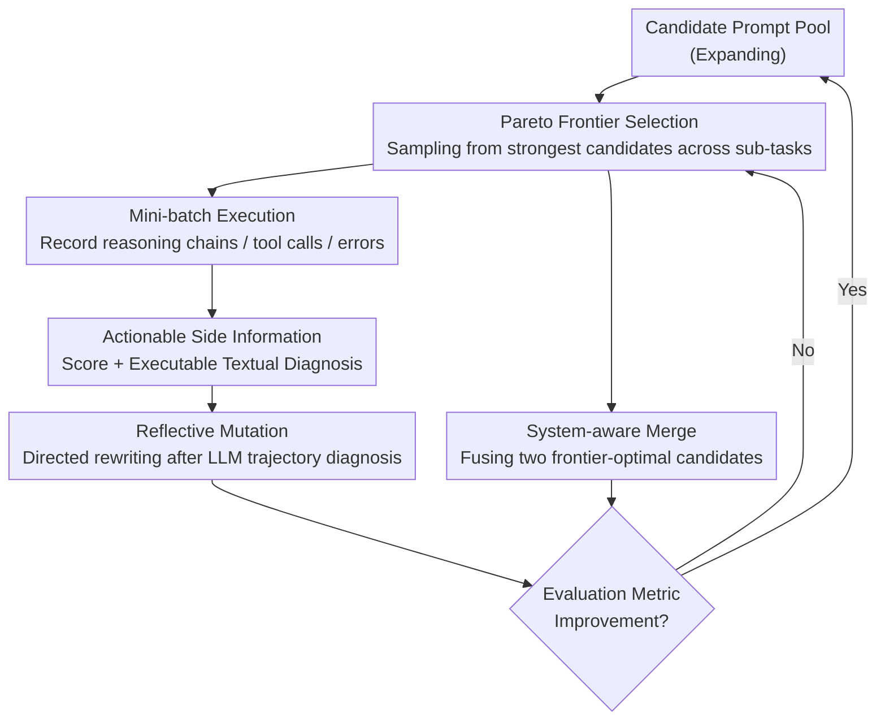

# GEPA: Reflective Prompt Evolution Can Outperform Reinforcement Learning

**Conference**: ICLR 2026 (Oral)  
**arXiv**: [2507.19457](https://arxiv.org/abs/2507.19457)  
**Code**: [https://github.com/gepa-ai/gepa](https://github.com/gepa-ai/gepa)  
**Area**: Interpretability  
**Keywords**: Prompt Optimization, Evolutionary Search, Natural Language Reflection, Pareto Frontier, GRPO Alternative  

## TL;DR
The study proposes GEPA (Genetic-Pareto), a prompt optimizer that diagnoses issues and iteratively optimizes prompts through natural language reflection based on a small number of execution trajectories. It outperforms GRPO by an average of 6% (up to 20%) across six tasks while using only 1/35 of the sampling volume.

## Background & Motivation
Large Language Models are increasingly adapted for downstream tasks using reinforcement learning methods (such as GRPO). However, methods like GRPO typically require thousands of rollouts, compressing rich execution trajectories into sparse scalar reward signals—a process that discards substantial information.

Language itself is a highly interpretable medium that naturally contains much richer learning signals than scalar rewards. An LLM's reasoning chain, tool-calling process, and error messages contain implicit diagnostic clues regarding "why it failed," yet RL methods discard these in favor of a single score.

**Key Challenge**: RL methods (GRPO) require massive rollouts but only utilize scalar rewards vs. natural language carrying significantly richer learning signals than scalar rewards.

**Key Insight**: Given that LLMs can comprehend execution trajectories, why not allow the LLM to directly reflect on failure causes and propose improvements, achieving high-efficiency optimization with minimal sampling?

**Core Idea**: Model prompt optimization as an evolutionary search process with reflection. Leverage LLMs to read complete execution trajectories for "gradient-equivalent" diagnosis and repair, maintaining diversity through a Pareto frontier.

## Method
GEPA models "prompt optimization" as a natural language-driven evolutionary search: maintaining a candidate prompt pool, selecting a candidate to run on a mini-batch of tasks, recording its reasoning chains, tool calls, and errors, and then employing an LLM reflector to analyze the trajectory, diagnose issues in text, and rewrite a new prompt accordingly. The entire process does not modify model weights or calculate gradients, relying instead on a closed loop of "Execute—Reflect—Mutate—Evaluate" to retain high-quality prompts.

### Overall Architecture
In each round, the system completes a cycle of "Selection $\to$ Batch Execution $\to$ Trajectory Reflection $\to$ Prompt Rewriting $\to$ Score-based Retention." During this process, two components are maintained: an expanding pool of candidate prompts and a Pareto frontier recording "which candidates are strongest on which tasks." Each round starts by sampling a candidate from the frontier to serve as a mutation target. Following execution on a mini-batch to extract "Score + Textual Diagnosis" feedback, the reflector performs directed rewriting of the prompt. Two specialized candidates on the frontier can also be merged into a complementary new candidate. New candidates are only accepted and added back to the pool (updating the frontier) if evaluation metrics show genuine improvement. The search progresses across diverse candidates until the sampling budget is exhausted.

### Key Designs

**1. Pareto Frontier Selection: Maintaining Candidate Diversity via a Multi-objective Perspective**

Each round begins by deciding "which candidate to mutate." If one only selects based on average scores, the search quickly converges to a single prompt style, potentially overlearning one sub-task while discarding variants that performed exceptionally on others. GEPA instead maintains a Pareto frontier, tracking candidates that are strongest across different task subsets. When selecting mutation targets, it samples from this frontier. Thus, even if a candidate has a lower overall average score, it is preserved for further propagation as long as it excels in a specific category of problems, allowing the search to explore multiple directions simultaneously without premature convergence.

**2. Actionable Side Information (ASI): Replacing Scalar Rewards with Executable Textual Diagnoses**

After running a mini-batch for a selected candidate, the content of the feedback determines how much can be learned. The fundamental inefficiency of RL methods lies in compressing an information-rich trajectory into a scalar score; the model learns "how well it performed" but not "why." GEPA requires the evaluator to return a diagnostic feedback alongside the score—error messages, performance profiling, reasoning logs, failure causes from unit tests, etc. This text acts as a "gradient" in text optimization: it directly identifies the specific point of failure, allowing the reflector to perform directed modifications rather than blind trial-and-error. Because each execution extracts such high-density learning signals, GEPA achieves improvements in just hundreds of evaluations that RL would require tens of thousands of rollouts to approximate.

**3. Reflective Mutation: LLM Diagnosis before Rewriting instead of Random Perturbation**

Once ASI is obtained, the prompt must be modified. Evolutionary search typically relies on random mutation, but the prompt space is vast, leading to extremely low hit rates for random rewrites. GEPA's mutation is diagnosis-based: the reflector reads the failure trajectory and ASI, answers "why this prompt failed on this problem type," and translates the answer into specific revisions. It also incorporates lessons accumulated from all ancestor candidates to avoid repeating the same mistakes. This "diagnosis-before-revision" directed mutation is the core reason GEPA's sample efficiency is significantly higher than RL.

**4. System-aware Merge: Complementing the Strengths of Two Distinct Bloodlines**

Beyond single-line mutation, situations often arise where two candidates on the frontier each excel at a different set of tasks. Simple mutation rarely combines these strengths effectively. GEPA introduces a merge operator: the LLM analyzes why two Pareto-optimal candidates succeeded in their respective tasks and generates a new candidate fusing both strategies. For complex systems containing multiple prompt modules, this step is particularly critical—it assembles optimized components from different modules into a stronger overall version.

### Loss & Training
GEPA involves no gradients or loss functions. Whether a new candidate is accepted depends entirely on evaluation metrics: by default, any improvement is accepted, though thresholds or statistical significance requirements can be applied. A typical budget is 100–500 evaluations, whereas the comparative GRPO often requires over 5,000–25,000 rollouts. Since it relies solely on API-level calls without needing access to model weights, GEPA can directly optimize closed-source models like GPT-5, Claude, or Gemini—a feat impossible for RL methods based on policy gradients.

## Key Experimental Results

### Main Results

| Task | Metric | GEPA | GRPO | MIPROv2 | Gain (vs GRPO) |
|------|------|------|------|---------|---------------|
| 6-Task Average | Accuracy | - | - | - | +6% avg, up to +20% |
| AIME-2025 | Accuracy | - | - | - | +12% (vs MIPROv2) |
| GPT-4.1 Mini + AIME | Accuracy | 56.6% | - | 46.6% | +10pp |
| DSPy MATH | Accuracy | 93% | - | 67% | - |
| ARC-AGI | Accuracy | 89% | - | 32% | - |

### Ablation Study

| Config | Key Metric | Description |
|------|---------|------|
| Full GEPA | Best | Reflection + Pareto + Merge all enabled |
| No Reflection | Sig. Drop | Degenerates into random search |
| No Pareto Selection | Diversity Loss | Prone to local optima |
| No System Merge | Moderate Drop | Unable to complement advantages across sub-tasks |

### Key Findings
- The number of rollouts used by GEPA is only 1/35 of those used by GRPO, yet average performance is 6% higher.
- It outperforms the leading prompt optimizer MIPROv2 by 12% on AIME-2025.
- The generated optimized prompts are human-readable and contain detailed problem-solving strategies.
- It demonstrates potential as a test-time search strategy for code optimization.
- It has been integrated into mainstream frameworks such as DSPy, MLflow, OpenAI Cookbook, Google ADK, and HuggingFace.

## Highlights & Insights
- Replacing scalar rewards with natural language reflection is a profound rethink of the RL paradigm—language itself is the best gradient.
- Extremely low sample requirements (100-500 evaluations) enable the optimization of API models (GPT-5, Claude) without weight access.
- Generated prompts act as interpretable "pre-computed reasoning plans" that can be directly audited and understood.
- Pareto frontier maintenance is an elegant solution to avoid overfitting.

## Limitations & Future Work
- Dependency on high-quality reflection models (usually requiring GPT-5 level), which is not inexpensive.
- For tasks requiring large-scale weight updates (e.g., knowledge injection), prompt optimization has a limited ceiling.
- Randomness in the search process may result in variance between different runs.
- Fairness in comparison with RL is debatable—the optimization targets differ (prompts vs. weights).
- For ultra-long prompts (thousands of tokens), the quality of reflection and mutation may degrade.
- The design of the evaluation metric significantly impacts final results; GEPA cannot optimize if the metric is poor.
- In tasks requiring precise control over internal model representations, such as safety alignment, the limitations of prompt optimization are more pronounced.

## Related Work & Insights
- **vs. GRPO/PPO**: GRPO optimizes model weights via policy gradients, requiring massive rollouts; GEPA optimizes prompt text, replacing gradients with reflection.
- **vs. MIPROv2**: Previously the strongest prompt optimizer; GEPA surpasses it by 10%+ on tasks like AIME via ASI and Pareto search.
- **vs. TextGrad**: TextGrad also uses textual feedback but adopts gradient emulation; GEPA’s evolutionary search + reflection is more efficient.

## Rating
- Novelty: ⭐⭐⭐⭐⭐ The paradigm of replacing RL scalar rewards with natural language reflection is highly inspiring and well-deserving of an ICLR Oral.
- Experimental Thoroughness: ⭐⭐⭐⭐ Validated across six tasks with comprehensive comparisons against GRPO and MIPROv2.
- Writing Quality: ⭐⭐⭐⭐⭐ Motivation is clearly articulated; the method is intuitive and easy to understand.
- Value: ⭐⭐⭐⭐⭐ Has already seen large-scale industrial adoption (Shopify, Databricks, OpenAI, etc.), indicating significant practical impact.

<!-- RELATED:START -->

## Related Papers

- [\[ICLR 2026\] Learning Nonlinear Causal Reductions to Explain Reinforcement Learning Policies](learning_nonlinear_causal_reductions_to_explain_reinforcement_learning_policies.md)
- [\[ICLR 2026\] Reinforcement Learning Fine-Tuning Enhances Activation Intensity and Diversity in the Internal Circuitry of LLMs](reinforcement_learning_fine-tuning_enhances_activation_intensity_and_diversity_i.md)
- [\[NeurIPS 2025\] Understanding Prompt Tuning and In-Context Learning via Meta-Learning](../../NeurIPS2025/interpretability/understanding_prompt_tuning_and_in-context_learning_via_meta-learning.md)
- [\[ICLR 2026\] Evolution of Concepts in Language Model Pre-Training](evolution_of_concepts_in_language_model_pre-training.md)
- [\[ICML 2026\] Interpretability Can Be Actionable](../../ICML2026/interpretability/interpretability_can_be_actionable.md)

<!-- RELATED:END -->
