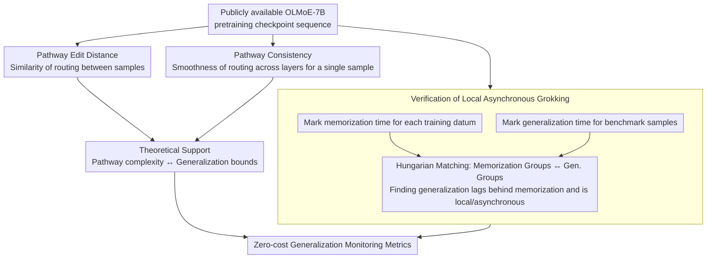

# Grokking in LLM Pretraining? Monitor Memorization-to-Generalization without Test

**Conference**: ICLR 2026  
**arXiv**: [2506.21551](https://arxiv.org/abs/2506.21551)  
**Code**: None  
**Area**: Interpretability  
**Keywords**: grokking, memorization, generalization, MoE pathway, pretraining dynamics

## TL;DR
This paper validates the grokking phenomenon—characterized by asynchronous memorization across different data groups and delayed generalization—for the first time in near-single-pass pretraining of actual-scale LLMs (7B MoE). By analyzing the evolution of MoE routing pathways (from instance-specific to structured/shared), the authors propose two zero-cost metrics to monitor generalization progress without the need for instruction tuning or benchmark evaluation.

## Background & Motivation

**Background**: Grokking (delayed generalization) is a counterintuitive phenomenon observed when training Transformers, where generalization performance improves sharply long after the training loss has converged. Existing grokking studies are limited to small models trained on algorithmic data over thousands of epochs.

**Limitations of Prior Work**: (a) LLM pretraining is near-single-pass (~1 epoch) without repeated data playback, and its loss convergence mechanism differs significantly from multi-epoch training; (b) LLMs are trained on heterogeneous cross-domain data, where the relationship between memorization speed and generalization might vary; (c) monitoring LLM generalization performance is extremely costly, requiring instruction tuning followed by benchmark evaluation.

**Key Challenge**: What internal changes occur in the model after the pretraining loss converges? Why does generalization improve while the loss remains stable? Are there metrics to track generalization without relying on external evaluations?

**Goal** (a) Verify whether grokking exists in actual LLM pretraining; (b) reveal the internal mechanisms of the transition from memorization to generalization; (c) provide zero-cost generalization monitoring metrics.

**Key Insight**: MoE architectures naturally organize computation into sequences of expert choices (pathways). This allows tracking the evolution of each sample's pathway—from random or instance-specific (memorization) to structured and shared across samples (generalization).

**Core Idea**: Grokking exists in LLM pretraining in a local and asynchronous form; the evolution of MoE pathways from individual-specific to cross-sample shared serves as an observable signal of the transition from memorization to generalization.

## Method

### Overall Architecture
The paper does not train new models but instead dissects a sequence of publicly available OLMoE-7B pretraining checkpoints as "time slices." The analysis follows two tracks: first, it calibrates "when data is memorized" for training data and "when benchmark samples are answered correctly" across these checkpoints. By aligning the two, it verifies how grokking occurs. Second, it focuses on the MoE routing pathways—the sequence of experts selected for each sample across layers—quantifying their evolution through two metrics that only require training data. Finally, a theoretical analysis of a single-layer MoE links pathway complexity to generalization bounds, proving that these two metrics are strongly correlated with downstream generalization and can serve as zero-cost monitoring signals.

### Key Designs

**1. Verification of Local Asynchronous Grokking: Proving that grokking exists in real pretraining but is not globally synchronized**

Original grokking research was conducted on small models and algorithmic data over thousands of epochs, which does not confirm its existence in near-single-pass, cross-domain LLM pretraining. The authors assign a memorization time point $t_i^*$ (the step where loss drops to convergence) to each training sample and group data accordingly. Simultaneously, they group benchmark samples by the time they flip from "wrong" to "correct" and use Hungarian matching to pair memorization groups with generalization groups. Results show that different data groups are memorized at different steps, and generalization generally lags behind memorization—with the lag varying by data type: math and code tasks require memorizing more samples before generalization starts, while commonsense QA generalizes faster with less memorization. This indicates that grokking in LLMs does not happen as a global flip but unfolds locally and heterogeneously.

**2. Pathway Edit Distance: Capturing the shift from individualized to shared knowledge via inter-sample pathway similarity**

To transform the "memorization → generalization" transition into an observable signal, the authors focus on discrete MoE routing. For each sample, the sequence of selected experts across layers is concatenated into a pathway string $s_i = \text{concat}(e_1^{(i)}, ..., e_L^{(i)})$. The Levenshtein edit distance $D_{path}(s_i, s_j)$ is then used to measure how similar the paths of any two samples are. Over the course of training, this produces a three-stage curve: early on, all sample pathways are nearly identical (low distance, no differentiation) → during the memorization phase, pathways differentiate (distance increases as samples take unique paths) → **after memorization, the edit distance drops**—semantically related samples begin to converge to similar pathways. This drop marks the emergence of "shared knowledge," where the model stops assigning a unique path to every sample and instead extracts and reuses transferable structures.

**3. Pathway Consistency: Characterizing pathway structure via intra-sample layer-wise routing smoothness**

While edit distance transitions between samples, this metric focuses on the interior of a single sample: whether experts selected in adjacent layers "work in coordination." The authors calculate the weighted cosine similarity of selected expert embeddings between adjacent layers as the layer-wise consistency of the pathway. Training dynamics show that consistency continues to rise after memorization—expert selection becomes smoother and more structured across layers rather than being a random concatenation. Combined with edit distance, it confirms that pathways become better organized during the generalization phase.

**4. Theoretical Support: Linking pathway complexity to generalization bounds**

To demonstrate that the empirical metrics are not coincidental, the authors conduct a theoretical analysis on a single-layer MoE, establishing a link between pathway complexity and generalization bounds: more structured pathways (lower edit distance, higher consistency) correspond to tighter generalization bounds. This provides a formal basis for using structured pathways as an indicator of better generalization.

### Loss & Training
- The study analyzes 10 equally spaced pretraining checkpoints of OLMoE-7B, all based on public weights without retraining.
- Generalization Evaluation: Each checkpoint undergoes LoRA instruction tuning followed by standard benchmarks to obtain "ground truth generalization" as a reference.
- The two pathway metrics are calculated only on training data, requiring no instruction tuning or benchmarks, thus serving as zero-cost monitoring signals.

## Key Experimental Results

### Main Results

**Verification of Grokking Phenomenon** (4 domains × multiple data groups):

| Domain | Gen. Lag after Memorization | Data Difficulty Effect |
|--------|-----------------------------|------------------------|
| Math | Long lag (requires many samples memorized) | Later memorization leads to longer lag |
| Code | Long lag | Same as above |
| Commonsense QA | Short lag | Relatively easy to generalize |
| Domain QA | Medium lag | Medium |

### Ablation Study

| Metric | Correlation with Generalization | Description |
|--------|---------------------------------|-------------|
| Pathway Edit Distance | Strong Negative | Distance decrease → Gen. increase |
| Pathway Consistency | Strong Positive | Consistency increase → Gen. increase |
| Training Loss | No Significant Correlation | Loss convergence does not predict generalization |

### Key Findings
- **Grokking does exist in LLM pretraining**, but it is local and asynchronous—different data groups have different time points for memorization and generalization.
- **Training loss cannot predict generalization**: Generalization continues to improve after loss converges, with the magnitude varying by domain and difficulty.
- **Pathway Transition from Individualized to Structured**: After memorization, the model continues to "memorize smarter" by discovering transferable knowledge structures across samples.
- **Depth-Dependent Reorganization**: Pathways in shallow layers become shared first (universal representations), while deep layers reserve more flexibility (task specialization).
- **High Correlation of Pathway Metrics with Generalization**: These can serve as zero-cost tools for monitoring generalization.

## Highlights & Insights
- **"Memorizing Smarter"**: Loss convergence does not mean learning has stopped. The model continues to discover more efficient encoding methods (shared pathways), explaining why continued training improves generalization.
- **MoE as an Interpretability Tool**: The discrete nature of expert routing naturally provides a window into computational allocation, which is impossible in dense models.
- **Utility of Zero-Cost Monitoring**: For LLM developers, determining when to stop pretraining without the need for instruction tuning and benchmarks is extremely valuable.
- **Local Grokking Suggests Curriculum Design**: The varying memorization-to-generalization lag across data types suggests that data mixing strategies can be optimized based on these dynamics.

## Limitations & Future Work
- Analysis was only performed on OLMoE-7B; grokking behavior in larger models or dense architectures remains unverified.
- Pathway metrics depend on MoE architecture and cannot be directly generalized to dense Transformers.
- The choice of instruction tuning (LoRA vs. full-finetune) might affect generalization measurements.
- Causal relationship is not fully established—is pathway sharing the cause of generalization or its result?

## Related Work & Insights
- **vs. Power et al. (Original Grokking)**: Small models + algorithmic data + thousands of epochs. This paper is the first to verify it in 7B MoE + near-single-pass pretraining, discovering local asynchronous patterns.
- **vs. Nanda et al. (Grokking Mechanism)**: Explanation via weight analysis. This paper uses MoE pathway analysis, which is more suitable for large-scale models.
- **vs. Merrill et al. (Subnetwork Sparsity)**: Relates grokking to sparsity in ReLU networks. The pathway structuring in this paper mirrors this idea but within the MoE framework.

## Rating
- Novelty: ⭐⭐⭐⭐⭐ First systematic study of grokking in real-scale LLM pretraining, discovering local asynchronous modes.
- Experimental Thoroughness: ⭐⭐⭐⭐ Analysis across 4 domains × multiple data groups + layer-wise analysis + theoretical support, but limited to one model.
- Writing Quality: ⭐⭐⭐⭐⭐ Rigorous derivation of motivation; the step-by-step revelation of findings is highly engaging.
- Value: ⭐⭐⭐⭐⭐ Fundamental contribution to understanding LLM training dynamics + practical generalization monitoring tools.

<!-- RELATED:START -->

## Related Papers

- [\[ICML 2026\] Memorization Dynamics of Fill-in-the-Middle Pretraining](../../ICML2026/interpretability/memorization_dynamics_of_fill-in-the-middle_pretraining.md)
- [\[ICLR 2026\] Specialization after Generalization: Towards Understanding Test-Time Training in Foundation Models](specialization_after_generalization_towards_understanding_test-time_training_in_.md)
- [\[ICML 2026\] Grokking: From Abstraction to Intelligence](../../ICML2026/interpretability/grokking_from_abstraction_to_intelligence.md)
- [\[ACL 2026\] Crosscoding Through Time: Tracking Emergence & Consolidation Of Linguistic Representations Throughout LLM Pretraining](../../ACL2026/interpretability/crosscoding_through_time_tracking_emergence_consolidation_of_linguistic_represen.md)
- [\[ICLR 2026\] Evaluating SAE Interpretability Without Generating Explanations](evaluating_sae_interpretability_without_generating_explanations.md)

<!-- RELATED:END -->
