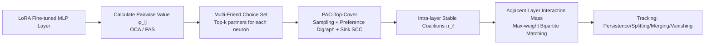

# Hedonic Neurons: A Mechanistic Mapping of Latent Coalitions in Transformer MLPs

**Conference**: ICLR 2026  
**OpenReview**: [https://openreview.net/forum?id=v6HPsCu2R8](https://openreview.net/forum?id=v6HPsCu2R8)  
**Code**: [https://github.com/TaKneeAa/hedonicNeurons](https://github.com/TaKneeAa/hedonicNeurons)  
**Area**: Mechanistic Interpretability / Cooperative Game Theory / LLM Internal Representations  
**Keywords**: hedonic game, neuron coalition, PAC-stable, LoRA, MLP, synergy, mechanistic interpretability  

## TL;DR
By treating neurons in Transformer MLPs as "rational players" in a cooperative game, this work employs hedonic games and the PAC-Top-Cover algorithm to identify neuron coalitions where "joint ablation effects superimpose non-linearly." This reveals how LoRA fine-tuning encodes task features within synergistic neuron groups.

## Background & Motivation
- **Background**: LoRA fine-tuning teaches LLMs new tasks with minimal parameters, and these new features are primarily concentrated in mid-layer MLPs. However, LoRA's low-rank updates "diffuse" new feature directions across thousands of neurons, leaving the weight updates structurally opaque to manual inspection.
- **Limitations of Prior Work**: Existing interpretability tools focus on "individual units" or "statistical proximity." Probing captures correlations between neurons and labels but ignores synergy; SAEs decompose activations into monosemantic directions but erase non-linear dependencies; clustering groups neurons by statistical similarity rather than functional interaction. None address the core question: **Which neuron subsets are synergistic (joint contribution > sum of individual contributions)?**
- **Key Challenge**: Features are not computed by isolated neurons but by "partnerships" of neurons. However, enumerating all $2^{n-1}$ possible subsets to find coalitions is computationally infeasible.
- **Goal**: Provide a theoretically grounded and scalable framework to automatically discover stable synergistic coalitions within MLP layers and track their evolution (persistence, splitting, merging, vanishing) across depths.
- **Core Idea**: **[Game Theory Analogy]** SGD exerts "selection pressure" on neurons—only directions that reduce loss survive, and many neurons are only useful when combined. Thus, neurons can be viewed as agents in a hedonic game where utility measures "how much my survival depends on synergy with others." **Stable coalitions = groups of neurons that survived together during training.**

## Method

### Overall Architecture
The method consists of two stages: first, formalizing the search for synergistic coalitions within a single layer as a cooperative game with hedonic utility, solved via the PAC-Top-Cover algorithm to find PAC-stable neuron partitions; second, using maximum weight bipartite matching to connect coalitions in adjacent layers and track how these "meta-neurons" evolve with depth.

### Key Designs

**1. Pairwise Value Functions: Complementary OCA and PAS Routes** — The process begins by estimating a synergy score $\phi_{ij}$ for each neuron pair $(i,j)$, where positive values indicate synergy and negative values indicate redundancy. The structural heuristic OCA (Orthogonal-Co-Activation) assumes neurons calculating complementary features have "orthogonal weights but correlated activations": $\phi_{OCA}(i,j)=(1-|\cos(W_i,W_j)|)\,\rho(a_i,a_j)$, where $\rho$ is the Pearson correlation of activations. The functional PAS (Pairwise Ablation Synergy) directly measures second-order interactions by ablating neurons back to pre-LoRA weights: $\Delta_{ij}(x)=\ell(x)-\ell_{-i}(x)-\ell_{-j}(x)+\ell_{-(i,j)}(x)$, with $\phi_{PAS}(i,j)=\mathbb{E}_x[\Delta_{ij}(x)]$. Positive values indicate that "joint ablation changes the loss more than the sum of individual ablations." To scale for large $n$, PAS is approximated using the mixed second derivative $\partial^2\ell/\partial a_i\partial a_j$ multiplied by activation differences. These two routes examine the robustness of the framework from structural and functional perspectives.

**2. Multi-Friend Choice Sets for Tractability (Top-Responsiveness)** — Since enumerating all preferences is impossible, the game is restricted to be top-responsive: each neuron only cares about its top-k partners. Specifically, the choice set of neuron $i$ within coalition $S$ consists of its $k$ highest-scoring partners: $\mathrm{Ch}(i,S)=\arg\max_{T\subseteq S\setminus\{i\},|T|=k}\sum_{j\in T}\phi_{ij}$, and utility is normalized as $u_i(S)=\frac{1}{k}\sum_{j\in\mathrm{Ch}(i,S)}\phi_{ij}$. This allows neurons to compare only their most valuable sets of partners rather than all possible groupings, capturing "multi-partner synergy" where a neuron is meaningful only when several complementary features are present.

**3. PAC-Top-Cover: Scalability via Sampling + Stability Guarantees** — This is the engine for solving the game. It repeatedly samples coalitions from a distribution $D$ (sampling size $s$, then a uniform subset of that size), retains the coalition $T_i^\star$ with the highest MFC utility for each player, and estimates the choice set $B_i$ based on top-k outcomes. A preference digraph is constructed ($i\to j$ if $j\in B_i$), and **sink strongly connected components** (closed under the choice set) are output as coalitions. Nodes are then removed, and the process iterates. Theoretically, only $m=\mathrm{poly}(n,1/\epsilon,\log(1/\delta))$ samples are needed to obtain an $\epsilon$-PAC stable partition with probability $\ge 1-\delta$, meaning the probability of observing a blocking coalition under distribution $D$ is $\le\epsilon$. This provides theoretical support that the discovered coalitions reflect robust cooperative structures.

**4. Cross-layer Tracking: Interaction Mass + Max-weight Matching** — Treating coalitions as "meta-neurons," their evolution across depths is analyzed. For coalition pairs $(C,C')$ in adjacent layers, interaction mass is defined as $M(C,C')=\frac{1}{|C||C'|}\sum_{p\in C}\sum_{q\in C'}(W^{(\ell+1)}_{up}[q,p]+W^{(\ell+1)}_{gate}[q,p])\cdot A_p$, covering both additive (up) and gated multiplicative (gate × SiLU) pathways, normalized by coalition size. A bipartite matrix of these masses is solved via maximum weight matching to align coalitions. Transitions are categorized based on the ratio of source output to target input ($\alpha$) and target input from source ($\beta$): persistence (both high), splitting (low $\alpha$, high $\beta$), merging (high $\alpha$, low $\beta$), and vanishing (both low). This step is exploratory, as residual connections allow neurons to influence all deeper layers.

## Key Experimental Results

Models: LLaMA-3.1-8B, Mistral-7B-v0.1, and Pythia-6.9B, all fine-tuned using LoRA (rank 8) on MLP layers 7–14. Tasks: Three scalar objectives from MS MARCO — CQTR (Query Term Coverage), Mean-TF/L (Length-normalized Mean Term Frequency), and RM (Supervised Ranking, NDCG). OOD evaluation on TREC DL-19/20.

### Main Results (Extrinsic Evaluation: OOD Drop ↑ and Feature Alignment $R^2$ ↑)

| Task/Algorithm | LLaMA OOD Drop | LLaMA Align $R^2$ | Mistral OOD Drop | Pythia Align $R^2$ |
|---|---|---|---|---|
| K-means | 0.02 | 0.12 | 0.03 | 0.11 |
| Hier. clustering | 0.03 | 0.15 | 0.03 | 0.13 |
| Hedonic (OCA) | 0.07 | 0.41 | 0.09 | 0.45 |
| **Hedonic (PAS)** | **0.11** | **0.58** | **0.13** | **0.63** |

(Selected data for CQTR; for RM, Hedonic-PAS reaches OOD Drop of 0.14–0.17 and Align $R^2$ of 0.63–0.67). Jointly ablating a hedonic coalition causes a performance drop **3–5×** larger than clustering. Activation alignment with IR heuristics (BM25/IDF/Coverage) improves from $R^2 \approx 0.11\text{--}0.18$ to $0.55\text{--}0.67$.

### Ablation Study (Predictive Power: Coalition as Macro-features for Ridge Regression, OOD $R^2$ ↑)

| Algorithm | CQTR | Mean-TF/L | RM |
|---|---|---|---|
| Random | 0.08 | 0.09 | 0.12 |
| K-means | 0.16 | 0.15 | 0.21 |
| Hier. clustering | 0.18 | 0.17 | 0.21 |
| Hedonic (OCA) | 0.34 | 0.33 | 0.38 |
| **Hedonic (PAS)** | **0.43** | **0.42** | **0.47** |

Using coalitions as macro-features, PAS achieves 2–3× the OOD $R^2$ of clustering, with OCA consistently second. This indicates that utility-respecting synergy produces robust transferable features.

### Key Findings
- **Cross-layer Dynamics (Layers 7→14)**: Vanishing dominates (typically 60–75% of coalitions disappear in the next layer), splits are common (20–50%), merges are nearly zero, and persistence is generally <12%. This supports the claim that **deep MLPs primarily perform feature filtering/refinement rather than creation**; once synergistic units are formed, they are mostly pruned or refined rather than fused.
- Mean-TF/L shows the most aggressive pruning (vanishing >70%), aligning with the intuition that simple frequency statistics are isolated early and discarded later.
- Confidence intervals are consistently narrow across three seeds.

## Highlights & Insights
- **First application of cooperative game theory at the neuron level**: Employs hedonic games and PAC stability—tools with theoretical guarantees—to discover and track synergistic neuron groups in fine-tuned LLMs. The perspective is novel and consistent with training dynamics (SGD selection pressure ↔ stable coalitions).
- **Beyond disentanglement to "higher-order structures"**: Unlike SAEs which re-express activation space, hedonic coalitions treat neurons as fundamental units rooted in weight geometry and preference structures, capturing non-linear synergies invisible to SAEs or clustering.
- **Dual Causal + Semantic Validation**: Coalitions are functionally indispensable (ablation causes significant OOD degradation) and semantically interpretable (aligned with BM25/IDF), avoiding post-hoc "storytelling."
- **Actionable Insights from "Meta-neuron" Tracking**: Coalition-level persistence/splitting/vanishing points toward interventions at the coalition granularity (editing, merging, transfer) rather than individual weights.

## Limitations & Future Work
- **Local Cross-layer Dynamics**: Because interaction mass only looks at adjacent layers, it likely underestimates long-range interactions mediated by residual connections. Cross-layer tracking is explicitly characterized as "exploratory."
- **High Computational Cost for PAS**: Estimating PAS values requires second-order interactions/mixed derivatives. PAC-Top-Cover takes 280 minutes under PAS (vs. 90 minutes for OCA) on 4×A100 GPUs, making full-model scaling expensive.
- **Narrow Task Scope**: Experiments focus on IR scalar output tasks and mid-layers (7–14). Generality to generation, classification, or other depths remains to be verified.
- **"Rational Agents" as Analogy**: Neurons are not actually rational; the framework's explanatory power relies on the assumption of SGD selection pressure. Causal claims should be treated with caution.

## Related Work & Insights
- **Mechanistic Interpretability**: Contrasts with probing, SAEs (Huben et al. 2024), and neuron clustering by explicitly modeling "synergy" rather than "correlation/monosemanticity/proximity."
- **Cooperative Games & PAC Stability**: Directly builds on hedonic games (Dreze & Greenberg 1980), Top-Covering algorithms for top-responsive games, and PAC stabilization (Sliwinski & Zick 2017).
- **LoRA & Mid-layer MLPs**: Motivated by observations (Hu et al. 2022, Nijasure et al. 2025) that LoRA primarily updates mid-layer MLPs.
- **Insight**: Treating "synergy/coalition" as a first-class citizen in interpretability suggests a hierarchical understanding of LLMs (Unit → Coalition → Coalition Dynamics).

## Rating
- Novelty: ⭐⭐⭐⭐⭐ First introduction of hedonic games + PAC stability to neuron-level interpretability.
- Experimental Thoroughness: ⭐⭐⭐⭐ Three models, three tasks, dual intrinsic/extrinsic evaluation; however, limited to IR tasks and mid-layers.
- Writing Quality: ⭐⭐⭐⭐ Clear chain of logic; persuasive analogies; formulas for PAS and interaction mass are dense but supported by appendices.
- Value: ⭐⭐⭐⭐ Provides "synergistic coalitions" as a new actionable analysis unit for understanding LoRA fine-tuning.

<!-- RELATED:START -->

## Related Papers

- [\[ICLR 2026\] Latent Concept Disentanglement in Transformer-based Language Models](latent_concept_disentanglement_in_transformer-based_language_models.md)
- [\[NeurIPS 2025\] Bigram Subnetworks: Mapping to Next Tokens in Transformer Language Models](../../NeurIPS2025/interpretability/bigram_subnetworks_mapping_to_next_tokens_in_transformer_language_models.md)
- [\[ICLR 2026\] Latent Thinking Optimization: Your Latent Reasoning Language Model Secretly Encodes Reward Signals in Its Latent Thoughts](latent_thinking_optimization_your_latent_reasoning_language_model_secretly_encod.md)
- [\[ICLR 2026\] Latent Planning Emerges with Scale](latent_planning_emerges_with_scale.md)
- [\[ICLR 2026\] Why Low-Precision Transformer Training Fails: An Analysis on Flash Attention](why_low-precision_transformer_training_fails_an_analysis_on_flash_attention.md)

<!-- RELATED:END -->
