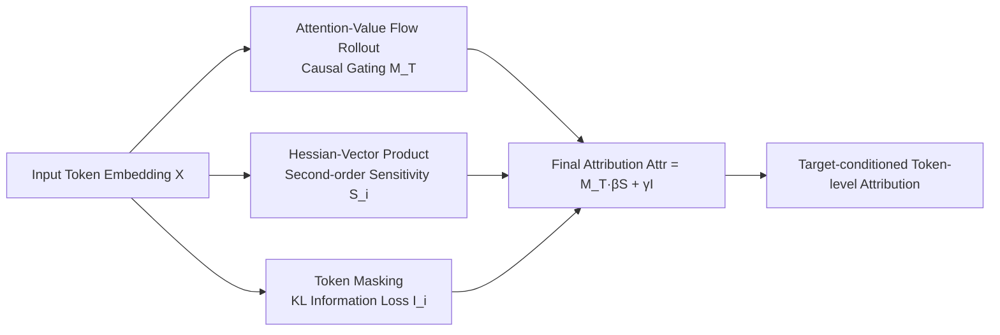

# Hessian-Enhanced Token Attribution (HETA): Interpreting Autoregressive LLMs

**Conference**: ICLR 2026  
**OpenReview**: [https://openreview.net/forum?id=XsEZcigEjq](https://openreview.net/forum?id=XsEZcigEjq)  
**Code**: [https://github.com/VishalPramanik/HETA](https://github.com/VishalPramanik/HETA)  
**Area**: Interpretability / Token Attribution  
**Keywords**: token attribution, decoder-only LLM, Hessian, second-order sensitivity, KL divergence, faithfulness  

## TL;DR
HETA integrates "causal semantic flow gating + Hessian second-order curvature sensitivity + KL information loss" into a unified token attribution score. Specially designed for decoder-only autoregressive LLMs, it significantly outperforms existing methods in faithfulness and robustness to decoding hyperparameters and syntactic paraphrasing.

## Background & Motivation
- **Background**: Classical feature attribution methods such as LIME, KernelSHAP, Integrated Gradients, Grad-CAM, and LRP are mostly designed for encoder architectures. They rely on local linear or first-order derivative approximations, assuming the model is approximately linear near the input.
- **Limitations of Prior Work**: This linear assumption collapses in autoregressive LLMs—token interactions are highly nonlinear and strongly context-dependent; attention weights only reflect "where the model looks" rather than "what truly influences the output," being susceptible to perturbations without altering predictions and ignoring multi-hop indirect paths in residuals/MLPs during cross-layer aggregation; first-order gradients completely miss influence in regions where gradients vanish but the function remains sensitive to finite perturbations.
- **Key Challenge**: Encoder models use bidirectional attention and require only a single attribution map; decoder-only models generate tokens autoregressively, requiring conditional attribution at each target position. Directly porting encoder-era methods is "non-trivial and often unfaithful," while recent generative methods like ContextCite, TDD, or Peering have downsides (sparse linear proxies are sensitive to redundancy and restricted to sentence-level; logit lens confuses correlation with causality; representation matching is only effective for verbatim segments).
- **Goal**: Construct a token-lever attribution framework that respects the causal and contextual structure of generative models while remaining stable across decoding settings and syntactic paraphrasing.
- **Core Idea**: **[Trilateral Integration of Second-Order + Causality + Information Theory]** Use causal rollout of attention-value flow as gating to ensure "target-oriented causal directionality," use Hessian-vector products to capture curvature sensitivity missed by first-order gradients, and use KL divergence to measure information loss of the output distribution when a token is masked. The unified attribution score is formed by multiplying/adding these three components.

## Method

### Overall Architecture
HETA decomposes the "contribution of token $x_i$ to the predicted target token $x_T$" into three complementary components: semantic transfer influence (causal gating), Hessian second-order sensitivity, and KL information contribution. The final score treats gating as a causal mask and the curvature/information terms as internal intensities, resulting in target-conditioned, curvature-aware token-level explanations.

### Key Designs

**1. Semantic Flow Gating: Causal rollout ensuring "target-oriented" directionality.** To prevent posterior attention aggregation from misassigning importance to tokens with no causal connection to the output, HETA tracks attention-value flows that terminate only at position $T$ under the decoder's causal mask. For each layer $l$ and head $h$, target-conditioned rollout $\Phi^{(l,h)}(i\to T)$ is computed using the masked attention matrix $A^{(l,h)}$, value vectors $V^{(l,h)}$, and output projection $W_O^{(l,h)}$. Only paths "ending at $T$" are aggregated to obtain semantic transfer influence $M_T[i]=\frac{1}{Z}\sum_{l,h}\Phi^{(l,h)}(i\to T)\lVert V_i^{(l,h)}W_O^{(l,h)}\rVert_1$. It is simplex-normalized ($\sum_i M_T[i]=1$), assigning mass only to tokens with a causal path to $T$. Compared to pure attention, this encodes both "alignment" (attention) and "semantic intensity" (norm of value vectors).

**2. Hessian Second-Order Sensitivity: Discovering influence where gradients vanish.** The core motivation is the second-order Taylor expansion $f(x)=f(x_0)+\nabla f(x_0)^\top(x-x_0)+\tfrac12(x-x_0)^\top\nabla^2 f(\xi)(x-x_0)$. When first-order gradients are near zero in saturation regions (e.g., $w^\top x+b\ll0$ in $\log(1+e^{w^\top x+b})$), function changes are driven entirely by curvature encoded in the Hessian; first-order methods systematically underestimate or miss this influence. HETA takes the Hessian of the target log-probability with respect to embeddings: $H_T=\nabla^2_X\log P_\theta(x_T\mid x_{<T})$. Since explicitly constructing the $(Td)\times(Td)$ Hessian is infeasible, it uses the Hutchinson estimator combined with the Pearlmutter trick for Hessian-vector products (HVP) to estimate the sensitivity of each token block: $S_i^{(T)}\approx\frac1m\sum_k\lVert\Pi_i H_T(\Pi_i r_k)\rVert_1$ (where $r_k$ is a Rademacher vector restricted to the $i$-th block). Gauss-Newton/Fisher proxies can optionally enhance numerical stability. Operationally, it defaults to rank-64 block low-rank + 512-token window with 50% overlap (HETA-LR+WIN). For a 70B model, second-order terms are computed only for the last six layers, significantly reducing costs with minimal quality loss.

**3. KL Information Contribution: Quantifying output distribution shift via mask perturbation.** To provide a probabilistic interpretation of contribution, HETA masks each $x_i$ and compares the original target distribution $P_{\text{orig}}$ with the masked distribution $P^{(i)}_{\text{masked}}$ via KL divergence: $I(x_i\to x_T)=D_{KL}(P_{\text{orig}}\,\Vert\,P^{(i)}_{\text{masked}})$. This directly measures "how much prediction uncertainty changes after removing this token."

**4. Unified Attribution Score: Gating × (Curvature + Information).** The three are fused as $\mathrm{Attr}(x_i\to x_T)=M_T[i]\big(\beta S_i^{(T)}+\gamma I(x_i\to x_T)\big)$, where the gating $M_T[i]$ restricts attribution to tokens on causal paths and redistributes mass along them. $\beta,\gamma\ge0$ weight curvature sensitivity and information contribution (default 0.5 each). The resulting score is simultaneously causally grounded, curvature-aware, and robust for generative decoder-only models.

## Key Experimental Results

Settings: Four decoder-only models (Qwen2.5-3B, GPT-J-6B, Phi-3-Medium-14B, LLaMA-3.1-70B); LongRA / TellMeWhy / WikiBio benchmarks + a self-constructed 2000-entry mixed paragraph dataset; single A100-80GB GPU. Faithfulness used Soft-NC / Soft-NS; alignment used custom DSA metrics.

### Main Results: Faithfulness (Soft-NC↑ / Soft-NS↑, GPT-J 6B)

| Method | LongRA NC | LongRA NS | TellMeWhy NC | TellMeWhy NS | WikiBio NC | WikiBio NS |
|------|----------|----------|--------------|--------------|-----------|-----------|
| Integrated Gradients | 1.87 | 0.45 | 1.54 | 0.04 | 1.38 | 0.77 |
| Peering (PML) | 2.05 | 0.50 | 1.68 | 0.06 | 1.50 | 0.83 |
| Attention Rollout | 0.41 | -0.01 | 0.25 | -0.09 | 1.91 | 0.46 |
| ReAgent (Second best) | 1.68 | 0.37 | 1.45 | 0.36 | 1.22 | 0.39 |
| **HETA (Ours)** | **10.3** | **2.31** | **9.2** | **2.04** | **3.80** | **2.20** |

HETA's Soft-NC on LongRA/TellMeWhy is over 2x higher than the runner-up ReAgent; consistent trends are observed on Phi-3 and LLaMA.

### Alignment Experiment: DSA Metric (Distractor dataset, ↑ higher is better)

| Method | GPT-J | LLaMA | Phi-3 | Qwen2.5 |
|------|-------|-------|-------|---------|
| Integrated Gradients | -0.34 | -0.28 | -0.41 | -0.31 |
| Attention Rollout | -0.44 | -0.39 | -0.52 | -0.41 |
| ReAgent (Second best) | 3.60 | 3.78 | 3.35 | 3.50 |
| **HETA (Ours)** | **4.80** | **5.10** | **4.25** | **4.65** |

Gradient/attention-based methods show negative DSA when distractors are present, indicating an inability to isolate causal tokens; HETA achieves $DSA\ge4.2$ across all models.

### Ablation Study and Robustness

- **Component Ablation**: Removing semantic flow, Hessian, or KL components consistently decreases faithfulness and alignment, proving they are complementary.
- **Robustness to Decoding Hyperparameters** (Max relative change $\Delta\% \downarrow$): Across a grid of temperature/top-p/top-k/repetition penalty + 3 seeds, HETA's metrics show $\Delta\% < 1\%$, whereas all baselines exceed $2\%$.
- **Stress Testing**: HETA is globally optimal in Gaussian perturbation sensitivity ($\downarrow$), robustness to active/passive voice paraphrasing (Spearman $\uparrow$), and alignment F1 with GPT-4o/GPT-5 annotations ($\uparrow$).

### Key Findings
ReAgent consistently ranks second; SEA-CoT and Progressive Inference show moderate gains over traditional methods. First-order gradient and attention methods often give low or negative Soft-NS / DSA, confirming the core argument that "the linear assumption fails in autoregressive generation."

## Highlights & Insights
- **Explicit Motivation for Second-order Perspective**: Uses saturated activation counterexamples (gradient zero but Hessian non-zero) to provide a rigorous argument for "why curvature is needed," rather than just piling on terminology.
- **Tri-signal Orthogonal Complementarity**: Causal gating manages "direction," Hessian manages "nonlinear intensity," and KL manages "information theoretic impact." Ablations show all are indispensable.
- **Scalable Engineering**: HVP + Hutchinson + low-rank windowing + restricting second-order to final layers makes curvature attribution for 70B-scale models computationally feasible.
- **New Evaluation Benchmark + DSA Metric**: Uses NarrativeQA distractors concatenated with SciQ evidence segments to create "semantically rich but non-diagnostic" controls, enabling direct quantification of whether attribution lands on true predictive evidence (annotation F1=0.91, $\kappa=0.89$).

## Limitations & Future Work
- **Computational Cost**: Even with low-rank/windowing, second-order terms and per-token masked KL are more expensive than first-order methods; further approximations (e.g., only calculating the last six layers) are needed for ultra-long contexts or massive models.
- **Weight Tuning**: $\beta,\gamma$ default to 0.5; the optimal ratio might vary by task/model, and the paper does not provide an adaptive scheme.
- **Evaluation Dependency on LLM Labeling**: The gold standard for DSA relies on the intersection of GPT-4o/GPT-5 annotations, posing a risk of evaluation model bias.
- **Theoretical Guarantees**: Error bounds are in the appendix; the main text does not fully explore the bias-variance trade-off of HVP estimation under low-rank approximation.

## Related Work & Insights
- **Spectrum of Attribution Methods**: Transitions from the first-order paradigm (LIME/SHAP/IG/Grad-CAM/LRP) to generative-specific methods like ContextCite (sparse linear proxy), TDD (logit lens), Peering (representation matching), and ReAgent. HETA is positioned as the branch adding "second-order + causal gating."
- **Norm-based Attention** (Kobayashi et al. 2020) inspired the "attention $\times$ value norm" design in semantic flow.
- **Hessian Sensitivity** (Alvarez-Melis & Jaakkola, Dhamdhere et al.) concepts are migrated to the token embedding level with scalable estimation.
- **Insight**: For any scenario where "linear/first-order approximation fails," the trio of second-order signals + causal path constraints + information theoretic perturbation can serve as a universal enhancement template; its scalable HVP estimation is also applicable to other interpretability/optimization tasks requiring Hessians.

## Rating
- **Novelty**: ⭐⭐⭐⭐ — Fusing second-order curvature, causal attention flow, and KL information loss systematically with scalable HVP estimation for decoder-only attribution is novel and well-motivated.
- **Experimental Thoroughness**: ⭐⭐⭐⭐ — 4 models × multiple datasets × multiple baselines, covering faithfulness, alignment, ablation, and robustness to decoding/syntax. Robust coverage, though some results (Qwen) and error bounds are relegated to the appendix.
- **Writing Quality**: ⭐⭐⭐⭐ — Clear derivation of motivation (second-order Taylor + saturation counterexamples), good synergy between formulas and flowcharts, smooth logic.
- **Value**: ⭐⭐⭐⭐ — Provides a more faithful and stable attribution tool for autoregressive LLMs, alongside reusable evaluation benchmarks and the DSA metric, offering practical value to the interpretability community.

<!-- RELATED:START -->

## Related Papers

- [\[ICML 2026\] Towards Long-Horizon Interpretability: Efficient and Faithful Multi-Token Attribution for Reasoning LLMs](../../ICML2026/interpretability/towards_long-horizon_interpretability_efficient_and_faithful_multi-token_attribu.md)
- [\[ICML 2025\] On the Power of Context-Enhanced Learning in LLMs](../../ICML2025/interpretability/on_the_power_of_context-enhanced_learning_in_llms.md)
- [\[ICLR 2026\] Multiple Token Divergence: Measuring and Steering In-Context Computation Density](multiple_token_divergence_measuring_and_steering_in-context_computation_density.md)
- [\[ICLR 2026\] Thought Branches: Interpreting LLM Reasoning Requires Resampling](thought_branches_interpreting_llm_reasoning_requires_resampling.md)
- [\[ACL 2026\] Jacobian Scopes: Token-Level Causal Attributions in LLMs](../../ACL2026/interpretability/jacobian_scopes_token-level_causal_attributions_in_llms.md)

<!-- RELATED:END -->
