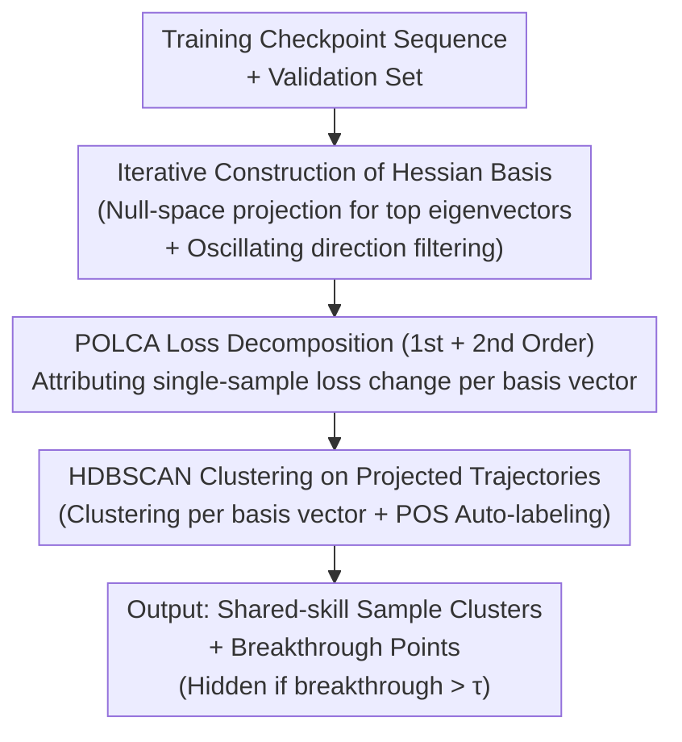

# Hidden Breakthroughs in Language Model Training

**Conference**: ICLR 2026  
**arXiv**: [2506.15872](https://arxiv.org/abs/2506.15872)  
**Code**: [GitHub](https://github.com/skangasl/POLCA)  
**Area**: Interpretability  
**Keywords**: Training dynamics, hidden phase transitions, loss decomposition, unsupervised interpretability, Hessian eigenvectors

## TL;DR

This paper proposes POLCA (Projection Oriented Loss Change Allocation)—a method to decompose single-sample loss changes along any orthogonal basis of the low-rank training subspace. It reveals numerous hidden conceptual breakthroughs from seemingly smooth training loss curves, shifting training interpretability from "pre-defining skills before observation" to "decomposition followed by automatic skill discovery."

## Background & Motivation

**Background**: During training, language models undergo various sudden phase transitions—emergence of in-context learning, acquisition of grammatical structures, and development of hierarchical generalization. These transitions are crucial for understanding learning mechanisms and guiding training strategies (e.g., data selection, learning rate scheduling). However, in practice, aggregated loss curves are extremely smooth, masking many phase transitions under a single scalar metric.

**Limitations of Prior Work**: Existing methods for identifying phase transitions almost exclusively follow a **top-down** paradigm: researchers pre-define a concept or skill (e.g., "carrying," "subject-verb agreement") and then monitor its dynamic changes during training. This approach fails to discover new, non-predefined skills and cannot handle cases where a single sample relies on multiple skills simultaneously (polygenic scaling effects).

**Key Challenge**: A smooth aggregated loss curve $\neq$ an absence of breakthroughs. Theoretical work by Saxe et al. (2019) predicted that the superposition of multiple sigmoidal phase transitions occurring at different times produces a smooth curve. The challenge lies in the lack of tools to reverse-engineer these hidden breakthroughs from smooth curves.

**Goal**: (1) How to automatically discover conceptual breakthroughs during training without pre-defining skills? (2) How to handle the entanglement of a single sample undergoing multiple skill breakthroughs? (3) How to decompose loss changes into interpretable gradient directions?

**Key Insight**: The authors observe that the training subspace is low-rank and that linearly connected checkpoints retain semantic capabilities, suggesting that linear decomposition is meaningful at the conceptual level. Projecting loss changes onto high-curvature Hessian directions allows each direction to potentially correspond to the acquisition of a "skill," thereby decoupling a single sample's loss change into multiple independent directions.

**Core Idea**: By decomposing the loss change of each sample along an orthogonal basis constructed from Hessian eigenvectors and then clustering the projected loss trajectories, one can unsupervisedly discover hidden conceptual breakthroughs within smooth training curves.

## Method

### Overall Architecture

The goal of POLCA is straightforward: the aggregated loss curve compresses countless individual phase transitions into a single smooth curve; POLCA aims to reverse this process to reveal when and along which direction each sample undergoes a breakthrough. The pipeline takes a sequence of training checkpoints and a validation set as input, and outputs "sample clusters grouped by shared learning events + their respective breakthrough points." This involves three steps: first, iteratively constructing an interpretable orthogonal basis from Hessian matrices to compress high-dimensional parameter movement into a low-rank subspace; second, decomposing each sample's loss change along these basis vectors (the POLCA step); and third, clustering samples based on their projected loss trajectories so that similar trajectories automatically reveal "shared skills."

A "breakthrough" is explicitly defined as the point of maximum loss acceleration: $\text{break}(f, x, \Delta) = \arg\max_t \big([f(x, t+\Delta) - f(x,t)] - [f(x,t) - f(x,t-\Delta)]\big)$. A cluster is identified as a "hidden breakthrough" if its average breakthrough onset occurs after a threshold $\tau$ (where $\tau$ marks the time the aggregated loss has entered a plateau). The value of POLCA lies in extracting these breakthroughs that were previously swallowed by the smooth curve.

### Key Designs

**1. Iterative Construction of Hessian Orthogonal Basis: Finding Semantically Meaningful Directions**

To decompose loss changes into "meaningful" directions, a high-quality basis is required. POLCA avoids using raw parameter axes (which lack semantics in high-dimensional space) and instead builds the basis using Hessian eigenvectors. At $T$ checkpoints, Hessian matrices are computed. For each new checkpoint, its Hessian is projected into the null space of the existing basis (to exclude previously captured directions), and the top $k$ eigenvectors are added to the basis, resulting in a $Tk$-dimensional subspace. The focus on top Hessian eigenvectors is because they correspond to directions of maximum curvature, often representing critical model decision boundaries. Finally, "oscillating directions"—basis vectors where the average projected loss increases rather than decreases over training—are filtered out as they represent local noise rather than long-term learning.

**2. POLCA Loss Decomposition (First & Second Order): Attributing Single-Sample Loss Changes**

With the basis established, loss changes for each sample at each step can be attributed to specific directions. POLCA introduces three modifications to the classic LCA (Loss Change Allocation). First, while LCA decomposes along parameter axes, POLCA allows for any orthogonal basis $b$. Second, while LCA aggregates over the entire dataset, POLCA operates at the single-sample level $x$ to identify breakthroughs affecting only specific subsets. Third, since the basis consists of high-curvature Hessian directions, first-order Taylor approximations incur significant errors, so a second-order correction is added. First-order POLCA is defined as:

$$\text{POLCA}_1(x, b; \theta_t) = \langle b, \nabla_\theta L(x;\theta_t)\rangle \, \langle b, \theta_{t+1}-\theta_t\rangle,$$

The second-order term uses a computationally efficient approximation by scaling global Hessian eigenvalues proportional to the sample's loss change to estimate per-sample Hessians, avoiding the catastrophic cost of computing per-sample Hessians directly. In synthetic addition experiments, using Hessian directions improved carrying-skill homogeneity from 0.792 (LCA) to 0.973.

**3. HDBSCAN Clustering of Projected Loss Trajectories: Grouping Shared Skills**

The final step identifies samples that undergo similar learning events. For each basis vector $b$ and sample $x$, the cumulative projected loss trajectory is calculated:

$$L_b(x, \theta_t) = \sum_{i=0}^{t-1} \text{POLCA}(x, b; \theta_i),$$

This creates a 1D time series. HDBSCAN is then used to cluster these trajectories for each basis vector. Before clustering, samples with increasing projected loss are filtered out. After clustering, POS (Part-of-Speech) tag templates are used to automatically label clusters. HDBSCAN is chosen over K-Means because it handles varying densities and identifies outliers. Clustering "per basis vector" is critical, as a single token can belong to different clusters across different directions, representing entanglement where a sample depends on multiple skills.

## Key Experimental Results

### Main Results 1: Synthetic Arithmetic Addition Task

A 3-layer 9M parameter Transformer was trained on 3-digit addition (e.g., "342+578=920"). The data involves 4 digit-position skills and 1 carrying skill. While digit skills have distinct loss curves, the carrying skill is invisible in the aggregated loss.

| Decomposition Strategy | Max Carrying Homogeneity↑ | Hidden Breakthrough Ratio↑ | Carrying Skill Recovery |
|---------|:---:|:---:|:---:|
| Exact Loss | 0.514 | 0.0 | ✗ |
| Exact Loss Change | 0.524 | 0.0 | ✗ |
| LCA (Lan et al., 2020) | 0.792 | 0.019 | Partial |
| **POLCA (Ours)** | **0.973** | **0.355** | **✓** |

POLCA recovers both digit and carrying skills using only the first two basis vectors; carrying homogeneity in the second basis vector cluster reaches 0.90. In contrast, clustering based on exact loss fails to distinguish samples requiring carrying from those that do not.

### Main Results 2: English Language Modeling

A 3-layer 40M parameter model was trained on Wikipedia data. Out of 30 basis vectors, 26 remained after filtering, and 22 contained at least one interpretable cluster.

| Basis Vector | Cluster Label | Content Example | Breakthrough Type |
|:---:|------|------|------|
| #13 Cluster 1 | Prepositions after initial clauses | "from", "and", "after" | Hidden Breakthrough |
| #13 Cluster 2 | Continuous newlines | "\n\n" at end of paragraphs | Early Breakthrough |
| #13 Cluster 3 | Comma after parenthetical phrase | Enumerated items after comma | Hidden Breakthrough |
| #23 Cluster 1 | Appositive noun phrases | e.g., "Air Force Instruction 36-2406: Officer and..." | Hidden Breakthrough |
| #23 Cluster 2 | Non-appositive comma phrases | List items, year enumerations | Reverse Hidden Breakthrough |

A key discovery is the "mirror phenomenon" in basis #23: Cluster 1 (appositives) and Cluster 2 (non-appositives) show opposite movements in projected loss. The acquisition of appositive skills coincides with a temporary drop in prediction accuracy for non-appositive tokens, suggesting these structures share a gradient direction but are learned competitively.

### Ablation Study

| Ablation Config | Carrying Homogeneity | Description |
|---------|:---:|------|
| POLCA Full Model (2nd order) | 0.973 | Optimal |
| POLCA 1st order | ~0.96 | Small difference, but worse theoretical bounds |
| No oscillation filtering | Significant drop | Oscillating directions create noisy clusters |
| K-Means instead of HDBSCAN | Poor | Fails to handle noise and varying density |
| LCA (Parameter axis) | 0.792 | Axis semantics are much weaker than Hessian directions |

### Key Findings

- **Phase transitions are ubiquitous**: Supports the hypothesis by Nanda et al. (2023). Even in late training stages where aggregated loss is flat, 35.5% of POLCA clusters exhibit hidden breakthroughs.
- **Skill separation occurs naturally in gradient space**: Different skills (e.g., carrying vs. digit position) are learned along different Hessian directions, providing an operational definition of "skills" via gradient geometry.
- **Competitive learning patterns**: Certain grammatical structures show opposing dynamics along the same basis vector, indicating a zero-sum learning trade-off.
- **Effectiveness of linear decomposition**: Despite using linear methods, the clusters are highly interpretable (22/26 bases), supporting the hypothesis that the training subspace is linearly separable.

## Highlights & Insights

- **Paradigm Flip—Bottom-up over Top-down**: Shifts training dynamics analysis from "hypothesize then verify" to "decompose then discover." This parallels Sparse Autoencoders (SAEs) in representation space: SAEs discover features, while POLCA discovers training skills.
- **Elegance of POLCA Decomposition**: By applying three precise modifications to LCA, the method remains theoretically grounded and computationally manageable. The second-order term approximation avoids the prohibitive cost of per-sample Hessians.
- **"Mirror Clustering" Phenomenon**: Opposite movements along the same basis vector indicate that models may "sacrifice" performance on similar structures while mastering a specific grammatical distinction, providing insights into capability trade-offs.

## Limitations & Future Work

- **Model Scale Bottleneck**: Validated only on 9M and 40M parameter models. Computing Hessian eigenvectors for billion-parameter LLMs is non-trivial. Potential solutions include random projections or decomposing only within LoRA subspaces.
- **Basis Diversity**: Currently uses only Hessian eigenvectors. Other bases like PCA components of the training trajectory, SAE decoder directions, or task-specific gradients could reveal different granularities of skills.
- **Linearity Assumption**: Assumes each skill corresponds to a linear direction. Complex compositional skills might span multiple directions, which a linear basis cannot directly capture.
- **Limited Automatic Labeling**: POS-based labeling only covers simple grammatical patterns; abstract semantic clusters still require human review. LLMs could potentially be used for auto-labeling.
- **Lack of Downstream Application**: While the paper suggests POLCA can guide data selection, it does not demonstrate this experimentally. Validating if breakthroughs can improve training efficiency remains a future goal.

## Related Work & Insights

- **vs LCA (Lan et al., 2020)**: LCA decomposes aggregated loss along parameter axes, which lacks semantics. POLCA generalizes this to arbitrary bases, single samples, and second-order terms, improving carrying-skill recovery from 0.792 to 0.973.
- **vs Skill-It (Chen et al., 2024b)**: Skill-It analyzes dependencies between pre-defined skills. POLCA is truly unsupervised and does not require pre-definition.
- **vs SAEs (Sparse Autoencoders)**: While SAEs discover "what" a model has learned in representation space, POLCA discovers "when" it was learned in gradient space.
- **vs Singular Learning Theory (Watanabe, 2010)**: SLT predicts phase transitions theoretically through singularity analysis; POLCA provides an empirical tool to discover these transitions in practice.

## Rating

- Novelty: ⭐⭐⭐⭐⭐ Elegant flip to bottom-up analysis; hidden breakthrough concept is highly insightful.
- Experimental Thoroughness: ⭐⭐⭐⭐ Strong synthetic validation, but natural language experiments are limited to 40M parameters.
- Writing Quality: ⭐⭐⭐⭐⭐ Clear theoretical motivation and intuitive visualizations.
- Value: ⭐⭐⭐⭐ Opens a new direction for training-time interpretability, though currently limited as an analysis tool for smaller scales.

<!-- RELATED:START -->

## Related Papers

- [\[ICLR 2026\] Evolution of Concepts in Language Model Pre-Training](evolution_of_concepts_in_language_model_pre-training.md)
- [\[ICLR 2026\] Fresh in Memory: Training-order Recency is Linearly Encoded in Language Model Activations](fresh_in_memory_training-order_recency_is_linearly_encoded_in_language_model_act.md)
- [\[ICML 2026\] ExPLAIND: Unifying Model, Data, and Training Attribution to Study Model Behavior](../../ICML2026/interpretability/explaind_unifying_model_data_and_training_attribution_to_study_model_behavior.md)
- [\[ACL 2026\] Linear Probes Detect Task Format, Not Reasoning Mode in Language Model Hidden States](../../ACL2026/interpretability/linear_probes_detect_task_format_not_reasoning_mode_in_language_model_hidden_sta.md)
- [\[ICLR 2026\] Towards Understanding Subliminal Learning: When and How Hidden Biases Transfer](towards_understanding_subliminal_learning_when_and_how_hidden_biases_transfer.md)

<!-- RELATED:END -->
