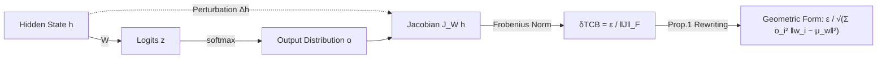

# How Stable is the Next Token? A Geometric View of LLM Prediction Stability

**Conference**: ICLR 2026  
**OpenReview**: [https://openreview.net/forum?id=Zjz8F6gdrw](https://openreview.net/forum?id=Zjz8F6gdrw)  
**Code**: TBD  
**Area**: Interpretability / LLM Prediction Robustness  
**Keywords**: Prediction Stability, Output Embedding Geometry, Jacobian, Contextual Robustness, Prompt Engineering  

## TL;DR
This paper proposes **Token Constraint Bound ($\delta$TCB)**—a geometric metric that quantifies how much the internal hidden state $h$ of an LLM can be perturbed before the next-token prediction changes significantly. It demonstrates that this bound is determined by the "probability-weighted dispersion" of the output embedding space relative to the current prediction distribution, revealing local prediction robustness invisible to perplexity or accuracy.

## Background & Motivation

**Background**: While LLMs exhibit remarkable capabilities, they are extremely sensitive to minor contextual perturbations—accuracy can fluctuate by 76% just by changing prompt formats, or drift between 54%–93% simply by reordering examples. Scaling up models does not naturally confer robustness and may even introduce new sensitivities. Reliable deployment necessitates stability metrics that can characterize this "fragility."

**Limitations of Prior Work**: Common evaluation metrics fail in this regard. Accuracy only provides aggregate performance and cannot capture the stability of individual predictions. Perplexity (PPL) mixes probabilities across the entire sequence, masking local dynamics and failing to reflect the geometric structure of internal states. Confidence/calibration metrics primarily align probabilities with correctness rather than directly measuring the "resistance of the current top-1 prediction to perturbations in the internal representation $h$."

**Key Challenge**: Softmax normalization can **disguise** instability. A token's high probability might merely be a product of relative normalization and does not guarantee that the internal state $h$ producing it is robust. A well-calibrated, high-confidence prediction may still reside at an unstable equilibrium point "ready to flip."

**Goal**: To answer the core question—*How can we quantify the stability of an instantaneous prediction state induced by a specific prompt/context against small internal perturbations?* Specifically, to find a "safety margin" for the hidden state $h$.

**Key Insight**: **[Local Perturbation Radius]** Instead of explaining the absolute magnitude of the output probability $o$, this work asks: "What is the maximum perturbation $h$ can sustain such that the change in output distribution does not exceed a tolerance $\epsilon$?" This maximum radius is the stability measure $\delta$TCB, which can be analytically translated into the geometric dispersion of output embeddings.

## Method

### Overall Architecture
The final-layer hidden state $h \in \mathbb{R}^d$ of an LLM yields logits $z = Wh$ via an output matrix $W \in \mathbb{R}^{V \times d}$, which are then softmaxxed into a distribution $o$. This paper formalizes "prediction stability" by adding a perturbation $\Delta h$ to the hidden state, linking the output change $\Delta o$ to $\Delta h$ via a first-order Jacobian. It then solves for the maximum allowable perturbation radius under the tolerance $\|\Delta o\|_2 \le \epsilon$, resulting in $\delta$TCB. Finally, the Jacobian norm determining this radius is precisely rewritten as the geometric dispersion of output embeddings relative to their probability-weighted mean, bridging "stability" and "embedding geometry."

### Key Designs

**1. Using the Jacobian to Linearly Propagate Internal Perturbations (Definition of $\delta$TCB)**: Under a first-order approximation, $\Delta o \approx J_W(h) \Delta h$, where the Jacobian of the softmax is $J_W(h) = (\mathrm{diag}(o) - oo^\top)W$. Utilizing the matrix norm inequality $\|\Delta o\|_2 \le \|J_W(h)\|_F \|\Delta h\|_2$, requiring the output change to stay within $\epsilon$ is equivalent to constraining the perturbation radius $\|\Delta h\|_2 \le \epsilon / \|J_W(h)\|_F$. Thus, the metric is defined by this upper bound: $\delta_{\mathrm{TCB}}(h) := \dfrac{\epsilon}{\|J_W(h)\|_F}$. Intuitively, any perturbation within a hypersphere centered at $h$ with radius $\delta_{\mathrm{TCB}}$ guarantees (in a first-order sense) that the output distribution shift does not exceed $\epsilon$. A larger radius indicates higher robustness to "internal jitter." Here, $\epsilon$ is a dimensionless scaling factor fixed at $1.0$ in experiments to focus on relative stability.

**2. Resolving the Jacobian Norm as Geometric Dispersion of Output Embeddings (Core Proposition)**: The key contribution is not the definition itself, but the exact equality provided by Prop. 1: $\|J_W(h)\|_F^2 = \sum_{i=1}^{V} o_i^2 \|w_i - \mu_w(h)\|_2^2$, where $\mu_w(h) = \sum_j o_j w_j = W^\top o$ is the **probability-weighted mean embedding** (the "centroid" of output embeddings). This transforms abstract sensitivity into an interpretable geometric quantity: stability is determined by how "dispersed" each token embedding $w_i$ is from the centroid $\mu_w$, with each squared distance weighted by the square of the token's probability $o_i^2$. The $o_i^2$ weighting is crucial—low-probability tokens contribute almost nothing even if geometrically distant, while high-probability tokens are counted with quadratic amplification. Substituting this back yields the geometric form: $\delta_{\mathrm{TCB}}(h) = \dfrac{\epsilon}{\sqrt{\sum_i o_i^2 \|w_i - \mu_w(h)\|_2^2}}$. More "clustered" embeddings and sharper distributions lead to a smaller denominator and a larger stability radius.

**3. Explaining Stability Sources Across Confidence Intervals**: This geometric expansion predicts that stability is dominated by different factors in different regimes. In the **High-Confidence Interval** ($V_\mathrm{eff} \to 1$, $o$ concentrated on token $k$): $\mu_w \to w_k$, leading to $\|J_W\|_F^2 \to 0$ and $\delta_{\mathrm{TCB}} \to \infty$. The sum is approximated by $\sum_{j \ne k} o_j^2 \|w_j - w_k\|_2^2$. Since competitor probabilities $o_j$ are super-exponentially sensitive to the top-2 logit margin $z_k - z_{j^*}$, a larger margin yields higher stability. In the **Uncertainty Interval** (large $V_\mathrm{eff}$, flat $o$): Multiple tokens have non-zero probabilities. If their embeddings are far from $\mu_w$, dispersion is high and $\delta$TCB is small. However, if these high-probability embeddings are geometrically clustered, $\delta$TCB can remain large even with a flat distribution, highlighting "geometry over probability." Under simplified assumptions, $\|J_W\|_F^2 \propto 1/V_\mathrm{eff}$, meaning $\delta_{\mathrm{TCB}} \propto \sqrt{V_\mathrm{eff}}$, consistent with empirical correlations across diverse prompts.

**4. $\delta$TCB as a Diagnostic and Co-optimization Objective for Prompt Engineering**: Because $\delta$TCB exposes fragility invisible to accuracy/confidence, the authors propose four "Accuracy-Stability Conflict" scenarios (Accurate but Fragile, Wrong but Stable, Confident but Unstable, Uncertain but Robust). This drives iterative prompt optimization: first, using multiple random seeds to distinguish "Very Certain Questions (VCQ)" from "Ambiguous Questions (AQ)", then systematically adjusting ICL examples and instruction phrasing for AQs to **simultaneously** optimize accuracy and $\delta$TCB. Robustness gains are finally evaluated on perturbed data.

## Key Experimental Results

Models: LLAMA-3.1-8B; Datasets: MMLU, GSM8K, plus custom Diverse Prompts (DPD, N=309) and Low-V_eff Targeted (LVD, N=360) for correlation analysis; perturbation tolerance $\epsilon = 1.0$.

### Main Results: Interval Correlation Validation (Table 1)

| Dataset | Corr($\delta$TCB, $V_\mathrm{eff}$) | Corr($\delta$TCB, $z_k - z_{j^*}$) |
| :--- | :--- | :--- |
| Diverse Prompts (DPD, N=309) | **0.95** (Strong pos, driven by flatness) | -0.40 (Moderate neg) |
| Low-V_eff Targeted (LVD, N=360) | 0.08 (Near zero) | **0.62** (Strong pos, driven by top-token separation) |

$\rightarrow$ Stability is determined by the top-2 logit margin in high-confidence scenarios and by overall distribution flatness in low-confidence scenarios, matching theoretical predictions.

### Ablation Study: Geometric Sensitivity Validation (Table 2)

By fixing $o$ and only manipulating $W$ (clustering vs. dispersing competitor embeddings), the hypothesis $\delta_{\text{cluster}} > \delta_{\text{orig}} > \delta_{\text{disperse}}$ is tested:

| Prompt Category | Hypothesis Success Rate |
| :--- | :--- |
| Low $V_\mathrm{eff}$ (<20) | 95% |
| Medium $V_\mathrm{eff}$ (20–100) | 92% |
| High $V_\mathrm{eff}$ (>100) | 80% |
| **Overall** | **90%** |

$\rightarrow$ Even when the probability distribution remains identical, embedding geometry alone can alter $\delta$TCB, proving it captures geometric dimensions missed by probability-based metrics.

### Prompt Engineering Gain (Table 3 / Table 4)

| Scenario | Metric | Baseline | $\delta$TCB-Enhanced |
| :--- | :--- | :--- | :--- |
| MMLU Ambiguous (AQ) | Acc | 0.40 | **0.70** |
| MMLU AQ | Avg. $\delta$TCB | 1983.0 | **2734.0** |
| MMLU AQ | Performance Drop Rate (PDR) | 30% | **10%** |
| MMLU AQ | Worst-case Acc ($Acc_{worst}$) | 15% | **30%** |

Compared to "PPL-only prompt selection," $\delta$TCB co-optimization achieves higher worst-case accuracy under perturbations.

### Key Findings
- The average $V_\mathrm{eff}$ for ambiguous questions remains low—**models can be "confidently wrong,"** indicating that confidence does not equal correctness nor stability.
- $\delta$TCB can flag "nascent instability" early in the text generation process, a dynamic overlooked by perplexity.

## Highlights & Insights
- **Transforming "Stability" from Intuition to a Closed-form Geometric Metric**: The single formula $\delta_{\mathrm{TCB}} = \epsilon / \sqrt{\sum o_i^2 \|w_i - \mu_w\|^2}$ simultaneously links Jacobian sensitivity, softmax geometry, and prompt robustness.
- **Insight of $o_i^2$ Weighting**: This distinguishes the metric from a standard probability-weighted covariance trace, emphasizing that the geometry of high-probability tokens is quadratically amplified. This is the key to correctly interpreting stability and the authors' repeated theme of "geometry over probability shape."
- **Practical Diagnostic Value**: The four Accuracy-Stability conflict categories and $\delta$TCB co-optimization allow an analytical metric to actually guide prompt engineering rather than remaining a purely explanatory tool.

## Limitations & Future Work
- **First-order Approximation**: $\delta$TCB relies on Jacobian linearization and the Frobenius norm upper bound, which may be too loose or conservative for large perturbations or highly non-linear regions.
- **Perturbations in Hidden Space**: $\Delta h$ is an abstract perturbation of internal representations. The quantitative mapping between this and real "input-level" perturbations (formatting, example swapping) is not yet fully established.
- **Experimental Scale**: Experiments primarily focus on LLAMA-3.1-8B and MMLU/GSM8K. Generalization across model scales and tasks (especially open-ended long-form generation) requires larger-scale validation; some tables are noted as "illustrative of observed trends."
- **Future Work**: Using $\delta$TCB as a regularization or selection signal during training/decoding (not just post-hoc analysis), and integrating it with uncertainty/calibration metrics into a unified reliability dashboard.

## Related Work & Insights
- **Empirical Context Sensitivity** (Sclar 2023; Zhao 2021; Lu 2021) documented severe fluctuations caused by format/order. Ours provides an internal geometric perspective to explain this brittleness.
- **Perplexity and Confidence/Calibration** (Jelinek 1977; Tian 2023; Geng 2023) focus on sequence likelihood and "aligning probability with correctness." Ours notes that neither measures top-1 prediction resistance to internal perturbations; $\delta$TCB is a complementary dimension.
- **Insight**: The Jacobian geometry of the softmax output layer is an undervalued entry point for analysis. The construction of "centroid $\mu_w$ + $o_i^2$-weighted dispersion" could be transferred to retrieval, decoding temperature adjustment, or adversarial robustness scenarios where characterizing "how easily a prediction flips" is crucial.

## Rating
- **Novelty**: ⭐⭐⭐⭐ — Formalizing prediction stability as a hidden state perturbation radius and providing a precise geometric closed-form (Prop. 1) is a fresh and self-consistent approach that diverges from traditional probability/calibration metrics.
- **Experimental Thoroughness**: ⭐⭐⭐ — The correlation, geometric sensitivity ablation, and prompt optimization threads are complete and support the theory. However, the focus on a single 8B model and two reasoning datasets, alongside some "illustrative" tables, limits the breadth of validation across architectures and open generation.
- **Writing Quality**: ⭐⭐⭐⭐ — The progression from motivation to Jacobian derivation, geometric form, and interval interpretation is clear. Figures 1/2/3 are intuitive, and notation is consistent.
- **Value**: ⭐⭐⭐⭐ — Provides a computable, interpretable robustness metric that can guide prompt engineering, offering both practical and heuristic value for reliable deployment and interpretability research.

<!-- RELATED:START -->

## Related Papers

- [\[ICLR 2026\] I Predict Therefore I Am: Is Next Token Prediction Enough to Learn Human-Interpretable Concepts from Data?](i_predict_therefore_i_am_is_next_token_prediction_enough_to_learn_human-interpre.md)
- [\[ICLR 2026\] Token Alignment Heads: Unveiling Attention's Role in LLM Multilingual Translation](token_alignment_heads_unveiling_attentions_role_in_llm_multilingual_translation.md)
- [\[ICLR 2026\] Noise Stability of Transformer Models](noise_stability_of_transformer_models.md)
- [\[ICLR 2026\] Explainable K-means Neural Networks for Multi-view Clustering](explainable_k_-means_neural_networks_for_multi-view_clustering.md)
- [\[ICML 2026\] GEM: Geometric Entropy Mixing for Optimal LLM Data Curation](../../ICML2026/interpretability/gem_geometric_entropy_mixing_for_optimal_llm_data_curation.md)

<!-- RELATED:END -->
