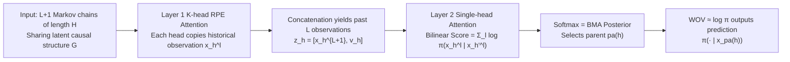

# How Transformers Learn Causal Structures In-Context: Explainable Mechanism Meets Theoretical Guarantee

**Conference**: ICLR 2026  
**OpenReview**: [https://openreview.net/forum?id=bpF8zgSt41](https://openreview.net/forum?id=bpF8zgSt41)  
**Code**: TBD  
**Area**: Interpretability / In-context learning theory  
**Keywords**: in-context learning, causal structure inference, Bayesian Model Averaging, attention mechanism interpretability, information-theoretic guarantees, Markov chains  

## TL;DR
This paper proves and empirically demonstrates that a two-layer Transformer with relative position encoding (RPE) can explicitly implement Bayesian Model Averaging (BMA)—the statistically optimal algorithm—in-context to infer the "parent" causal structure of each token. It further provides identifiability and training dynamics guarantees using information theory (DPI / mutual information).

## Background & Motivation
- **Background**: Most theoretical analyses of in-context learning (ICL) assume that the dependency structure between sequence elements is **fixed and preset**, such as rigid templates like `[x1, f(x1), x2, f(x2)]`, or a fixed n-gram/bigram causal model, subsequently proving that Transformers can embed this structure into attention weights.
- **Limitations of Prior Work**: Real-world sequence dependency graphs (e.g., natural language syntax, stock asset correlations) are **inherently dynamic**. Structures shift significantly between different sequences and documents. Works such as Nichani et al. (2024) only handle causal structures that are "fixed during training" and fail to address whether models can **temporarily infer and adapt** to new structures during inference.
- **Key Challenge**: Empirically, Transformers exhibit strong structural adaptation capabilities, yet the theoretical side lacks both a task framework where structure serves as a latent variable to be inferred from context samples and a mechanism-level explanation regarding what statistics the attention mechanism is computing.
- **Goal**: To construct a task involving random sampling of latent causal structures to answer (⋆) "Can Transformers infer and adapt to causal structures in-context?" while simultaneously providing an **explainable mechanism** (what attention computes) and **theoretical guarantees** (why it can correctly identify parent nodes).
- **Core Idea**: **Causal structure as a latent variable + BMA as the optimal baseline**. Sequences are generated using Markov chains with random parent dependencies. Inferring the parent node is formalized as the posterior of Bayesian Model Averaging. The core proof demonstrates that the second attention layer of a two-layer Transformer precisely approximates this BMA posterior.

## Method

### Overall Architecture
The task models each sequence of length $H$ as a directed tree: token $x_h$ depends on a unique parent $x_{\mathrm{pa}(h)}$, where $\mathrm{pa}(h)\sim\mathrm{Unif}(1,\dots,h-1)$. The set of parent relations $G=\{\mathrm{pa}(h)\}$ is shared within a context ($L$ examples + 1 query sample) but varies randomly across contexts. The model must infer $G$ from $L$ examples to predict the $L+1$-th sample. The statistically optimal solution is BMA, which treats the parent as a parameter and estimates its posterior. The core construction proves that a two-layer structure—**the first layer RPE attention acting as a "copier" and the second layer attention acting as a "BMA parent selector"**—can accurately approximate it.

### Key Designs

**1. Random Parent Markov Chain Task: Elevating "structure" to an inferable latent variable.** Unlike previous fixed-structure settings, this paper samples the parent relation graph $G$ for each sequence from a uniform distribution. Within the same context, $L+1$ samples share the same $G$. From a BMA perspective, the posterior of the parent node $\mathrm{pa}(h)=h'$ can be written as a softmax over accumulated log-likelihoods: $P(\mathrm{pa}(h){=}h'\mid x^{1:L}_{1:H})=\sigma\big(\hat p_{h,L}\big)_{h'}$, where $\hat p_{h,L}^{h'}=\sum_{l\in[L]}\log\pi(x^l_h\mid x^l_{h'})$. This transforms "parent selection" into a computable quantity determined solely by the transition kernel $\pi$, providing a precise target for mechanism alignment. The paper provides both discrete Markov chain and continuous linear dynamical system ($x_h=\rho A^\top x_{\mathrm{pa}(h)}+\sqrt{1-\rho^2}\,\eta_h$) versions.

**2. Two-layer Construction = Copier + BMA Selector.** The first layer utilizes Relative Position Encoding (RPE), splitting attention scores into across-example terms $w_L[l-l']$ and within-example terms $w_H[h-h']$. The theoretical construction allows the $k$-th head to dominate at $w_H[0]$ and $w_L[k]$, such that each head precisely "copies" the $k$-th historical observation at the same position $h$. Concatenating $K=L$ heads recovers the past $L$ observations $x^{1:L}_h$. Under constraints where $W_{KQ}$ is block-diagonal $W$ and $\sigma(W_{OV})=\pi$, the second-layer attention score collapses into a bilinear form $\hat p^h_{h'}(W)=\sum_l x^{l\top}_{h'}W x^l_h$. By setting $W=\log\pi$, it matches the BMA score term-by-term. **Theorem 1** provides the limit result: $\lim_{\beta\to\infty}A^{(2)}_{h\to\cdot}=\sigma(\hat p^{h,L}_{\mathrm{BMA}})$ and $\lim_{\beta,L\to\infty}f_\theta(\cdot\mid H^L_h)=\pi(\cdot\mid x_{\mathrm{pa}(h)})$, meaning the prediction converges to the true conditional distribution.

**3. Trained parameters indeed "become" BMA.** Construction alone is insufficient; the paper validates whether $W_{tf}$ learned via gradient descent is equivalent to $\log\pi$. A key obstacle is that for softmax attention $\sigma(v^\top_{1:h-1}Wv_h)$, there exists a **column-wise translation invariance** for $\log\pi$: **Proposition 1 (Invariance)** proves that if $W_{tf}=\log\pi+\mathbf 1 a^\top$, the attention output is identical to BMA. Therefore, the correct alignment criterion is not $\sigma(W_{tf})=\pi$ (row-wise softmax, which shows significant bias), but checking column-wise softmax $\sigma_{\mathrm{col}}(W_{tf})=\sigma_{\mathrm{col}}(\log\pi)$. Empirical column-wise error $\frac1d\|\sigma_{\mathrm{col}}(W_{tf})-\sigma_{\mathrm{col}}(\log\pi)\|_1<0.05$ confirms that trained parameters indeed implement BMA.

**4. Information-theoretic Identifiability + Training Dynamics Guarantee.** To explain "why the parent can be correctly selected," the paper provides structural identifiability using the Data Processing Inequality (DPI) and mutual information. **Lemma 3** proves $I(x_h;x_{h'})\le\alpha\,I(x_h;x_{\mathrm{pa}(h)})$ ($\alpha<1$, $h'\ne\mathrm{pa}(h)$) under transition kernel lower bound conditions, meaning the mutual information of the true parent is strictly dominant. **Lemma 4** converts this into expected log-likelihood: $\mathbb E[\log\pi(x_h\mid x_{\mathrm{pa}(h)})]>\mathbb E[\log\pi(x_h\mid x_{h'})]$. **Theorem 2** subsequently proves $\lim_{L\to\infty}A^L_{h\cdot}=e_{\mathrm{pa}(h)}$, showing attention asymptotically collapses to a one-hot true parent. **Theorem 3** analyzes training dynamics: at initialization, the gradient component of $\partial\ell/\partial\hat p$ for the true parent is maximal and directly related to $\chi^2$-mutual information, indicating that the latent causal structure is recovered by gradients in the **early stages** of training.

## Key Experimental Results

The paper primarily focuses on theoretical construction; the experimental side validates mechanism alignment through attention/parameter visualization and parent selection loss $L_{pa}$, rather than large-scale benchmarks.

### Main Results

| Validation Dimension | Setting | Observation |
|---|---|---|
| Second Layer Attention $A^{(2)}$ | $L{=}10,H{=}10,d{=}5$, 1024 steps | Attention highlights precisely the true causal parent (Fig. 2) |
| Parameter Structure $w_H^k, W_{KQ}, W_{OV}$ | Same as above | $w_H$ is max at $h{=}0$, $W_{KQ}$ is block-diagonal, $\sigma(W_{OV})\approx\pi$, matching Eq. (7) (Fig. 3) |
| Parent Selection Loss $L_{pa}$ | Throughout training | Decreases and approaches BMA loss, though remains slightly higher |
| Generalization $L^{L'}_{pa}$ | $L\in\{1,..,20\}, d{=}10, H{=}15$ | Approaches BMA across test scales $L'$; smaller training $L$ yields better generalization; for fixed $L$, loss vanishes as $L'$ increases (Fig. 5) |
| Column Softmax Alignment | $d{=}20,H{=}50,L{=}3$, 2048 steps | Column error 0.0278 (Row error 0.350), proving $W_{tf}=\log\pi+\mathbf 1a^\top$ (Fig. 6) |

### Key Findings
- For discrete Markov chains, $W_{tf}=\log\pi$ precisely matches BMA. However, for continuous dynamical systems (DS), the missing quadratic term in the Transformer's bilinear scoring prevents exact matching—revealing a fundamental difference in representation requirements between discrete and continuous causal inference.
- Causal structures are recovered by $\chi^2$-mutual information driven gradients at the very beginning of training.

## Highlights & Insights
- **Mechanism + Theory Synergy**: The paper goes beyond proving "it can compute BMA" by empirically confirming that trained parameters "actually are BMA" and using DPI to explain "why it works."
- **Column Translation Invariance (Prop. 1)**: This insight corrects the naive comparison of $\sigma(W_{tf})$ and $\pi$, providing the correct criterion for alignment verification.
- **Latent Variable Framework**: Treating structure as a latent variable inferred in-context is more representative of context-dependent dependencies in real sequences than fixed-structure settings.

## Limitations & Future Work
- **Strong Structural Assumptions**: Limited to directed trees with exactly one parent per token and Markovian properties, distant from the multi-parent, long-range, non-Markovian dependencies in natural language.
- **Small Model Scale**: Uses a two-layer, low-dimensional, attention-only toy model; extrapolation to large-scale LLMs remains unverified.
- **Continuous Setting Hard Limits**: Prop. 2 proves the bilinear structure cannot represent the DS BMA quadratic term, suggesting a need for higher-order attention or additional non-linearity.
- **BMA as Upper Bound**: Trained $L_{pa}$ remains slightly higher than BMA, not reaching full statistical optimality.

## Related Work & Insights
- Shares roots with Nichani et al. (2024) (using transition kernel lower bounds and DPI), but advances from "fixed structure at training" to "inferring dynamic structures in-context" and generalizes the $\chi^2$-MI framework.
- Relates to selective induction heads (D'Angelo et al., 2025); the proposed construction can cover simpler variants of those tasks.
- Extends the lineage of induction heads (Olsson et al., 2022) and statistical induction heads (Edelman et al., 2024), scaling "copier+selector" circuits from n-grams to random causal structure inference.

## Rating
- Novelty: ⭐⭐⭐⭐ — In-context inference of causal structures as latent variables and the proof of BMA implementation are highly novel.
- Experimental Thoroughness: ⭐⭐⭐ — Solid mechanism-level visualization and alignment verification, but limited to toy scales and lacks verification on real models/data.
- Writing Quality: ⭐⭐⭐⭐ — Clear logical flow between construction, empirics, and info-theoretic guarantees; high formula density but well-explained.
- Value: ⭐⭐⭐⭐ — Provides a provable and explainable unified account for "structural adaptation" in ICL.

<!-- RELATED:START -->

## Related Papers

- [\[ICLR 2026\] How Do Transformers Learn to Associate Tokens: Gradient Leading Terms Bring Mechanistic Understanding](how_do_transformers_learn_to_associate_tokens_gradient_leading_terms_bring_mecha.md)
- [\[NeurIPS 2025\] How Do Transformers Learn Implicit Reasoning?](../../NeurIPS2025/interpretability/how_do_transformers_learn_implicit_reasoning.md)
- [\[ICML 2026\] How Few-Shot Examples Add Up: A Causal Decomposition of Function Vectors in In-Context Learning](../../ICML2026/interpretability/how_few-shot_examples_add_up_a_causal_decomposition_of_function_vectors_in_in-co.md)
- [\[ICLR 2026\] Mixing Mechanisms: How Language Models Retrieve Bound Entities In-Context](mixing_mechanisms_how_language_models_retrieve_bound_entities_in-context.md)
- [\[ICLR 2026\] On the Limits of Sparse Autoencoders: A Theoretical Framework and Reweighted Remedy](on_the_limits_of_sparse_autoencoders_a_theoretical_framework_and_reweighted_reme.md)

<!-- RELATED:END -->
