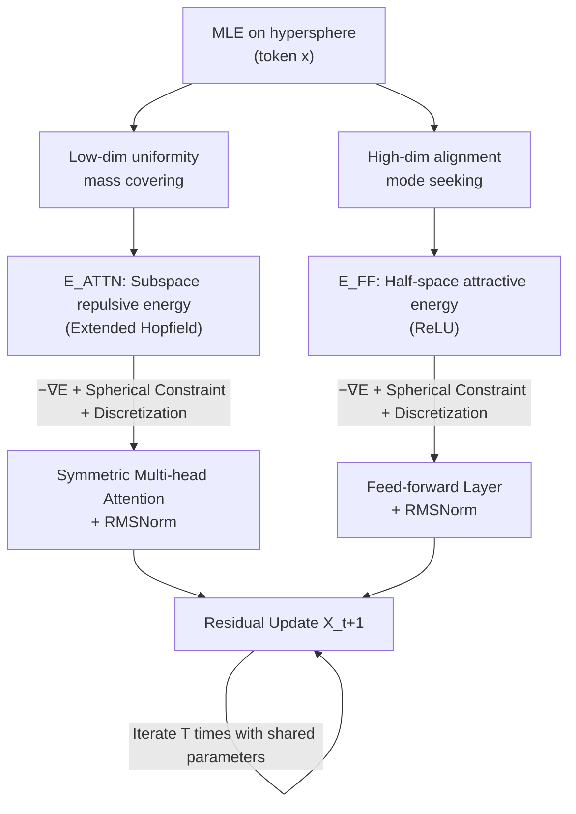

# Hyper-SET: Designing Transformers via Hyperspherical Energy Minimization

**Conference**: ICLR 2026  
**arXiv**: TBD (OpenReview: [FinhjyDgYA](https://openreview.net/forum?id=FinhjyDgYA))  
**Code**: [github.com/huyunzhe/hyper-set](https://github.com/huyunzhe/hyper-set)  
**Area**: Interpretability / White-box Transformer Design  
**Keywords**: Energy-based Models, Hopfield Energy, Hypersphere, Recurrent-depth Transformer, White-box Architecture, Representation Collapse  

## TL;DR
Transformer layers are reinterpreted as "Maximum Likelihood Estimation (MLE) of tokens on a hypersphere," decomposed into two complementary objectives: **distribution uniformity in low-dimensional subspaces** and **semantic alignment in high-dimensional space**. These are quantified using two extended Hopfield energy functions for iterative energy minimization. Consequently, symmetric attention, feed-forward layers, RMSNorm, and residual connections emerge naturally, resulting in HYPER-SET—a parameter-shared, interpretable recurrent-depth model with performance approaching the original Transformer.

## Background & Motivation

**Background**: Although Transformers have become the foundational architecture for CV, NLP, robotics, and scientific discovery, their core components—individual Transformer layers—rely on heuristic, bottom-up designs based on engineering intuition. Numerous empirical studies observe high redundancy in deep LLM layers, convergence of representations in middle layers, and the interchangeable nature of certain layers, suggesting that the function of a layer might converge toward a specific purpose. However, understanding remains limited.

**Limitations of Prior Work**: Most existing interpretability research (mechanistic interpretability, causal mediation analysis, visualization) consists of **post-hoc explanations** and phenomenological descriptions that do not guide design. In the energy-based perspective, the Energy Transformer analogies focus on attention as iterative descent of Hopfield energy, yet it remains at the level of "mechanistic analogy with associative memory" without grounding the formulas in concrete representation challenges or constructively deriving new components.

**Key Challenge**: Is it possible to find a **top-down design prior** that makes a model "interpretable by construction"—serving as both a reinterpretation of existing components and a constructive derivation for new architectures? This requires a design objective that is sufficiently fundamental and general, rather than tied to specific task priors.

**Goal**: Starting from a fundamental principle (MLE), derive all core Transformer components while maintaining generalizability.

**Core Idea**: Forward dynamics are formalized as a joint MLE of tokens on a hypersphere, split into two complementary properties: **semantic alignment (mode seeking)** in high-dimensional space and **distribution uniformity (mass covering)** in low-dimensional subspaces. These are quantified using two Hopfield-style energy functions, followed by iterative energy minimization under spherical constraints, allowing architectural components to "emerge" from the optimization process.

## Method

### Overall Architecture

HYPER-SET views a Transformer layer as a single-step alternating minimization of dual energies $E = E_{\text{ATTN}} + E_{\text{FF}}$ under hypersphere constraints: **Repulsive energy** $E_{\text{ATTN}}$ drives tokens to spread across multiple low-dimensional subspaces (preventing collapse) $\rightarrow$ deriving symmetric attention; **Attractive energy** $E_{\text{FF}}$ pulls tokens towards semantic-encoding basis directions in high-dimensional space (compressing redundancy) $\rightarrow$ deriving the feed-forward layer. Hypersphere constraints $\|W_h^\top x\|=\sqrt{p}$ and $\|D^\top x\|=\sqrt{M}$ correspond exactly to RMSNorm, while the step size of discretized energy gradient flow becomes the learnable coefficients in residual connections. The entire model consists of only one set of trainable parameters, achieving "equivalent depth" through recurrent-depth iterations.

### Key Designs

**1. Hypersphere MLE Principle: Decomposing "Good Representations" into Alignment and Uniformity**. The starting point is a conjecture that effective representations should satisfy both semantic alignment in high dimensions and distribution uniformity in low-dimensional subspaces, corresponding to mode seeking (information preservation) and mass covering (entropy collapse prevention). Formally, this is written as a single objective $\min_x \sum_h D_{KL}\big(p(z)\|p_\phi(z_h|x)\big) - \log p_\theta(x)$: the first term constrains subspace projections $z_h$ to approach a uniform prior on the hypersphere, maximizing entropy and inhibiting collapse; the second term uses von Mises–Fisher distributions to model alignment between tokens and several semantic mean directions. This aligns with the unified "alignment + uniformity" objective in contrastive learning, but here it is formulated through an energy route—quantifying these properties as optimizable functions of token $x$ to induce architecture.

**2. Repulsive Subspace Energy → Symmetric Attention**. Tokens are projected by $H$ basis matrices $W_h$ into $p$-dimensional subspaces as $z_i^h=W_h^\top x_i$. While original Hopfield energy aligns dynamic tokens with static patterns, self-attention involves interactions between dynamic tokens, where hard alignment would collapse representations into degenerate clusters (oversmoothing/rank collapse). To counter this, the authors transform Hopfield energy into a **repulsive force** between tokens: $E_{\text{ATTN}}^h = \beta^{-1}\sum_i \log\sum_j \exp\big(\beta (z_i^h)^\top z_j^h\big)$, summed over all subspaces under the constraint $\|W_h^\top x_i\|_2=\sqrt{p}$. Applying gradient flow $\dot X = -\nabla_X E_{\text{ATTN}}$ and discretization naturally yields a **doubly symmetric (simultaneous row/column softmax)** multi-head attention operator, where $\beta=1/\sqrt{p}$ matches the scaling factor of the original Transformer. The spherical constraint $\|W_h^\top x\|=\sqrt{p}$ maps directly to RMSNorm on projections. This row-column symmetric structure also aligns with work using doubly-stochastic attention for Wasserstein gradient flow.

**3. Attractive Half-space Energy → Feed-Forward Layer**. In the high-dimensional original space, the goal is to "enrich" representations. From an information bottleneck perspective, good representations should compress useless redundancy while preserving salient information. Thus, tokens are encouraged to align with a set of directions $D=[d_1,\dots,d_M]$ encoding data knowledge (interpreting $D$ as semantic directions). The attractive energy is defined as $E_{\text{FF}} = -\frac{1}{2}\sum_i\sum_m \big(\text{ReLU}(d_m^\top x_i)\big)^2$, optimized under $\|D^\top x_i\|_2=\sqrt{M}$. This only pulls tokens toward basis directions forming an acute angle (filtered by ReLU)—geometrically, each token is pulled by a union of "attractive half-spaces," allowing compositional binding of patterns beyond the number of bases $M$. Gradient flow $\dot X = D\,\text{ReLU}(D^\top X)$ with spherical discretization results in a feed-forward update $X_{t+1}=X_t+\gamma_t D\,\text{ReLU}(\text{RMSNorm}(D^\top X_t))$ that is symmetric in weight space—the same basis $D$ performs both "up-projection" and "down-projection."

**4. Adaptive Step Size + Recurrent Depth + Generalizable Variants**. Attention step sizes $\alpha_t$ and feed-forward step sizes $\gamma_t$ are learned via a small network conditioned on the iteration index $t$ and initial tokens $x^{(0)}$ (using channel-wise operations and zero-initialization for convergence). This ensures continuous energy descent and allows the model to extrapolate to iteration counts beyond training. The final model uses **only one layer of learnable parameters**, stacking depth via iteration, meaning parameter count barely increases with equivalent depth. Most importantly, the framework allows for replacing energy functions: swapping attention energy for kernelized forms yields linear attention; generalizing feed-forward energy leads to gated FFNs; adding depth-wise LoRA provides lightweight low-rank modulation to shared weights during each iteration, enhancing scalability.

## Key Experimental Results

### Main Results

**Sudoku (Structured Reasoning)**: Single-layer recurrent model, 9k train / 1k test. HYPER-SET achieved an in-distribution accuracy of 54.70% vs Transformer's 49.30%. Energy Transformer and the white-box model CRATE **failed completely** on this task (flat training curves, near-zero accuracy). When increasing iterations during testing to 2× training, HYPER-SET showed stable extrapolation and larger gains (24→48 iterations: 56.2%→57.2%).

**Image Classification (Single-layer recurrent depth, ImageNet-1K parameter count)**:

| Model | Width d | Params(M) | CIFAR-10 | CIFAR-100 | IN-100 | IN-1K |
|------|------|------|------|------|------|------|
| Transformer | 384 | 2.38 | 89.90 | 61.89 | 69.44 | **66.94** |
| CRATE | 768 | 3.00 | 84.81 | 58.22 | 68.52 | 57.00 |
| Energy Transformer | 512 | 2.39 | 76.39 | 50.60 | 36.68 | 34.24 |
| **HYPER-SET** | 512 | 2.39 | **90.11** | 63.41 | **70.16** | 62.76 |
| **HYPER-SET** | 640 | 3.40 | 89.96 | **64.60** | 69.31 | 66.21 |

With parameter-aligned settings, HYPER-SET outperformed all competitors on CIFAR-10/100 and IN-100, but lagged behind the original Transformer on large-scale IN-1K; increasing width $d$ narrowed the gap, suggesting its structural inductive bias is more advantageous in **resource-constrained** scenarios.

**Masked Image Modeling (ImageNet-100, Single-layer)**: At identical iteration counts, HYPER-SET halved parameters (3.94M vs 8.85M) but lagged slightly in metrics. Increasing iterations to 24 and feed-forward width $M$ to $8d$ (8.07M) allowed PSNR/SSIM to match the Transformer (PSNR 15.955 vs 15.953).

### Ablation Study

**Component Replacement (CIFAR)**: Default Bi-Softmax attention (90.11/63.41) significantly outperformed Sigmoid attention (85.93/59.72) and linear attention (84.88/56.97). Default ReLU FFN performed best, followed by Softmax FFN, with gated FFN performing worst. Learned step sizes (90.11) were markedly better than fixed step sizes ($\alpha=\gamma=0.5$ yielded only 25.81).

**Depth-wise LoRA (IN-100)**: Base 70.16%, with performance increasing with rank; $r=32$ reached 72.20% (parameters increased only from 1.93M to 2.72M).

### Key Findings
- **Energy genuinely decreases**: Even without positivity constraints on step sizes, attention energy and feed-forward energy shifted monotonically downward on Sudoku/CIFAR, with energy descent synchronizing with performance gains—the architecture truly aligns with the optimization objective.
- **Verifiable Uniformity**: Subspace effective rank rose steadily with iterations while full rank remained constant, and average angles between tokens approached orthogonality, validating the "prevention of entropy collapse" design intent.

## Highlights & Insights
- **Truly Constructive White-box**: Not a post-hoc explanation, but a derivation from MLE to symmetric attention + FFN + RMSNorm + Residuals. Every component has an energy interpretation, and new variants (linear attention/gated FFN) can be generated by swapping energy functions.
- **Energy-based "Alignment vs Uniformity"**: Porting contrastive learning's alignment-uniformity intuition to token dynamics and formalizing it as two optimizable Hopfield energies provides a elegant, unified perspective.
- **Extreme Parameter Reuse**: One set of parameters plus recurrent depth makes parameter efficiency increasingly evident as depth increases, making it ideal for resource-constrained scenarios.
- **Honest Comparisons**: Direct demonstration of Energy Transformer and CRATE's total failure on Sudoku highlights that "more fundamental objective assumptions lead to better optimization alignment."

## Limitations & Future Work
- **Large-scale Performance Gap**: Performance on IN-1K still lags the original Transformer, as structural inductive biases may limit scaling on massive datasets, requiring increased width/iteration to catch up.
- **Cost Shift**: Matching Transformer performance in masked modeling required doubling iterations and FFN width, trading computational efficiency for parameter savings.
- **Recurrent Depth Drawbacks**: While parameter-efficient, high iteration counts increase inference latency; step-size learning is sensitive to convergence (the model collapses with fixed steps).
- **Theoretical Assumptions**: The dual uniformity/alignment objective is a conjectural prior; whether it holds for more complex modalities like language and can scale to foundation-model sizes remains to be validated.

## Related Work & Insights
- **Energy Transformer** (Hoover 2024): Interprets attention via Hopfield energy but remains at mechanistic analogy; Ours grounds energy in specific representation challenges and constructively derives components.
- **CRATE / Sparse Rate Reduction** (Yu 2023): Another white-box approach using rate reduction to derive Transformers. This work adopts the alternating minimization strategy but switches to hyperspherical energy, covering more components.
- **Recurrent/Looped Transformers** (Universal/Looped/Relaxed Recursive, Bae 2025 etc.): Sharing weights across layers to support iterative inference; HYPER-SET’s depth-wise LoRA is inspired by these.
- **Alignment-Uniformity in Contrastive Learning** (Wang & Isola 2020): Theoretical source, reinterpreted here via energy.
- Insight: Interpretable architecture design can follow a path of "defining desired representation properties $\rightarrow$ quantifying them as energy $\rightarrow$ letting components emerge," providing a falsifiable answer to "why attention looks the way it does."

## Rating
- **Novelty**: ⭐⭐⭐⭐⭐ Top-down constructive derivation of the entire Transformer layer (including symmetric attention/FFN/RMSNorm/residuals) from MLE, capable of generating new components. A rare "white-box all the way" effort.
- **Experimental Thoroughness**: ⭐⭐⭐⭐ Covers reasoning (Sudoku), classification (4 datasets), and masked modeling. Ablations and energy/rank/angle visualizations are solid. However, it lags on IN-1K and lacks large-scale language modality validation.
- **Writing Quality**: ⭐⭐⭐⭐ Clear derivations and intuitive illustrations (token evolution on hypersphere, energy trajectories). Motives and conclusions are self-consistent; formulas are dense, placing a high bar for readers without energy-based backgrounds.
- **Value**: ⭐⭐⭐⭐ Provides a principled paradigm for "interpretable and efficient Transformer design," with practical potential in resource-constrained scenarios and architecture search.

<!-- RELATED:START -->

## Related Papers

- [\[ICLR 2026\] Spilled Energy in Large Language Models](spilled_energy_in_large_language_models.md)
- [\[ICLR 2026\] DIVERSE: Disagreement-Inducing Vector Evolution for Rashomon Set Exploration](diverse_disagreement-inducing_vector_evolution_for_rashomon_set_exploration.md)
- [\[ICLR 2026\] SEED-SET: Scalable Evolving Experimental Design for System-level Ethical Testing](seed-set_scalable_evolving_experimental_design_for_system-level_ethical_testing.md)
- [\[ICLR 2026\] Emergent Discrete Controller Modules for Symbolic Planning in Transformers](emergent_discrete_controller_modules_for_symbolic_planning_in_transformers.md)
- [\[ICLR 2026\] From Concepts to Components: Concept-Agnostic Attention Module Discovery in Transformers](from_concepts_to_components_concept-agnostic_attention_module_discovery_in_trans.md)

<!-- RELATED:END -->
