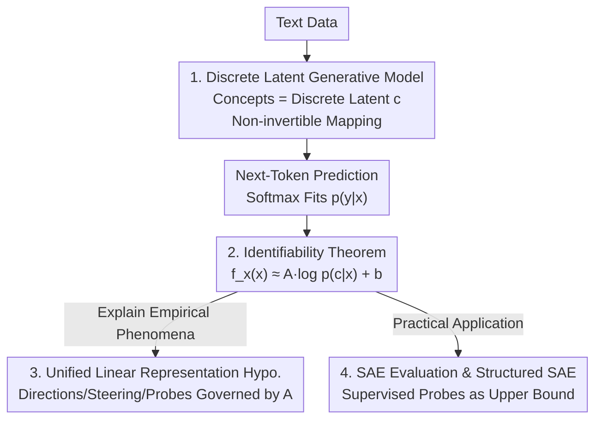

# I Predict Therefore I Am: Is Next Token Prediction Enough to Learn Human-Interpretable Concepts from Data?

**Conference**: ICLR 2026  
**OpenReview**: [https://openreview.net/forum?id=vVYD74U5KE](https://openreview.net/forum?id=vVYD74U5KE)  
**Code**: [Project Page](https://sites.google.com/view/yuhangliu/projects/ntp)  
**Area**: Interpretability / Representation Learning Theory  
**Keywords**: Next-token prediction, Identifiability, Linear Representation Hypothesis, Latent Variable Models, Sparse Autoencoders (SAE)

## TL;DR
This paper constructs a text generation model that formalizes "human-interpretable concepts" as discrete latent variables and rigorously proves that LLM representations trained solely via next-token prediction are, under mild conditions, approximately equivalent to a linear transformation of the posterior log-probabilities $\log p(c\mid x)$ of these latent concepts. This provides a unified theoretical foundation for the linear representation hypothesis, steering vectors, linear probing, and Sparse Autoencoder (SAE) evaluation.

## Background & Motivation

**Background**: Numerous empirical studies have found that internal representations (activations) of LLMs encode human-interpretable concepts—such as sentiment, writing style, truthfulness, and language type—and often do so in a "linear" form. Concepts can be represented as directions in the representation space (e.g., $Rep("man")−Rep("woman") \approx Rep("king")−Rep("queen")$), manipulated individually with steering vectors, or read out via linear probes. This is collectively known as the "Linear Representation Hypothesis."

**Limitations of Prior Work**: These linear phenomena are almost entirely empirical observations and lack a principled framework to explain "why they emerge." Existing latent variable modeling attempts have limitations: Park et al. (2023) can only handle binary concepts; Park et al. (2024) generalizes to categorical concepts but focuses only on hierarchical structures, struggling to cover other possible dependencies in text; Rajendran et al. (2024) models both concepts and text as continuous variables, which contradicts the inherently discrete nature of language and often requires the mapping from latent variables to observations to be invertible for identifiability analysis.

**Key Challenge**: The generative mapping of real text is both **discrete** and typically **non-invertible** (many-to-one: different combinations of sentiments might produce the same sentence; latent concepts like speaker intent or tone may never explicitly appear in the surface text). Previous works avoided these two most language-aligned features to prove identifiability by assuming continuity or invertibility.

**Goal**: To answer a fundamental question without assuming invertibility, modeling all variables as discrete, and without restricting the latent variable graph structure: Can LLMs "learn" these latent concepts solely through the next-token prediction objective, and in what form?

**Key Insight**: The authors place the problem within the framework of "identifiability analysis." Next-token prediction essentially fits the true conditional distribution $p(y\mid x)$ using a softmax function, while this true distribution can be derived from a latent variable generative model using Bayes' rule. By aligning the "model-learned $p(y\mid x)$" with the "generative-model-derived $p(y\mid x)$," a bridge is established between LLM representations $f_x(x)$ and latent concept posteriors.

**Core Idea**: Using a discrete latent variable generative model that allows non-invertible mappings, the authors prove that $f_x(x)$ is approximately a linear transformation of the latent posterior log-probabilities $\log p(c\mid x)$, thereby giving a unified explanation for all linear representation phenomena and deriving a theoretically grounded SAE evaluation method.

## Method

### Overall Architecture

The paper follows a theoretical chain "from assumptions to theorems, and from theorems to insights and applications," rather than presenting a trainable algorithmic pipeline. It proceeds in four steps: **(1)** Establishing a generative model where human concepts are discrete latent variables $c$ that generate both context $x$ and the next token $y$; **(2)** Performing identifiability analysis within the next-token prediction framework to prove the core theorem: $f_x(x)$ equals a linear transformation of $\log p(c\mid x)$ plus a constant and a residual term that vanishes as non-invertible error goes to zero; **(3)** Explaining three types of empirical phenomena—concepts-as-directions, steering vectors, and linear probing—through this "linearity," showing they are all governed by the same linear matrix $A$; **(4)** Applying the theorem to practice by deriving a method to evaluate whether SAEs truly learn monosemantic concepts using supervised probes as an upper bound, and proposing a "Structured SAE" with structural regularization.

### Key Designs

**1. Discrete and Non-Invertible Latent Generative Model: Modeling Language Essence**

This paper addresses the pain point that previous models assumed continuity or invertibility for analytical ease, losing the two most important features of text. The proposed generative model is $p(x,y)=\sum_c p(x\mid c)\,p(y\mid c)\,p(c)$, where $c=[c_1,\dots,c_m]$ is a set of discrete latent variables (each $c_k$ from a finite set $V_k$), and $x$ (context) and $y$ (next-token) are generated from $c$ via the same mapping $g$. Two deliberate designs are included: first, **fully discrete**—latent variables represent categorical distinctions like "Sports/Politics/Tech," and observations are discrete tokens, consistent with human information categorization; second, **no invertibility requirement for $g$**, with no restrictions on causal graphs between latent variables (allowing any DAG). To discuss "approximate identifiability" under non-invertibility, the authors quantify "approximate invertibility" with an error term $\epsilon$: $1-p(c=c^*\mid x,y)=\epsilon$, where $c^*$ is the dominant mode of the posterior. A smaller $\epsilon$ means the latent variable is more certain given $(x,y)$. This relaxed condition allows for approximate (rather than exact) identifiability, enabling the model to approach real text conditions.

**2. Identifiability Theorem: Grounding LLM Representations as Linear Transforms of Posterior Logs**

This is the theoretical core. Next-token prediction uses softmax to fit $p(y\mid x)=\dfrac{\exp(f_x(x)^\top f_y(y))}{\sum_{y_j}\exp(f_x(x)^\top f_y(y_j))}$, where $f_x$ maps context to representation space and $f_y$ is the final layer weights. The true $p(y\mid x)$ can be written via the generative model and Bayes' rule as $\sum_c p(y\mid c)\,p(c\mid x)$. By aligning these and taking logarithms, an initial link between $f_x$ and $c$ is built. After introducing three mild regularity conditions—**Diversity Condition** (sufficiently diverse $y$ making the matrix $\hat L$ span by $f_y(y_j)-f_y(y_0)$ invertible), **TV Condition** (posterior $p(c\mid y)$ changes slowly with a single token), and **Coverage Condition** (log-differences of conditional posteriors are bounded by constant $\delta$)—the authors derive Theorem 3.1:

$$f_x(x) = A\,[\log p(c=c_i\mid x)]_i + b - (\hat L^\top)^{-1}h_y,$$

where $A=(\hat L^\top)^{-1}L$ is determined by the diversity condition. The key conclusion: when $\epsilon=0$, the residual vanishes and $f_x(x)=A[\log p(c\mid x)]_i+b$ holds exactly; as $\epsilon\to0, \delta\to0$, it holds approximately. This means **LLM representations are essentially a linear readout of the latent concept posterior log-probabilities**, providing a theoretical explanation for why next-token prediction captures generative factors.

**3. Unifying Three Linear Phenomena via Matrix $A$**

After expressing the representation in linear form, the authors prove that all linear representation phenomena are governed by the same $A$, unifying scattered empirical observations. Corollary 4.2 shows that for a pair $(x_0, x_1)$ differing only in the $k$-th concept, the representation difference $f_x(x_1)-f_x(x_0)\approx \tilde A_k\big(\log p(c_k\mid x_1)-\log p(c_k\mid x_0)\big)$, where $\tilde A_k=AB_k$. This explains both **concepts-as-directions** (why "man-woman" and "king-queen" are similar—they both vary only in the gender concept via the same $\tilde A_k$ expression) and **concept steerability** (adding a steering vector is equivalent to modifying the posterior of the concept of interest). Corollary 4.3 further proves that representations are **linearly separable** along $c_k$, with a linear classifier weight $W$ satisfying $W\tilde A_k\approx I$, where the logit is $[p(c_k\mid x)]$. This explains why **linear probing** works.

**4. SAE Evaluation and Structured SAE: Turning Theorems into Practical Tools**

SAEs aim to reconstruct representations using sparse linear combinations $\beta z$, where each feature $z_i$ corresponds to a monosemantic concept. The challenge is the lack of ground truth concepts for evaluation. This paper offers a breakthrough: since $f_x(x)\approx A[\log p(c\mid x)]_i$ and SAEs have $\beta z\approx f_x(x)$, then $\beta z\approx A[\log p(c\mid x)]_i$, meaning SAE features $z$ should be linearly related to the posterior log-probabilities. If a dimension $z_i$ truly learns a single concept $c_k$, it should depend only on $\log p(c_k\mid x)$. How to get $p(c_k\mid x)$? According to Corollary 4.3, one can train a supervised linear probe on paired data $(x_0, x_1)$ differing only in the $k$-th binary concept; the logit serves as an estimate of $p(c_k=1\mid x)$. **Supervised probes thus become a computable upper bound for evaluating SAEs.** Finding that pure sparsity is insufficient for decoupling concepts, the authors propose a "Structured SAE" with low-rank regularization:

$$\mathcal L = \mathbb E_{x}\big[\|f_x(x)-\bar f_x(x)\|_2^2 + \lambda_t\|S\|_{p_t}^{p_t} + \gamma\|R\|_{\text{nuc}}\big],$$

where $\|S\|_{p_t}^{p_t}$ is an adaptive $L_{p_t}$ norm for sparsity and $\|R\|_{\text{nuc}}$ is a nuclear norm to impose a low-rank structure on $R$ to model dependencies between concepts.

## Key Experimental Results

Experiments aim to indirectly validate the theorem across simulation, real LLMs, and SAEs.

### Main Results

| Experiment | Setup | Proof Target | Key Observation |
|------|------|----------|----------|
| Simulation: Scale of Observations | Fixed latent count, gradually increase observations $x$ (improve $c\to x$ invertibility) | Theorem 3.1 | Linear classification accuracy improves as $x$ increases, consistent with "tighter approximation as $\epsilon$ decreases." |
| Simulation: Latent Graph Structure | Random ER1/ER2/ER3 graphs, varying latent scale | Theorem 3.1 Universality | Classification accuracy holds across different graph structures and scales; conclusions are robust. |
| Real LLM: $A_sW_s$ | 27 counterfactual pairs from Park et al. (2023); construct $A_s$ (concept direction) and $W_s$ (probe weight) | Corollary 4.3 | Normalized product $A_sW_s$ approximates identity matrix $I$ (diagonals $\approx 1$, off-diagonals smaller), holding for LLaMA-2 and Pythia. |

### SAE Comparison

| SAE Variant | Pearson Correlation (Higher is better) | Reconstruction MSE (Lower is better) |
|----------|--------------------------|----------------------|
| top-k SAE | Lower | Higher |
| batch-top-k SAE | Medium | Medium |
| p-annealing SAE | Medium | Medium |
| **Structured SAE (Ours)** | **Highest** | **Lowest** |

*Note: Specific values are summarized from trends in the original paper's figures. Structured SAE showed superior performance on Pythia-70m/1.4b/2.8b models.*

### Key Findings
- **Invertibility Degree Determines Tightness**: Increasing observation dimensions (improving invertibility) improves linear separability, directly supporting the "$\epsilon \to 0$" theoretical condition.
- **$A_sW_s \approx I$ as a New Verification**: While "concepts-as-directions" was known, this paper verifies the relationship between probe weights and concept directions, showing they are indeed aligned.
- **Sparsity is Not Enough**: Pearson correlations for all SAEs were below 0.8, indicating concept decoupling is not yet saturated. Structured SAE's success suggests that modeling interdependent latents via low-rank structures is necessary.
- **Evaluation Framework Effectiveness**: The proposed evaluation distinguishes between SAE variants sensitively and aligns with traditional reconstruction metrics.

## Highlights & Insights
- **Theorizing the "Why"**: The paper moves beyond the empirical observation that "LLM representations are linear" to derive $f_x(x) \approx A \log p(c\mid x) + b$, grounding the entire field on a common bedrock.
- **Pragmatic Modeling Choices**: By choosing non-invertible and discrete assumptions and quantifying approximation via $\epsilon$, the authors preserve the realistic "many-to-one" structure of language while maintaining analytical tractability.
- **Theory-to-Tool Translation**: Using supervised linear probes as an SAE evaluation upper bound is a transferable insight for any scenario where unsupervised decoupling needs a reliable proxy metric.
- **Low-Rank Intuition**: Translating the "dependency between concepts" into a low-rank constraint $\|R\|_{\text{nuc}}$ is a clean implementation of theoretical assumptions into a regularization term.

## Limitations & Future Work
- **Reliance on Strong Assumptions**: Theorems rely on Diversity, TV, and Coverage conditions. The core conclusion is an "approximation," and it remains hard to quantify how far real LLMs are from the ideal $\epsilon, \delta \to 0$ state.
- **Indirect Verification**: As true latent variables cannot be directly observed in real data, verification is indirect and based on small-scale datasets (27 human-constructed pairs).
- **SAE Performance Ceiling**: The Pearson correlation remains below 0.8, suggesting that current SAEs (including the structured version) are far from perfect monosemantic decoupling.
- **Future Directions**: Suggestions include "linear unmixing" to extract probabilities of high-level concepts directly and expanding counterfactual datasets to more complex semantics.

## Related Work & Insights
- **Vs. Park et al. (2023/2024)**: Previous models were limited to binary or hierarchical concepts; this work handles arbitrary discrete concepts and unifies multiple linear phenomena under one matrix $A$.
- **Vs. Rajendran et al. (2024)**: This paper avoids continuity and invertibility requirements, better fitting the discrete and non-invertible nature of linguistic mapping.
- **Vs. Traditional SAE Evaluation**: Traditional methods focus on reconstruction loss; this paper introduces a theoretically grounded decoupling metric using supervised probe upper bounds.

## Rating
- Novelty: ⭐⭐⭐⭐⭐ 
- Experimental Thoroughness: ⭐⭐⭐⭐ 
- Writing Quality: ⭐⭐⭐⭐ 
- Value: ⭐⭐⭐⭐⭐ 

<!-- RELATED:START -->

<!-- RELATED:END -->

## Related Papers

- [\[ICLR 2026\] How Stable is the Next Token? A Geometric View of LLM Prediction Stability](how_stable_is_the_next_token_a_geometric_view_of_llm_prediction_stability.md)
- [\[ICLR 2026\] Sparse Autoencoders Trained on the Same Data Learn Different Features](sparse_autoencoders_trained_on_the_same_data_learn_different_features.md)
- [\[ICLR 2026\] SAE as a Crystal Ball: Interpretable Features Predict Cross-domain Transferability of LLMs without Training](sae_as_a_crystal_ball_interpretable_features_predict_cross-domain_transferabilit.md)
- [\[ICLR 2026\] Concepts' Information Bottleneck Models](concepts_information_bottleneck_models.md)
- [\[ICLR 2026\] Concept-TRAK: Understanding how diffusion models learn concepts through concept attribution](concept-trak_understanding_how_diffusion_models_learn_concepts_through_concept_a.md)

<!-- RELATED:END -->
