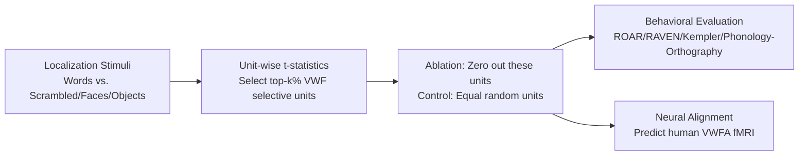

# Inducing Dyslexia in Vision Language Models

**Conference**: ICLR 2026  
**OpenReview**: [https://openreview.net/forum?id=AQhpxQ1xfa](https://openreview.net/forum?id=AQhpxQ1xfa)  
**Code**: To be confirmed (Paper states Code available via GitHub)  
**Area**: Interpretability / Computational Neuroscience (VLM Functional Localization and Ablation)  
**Keywords**: Visual Word Form Area (VWFA), functional localization, unit ablation, dyslexia modeling, Qwen2-VL, computational modeling of brain diseases  

## TL;DR
By "functionally localizing" units with visual word form selectivity in Vision-Language Models and ablating them, the authors reproduce core features of human dyslexia (selective reading deficits + phonological-leaning impairments) without damaging general visual and reasoning abilities, proving these units predict real human VWFA fMRI responses.

## Background & Motivation
- **Background**: Dyslexia is a persistent reading disorder affecting approximately 5–20% of the population, long associated with **hypoactivation of the Visual Word Form Area (VWFA)** in the left ventral occipitotemporal cortex. While traditional behavioral and neuroimaging methods observe correlations, it is **difficult to perform causal manipulation experiments**—one cannot "precisely turn off" a specific region in a living human brain to observe the consequences.
- **Limitations of Prior Work**: Existing computational models of brain diseases are mostly coarse-grained dynamical models based on the connectome, unable to characterize fine-grained neural mechanisms like word form recognition; small-scale computational work on dyslexia only touches upon visual processing or handwriting abnormalities, and **no work has used system-level neural network models to simulate brain diseases**.
- **Key Challenge**: Whether VWFA abnormality is the "cause" or "effect" of reading disorders remains controversial in academia, and human experiments cannot achieve controlled causal ablation.
- **Goal**: Establish a controllable, manipulable, and scalable "in-silico dyslexia" framework—a successful simulation should **impair only reading while preserving general intelligence and reasoning**.
- **Core Idea**: **[Neuroscience-inspired functional localization + causal ablation]** Transfer the "functional localizer" paradigm used for studying healthy brains to VLMs. First, use word/non-word contrastive stimuli to identify "visual word form selective units" in the model, then zero them out (artificial lesion) to observe if dyslexia-like selective deficits emerge.

## Method

### Overall Architecture
The method follows a three-step causal chain: "**Localization → Ablation → Behavioral/Neural Evaluation**". First, classic fMRI localization stimuli (words, scrambled words, faces, objects) are used to calculate t-statistics for every unit in the model, selecting the top-$k\%$ units with the highest preference for "words" as VWF-selective units. Second, these units are zeroed out in the language decoder (using an equal number of random units as a control). Finally, a set of clinical assessments designed for humans (ROAR reading, RAVEN visual IQ, Kempler sentence comprehension, phonological/orthographic lexical decision) is used to evaluate if the damage is "reading-specific," validated against alignment with actual human VWFA fMRI responses.

### Key Designs

**1. Functionally Localizing VWF Selective Units: Bringing fMRI localizers into models.** The authors borrow the classic localization paradigm from Saygin et al., presenting the model with four types of image stimuli: written words, scrambled words, line-drawn faces, and line-drawn objects. For each candidate unit, the **t-statistic** of the "response to word images" relative to the "response to the three types of non-word control stimuli" is calculated: a larger $t$ indicates a more stable and specific preference for word forms. Units are ranked by t-statistics in descending order, and the top $k\%$ are defined as the model's VWF selective units. The spirit of this step is: rather than presupposing which parameters handle reading, contrastive stimuli are used to let the model "expose" its word-form pathways, just as neuroscientists delineate the VWFA on the cortex.

**2. Minimal Subnetwork and Dyslexia Threshold: Quantifying "how severe is dyslexia" as a stoppable search.** The authors do not arbitrarily cut a fixed percentage. Instead, they **gradually increase** the proportion of ablated top-$k\%$ units starting from 0%. At each step, accuracy is measured on a ROAR training subset. Once accuracy falls below the **dyslexia threshold of 65%** (derived from 1 standard deviation below the population mean, consistent with the 5–20% epidemiological prevalence), the search stops. The **minimal** ablation ratio satisfying this condition defines the lesion subnetwork—approximately **6.89%** of the language decoder MLP units in Qwen2-VL-72B. This minimal intervention "just past the clinical threshold" ensures observed deficits are not artifacts of massive destruction.

**3. Causal Identification of Layer Types and Perturbation Intensity: Proving "which units" rather than "how many" matter.** The authors systematically compared ablation locations: vision encoder self-attention, vision merger, language decoder self-attention output, and language decoder MLP gate projection layers. Only ablation of the **language decoder MLP layers** (`model.layers.{i}.mlp.gate_proj` across 80 transformer blocks) produced the selective effect of "damaging ROAR without damaging RAVEN," consistent with findings that MLP layers carry knowledge-specific representations. Regarding perturbation intensity, the authors adjusted unit activations by scaling factors in $[-2, 4]$, finding that only **complete zeroing (scaling factor = 0)** stably reproduced dyslexia-like selective damage; positive scaling was ineffective, while negative scaling non-selectively collapsed the entire output. These controls demonstrate that the dyslexic effect depends on the **identity of ablated units** rather than quantity or layer distribution—causal evidence complementary to the "equal random unit ablation" experiment.

**4. Using Human Clinical Assessments for Double Dissociation of "Reading vs. Non-Reading".** Evaluation intentionally reuses standardized tests designed for humans: ROAR (lexical decision for words/pseudowords, accuracy only) measures reading; RAVEN (non-verbal reasoning) and Kempler (sentence-picture matching, adapted to VQA) serve as controls for general intelligence/comprehension; Luke et al.'s lexical decision benchmark further splits reading deficits into **phonological sensitivity** (homophones brake/break, pseudohomophones beaf/beef) and **orthographic sensitivity** (transposed-letter words blots/bolts, transposed non-words golve/glove). This design allows "selectivity" to be strictly falsified—if the ablation truly simulates dyslexia, it should only depress ROAR/phonological items, while RAVEN/orthographic items remain significantly unaffected.

## Key Experimental Results

### Main Results: Selective Reading Deficit (VWF Unit Ablation vs. Random Units)

| Ablation Target | ROAR (Reading) | RAVEN (Visual IQ) | Kempler (Sentence Comp.) | Drop Below Dyslexia Threshold |
|---|---|---|---|---|
| VWF Selective Units | **−32%**, $p\ll0.01$ | Unchanged, $p\approx0.75$ | No drop (Two-tailed **+10%**, $p\ll0.01$) | **Yes** |
| Random Units (Same Layers) | −21%, $p<0.003$ | −21%, $p<0.004$ | −13%, $p<0.042$ | No ($p\approx0.87$) |

Ablating VWF units specifically crashes reading while preserving or slightly improving reasoning/comprehension, highly consistent with the "poor reading but normal intelligence" profile of dyslexia. Random ablation leads to general decline without reaching clinical thresholds, proving deficits depend on unit identity.

### Phonological vs. Orthographical Double Dissociation (Against Human Behavior)

| Stimulus Type | Post-Ablation Model | Human Dyslexics |
|---|---|---|
| Phonological Sensitivity | **−8%**, $p\ll0.01$ | −9%, $p\ll0.01$ |
| Orthographical Sensitivity | Not significant, $p>0.059$ | −6%, $p\ll0.01$ |

The model reproduces the mainstream view of dyslexia as "primarily phonological"; humans also show orthographic damage, which the authors attribute to unlabeled comorbidity heterogeneity in the dataset.

### Ablation Study: Hyperparameter Sensitivity and Cross-Model/Font Generalization
- **Mask Size**: ROAR drops monotonically with ablation ratio, while RAVEN is only affected by large masks; the first ratio to cross the threshold (6.89%) is selected.
- **Cross-Model**: Reading-specific deficits were also induced in Molmo-72B and PixTral-12B.
- **Font Effects**: After ablation, the "dyslexic model" **significantly improved** ($p\ll0.001$) on fonts designed for dyslexics like OpenDyslexic, Comic Sans, and KG Primary Penmanship, while worsening on Papyrus—consistent with empirical phenomena where specific fonts help dyslexics; the intact model was font-insensitive.
- **Neural Alignment**: At small subsets (0.25%–1.25%), VWF selective units predict human VWFA fMRI responses (noise-normalized) significantly better than equal random units, indicating these units encode brain-relevant structures.

### Key Findings
- Approximately 6.89% of language decoder MLP units constitute the "dyslexia minimal subnetwork"; only complete zeroing stably causes damage.
- Deficits depend on unit identity: neither same-layer random ablation nor network-wide random ablation yields selective reading impairment (the latter simply collapses output into gibberish/empty responses).
- Errors in the ablated model are not random degradation but present an interpretable profile of "reading collapse," categorized into five types:

| Error Type | Phenomenon | Example |
|---|---|---|
| Blank | No output at all | accustomed (word) → No output |
| Misclassification | Word judged as pseudoword or vice versa | yammerring (word) → "Looks like pseudoword" |
| Contextual Over-interpretation | Inventing meanings/origins for pseudowords | hus (pseudo) → "Noun of husk, a type of corn" |
| Ambiguity | Refusing to conclude, citing context | dood (pseudo) → "Could be or could not be a word" |
| Corrupted/Garbage | Meaningless fragments or repetition | imeyits (pseudo) → "image of the image of..." |

## Highlights & Insights
- **Engineering Brain Science Localizer Paradigms into VLMs**: First to "create" a brain disease using a system-level neural network, providing a controllable causal manipulation platform impossible in human experiments.
- **Triple Consistency Evidence**: Behavioral (selective reading deficit + phonological lean), neural (VWFA fMRI alignment), and clinical (font effects) evidence align simultaneously, far exceeding simple correlation.
- **Rigorous Causal Identification**: Random unit controls + layer type controls + perturbation intensity scans systematically rule out alternative explanations like "quantity/hierarchy/overall destruction."
- **Falsifiable "Selectivity" Design**: Using a full suite of human-designed assessments ensures the claim of "damaging only reading" can be strictly tested.

## Limitations & Future Work
- **Mechanism $\neq$ Etiology**: Ablation simulates the "hypothetical neural phenotype" of VWFA hypoactivation, deliberately abstracting away causal factors like genetics. It answers "what happens if VWFA is weakened" rather than the root cause of dyslexia.
- **Orthographic Deficit Not Reproduced**: Human dyslexics show deficits in orthographic sensitivity while the model did not, attributed to unlabeled comorbidities—though this might also expose differences between model and brain mechanisms.
- **Dependence on Large Models and English Stimuli**: Main analysis was completed on 72B-class models and English vocabulary; applicability to cross-linguistic (especially deep/shallow orthography) and smaller models remains to be verified.
- **"Effect only with zeroing" fragility**: The lack of intermediate results within parametric scaling suggests the effect might be sensitive to specific implementations; whether this corresponds to real gradual hypoactivation requires further discussion.
- **Prospects**: Extend the framework to other brain diseases (e.g., specific language impairment, prosopagnosia) and explore "repair/intervention" directions (e.g., whether training can reconstruct subnetworks).

## Related Work & Insights
- **Models as Brain Models**: Continues the tradition of Yamins, Schrimpf, et al., treating ANNs as predictive models for the ventral visual stream/language cortex, advancing it from "healthy brains" to "brain diseases."
- **LLM Functional Localization**: Directly inspired by AlKhamissi et al.’s localization and ablation of "language-selective units" in LLMs, extending it to vision-language modalities to reach word-form pathways.
- **Knowledge in MLP Layers**: The discovery that MLP layers carry knowledge-specific representations (Meng, Zhang, et al.) provides a mechanistic explanation for why only MLP ablation causes selective damage.
- **Insight**: Functional localization + causal ablation is a general "Interpretability $\times$ Neuroscience" research paradigm transferable to any question regarding whether specific abilities are carried by localizable subnetworks.

## Rating
- **Novelty**: ⭐⭐⭐⭐⭐ First to simulate a brain disease (dyslexia) with system-level VLMs, innovatively combining neuroscience localizer paradigms with causal ablation.
- **Experimental Thoroughness**: ⭐⭐⭐⭐ Triple evidence from behavioral/neural/fonts + multiple controls for random/layer type/perturbation + cross-model validation; solid, though lacking cross-linguistic generalization.
- **Writing Quality**: ⭐⭐⭐⭐ Clear motivation and logical chain; correspondence between charts and clinical assessments is explicit.
- **Value**: ⭐⭐⭐⭐ Provides a manipulable in-silico experimental platform for computational psychiatry/interpretability, valuable for both brain disease research and model interpretability.

<!-- RELATED:START -->

## Related Papers

- [\[ICLR 2026\] Linear Mechanisms for Spatiotemporal Reasoning in Vision Language Models](linear_mechanisms_for_spatiotemporal_reasoning_in_vision_language_models.md)
- [\[ICLR 2026\] A Comprehensive Information-Decomposition Analysis of Large Vision-Language Models](a_comprehensive_information-decomposition_analysis_of_large_vision-language_mode.md)
- [\[ICLR 2026\] MICLIP: Learning to Interpret Representation in Vision Models](miclip_learning_to_interpret_representation_in_vision_models.md)
- [\[ICLR 2026\] Cross-Modal Redundancy and the Geometry of Vision-Language Embeddings](cross-modal_redundancy_and_the_geometry_of_vision-language_embeddings.md)
- [\[ICLR 2026\] DIVERSE: Disagreement-Inducing Vector Evolution for Rashomon Set Exploration](diverse_disagreement-inducing_vector_evolution_for_rashomon_set_exploration.md)

<!-- RELATED:END -->
