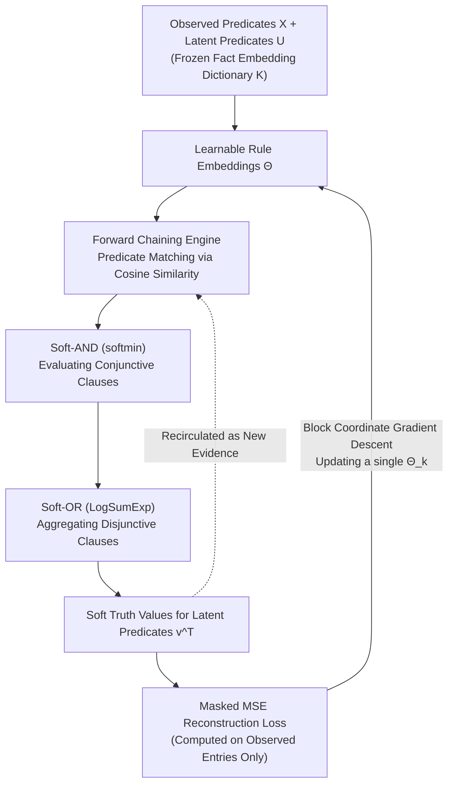

# Inferring the Invisible: Neuro-Symbolic Rule Discovery for Missing Value Imputation

**Conference**: ICLR 2026  
**OpenReview**: [https://openreview.net/forum?id=26Msp6pV5i](https://openreview.net/forum?id=26Msp6pV5i)  
**Code**: [https://github.com/conniemessi/infer_missing](https://github.com/conniemessi/infer_missing)  
**Area**: Interpretability / Neuro-Symbolic ILP  
**Keywords**: Missing value imputation, neuro-symbolic reasoning, logic rule induction, forward chaining, block coordinate descent, interpretability  

## TL;DR
Treat "missing table entries" as latent predicates to be inferred. A differentiable forward chaining reasoning engine allows **rule induction** and **missing value imputation** to serve as mutual evidence and reinforce each other, completing the data while learning human-readable logic rules.

## Background & Motivation
**Background**: Neuro-symbolic reasoning combines the noise tolerance of neural representation learning with the interpretability of symbolic logic. Inductive Logic Programming (ILP) is a mainstream approach for rule learning. However, traditional rule induction methods (e.g., BRCG, RRL, DR-NET) mostly assume "complete" data, extracting rules from fully observed instances.

**Limitations of Prior Work**: Real-world data is ubiquitous with incompleteness—critical indicators are often missing in medical diagnoses. Neither of the existing paths is ideal: (1) Probabilistic models like Markov Logic Networks (MLNs) can treat unobserved facts as latent predicates but rely on **fixed rule bases + expensive joint inference**, making them difficult to scale to massive heterogeneous data; (2) Mainstream missing value imputation methods (statistical methods like MICE/MissForest, deep methods like GAIN/Diffusion/VAE) rely only on statistical correlations to "guess" values and **completely fail to explicitly model logical relationships between variables**. The imputed values are black-box and uninterpretable.

**Key Challenge**: Rule learning requires complete data, while imputation requires rules—this is a "chicken-and-egg" deadlock. Existing practices treat imputation as an independent preprocessing step, where imputation errors propagate directly into downstream rule learning/classification without the possibility of correction.

**Goal**: Simultaneously learn rules and fill missing values in a **differentiable single cycle**, allowing the two to form a feedback loop while uniformly processing heterogeneous data (discrete + continuous).

**Core Idea**: **(1) Latent Predicate Perspective**—each missing table entry is viewed as an unobserved grounded fact, which is an instance of a latent predicate to be inferred; **(2) Feedback Loop**—better rules lead to better imputation, and better imputation provides stronger evidence for subsequent rule refinement; **(3) Universal Heterogeneous Data via Soft Logic**—using soft-min to approximate AND and soft-max to approximate OR, continuous features are learned as soft predicates (sigmoid threshold + slope), enabling unified forward chaining without pre-discretization.

## Method

### Overall Architecture
The model is named **NS-FCN (Neuro-Symbolic Forward Chaining Network)**. Predicates are categorized into two types: $X$ for fully observed predicates and $U$ for latent predicates that are at least partially missing. Each predicate first freezes a fixed embedding as a "dictionary"; rules are represented by **learnable rule embeddings** $\Theta$. During training, the forward chaining engine uses the current rule set to derive soft truth values for missing predicates, then backpropagates through the mask-reconstruction loss on observed entries to update rule embeddings—this is the "inference → compare with observation → update rules" cycle. To maintain solvability in a highly expressive rule space (multi-hop chains + disjunctive heads), learning uses **staged block coordinate descent**: updating one rule block at a time while fixing others, with disjunctive heads found via sequential covering and then jointly fine-tuned.

### Key Designs

**1. Latent Predicates + Forward Chaining: Turning Imputation into Logical Inference** Unlike traditional latent variable models, this work treats "missing grounded values" directly as latent predicates to be derived through logic. Rules are written in OR-of-ANDs form $Q_k \leftarrow (P_1 \wedge P_2) \vee (P_3 \wedge P_4) \vee \cdots$; the head predicate is derived if any clause is satisfied. Given a set of observed facts $E$, forward chaining generates head predicates whenever a clause is (approximately) satisfied and feeds the new facts back into $E$. Reusing inferred facts as evidence supports multi-hop cascading reasoning. State updates modify only unobserved terms: $v^{t+1} = M \circ v^t + (1-M) \circ g(v^t; \Theta)$, where $M$ is the observation mask and unobserved terms are initialized to $0.5$. In practice, only $T = 2\sim 5$ steps are run instead of iterating to a fixed point to avoid gradient saturation. This design is the soul of the paper—**imputation is no longer preprocessing but a byproduct of rule reasoning, and inferred values in turn support rule induction**.

**2. Soft Logic Operators: Unifying Heterogeneous Forward Chaining** The reasoning engine operates only on truth values in $[0,1]$. Conjunction (AND) is approximated by soft-min: for all $2h$ scalars in a clause ($h$ current predicate values + $h$ matching similarities $s_j = \cos(K_j^*, \theta_j)$), $\text{softmin}(x;\tau) = -\frac{1}{\tau}\log(\frac{1}{2h}\sum_i \exp(-x_i/\tau))$ is used, which approaches $\min$ as $\tau \to 0$. Disjunction (OR) uses LogSumExp: $g_k = \frac{1}{\mu}\log\sum_r \exp(\mu\, v_{f_{k,r}})$, approaching $\max$ as $\mu \to \infty$. Continuous features are no longer manually binned; instead, a threshold $\epsilon_{c,r}$ and slope $\beta_{c,r}$ are learned for each bin of each feature $c$, defining a soft predicate $P_{c,r}(v_c) = \sigma(\beta_{c,r}(v_c - \epsilon_{c,r}))$. Thus, clinical rules like `age > 60` or `chol > 250` can be learned end-to-end, whereas baselines must discretize continuous values beforehand. Experiments show that keeping $\tau=0.1$ and $\mu=10$ fixed throughout is sufficient and insensitive.

**3. Block Coordinate Descent + Sequential Covering: Remaining Solvable in NP-hard Space** Rule parameters are blocked by head predicates; each latent predicate $U_k$ corresponds to a block $\Theta_k$. Block coordinate descent traverses latent predicates in random order each round, updating one block while freezing others to minimize masked MSE $L_{U_k}(\Theta_k) = \text{mean}\big(\|(v_{U_k} - U_{k,\text{obs}})\odot M_k\|^2\big)$. This Gauss–Seidel style update reduces interference between candidate explanations and guarantees the loss does not increase at each step; a block is frozen once it nearly perfectly fits observations (imputation accuracy > 0.99). For the difficult problem of **disjunctive heads** (where clauses may be undervalued due to missing data), a two-stage approach is used: **Stage 1 Sequential Covering**—learning one clause at a time using only current "uncovered" observed positive examples, marking as covered and removing from the active set once output > 0.99, repeating until $R_k$ clauses are found to ensure diversity; **Stage 2 Joint Fine-tuning**—optimizing all clauses together via soft-OR aggregation to capture interactions. The authors acknowledge that exact rule set induction is NP-hard, thus they rely on "freeze upon perfection + diverse initialization" rather than claiming global optimality.

## Key Experimental Results

### Main Results on Synthetic Data (Figure 3(b) Disjunctive Rules, Observation Ratio 0.2, 30 random seeds, 20k samples)

| Head Predicate | Imputation Acc (Pre-tuning) | Imputation Acc (Post-tuning) | Learned Rule | Rule Accuracy |
|---|---|---|---|---|
| X3 | 1.000±0.000 | / | $X_0 \wedge X_1$ (Ground Truth) | 1.00 |
| X4 | 1.000±0.000 | / | $X_2 \wedge X_7$ (Ground Truth) | 1.00 |
| X5 | 0.893±0.072 | **0.954±0.053** | $(X_0\wedge X_4)\vee(X_3\wedge X_6)$ (Ground Truth) | 0.53 |

Simple conjunctive rules (X3/X4) are perfectly recovered; complex disjunctive rules (X5) improve in imputation accuracy from 0.89 to 0.95 after fine-tuning, with the top rule structure containing at least one correct clause.

### Ablation Study: Effect of Fine-tuning on Disjunctive Rule X5

| X5 Metrics | Pre-tuning | Post-tuning |
|---|---|---|
| Recovered Rule Structure | $(X_0\wedge X_2)\vee(X_0\wedge X_4)$ (Incorrect) | $(X_3\wedge X_6)\vee(X_0\wedge X_4)$ (Correct) |
| Unobserved Imputation Acc | 0.8729 | **1.0** |

**Joint fine-tuning is decisive for disjunctive rules**—it corrects clauses underestimated during the sequential covering stage, pulling accuracy from 0.87 up to 1.00.

### Main Results on Real Data: Interpretable Baseline Comparison (Birds Dataset, 90% missing)

| Method | Imputation Acc | Example Learned Rule |
|---|---|---|
| LEN | 0.57 / 0.55 | abnormal_bird ← (ostrich∧¬wounded)∨(bird∧wounded) (Incorrect) |
| RRL | 0.53 / 0.51 | (Incorrect structure) |
| BRCG | 0.50 / 0.47 | abnormal_bird ← bird∧ostrich (Incomplete) |
| DR-NET | 0.56 / 0.53 | (Redundant terms) |
| **NS-FCN** | **1.00 / 1.00** | **abnormal_bird ← ostrich∨(bird∧wounded); can_fly ← bird∧¬abnormal_bird (Perfect)** |

### Main Results on Real Data: Downstream Medical Diagnosis (Classification post-imputation, 10 seeds)

| Method | Heart Acc | Heart F1 | SPECT Acc | SPECT F1 |
|---|---|---|---|---|
| MICE | 0.83 | 0.81 | 0.78 | 0.87 |
| MissForest | 0.83 | 0.81 | 0.79 | 0.87 |
| GAIN | 0.84 | 0.82 | 0.76 | 0.85 |
| DR-NET | 0.85 | 0.82 | 0.89 | 0.92 |
| RRL | 0.78 | 0.80 | 0.90 | 0.94 |
| **NS-FCN** | **0.89** | **0.89** | **0.92** | **0.96** |

### Key Findings
- **Breaking the Imputation Ceiling for Interpretable Rules**: On Birds, NS-FCN is the only method achieving 1.00 imputation accuracy and perfectly recovering ground-truth rules, while all interpretable baselines hover between 0.5~0.57.
- **Matching Black-box Accuracy with Superior Interpretability**: On the continuous Heart dataset, NS-FCN's imputation accuracy is comparable to advanced statistical/generative baselines like MICE/GAIN/VAE, while providing full logical interpretability.
- **Joint Optimization Avoids Error Propagation**: NS-FCN leads across the board in downstream diagnosis tasks. It jointly optimizes rule discovery and target inference, whereas baselines follow a "impute first, then train classifier" pipeline where imputation errors irrecoverably propagate.
- **Data Efficient + Computationally Cheap**: Recovers complex disjunctive rules with only 1,000 samples; 50k samples take only ~3 minutes on a CPU.

## Highlights & Insights
- **Elegance of Perspective Shift**: Redefining "missing values" as "latent predicates to be inferred" unifies imputation and rule induction into a single differentiable framework—the most brilliant move of the paper, making the two tasks serve as mutual weak supervision signals.
- **Soft Logic Truly Handles HeterheterogeneousData**: soft-min/soft-max combined with learnable soft predicates (sigmoid thresholds/slopes) allows continuous features to enter rules without discretization. Learned rules like `age > 60` are clinically readable, a feat unattainable by pure binary rule learners.
- **Pragmatic Engineering**: Running forward chaining for only 2~5 steps (preventing gradient saturation), freezing blocks upon perfect fit (saving computation), and keeping temperature parameters fixed (minimizing tuning)—these details make the method stable and fast.
- **Sequential Covering + Joint Fine-tuning**: This two-stage logic precisely targets the "clause undervaluation" pain point of disjunctive rules under high missingness. Ablation shows this is key to moving from incorrect to correct rule structures.

## Limitations & Future Work
- **Unresolved NP-hard Nature**: Exact rule set induction is equivalent to Minimum Set Cover. The method relies on heuristics (freeze upon perfection + diverse initialization) and cannot guarantee global optimality. Rule accuracy for disjunctive rules (e.g., 0.53 for X5) indicates the recovery of optimal individual clauses remains unstable.
- **Order Effects in Block Coordinate Descent**: Experiments (Table 3) show the sequence of rule learning affects convergence efficiency; more cycles are needed when dependency structures are unknown in reality.
- **Restricted Rule Form**: Currently limited to OR-of-ANDs; it does not yet cover flexible combinations of negation, recursive rules, or complex First-Order Logic structures with quantifiers.
- **Frozen Predicate Embeddings**: Fact embeddings are fixed one-hot dictionaries, lacking learned semantic similarity at the predicate level, which might become a bottleneck in massive predicate spaces.
- **Limited Scalability Verification**: Validated up to 50k samples and 22 features (SPECT); performance on much larger or higher-dimensional tables remains to be tested.

## Related Work & Insights
- **Neuro-Symbolic ILP**: TransE/ComplEx for KB completion, NTP (differentiable backward chaining), and Campero's forward chaining induction—but these often rely on manual templates. This work is template-free forward chaining rule discovery.
- **Interpretable Rule Learning**: High-performers like BRCG (integer programming), RRL (gradient grafting), DR-NET (DNF rules), and LEN (entropy-based FOL)—all focus on binary classification with complete data. This work couples rule learning directly with missing value imputation.
- **Rule-based Imputation**: Models like MINTY use rule models but lack neuro-symbolic reasoning to learn complex relationships. The feedback loop here is a core differentiator.
- **Insight**: This paradigm of "treating missingness as latent variables and using differentiable logic for closed-loop inference" can be transferred to KB completion, temporal event inference, and even LLM tool-calling scenarios requiring interpretable intermediate reasoning. Any task requiring "both completion and explanation" can benefit from this weak supervision loop.

## Rating
- **Novelty**: ⭐⭐⭐⭐ Redefining missing values as latent predicates and using differentiable forward chaining is clever; soft predicates for heterogeneous data are also innovative. A slight deduction as individual components (soft logic, sequential covering) are largely existing techniques.
- **Experimental Thoroughness**: ⭐⭐⭐⭐ Systematic verification of chained/disjunctive/long-chain rules on synthetic data, 9 baselines on real datasets, downstream diagnosis, and extensive ablation/order/noise analysis. Deduction for relatively small dataset scales and weak interpretable baselines.
- **Writing Quality**: ⭐⭐⭐⭐ Clear motivation, well-integrated formulas and frameworks, and an organized explanation of a complex neuro-symbolic pipeline.
- **Value**: ⭐⭐⭐⭐ In high-stakes scenarios like medicine, the combination of "black-box-matching accuracy + fully readable rules" is highly attractive. Open-source code and good potential for practical application.

<!-- RELATED:START -->

## Related Papers

- [\[CVPR 2026\] VIRO: Robust and Efficient Neuro-Symbolic Reasoning with Verification for Referring Expression Comprehension](../../CVPR2026/interpretability/viro_robust_and_efficient_neuro-symbolic_reasoning_with_verification_for_referri.md)
- [\[ICLR 2026\] GAVEL: Towards Rule-Based Safety through Activation Monitoring](gavel_towards_rule-based_safety_through_activation_monitoring.md)
- [\[ICLR 2026\] Explainable Mixture Models through Differentiable Rule Learning](explainable_mixture_models_through_differentiable_rule_learning.md)
- [\[ICLR 2026\] Priors in Time: Missing Inductive Biases for Language Model Interpretability](priors_in_time_missing_inductive_biases_for_language_model_interpretability.md)
- [\[ICLR 2026\] Emergent Discrete Controller Modules for Symbolic Planning in Transformers](emergent_discrete_controller_modules_for_symbolic_planning_in_transformers.md)

<!-- RELATED:END -->
