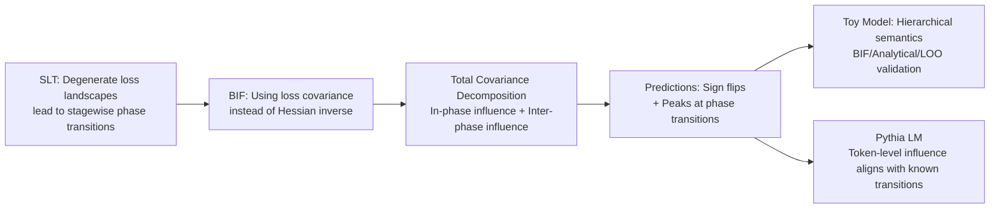

# Influence Dynamics and Stagewise Data Attribution

**Conference**: ICLR 2026  
**OpenReview**: [https://openreview.net/forum?id=8epkNiuAQC](https://openreview.net/forum?id=8epkNiuAQC)  
**Code**: To be confirmed  
**Area**: Interpretability / Developmental Interpretability  
**Keywords**: Training data attribution, influence functions, singular learning theory, stagewise learning, Bayesian influence functions, phase transitions  

## TL;DR
This paper uses Singular Learning Theory (SLT) to upgrade "training data attribution" from a static perspective to a **stagewise perspective**: it proves that the influence of one sample on another is not fixed but undergoes **sign flips** and **peaks** at phase transition points of model development, verifying this prediction using Bayesian Influence Functions (BIF) on both toy models and real language models.

## Background & Motivation
- **Background**: Training Data Attribution (TDA) investigates "which training data shapes model behavior," a core problem in AI interpretability and safety. The mainstream tool is the **Influence Function (IF)**, which measures attribution by infinitesimally upweighting a training point and observing its impact on an objective at the final parameters $w^*$.
- **Limitations of Prior Work**: Classical IF, inherited from regular statistical model analysis, implicitly assumes "data order does not affect attribution"—i.e., influence is **static and global**. This requires a unique stable minimum $w^*$ and an invertible Hessian $H(w^*)$. However, the loss landscapes of neural networks are **degenerate**: minima are non-isolated, and the Hessian is rank-deficient. Classical IF is theoretically **ill-defined** and practically **unstable** (requiring damping terms) in these settings, failing completely on intermediate checkpoints before convergence.
- **Key Challenge**: SLT (Watanabe) predicts that degeneracy leads to **stagewise development**—models undergo a series of **phase transitions** during training, jumping between qualitatively different solutions as the degree of degeneracy and Hessian rank change. Since learning itself is stagewise, while attribution tools remain static, the two are fundamentally mismatched. "Data that helps the model learn 'dog' early on might later harm its ability to distinguish 'Poodle' from 'Terrier'."
- **Goal**: Establish a theoretical framework connecting influence functions with developmental phase transitions, expanding TDA from "which data is important" to "**when and why** data is important."
- **Core Idea**: **[From Static to Stagewise]** Use the phase transition theory of SLT to predict that "influence is a dynamic quantity" and employ the **Bayesian Influence Function (BIF)**, which is robust to degenerate landscapes, to track the complete trajectory of influence over training time.

## Method

### Overall Architecture
The framework follows the three-step recipe of Developmental Interpretability: first, model the optimizer trajectory using an idealized **Bayesian learning process**; second, use SLT to make predictions about stagewise development; and finally, perform empirical validation on real networks. The core shift is replacing classical IF with BIF and deriving the dynamic behavior of influence at phase transitions using the "Law of Total Covariance."

### Key Designs

**1. Bayesian Influence Function (BIF): Replacing the Hessian inverse with covariance to make attribution well-defined on degenerate landscapes.** Classical IF takes the form $\mathrm{IF}(z_i,\phi) = -\nabla_w\phi(w^*)^\top H^{-1}(w^*)\nabla_w\ell_i(w^*)$, relying on the assumption of Hessian invertibility which fails in neural networks. This paper instead measures "how the posterior expectation of an observable $\mathbb{E}[\phi(w)]$ changes with sample weights," the derivative of which is exactly the negative covariance between the observable and the sample loss:

$$\mathrm{BIF}(z_i,\phi) = \frac{\partial}{\partial\beta_i}\mathbb{E}_{p_\beta(w|D)}[\phi(w)]\Big|_{\beta=1} = -\mathrm{Cov}_{p(w|D)}(\ell_i(w),\phi(w))$$

This form has three key advantages: it is **distributional** (naturally fitting the SLT Bayesian framework); it **requires no Hessian** (replacing the problematic Hessian inverse with covariance estimation, thus remaining well-defined on degenerate landscapes); and it is defined at **any point** on the training trajectory, rather than just at a stable minimum—a prerequisite for studying influence as a dynamic quantity. When regularity assumptions hold, BIF asymptotically recovers classical IF in the large-data limit, making it a higher-order generalization. In practice, a preconditioned SGLD (Stochastic Gradient MCMC) sampler is used to estimate local BIF from each checkpoint $w^*_t$.

**2. Total Covariance Decomposition: Splitting total influence into "in-phase baseline" and "inter-phase jump" to mathematically predict peaks and sign flips.** In statistical physics terms, BIF is a **generalized susceptibility**, measuring the system's response to perturbations; susceptibility diverges at phase transitions, suggesting its use for detecting transitions. Modeling a first-order phase transition as a mixture distribution of the posterior over two neighborhoods $U,V$, $p(w|D)=\pi_U p(w|U)+\pi_V p(w|V)$, the Law of Total Covariance decomposes $\mathrm{BIF}(z_i,\ell_j)=-\mathrm{Cov}(\ell_i,\ell_j)$ conditioned on phase $Z\in\{U,V\}$:

$$\mathrm{Cov}(\ell_i,\ell_j) = \underbrace{\pi_U\mathrm{Cov}_U(\ell_i,\ell_j)+\pi_V\mathrm{Cov}_V(\ell_i,\ell_j)}_{\text{In-phase average influence (Baseline)}} + \underbrace{\pi_U\pi_V(\mu_{i,U}-\mu_{i,V})(\mu_{j,U}-\mu_{j,V})}_{\text{Inter-phase influence}}$$

where $\mu_{i,U}=\mathbb{E}[\ell_i|U]$. Without a phase transition ($\pi_U=1$), only the baseline term remains, collapsing into the static view. This decomposition yields two predictions: **(a) Influence can change sign**—if the difference in in-phase influence between two phases is significant, or if the inter-phase term is large enough during transition to override the baseline; **(b) Influence peaks at phase transitions**—the inter-phase term is maximized when the posterior mass is split ($\pi_U\approx\pi_V\approx 0.5$). Its magnitude is proportional to $(\mu_{i,U}-\mu_{i,V})$, meaning the **influence peaks identify the samples most critical to a specific phase transition.**

**3. Three-party cross-validation on toy models: Corroborating BIF, analytical solutions, and LOO retraining.** Training a 2-layer deep linear network (MSE loss) on the hierarchical semantic dataset from Saxe et al., which is known to learn structures **progressively**: first "Animal vs. Plant," then "Mammal vs. Bird," and finally "Dog vs. Cat." This paper measures influence dynamics using three independent methods: **local BIF** via SGLD, **analytical derivation** of influence trajectories using model tractability, and **Leave-One-Out (LOO) retraining** to measure loss differences $\Delta\ell^{\backslash i}_{j,t}=\ell^D_{j,t}-\ell^{D\backslash i}_{j,t}$. All three show that influence varies **non-monotonically and changes sign** during training: upweighting "Dog" helps learning "Sparrow" early on (negative influence) during the "Animal vs. Plant" stage, but becomes harmful (positive influence) during the "Mammal vs. Bird" stage. Furthermore, the **branching nodes in the MDS trajectory align exactly with influence peaks**, confirming the metric identifies key learning windows.

**4. Token-level stagewise attribution on LMs: Influence dynamics align with known developmental transitions.** On the Pythia suite, a major advantage of BIF is the **zero additional cost** for calculating influence per token—autoregressive loss is already calculated token-by-token $\ell_i(w)=\sum_k\ell(x_{i,k}|x_{i,0\dots k-1},w)$. Token-level BIF matrices can be estimated simply by saving per-token losses. Following Baker et al., tokens are categorized into syntax (delimiters, formatting), morphology (sub-words), and structural (induction patterns) classes to calculate "group influence." Results show: **Induction relations** BIF shows an inflection point at 128 steps, peaks at 30k steps, and then declines—precisely matching the "Pythia induction circuit peak" found by Tigges et al. A stagewise intervention experiment verifies utility: upweighting induction pattern samples specifically during the induction circuit formation window **significantly accelerates** induction head formation compared to upweighting before the window.

## Key Experimental Results

### Main Results (Toy Model)

| Validation Method | Measured Object | Key Conclusion |
|---|---|---|
| Local BIF (SGLD) | Dog → Other sample influence | Non-monotonic, sign flips during training |
| Analytical IF | Analytical expression | Matches BIF trends; influence is a function of singular mode strength |
| LOO Retraining | $\Delta\ell^{\backslash i}_{j,t}$ | Isomorphic to BIF/Analytical, validating equivalence |
| MDS Branching | Hidden representation development | Branching moments align with influence peaks |

### Key Findings
- **Sign Flips**: The influence of the same datapoint (Dog) on a query (Sparrow) flips from "helpful (negative)" to "harmful (positive)" at different developmental stages.
- **Peak Positioning of Phase Transitions**: Influence peaks occur when a new hierarchy level begins to be learned; the samples with the largest peaks are those most inconsistent between the two phases.
- **Time-Window Ablation**: Removing samples only during the BIF peak period results in the largest loss difference $\rightarrow$ the metric correctly identifies the "critical learning window."
- **LM Alignment**: Induction BIF inflects at 128 steps and peaks at 30k steps, matching the known induction circuit developmental timeline; delimiter influences undergo sign flips.
- **Stagewise Intervention**: Upweighting induction samples within the development window accelerates head formation significantly better than upweighting outside the window.

## Highlights & Insights
- **Transferring "Susceptibility Divergence at Phase Transitions" from statistical physics to data attribution**: Using BIF as a generalized susceptibility makes "influence peaks" the most intuitive macroscopic signal for detecting phase transitions, which is both elegant and actionable.
- **Compelling Three-party Cross-validation**: Achieving consistent results across three independent methods on a tractable toy model effectively dismisses concerns about "metric-induced artifacts."
- **Incisive Critique of Unrolling-style Methods (TracIn/SOURCE)**: Since influence can change sign, cumulative attribution integrated along the training path may suffer from **cancellation effects**, potentially masking the true role of samples at specific developmental stages.
- **Finer-grained Mechanism for "Implicit Curriculum"**: Different data becomes "important" at different times, equivalent to a dynamically self-organizing curriculum, explaining why explicit curriculum learning often has limited success.

## Limitations & Future Work
- **Theoretical Gap between SLT Bayesian process and SGD non-equilibrium dynamics**: The gap between idealized Bayesian learning and real stochastic optimization remains a major theoretical bridge yet to be fully built.
- **Behavioral rather than Mechanistic Attribution**: The work measures "which samples have influence when," but has yet to connect this to specific features or circuits learned internally (mechanistic interpretability).
- **BIF Estimation Sensitivity**: BIF depends on SGLD sampling, which is sensitive to hyperparameters (e.g., $\beta, \epsilon, \gamma$); stability and cost on ultra-large models remain to be tested.
- **Incomplete Token Classification**: Some tokens lack categories or belong to multiple, introducing noise into group influence statistics.
- Future Directions: Moving from behavioral attribution toward a complete chain of "Data $\rightarrow$ Loss Landscape Geometry $\rightarrow$ Learning Dynamics $\rightarrow$ Internal Model Structure."

## Related Work & Insights
- **Classical Influence Functions** (Cook 1977; Koh & Liang): Static, global, dependent on Hessian invertibility—the target of this paper's criticism.
- **Bayesian Influence Functions** (Giordano 2017; Kreer 2025): Source of the primary tool; the BIF estimator and localized damping follow Kreer 2025.
- **Singular Learning Theory / Developmental Interpretability** (Watanabe 2009; Lehalleur 2025; Hoogland 2024; Baker 2025): Provides the theoretical and empirical foundation for "stagewise phase transitions."
- **Trajectory/Unrolling Attribution** (TracIn, HyDRA, SOURCE): Integrates influence along the training path; complementary but different goals—the former seeks cumulative totals, while this paper studies the trajectory itself.
- **Hierarchical Feature Learning Toy Models** (Saxe 2019a): Provides a tractable platform for progressive hierarchical learning.
- **Insights**: Incorporating "**when**" into data attribution offers direct value for data filtering, curriculum design, model debugging, and controlled training—allowing precise upweighting/downweighting of data during phase transition windows to guide learning.

## Rating
- **Novelty**: ⭐⭐⭐⭐⭐ Systematically connects SLT phase transition frameworks to data attribution for the first time, proposing a new paradigm of "stagewise data attribution."
- **Experimental Thoroughness**: ⭐⭐⭐⭐ Solid three-party validation on toy models; LM results align with known transitions and are supported by intervention experiments, though LM sections lean toward qualitative group statistics.
- **Writing Quality**: ⭐⭐⭐⭐⭐ Clear theoretical derivations, apt physical analogies, and strong visualizations (phase transitions/MDS/group influence) with a logical progression.
- **Value**: ⭐⭐⭐⭐ Provides a new tool and perspective on "when it matters" for interpretability and data curriculum, with methodological significance in its critique of unrolling methods.

<!-- RELATED:START -->

## Related Papers

- [\[ICLR 2026\] Learning to Weight Parameters for Training Data Attribution](learning_to_weight_parameters_for_training_data_attribution.md)
- [\[ICML 2026\] ExPLAIND: Unifying Model, Data, and Training Attribution to Study Model Behavior](../../ICML2026/interpretability/explaind_unifying_model_data_and_training_attribution_to_study_model_behavior.md)
- [\[ICLR 2026\] Signal in the Noise: Polysemantic Interference Transfers and Predicts Cross-Model Influence](signal_in_the_noise_polysemantic_interference_transfers_and_predicts_cross-model.md)
- [\[ICLR 2026\] The Shape of Adversarial Influence: Characterizing LLM Latent Spaces with Persistent Homology](the_shape_of_adversarial_influence_characterizing_llm_latent_spaces_with_persist.md)
- [\[ICLR 2026\] f-INE: A Hypothesis Testing Framework for Estimating Influence under Training Randomness](f-ine_a_hypothesis_testing_framework_for_estimating_influence_under_training_ran.md)

<!-- RELATED:END -->
