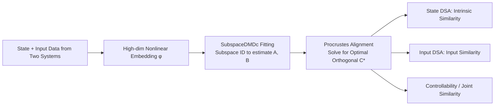

# InputDSA: Demixing, then comparing recurrent and externally driven dynamics

**Conference**: ICLR 2026  
**OpenReview**: [https://openreview.net/forum?id=2FrAvRz1E7](https://openreview.net/forum?id=2FrAvRz1E7)  
**Code**: To be confirmed  
**Area**: Neural Dynamics / Representation and Dynamical Similarity  
**Keywords**: Dynamical Similarity, DSA, Koopman, DMDc, Subspace Identification, Input-driven dynamics, RNN, Neural Data  

## TL;DR
The authors extend the Dynamical Similarity Analysis (DSA) method from autonomous to non-autonomous systems. By utilizing Subspace Dynamic Mode Decomposition with control (SubspaceDMDc) to simultaneously estimate the intrinsic operator $A$ and the input operator $B$, InputDSA enables the separate comparison of "intrinsic dynamics" and "input-driven dynamics" under partial observation, noise, or when only proxy inputs are available.

## Background & Motivation
- **Background**: Comparing whether two systems (brains, RNNs, physical systems) "perform the same function" is a common cross-disciplinary challenge. Dominant approaches compare state geometry (RSA / CKA / Procrustes / CCA) or topology, but none characterize **temporal dynamics**. Ostrow et al. (2023) introduced DSA, which uses Koopman theory to embed nonlinear dynamics into high-dimensional space and fits a linear transition operator $A$ for comparison. This has been applied to RNNs, training dynamics, and neural data.
- **Limitations of Prior Work**: DSA and subsequent dynamical comparison methods **assume the system is autonomous** ($x_{t+1}=Ax_t$), ignoring external inputs. Real-world brains and machine learning systems are almost always **non-autonomous**, continuously receiving sensory signals, communicating across regions, or involving closed-loop feedback.
- **Key Challenge**: Two systems with identical intrinsic dynamics may be judged "different" by DSA if driven by different inputs, and vice versa. Mixing input components **pollutes** the comparison of intrinsic dynamics and fails to evaluate whether systems respond to inputs in the same way.
- **Goal**: To propose a similarity metric that can **demix intrinsic and input-driven dynamics**, allowing for joint or separate comparisons that remain robust under partial observation, noise, and unknown inputs.
- **Core Idea**: **[Demix then Compare]** Explicitly estimate the state transition operator $A$ and the input-to-state mapping $B$, basing similarity on the **controllability matrix**. **[Subspace Identification for Debiasing]** Replace naive DMDc with subspace identification (N4SID / PO-MOESP) from classical control theory to solve the bias caused by partial observation. **[Procrustes Acceleration]** Simplify similarity optimization into a Procrustes alignment, achieving exponential speedup over the original DSA.

## Method

### Overall Architecture
InputDSA extends the DSA pipeline (embedding → fitting linear operators → comparing operators). For two systems, state and input data are collected, embedded into high-dimensional space, and a linear state-space model with control $x_{t+1}=Ax_t+Bu_t,\; y_t=Cx_t$ is fitted using **SubspaceDMDc**. Finally, **controllability similarity, state similarity, and input similarity** are computed based on the learned operators.

### Key Designs

**1. Controllability as a Similarity Metric: Including the Input Operator.** DSA only defines similarity on $A$ as $\min_{C\in O(n)}\|CA_1C^T-A_2\|_F$. InputDSA recognizes that a key feature of input-driven systems is **controllability**—whether an input sequence can drive the state to any point in finite steps. This is characterized by the $T$-step controllability matrix $K(T)=[B,\,AB,\,A^2B,\dots,A^{T-1}B]$, which is preserved under orthogonal transformations of the state space ($A_1=CA_2C^T,\,B_1=CB_2 \Rightarrow K_1=CK_2$). The metric is thus extended to align the entire **controllability matrix**:
$$\text{InputDSA}(A_1,A_2,B_1,B_2,T)=\min_{C\in O(n)}\sum_{i=0}^{T}\|CA_1^iB_1-A_2^iB_2\|_F^2=\min_{C\in O(n)}\|CK_1-K_2\|_F^2.$$
After finding the optimal $C^*$, two interpretable sub-scores are derived: the state score $\|C^*A_1C^{*T}-A_2\|_F^2$ and the input score $\|C^*B_1-B_2\|_F^2$.

**2. Procrustes Acceleration: Converting Iterative Optimization to Closed-form Alignment.** Standard DSA alignment for $A$ requires iterative optimization over the orthogonal group $O(n)$, which is computationally expensive. Since the new metric is formulated as $\|CK_1-K_2\|_F^2$, it is essentially an **Orthogonal Procrustes problem**, solvable via a single-step SVD, providing exponential speedup.

**3. SubspaceDMDc: Solving Pollution from Partial Observation.** Using naive DMDc ($\phi(x_{t+1})=A\phi(x_t)+B\phi(u_t)$) in **partial observation** scenarios (e.g., recording only a subset of neurons) is problematic. Inputs act directly on the observed dimensions and indirectly through **unobserved dimensions**. Naive estimation incorrectly attributes these indirect effects to intrinsic dynamics, biasing $B$ toward $A$. **SubspaceDMDc** incorporates control signals into subspace DMD, using N4SID / PO-MOESP algorithms to identify systems where only $y_t, u_t$ are observed. This method projects future (lifted) states onto the basis of past inputs and states, effectively filtering out observation and process noise.

**4. Proxy Inputs and Hyperparameter Selection.** In experimental settings, "true inputs" are often unavailable. InputDSA extends the metric to include joint alignment for inputs, allowing the use of **proxy inputs** (e.g., behavioral variables or task instructions). Hyperparameters (operator rank, delay steps, nonlinear basis) are determined by minimizing rank while maximizing future state prediction, utilizing Kalman filtering and AIC criteria.

## Key Experimental Results

### Main Results: Distinguishing Intrinsic vs. Input Dynamics under Partial Observation
On a 20-dimensional random RNN (only 2 dimensions observed, 5000 time points), four types of systems were constructed (sharing $A$ or $B$). Evaluation utilized silhouette scores (clustering separability, 1.0 is best):

| Method | State Similarity Silhouette | Input Similarity Silhouette |
|------|------|------|
| DMD (Hankel, DSA) | 0.60 | — (Cannot compare inputs) |
| DMDc | 0.68 | 0.19 (Fails under partial observation) |
| **SubspaceDMDc (Ours)** | **0.94** | **0.83** |

- As system dimensions scaled from 2 up to 1000 (with only 2 observed), SubspaceDMDc significantly outperformed other methods. Input scores for DMDc were consistently non-robust, while SubspaceDMDc remained robust across all scales.

### Robustness: Noise and Proxy Inputs
- With SNR (SER) near 1, correlation with ground truth distance remained $r>0.75$, thanks to delay embeddings and low-rank regression.
- In a Random Target Reach task, intrinsic (state) distances remained strongly correlated with ground truth even when using **random proxy inputs**, whereas input distances were most accurate when using task-relevant proxies (action + position).

### Application I: Individual Differences in RL Agents (Plume Tracking)
- InputDSA revealed that the **input-driven dynamics of successful (Top) agents were significantly more similar** and clearly separated from unsuccessful (Bottom) agents, while intrinsic dynamics showed no significant group difference.
- Successful tracking depends primarily on rapid input response to wind/odor. Top agents converged toward consistent input dynamics, whereas Bottom agents diverged into idiosyncratic dynamics.

### Application II: Rat Neural Population Dynamics Across Task Phases
- Neuropixels recordings from 6 brain regions were analyzed during an auditory evidence accumulation task.
- Comparing phases around the "neural Time of Commitment" (nTc): Both state and input dynamics changed significantly. Post-nTc, the intrinsic dynamics became more persistent (smaller power-law index $\beta$ for eigenvalues of $A$), and the Frobenius norm of the controllability Gramian decreased significantly ($p < 0.001$, median energy drop ~47.6%).
- **Key Finding**: Population activity undergoes a **mechanistic switch** at nTc from an input-driven accumulation phase to an intrinsically dominated commitment phase. Naive DMDc fails to recover this structure due to partial observation.

## Highlights & Insights
- **Input as a First-Class Citizen**: First framework to explicitly model and separately compare input-driven dynamics, answering whether two systems respond to inputs in the same way.
- **Controllability as a Unified Language**: Controllability matrices and Gramians bridge abstract similarity with neuroscientific narratives (e.g., evidence accumulation vs. commitment).
- **Validation of Proxy Inputs**: Theoretical and experimental evidence supports the use of behavioral/sensory proxies for robust intrinsic similarity estimation in computational neuroscience.
- **Simultaneous Debiasing and Speedup**: Subspace identification corrects partial observation bias and filters noise, while Procrustes alignment provides massive computational acceleration.

## Limitations & Future Work
- **Additive Inputs Only**: Assumes $Ax + Bu$, which may not capture multiplicative mechanisms like gain modulation.
- **Entanglement in Closed Loops**: If inputs are linear functions of states (closed-loop), separating contributions is difficult.
- **Identifiability Conditions**: Requires "persistent excitation" from inputs; otherwise, state modes might be underestimated.
- **Computational Bottleneck**: While comparison is fast, fitting SubspaceDMDc remains the primary overhead.

## Related Work & Insights
- **Geometry/Topology Similarity**: Complements RSA, CKA, and Procrustes by adding temporal dynamics.
- **DSA Lineage**: Directly extends the work of Ostrow et al. (2023) by addressing the omission of external inputs.
- **Control Theory Integration**: Builds upon DMDc (Proctor 2016) and Subspace DMD (Takeishi 2017), utilizing N4SID/PO-MOESP.

## Rating
- **Novelty**: ⭐⭐⭐⭐⭐ First to demix and compare input-driven dynamics with debiased subspace ID and Procrustes speedup.
- **Experimental Thoroughness**: ⭐⭐⭐⭐⭐ Comprehensive validation across synthetic systems, RL agents, and real neural data.
- **Writing Quality**: ⭐⭐⭐⭐ Clear motivation and strong link between theory and experiments.
- **Value**: ⭐⭐⭐⭐⭐ Provides a robust, efficient tool for comparing brain regions, model validation, and training dynamics.

<!-- RELATED:START -->

<!-- RELATED:END -->

## Related Papers

- [\[ICLR 2026\] Block Recurrent Dynamics in Vision Transformers](block_recurrent_dynamics_in_vision_transformers.md)
- [\[ICLR 2026\] Comparing the learning dynamics of in-context learning and fine-tuning in language models](comparing_the_learning_dynamics_of_in-context_learning_and_fine-tuning_in_langua.md)
- [\[ICLR 2026\] Discovering Alternative Solutions Beyond the Simplicity Bias in Recurrent Neural Networks](discovering_alternative_solutions_beyond_the_simplicity_bias_in_recurrent_neural.md)
- [\[ICLR 2026\] ExPO-HM: Learning to Explain-then-Detect for Hateful Meme Detection](expo-hm_learning_to_explain-then-detect_for_hateful_meme_detection.md)
- [\[ICLR 2026\] Influence Dynamics and Stagewise Data Attribution](influence_dynamics_and_stagewise_data_attribution.md)

<!-- RELATED:END -->
