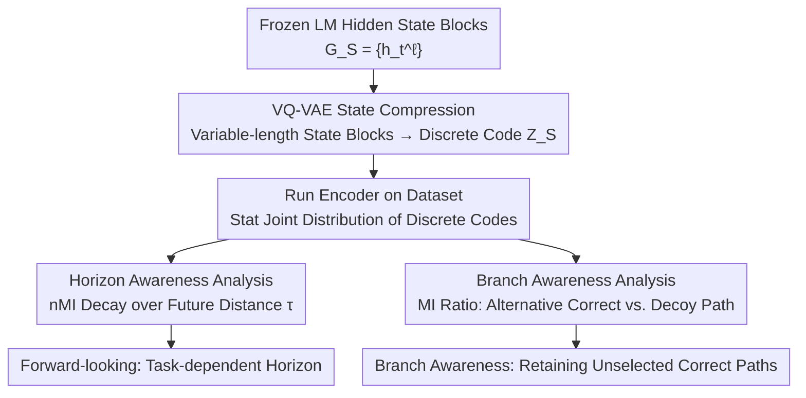

# Internal Planning in Language Models: Characterizing Horizon and Branch Awareness

**Conference**: ICLR 2026  
**arXiv**: [2509.25260](https://arxiv.org/abs/2509.25260)  
**Code**: Available (included in supplementary materials)  
**Area**: Interpretability  
**Keywords**: Language Model Planning, Mutual Information, VQ-VAE, Horizon Awareness, Branch Awareness

## TL;DR
Proposed an information-theoretic framework based on VQ-VAE to analyze the internal planning behavior of language models. It was found that planning horizons are task-dependent, models implicitly retain information about unselected correct paths, and next-token decisions primarily rely on recent computations.

## Background & Motivation
LLMs exhibit impressive capabilities, yet their training objective—next-token prediction—appears locally focused, contradicting the forward-looking nature of "planning." This raises a core problem: **To what extent are LMs "horizon-aware" and "branch-aware"?**

Horizon awareness: A good planner considers long-term goals in current decisions, similar to Model Predictive Control (MPC). Branch awareness: A good planner keeps multiple possible futures "alive" before making a decision, similar to Tree-of-Thoughts.

Existing analysis methods have limitations: (1) Circuit discovery requires significant manual engineering; (2) Linear probes may confuse representations learned by the probe itself with information actually encoded by the model (the probe cross-contamination problem). An automated, cross-contamination-free, and scalable analysis method is needed.

**Core Idea**: Use VQ-VAE to compress the high-dimensional hidden states of LMs into discrete codes, and then directly calculate the mutual information (MI) between these discrete codes to measure the information-sharing relationships between internal computations.

## Method

### Overall Architecture
This paper addresses a diagnostic question: whether decoder-only language models possess "planning" during generation—specifically, whether they are forward-looking (considering how far into the future) and whether they reserve space for multiple possible futures. The challenge lies in the fact that direct analysis of raw hidden states is both high-dimensional and redundant, and susceptible to the expressive power of probes. The overall approach first uses a VQ-VAE to compress any set of hidden state blocks into a single discrete code, transforming the abstract question of "how much information do two computation segments share" into statistically quantifiable mutual information (MI) of discrete variables. Then, the trained encoder is run across the entire dataset to compute the joint distribution of discrete codes. Finally, two types of analysis are derived from this joint distribution: analyzing information decay along the future distance $\tau$ (horizon awareness) and comparing the information content of "unselected correct paths" versus "decoy paths" (branch awareness).

### Key Designs

**1. VQ-VAE State Compression: Converting High-dimensional States into Computable MI Discrete Codes**

Estimating mutual information directly on raw hidden states is unstable due to high dimensionality and fine-grained redundancy. This step compresses a set of variable-length high-dimensional hidden states $G_\mathcal{S} = \{h_t^\ell | (\ell,t) \in \mathcal{S}\}$ into a discrete code $Z_\mathcal{S} \in [K]$. A Transformer encoder first aggregates the variable-length input into a fixed-dimensional latent vector $r_\mathcal{S}$, followed by nearest-neighbor quantization within a codebook $\{e_k\}_{k=1}^K$, where $k^* = \arg\min_k \|r_\mathcal{S} - e_k\|_2^2$. The training objective includes standard reconstruction and quantization losses, supplemented by a cosine similarity penalty and entropy regularization:

$$\mathcal{L} = \mathcal{L}_{\text{rec}} + \lambda_q \mathcal{L}_{\text{vq}} + \lambda_{\text{cos}} \mathcal{L}_{\text{cos}} + \lambda_{\text{ent}} \mathcal{L}_{\text{ent}}$$

The latter two terms force the codebook to remain diverse and fully utilized, preventing a few codes from dominating all samples. After discretization, each computation block retains only the critical differences, filtering out redundant details. By mapping to a finite code space, the joint distribution of mutual information can be stably calculated.

**2. Horizon Awareness Analysis: How Much Future Information is Hidden in the Prefix**

With discrete codes, forward-looking becomes a quantifiable problem. The prefix hidden state blocks $H = \{h_t^\ell | t=1,...,T;\ \ell=1,...,L-1\}$ are summarized into a code $Z_{1:T}^{1:L-1}$ to observe the normalized mutual information (nMI) with the last-layer hidden state code $Z_{T+\tau}^L$ of the $\tau$-th future generated token. By scanning $\tau$ from near to far, a slower decay of nMI indicates that the prefix encodes not just the next token, but subsequent content over a longer horizon. Unlike linear probes, this introduces no additional learnable models; nMI directly measures information sharing between two computation segments, thus avoiding misattributing "probe-learned" information to the model's actual encoding.

**3. Branch Awareness Analysis: Does the Unselected Correct Path Stay Alive?**

This design answers whether the model retains information about "another equally correct path" internally while outputting a specific correct answer. To isolate this, the paper constructs samples in the Path Finding (PF) task with 2 correct paths and 1 decoy path, ensuring no shared nodes among the three. It then compares the MI between the prefix summary code and the "alternative correct path code" versus the "decoy path code" by checking if the ratio 

$$\mathcal{I}(Z_H; Z_{\text{alt}})\,/\,\mathcal{I}(Z_H; Z_{\text{decoy}})$$

is greater than 1. The constraint that the three paths share no nodes is critical—it rules out trivial explanations where MI is high due to overlapping nodes, ensuring that a ratio significantly greater than 1 truly attributes to the model's awareness of the unselected correct branch.

## Key Experimental Results

Experiments were based on the GPT-3 Small architecture (with RoPE), analyzed across three types of data: (1) Context-Free Grammar (CFG) — local syntactic rules; (2) Path Finding (PF) — graph tasks requiring multi-step reasoning; (3) Natural Language (OpenWebText). The comparison focused on the differences between Next-Token Prediction (NTP) and Multi-Token Prediction (MTP) training objectives.

### Horizon Awareness (nMI Decay Patterns)

| Task | nMI Decay Rate | Implication |
|------|------------|------|
| CFG (Context-Free Grammar) | Rapid decay, drops to 1/5 of initial value at $\tau$=10 | Short horizon, local planning |
| PF-Short (4-node path) | nMI increases at $\tau$>1 | Non-myopic, prefix encodes subsequent nodes |
| PF-Long (6-node path) | nMI remains high at intermediate nodes | Long-horizon planning |

### Branch Awareness

| Model | PF-Short MI Ratio | PF-Short Accuracy | PF-Long MI Ratio | PF-Long Accuracy |
|------|----------------|-------------|---------------|-------------|
| NTP | 7.60±0.78 | 0.92 | 1.45±0.01 | 0.60 |
| MTP | 6.29±0.17 | 0.88 | 1.82±0.27 | 0.85 |

### Key Findings
- **Horizon awareness is task-dependent**: nMI decays rapidly on CFG (short-term planning) but remains high or even increases on PF (long-term planning).
- **nMI is higher at the second intermediate node than the first in PF tasks**: This may suggest a "backward reasoning from the goal" strategy.
- **Branch awareness truly exists**: MI ratios are much greater than 1 (as high as 7.6 on PF-Short), indicating the model indeed preserves information about unselected correct paths.
- MTP training slightly reduces myopic behavior, but the difference between NTP and MTP is not significant.
- Next-token decisions primarily depend on high-level and recent computation blocks (recency effect).

## Highlights & Insights
- The VQ-VAE+MI analysis framework is highly generalizable—avoiding the cross-contamination of probes and the manual engineering of circuit discovery.
- The finding that "models internally retain alternative path information" is significant for understanding LM robustness.
- The observation that nMI is higher for the second node than the first in PF tasks suggests implicit "reverse planning," which aligns with human problem-solving strategies.

## Limitations & Future Work
- VQ-VAE compression inevitably loses information; the absolute values of MI estimates are unreliable (the authors admit to only analyzing relative trends).
- Experiments were based on GPT-3 Small (~125M parameters); planning behavior might differ in larger models.
- Only diagnostic analysis of computation history was performed for natural language (OpenWebText), rather than horizon/branch analysis.
- Inconsistent differences between NTP/MTP may be related to model scale.

## Related Work & Insights
- **vs. Linear Probes**: Probes introduce additional expressive power leading to confounded results; the VQ-VAE+MI method is immune to this.
- **vs. Circuit Discovery**: Circuit discovery requires extensive manual engineering and is difficult to scale, whereas this framework is automated and general.

## Rating
- Novelty: ⭐⭐⭐⭐⭐ The VQ-VAE+MI analysis paradigm is entirely new, and the three analysis dimensions are elegantly designed.
- Experimental Thoroughness: ⭐⭐⭐⭐ Coverage of the three task types is comprehensive, though the model scale is small.
- Writing Quality: ⭐⭐⭐⭐ Rigorous framework, clear formulas, and very detailed appendices.
- Value: ⭐⭐⭐⭐ Provides a new tool for LM interpretability, though practical application scenarios are currently limited.

<!-- RELATED:START -->

## Related Papers

- [\[ICLR 2026\] Emotions Where Art Thou: Understanding and Characterizing the Emotional Latent Space of Large Language Models](emotions_where_art_thou_understanding_and_characterizing_the_emotional_latent_sp.md)
- [\[ICLR 2026\] Latent Planning Emerges with Scale](latent_planning_emerges_with_scale.md)
- [\[ACL 2026\] Model Internal Sleuthing: Finding Lexical Identity and Inflectional Features in Modern Language Models](../../ACL2026/interpretability/model_internal_sleuthing_finding_lexical_identity_and_inflectional_features_in_m.md)
- [\[ICML 2026\] Where's the Plan? Locating Latent Planning in Language Models with Lightweight Mechanistic Interventions](../../ICML2026/interpretability/wheres_the_plan_locating_latent_planning_in_language_models_with_lightweight_mec.md)
- [\[ICLR 2026\] The Shape of Adversarial Influence: Characterizing LLM Latent Spaces with Persistent Homology](the_shape_of_adversarial_influence_characterizing_llm_latent_spaces_with_persist.md)

<!-- RELATED:END -->
