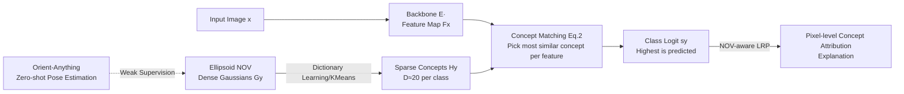

# Interpretable 3D Neural Object Volumes for Robust Conceptual Reasoning

**Conference**: ICLR 2026  
**OpenReview**: [https://openreview.net/forum?id=VSPLa2Sito](https://openreview.net/forum?id=VSPLa2Sito)  
**Code**: [github.com/phamleyennhi/CAVE](https://github.com/phamleyennhi/CAVE)  
**Area**: Interpretability / Robust Image Classification / 3D-Aware Representations  
**Keywords**: Neural Object Volumes (NOV), Concept Explanation, OOD Robustness, LRP, Interpretable Classification

## TL;DR
CAVE compresses thousands of dense 3D Gaussian features from NOVUM into approximately 20 sparse concepts per class via dictionary learning. This yields an image classifier that is both OOD robust and "faithful-by-design" in its interpretability, while proposing a 3D-C metric that measures spatial consistency of concepts across views and degradations without the need for part annotations.

## Background & Motivation
**Background**: Trustworthy AI requires both robustness and interpretability, yet these two research lines have long been disjointed. On one side, 3D-aware classifiers (such as NOVUM) match image features to volumetric representations (NOV) of objects, significantly improving robustness in OOD scenarios like occlusion and adverse weather. On the other side, conceptual XAI methods (CRAFT, ICE, ProtoPNet, CBM, etc.) pursue explanations but rarely consider distribution shifts.

**Limitations of Prior Work**: ① 3D-aware classifiers like NOVUM, though robust, use thousands of Gaussian features for bag-of-words matching, making the decision process extremely opaque; it is impossible to discern which features drive the results. ② Existing intrinsically interpretable models do not consider robustness during design; explanations often fail under OOD conditions—failing to capture consistent, meaningful concepts during heavy fog or background changes. ③ NOVUM strictly depends on ground-truth 3D pose annotations during training, which is high-cost and limits scalability. ④ Metrics for assessing concept consistency generally rely on human-annotated object parts, whereas models optimized for task accuracy may not naturally align with these parts.

**Key Challenge**: While mature solutions exist for both robustness and interpretability, unifying them in a single classifier—where explanations are faithful to the computation and stable under OOD—is far from a simple concatenation.

**Goal**: Construct an image classifier that is simultaneously OOD robust and intrinsically interpretable (explanations faithful to the model's computation), accompanied by a concept consistency metric that does not rely on part annotations.

**Core Idea**: **Replace dense Gaussians with sparse concepts**—perform dictionary learning or clustering on the NOV of each class to extract a set of "geometrically grounded" high-level concepts as new volumetric representations. Use concept matching instead of original Gaussian matching for classification, thereby achieving interpretability while maintaining the faithfulness of NOVUM. Use ground-truth CAD meshes instead of human part annotations to measure concept consistency.

## Method

### Overall Architecture
CAVE (Concept Aware Volumes for Explanations) is built upon NOVUM: a backbone (ResNet-50) first extracts image features $F_x$, each class is represented by an ellipsoidal NOV (with $K$ featured 3D Gaussians uniformly distributed on the surface), and dictionary learning compresses the Gaussian features of each class into $D$ sparse concepts. During classification, image features are matched with these concepts using a bag-of-words cosine matching (taking the maximum and summing) to obtain class logits. Finally, a modified LRP backpropagates concept relevance to pixels to generate faithful explanations.

### Key Designs

**1. From Dense Gaussians to Sparse Concepts: Conceptualizing NOV via Dictionary Learning**. Each class NOV $G_y\in\mathbb{R}^{K\times C'}$ in NOVUM contains thousands of Gaussians, making it unclear which contributes to a decision. CAVE formulates concept extraction as a dictionary learning problem $\min_{W_y,H_y}\|G_y-W_yH_y^\top\|_F^2$, where the dictionary $H_y^*=[h_y^{(1)},\dots,h_y^{(D)}]^\top$ represents the $D$ concept vectors. The authors use K-Means hard clustering for solving, which collapses the weight matrix $W_y^*$ into one-hot assignments—each Gaussian belongs to exactly one concept. This extreme sparsity maximizes interpretability. The resulting $H^*$ acts as the new "conceptual NOV," replacing the dense NOV. The classification formula changes from taking the max over $G$ to taking the max over $H$: $s_y=\phi(F_x,H_y)=\sum_i\max_{j\le D} f_i\cdot h_y^{(j)}$. Since both $f_i$ and $h_y^{(j)}$ are L2-normalized, each dot product is a cosine similarity in $[-1,1]$. Crucially, the logit is calculated precisely from these concept activations, inheriting the "faithful-by-design" property of NOVUM while gaining sparse readability. In experiments, $D=20$ compresses the ~1130 Gaussians per class by ~98%, while OOD accuracy remains comparable or slightly superior.

**2. NOV-aware LRP: Closing Relevance Leakage in 3D-aware Architectures**. To map concepts back to pixels for explanation, the authors rely on LRP (Layer-wise Relevance Propagation). The core of LRP is the conservation law—total relevance should remain constant across layers. However, the authors found that applying standard LRP to NOV architectures causes relevance to "leak unfaithfully" due to non-standard operators like concept matching, breaking conservation. CAVE designs specific relevance redistribution rules for the concept matching operator $\phi(F_x,H)$, enforcing $\sum_{f_i\in F_x}R_{f_i}=\sum_{h\in H}R_{\phi(h)}=R_{y^*}$, meaning the total relevance at the pixel level exactly matches the concept level and the final predicted relevance. This enables spatially coherent attribution under OOD (snow, heavy occlusion), where vanilla LRP and Grad-CAM yield scattered explanations under the same conditions.

**3. Weak 3D Supervision + Improved Ellipsoid Shape: Removing Pose Label Dependency and Improving Representation Quality**. NOVUM training strictly requires ground-truth 3D poses to align the NOV with objects in images. CAVE utilizes zero-shot pose estimation from Orient-Anything to provide "weak 3D supervision," eliminating the need for expensive pose annotations and significantly improving scalability (at the cost of a slight accuracy drop under OOD). Additionally, while NOVUM often uses coarse shapes like cubes or spheres, CAVE systematically compares cube, sphere, ellipsoid, and prototypical CAD geometries, ultimately selecting the ellipsoid as the carrier for concept extraction for its optimal trade-off between OOD accuracy and interpretability.

**4. 3D-C: Measuring Concept Consistency via CAD Meshes instead of Human Part Labels**. A meaningful concept should consistently map to the same semantic region of an object across different poses and OOD degradations. The authors propose the 3D Consistency metric (3D-C): for each concept $h$ of class $y$, its positive attributions $A^+(x,h)$ across test images are projected onto the triangular facets of the class's CAD mesh using the pose (ground-truth if available, otherwise estimated via Orient-Anything) and aggregated as $\Omega_y(A^+(x,h))$. The consistency is defined based on the $L_1$ difference of normalized projection distributions across images: $3\text{D-C}(X_y,h)=1-\frac{1}{2}\big(\frac{1}{n_y^2}\sum_{x\ne x'}\|\Omega_y(A^+(x,h))-\Omega_y(A^+(x',h))\|_1\big)$, ranging in $[0,1]$, where higher values indicate higher consistency. To avoid false consistency from few-shot cases, concepts with an occurrence rate below $\tau=50\%$ are excluded. The value of this metric lies in its independence from human part annotations, using object geometry as a common reference frame for a fair comparison between different concept methods.

## Key Experimental Results

### Main Results: Concept Interpretability (Pascal-Part / Pascal3D+ / ImageNet3D / OccludedP3D+ / OOD-CV)

| Method | Type | Loc.↑ | Cov.↑ | 3D-C P3D+ | 3D-C ImgNet3D | 3D-C OccP3D+ | 3D-C OOD-CV |
|---|---|---|---|---|---|---|---|
| NOVUM+CRAFT | post-hoc | 0.18 | 0.42 | 0.28 | 0.26 | 0.15 | 0.15 |
| NOVUM+ICE | post-hoc | 0.12 | 0.44 | 0.28 | 0.27 | 0.15 | 0.15 |
| TesNet | ad-hoc | 0.25 | 0.44 | 0.20 | 0.18 | 0.18 | 0.12 |
| MGProto | ad-hoc | 0.25 | 0.35 | 0.19 | 0.16 | 0.16 | 0.07 |
| **CAVE (Ours, Weak)** | ad-hoc | **0.28** | **0.80** | **0.40** | **0.40** | **0.23** | **0.24** |
| CAVE (Ours, Full) | ad-hoc | 0.28 | 0.87 | 0.42 | 0.43 | 0.23 | 0.26 |

Even with weak supervision, CAVE leads in localization, coverage, and 3D-C across all settings; object coverage is approximately 80%, far exceeding the ~56% of the second-best LF-CBM.

### Main Results: Classification Accuracy (%, ↑)

| Method | No GT Pose Needed | Pascal3D+ | ImageNet3D | OccludedP3D+ | OOD-CV |
|---|---|---|---|---|---|
| LF-CBM | Yes | 98.4 | 83.3 | 66.4 | 73.5 |
| TesNet | Yes | 97.6 | 77.9 | 63.8 | 70.1 |
| MGProto | Yes | 97.2 | 64.2 | 73.8 | 72.3 |
| **CAVE (Ours, Weak)** | Yes | **99.0** | **84.6** | **76.8** | **80.3** |
| CAVE (Ours, Full) | No | 99.4 | 88.5 | 81.3 | 84.0 |
| NOVUM (Full) | No | 99.5 | 88.3 | 81.7 | 81.3 |

Weakly supervised CAVE outperforms competitors by ~10% on OccludedP3D+ and achieves 80.3% on OOD-CV compared to 73.5% for LF-CBM. The fully supervised version nearly matches or even slightly exceeds NOVUM on ImageNet3D (+0.2) and OOD-CV (+2.7), despite a much sparser representation.

### Ablation Study

| Ablation Dimension | Key Findings |
|---|---|
| No. of Concepts $D\in\{5,10,20,40\}$ | 3D-C is stable across settings, rising slightly with $D$ under heavy occlusion; $D=20$ is the elbow point for sparsity-accuracy. |
| Sparsity-Accuracy Trade-off | ~20 concepts compress ~1130 Gaussians by ~98% with stable accuracy (slightly higher OOD), while predictions are more confident and classes more separable. |
| NOV-aware LRP | Removing it causes relevance leakage and scattered attribution; it is essential for reliable concept attribution under OOD. |
| Shape (Cube/Sphere/Ellipsoid/CAD) | Ellipsoid offers the best trade-off between OOD accuracy and interpretability. |

### Key Findings
- Sparsification does not degrade accuracy; instead, it maintains or slightly improves OOD performance while increasing prediction confidence and inter-class separability.
- Post-hoc methods (ICE/CRAFT) can achieve decent in-distribution consistency by leveraging NOVUM's 3D supervision, but they crash under OOD, where CAVE remains consistently superior.

## Highlights & Insights
- **First unification of 3D-aware robust classification and intrinsic interpretability**: Fills the gap between "robust but black-box" and "interpretable but fragile" models, with explanations that are faithful-by-design.
- **Sparsification is a free lunch**: Reducing thousands of Gaussians to ~20 concepts (a ~98% compression) maintains or even boosts OOD accuracy, indicating significant redundancy in NOVUM’s dense representation.
- **Innovation in evaluation paradigms**: 3D-C uses object meshes as a common reference, bypassing the long-standing bottleneck of manual part annotations and allowing fair cross-comparison between implicit and explicit concept methods.
- **Pragmatic reduction of annotation reliance**: Replacing ground-truth poses with weak supervision from Orient-Anything liberates NOV-style methods from expensive labeling requirements.

## Limitations & Future Work
- Ellipsoids are only coarse approximations; for objects with complex structures, concepts still only map "roughly" to the mesh, putting a ceiling on geometric fidelity.
- Weak supervision still shows a visible performance gap compared to full supervision under OOD; the quality of pose estimation is a bottleneck for the performance upper bound.
- Concepts emerge implicitly through unsupervised clustering and lack explicit semantic naming; human understanding still requires post-hoc visualization, unlike the explicit semantics in CBM or prototype networks.
- Evaluation is concentrated on object-centric categories with available CAD meshes (Pascal3D+/ImageNet3D series); transferability to mesh-less, scene-level, or fine-grained tasks remains to be verified.

## Related Work & Insights
- **3D-aware Robust Classification**: NOVUM pioneered robust classification by fitting cubic NOVs to 3D poses; CAVE removes its annotation dependency using zero-shot pose estimation (Orient-Anything).
- **Concept-based Explanation**: Post-hoc methods (CRAFT/ICE/MCD/PCX) decompose activations but are only approximations; explicit models (CBM, ProtoPNet/TesNet/PIP-Net/MGProto) use supervision to ground semantics/prototypes. CAVE is hybrid—faithful and implicit, with concepts emerging via unsupervised clustering.
- **Insights**: Combining "internal representation compression via dictionary learning" with "3D geometric grounding" suggests a general path for making internal units of large models both sparsely readable and physically grounded. The 3D-C approach—using structural ground truths instead of human annotations for consistency evaluation—can be transferred to other explanation tasks requiring cross-view stability.

## Rating
- **Novelty**: ⭐⭐⭐⭐ First unification of 3D-aware robustness and intrinsic interpretability. The trio of dictionary-learned conceptual NOV, NOV-aware LRP, and 3D-C is original and represents a fresh direction.
- **Experimental Thoroughness**: ⭐⭐⭐⭐ Covers multiple in-dist/OOD datasets, 9 strong baselines, and various metrics (localization, coverage, consistency, accuracy). Includes 10 random seeds and comprehensive ablations on shape and concept counts; clear comparison between weak and full supervision.
- **Writing Quality**: ⭐⭐⭐⭐ Logical flow from motivation to contradiction to solution. Formulas and figures (Fig.1-7) are well-coordinated, with rigorous arguments for the faithfulness of concept-pixel attribution.
- **Value**: ⭐⭐⭐⭐ Provides both robust and trustworthy explanations for safety-critical scenarios. Sparsification and the removal of pose annotations are practical, and the 3D-C metric has spillover value for the community.

<!-- RELATED:START -->

## Related Papers

- [\[ICLR 2026\] Uncovering Conceptual Blindspots in Generative Image Models Using Sparse Autoencoders](uncovering_conceptual_blindspots_in_generative_image_models_using_sparse_autoenc.md)
- [\[NeurIPS 2025\] Superposition Yields Robust Neural Scaling](../../NeurIPS2025/interpretability/superposition_yields_robust_neural_scaling.md)
- [\[ICLR 2026\] Features Emerge as Discrete States: The First Application of SAEs to 3D Representations](features_emerge_as_discrete_states_the_first_application_of_saes_to_3d_represent.md)
- [\[CVPR 2026\] VIRO: Robust and Efficient Neuro-Symbolic Reasoning with Verification for Referring Expression Comprehension](../../CVPR2026/interpretability/viro_robust_and_efficient_neuro-symbolic_reasoning_with_verification_for_referri.md)
- [\[ICLR 2026\] RADAR: Reasoning-Ability and Difficulty-Aware Routing for Reasoning LLMs](radar_reasoning-ability_and_difficulty-aware_routing_for_reasoning_llms.md)

<!-- RELATED:END -->
