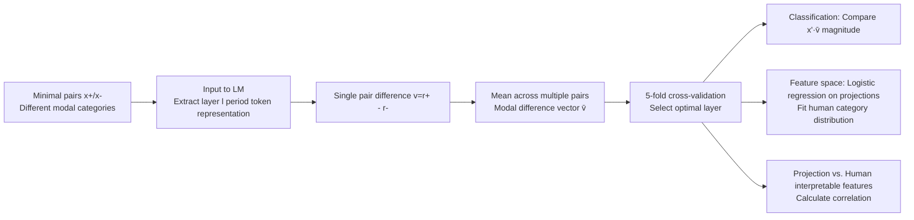

# Is This Just Fantasy? Language Model Representations Reflect Human Judgments of Event Plausibility

**Conference**: ICLR 2026  
**OpenReview**: [https://openreview.net/forum?id=Czul60ELOH](https://openreview.net/forum?id=Czul60ELOH)  
**Code**: The authors declare it is open source ("Code available here," repository link provided in original footnotes)  
**Area**: Mechanistic Interpretability / Cognitive Science Intersection  
**Keywords**: Modal categories, linear representations, contrastive activations, difference vectors, world models, modeling human judgment  

## TL;DR
The authors utilize Contrastive Activation Addition (CAA) to extract **modal difference vectors** from the hidden states of various LMs to distinguish between modal categories such as "probable / impossible / inconceivable." This demonstrates that LM internal judgments of sentence modality are significantly more reliable than previously suggested. These vectors emerge in a coarse-to-fine order across training, layers, and scale, and can effectively model fine-grained human categorical judgment behaviors.

## Background & Motivation
**Background**: LMs must distinguish whether a sentence describes something **real, hypothetical, or completely absurd** (i.e., judging the "modal category" of a sentence) to both answer real-world questions and write fantasy fiction. Philosophy and cognitive science have long used modal intuitions (whether an event is possible, impossible, or inconceivable) to characterize human "intuitive theories" of the world's causal structure.

**Limitations of Prior Work**: Recent studies (Kauf et al. 2023; Michaelov et al. 2025) found that LMs are overly sensitive to **surface features**, making sentence probability (sum of next-token probabilities) an unreliable metric for judging modal categories, as probability is confounded by factors unrelated to modality. This led to skepticism: Do LMs encode modal categories as **independent and coherent features**, or just implicitly represent them via unreliable probability estimation?

**Key Challenge**: "Unreliability of LM probability for modal judgment" $\neq$ "Absence of internal modal representations in LMs." Previous behavioral tests using probability may have significantly underestimated the actual modal knowledge possessed by these models.

**Goal**: Bypassing output probabilities, this paper directly investigates whether modal category representations exist within LM **hidden states**. It addresses four RQs: (1) Do internal representations outperform output probability? (2) How do these representations develop across training/layers/scale? (3) Do they reflect fine-grained human categorical judgments? (4) Which interpretable features do they correspond to?

- **Core Idea**: Use contrastive activations to distill "differences in modal categories" into a **linear direction** that is classifiable, interpretable, and comparable to human behavior, turning mechanistic interpretability tools into probes for both "investigating LM world models" and "generating human cognitive hypotheses."

The study utilizes four modal categories (from Hu et al. 2025b): **Probable** (likely and common, e.g., cooling with iced drinks), **Improbable** (possible but rare, e.g., cooling with snow), **Impossible** (violating laws of nature, e.g., cooling with fire), and **Inconceivable** (violating selectional restrictions, e.g., "cooling with yesterday").

## Method

### Overall Architecture
The method consists of three steps: First, extract **modal difference vectors** from a dataset containing minimal pairs for all modal categories (Hu et al. 2025b). Second, use these vectors as classifiers to perform modal classification on unseen sentence pairs across multiple "generalization datasets," comparing them with baselines like probability, principal components, and random vectors. Finally, use these vectors as a "feature space" to fit human categorical judgment distributions and correlate them with human ratings of interpretable dimensions (e.g., ease of imagination, event likelihood).

### Key Designs

**1. Modal Difference Vectors: Collapsing "Categorical Differences" into a Direction.** The core method adapts Contrastive Activation Addition (CAA, Panickssery et al. 2023). Given a minimal pair $(x_+, x_-)$ differing only in modal category, representations $r_+ = M_l(x_+)$ and $r_- = M_l(x_-)$ are taken from the final period "." token at layer $l$. The single-pair difference $v = r_+ - r_-$ is averaged across many similar pairs from Hu et al. 2025b to obtain the modal difference vector $\bar{v}$. Classification is performed without training a separate classifier, simply by comparing projections: if $x'_+ \cdot \bar{v} > x'_- \cdot \bar{v}$ for a new pair $(x'_+, x'_-)$, it is judged correctly. This comparison paradigm aligns with previous methods using total sentence probability, placing "internal representations vs. output probability" on the same scale. Vectors are trained for each category pair, with the optimal layer selected independently via 5-fold cross-validation.

**2. Three Baseline Controls to Rule Out Arbitrary Directions.** To prove modal vectors are not just any direction, three controls were set: **Probability Classifier** sums log probabilities assuming $p(\text{inconceivable}) < p(\text{impossible}) < p(\text{improbable}) < p(\text{probable})$; **Principal Component Classifier** calculates the first three PCs on WikiText and selects the one that best separates categories; **Random Vectors** are sampled from each layer. All share the same projection-comparison protocol to ensure differences arise solely from the direction chosen.

**3. "Generalization Datasets" to Force Category Abstraction.** Vectors extracted from Hu et al. 2025b are evaluated on three distinct datasets: Goulding et al. 2024 (impossibility from **biological** violations, e.g., "about to grow two wings"); Vega-Mendoza 2021 and Kauf 2023 (inconceivability from **animacy** violations, e.g., "The laptop bought the teacher"). Crucially, **adversarial pairs** are included—Vega-Mendoza uses semantically related words for inconceivable sentences and unrelated words for improbable ones; Kauf uses the **exact same words** for inconceivable and probable sentences, only swapping the word order (e.g., "The teacher bought the laptop" vs. "The laptop bought the teacher"), thereby eliminating word frequency or lexical shortcuts. Generalization across these datasets indicates the vectors capture the abstract concept of "impossibility" rather than surface physical details.

**4. Modeling Human "Disagreements" Using Vector Spaces.** In Study 3, the authors select the three least collinear vectors (probable-improbable, improbable-impossible, impossible-inconceivable) to form a 3D feature space. Projections are used in a logistic regression (Adam, lr=0.01, 200 epochs, soft-label cross-entropy) to predict the **categorical judgment distribution** from human subjects (e.g., how many chose probable / improbable / etc.). A key insight is that this space naturally clusters by modal category, and **sentences in transition zones between clusters correspond to those with the highest human disagreement**, meaning the vector geometry encodes human judgment uncertainty. Study 4 correlates projections on these vectors with human ratings for dimensions like "event likelihood, ease of imagination, grammaticality, and arousal."

## Key Experimental Results

### Main Results (Study 1: Classification Accuracy, Models $\ge$ 2B, Mean across Generalization Datasets)
Models include GPT2-{S/M/L/XL}, Llama-3.2-{1B,3B}, OLMo-2-{1B,7B,13B}, and Gemma-2-{2B,9B}.

| Classification Method | Performance Across Modal Category Pairs |
|---|---|
| **Modal Difference (Ours)** | **Matches or significantly exceeds** other methods across all pairs, inclusive of adversarial subsets |
| Probability | Significantly lags behind modal vectors on most category pairs |
| Principal Component | Lags behind modal vectors |
| Random | Close to random baseline |

Conclusion: Modal difference vectors are **more separable** than output probability, proving LMs possess internal modal judgments more reliable than their probabilities suggest (RQ1 supported).

### Key Findings (Study 2: Emergence Order)

| Dimension | Phenomenon |
|---|---|
| Parameters | A **qualitative gap** exists between <2B and $\ge$ 2B models; generalization is significantly worse below 2B. |
| Training / Depth / Scale | Consistently emerge in a **coarse-to-fine** order: separating inconceivable from others $\rightarrow$ probable/impossible $\rightarrow$ probable/improbable $\rightarrow$ finally improbable/impossible. |

This order replicates and extends findings from Hu et al. 2025b based on surprisal, but here it is observed at the **internal representation** level; furthermore, these representations develop with parameter count (whereas surprisal in Hu's work was less scale-sensitive).

### Modeling Human Behavior (Study 3 & 4)
- Study 3: Across Hu 2025b / Hu 2025a / Goulding datasets, the modal vector feature space consistently outperforms probability/PC/random baselines in **overall correlation, MSE, and entropy correlation**. Qualitative example (Gemma-2-9B):

| Scenario (Someone is about to...) | Modal Vector P(Probable) | Probability P(Probable) | Human P(Probable) |
|---|---|---|---|
| clean a car | 0.99 | 0.70 | 1.0 |
| clean a cloud | 0.09 | 0.57 | 0.05 |
| stay awake for 5 days | 0.67 | 0.63 | 0.53 |
| stay awake for 5 years | 0.25 | 0.60 | 0.05 |

While probabilities fail to differentiate clearly (hovering around 0.6), modal vectors align closely with the gradient of human judgment.

### Key Findings (Study 4: Interpretability)
- **Probable-improbable** vectors correlate **highly and selectively** with human "subjective event likelihood."
- **Impossible-inconceivable** vectors selectively correlate with "ease of imagination / presence of physical entities / scene location"—suggesting that **"the ability to imagine a scenario" is a key component in distinguishing impossible from inconceivable**, aligning with philosophical traditions (Hume, Yablo) and providing a new empirical hypothesis for cognitive science.

## Highlights & Insights
- **Convincing Corrective Conclusion**: By re-examining "internal representations" rather than "output probability," the paper directly corrects the pessimistic view that "LMs cannot judge modality," supporting this with adversarial datasets and multiple baselines.
- **Triple Integration**: The same set of vectors performs LM classification (Mechanistic Interpretability), replicates "coarse-to-fine" emergence in developmental psychology, and models human categorical judgment, bridging ML and Cognitive Science.
- **Geometry as Uncertainty**: The observation that transition zones between clusters correspond to high human disagreement is elegant and explanatory.
- **Zero-Training Classifier**: Using simple projection comparisons makes the method minimal and highly reproducible.

## Limitations & Future Work
- **Failure in <2B Models**: Modal vectors perform poorly in small models; probable vs. inconceivable is sometimes worse than probability, suggesting no single direction can simultaneously cover animacy and concreteness violations in small models.
- **Weak Causality**: Evidence that vectors drive model behavior (rather than being epiphenomenal) is only **preliminary** via steering in the appendix, lacking systematic causal intervention.
- **Limited Categories and Datasets**: Only four modal categories are addressed. Impossibility is mainly physical/biological, while inconceivability is selectional, limiting coverage.
- **Small Human Sample**: "Ranked Inconceivability" in Study 4 includes only 12 sentences, making the correlational analysis exploratory.
- **Future Work**: Controlled datasets for physical violations can systematically test which physical constraints LMs encode; empirical testing of the new cognitive hypothesis that "imagination distinguishes inconceivable from impossible."

## Related Work & Insights
- **Contrastive Activation / Linear Representation**: Directly draws from CAA (Panickssery et al. 2023) and difference vector classification in Marks & Tegmark 2024.
- **LM World Models**: Provides a quantifiable probe for the debate on whether LMs encode causal world principles (Mitchell 2025, Li et al. 2023).
- **Cognitive Science of Modality**: Replicates the isomorphic developmental order found in children and adults (Shtulman & Carey 2007; Hu et al. 2025a/b) within LMs.
- **Insights**: Turning "conceptual differences" into linear directions and benchmarking against probability/PC/random is a clean, portable interpretability paradigm applicable to safety/factuality scenarios (e.g., real vs. fiction vs. absurd).

## Rating
- **Novelty**: ⭐⭐⭐⭐⭐ Systematically applying difference vectors to modal categories and generating testable human cognitive hypotheses is a novel interdisciplinary approach.
- **Experimental Thoroughness**: ⭐⭐⭐⭐ Solid analysis across 11 models, 4 datasets, adversarial pairs, and three development dimensions; small deductions for limited causal intervention and small-sample human analysis.
- **Writing Quality**: ⭐⭐⭐⭐⭐ Clear progression through four RQs, well-integrated charts and qualitative examples, and rigorous argumentation.
- **Value**: ⭐⭐⭐⭐ Provides strong evidence for the "LM world model" debate and offers testable hypotheses for cognitive science; high long-term value.

<!-- RELATED:START -->

## Related Papers

- [\[ACL 2026\] Dual Alignment Between Language Model Layers and Human Sentence Processing](../../ACL2026/interpretability/dual_alignment_between_language_model_layers_and_human_sentence_processing.md)
- [\[ICLR 2026\] Hidden Breakthroughs in Language Model Training](hidden_breakthroughs_in_language_model_training.md)
- [\[ACL 2026\] AdaptiveK: Complexity-Driven Sparse Autoencoders for Interpretable Language Model Representations](../../ACL2026/interpretability/adaptivek_complexity-driven_sparse_autoencoders_for_interpretable_language_model.md)
- [\[ICLR 2026\] Evolution of Concepts in Language Model Pre-Training](evolution_of_concepts_in_language_model_pre-training.md)
- [\[ICML 2025\] Supernova Event Dataset: Interpreting Large Language Models' Personality through Critical Event Analysis](../../ICML2025/interpretability/supernova_event_dataset_interpreting_large_language_models_personality_through_c.md)

<!-- RELATED:END -->
