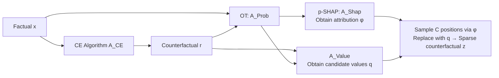

# Joint Distribution–Informed Shapley Values for Sparse Counterfactual Explanations

**Conference**: ICLR 2026  
**OpenReview**: [https://openreview.net/forum?id=3vIe5pNiUN](https://openreview.net/forum?id=3vIe5pNiUN)  
**Code**: [https://github.com/youlei202/XAI-COLA](https://github.com/youlei202/XAI-COLA)（PyPI: `xai-cola`）  
**Area**: Explainable AI / Feature Attribution / Counterfactual Explanation  
**Keywords**: Counterfactual Explanation, Shapley Value, Optimal Transport, Sparsity, Post-hoc XAI  

## TL;DR
The COLA framework is proposed: it uses Optimal Transport (OT) to find a coupling matrix between factual and counterfactual sets, which then drives Shapley attribution (p-SHAP) to refine any off-the-shelf counterfactual explanations. This approach maintains the target flip effect while modifying only 26–45% of the original features.

## Background & Motivation
**Background**: In Explainable AI, there are two main threads: Feature Attribution (FA, e.g., Shapley values) which identifies "which features are important," and Counterfactual Explanations (CE) which suggest "how to modify inputs to flip a prediction." The former is diagnostic, while the latter is actionable. Hundreds of CE algorithms exist, catering to instance-wise, group, global, or distributional scenarios, with some requiring differentiable models and others serving tree models.

**Limitations of Prior Work**: CE methods generally suffer from "over-modification"—changing more features than necessary to flip a prediction, which reduces the clarity and actionability of the explanation. An intuitive solution is to "run FA first to pick important features and only modify those," but the paper demonstrates that **decoupling** FA and CE is counterproductive: features with high conventional importance do not necessarily align with the path toward the target counterfactual result.

**Key Challenge**: The goal is to find a modification plan with **minimal actions** (sparsity) while maintaining the counterfactual effect, without assuming model structures or being tied to a specific CE generator. This is essentially a combinatorial optimization with $L_0$ sparsity constraints, which is computationally hard even for linear models with $d=1$.

**Goal**: Given a set of factual instances, the objective is to design an action plan that achieves the desired counterfactual result with **minimal feature modifications**, while remaining agnostic to both the model and the CE generator.

**Key Insight**: **Replace random baselines with OT coupling.** The long-standing problem in FA regarding "what reference values to use for missing features" is upgraded from a random background distribution to an optimal alignment between factuals and counterfactuals obtained via OT. This focuses the attention of Shapley attribution on the "most cost-effective modification paths," guiding a greedy selection to discard non-essential features.

## Method

### Overall Architecture
COLA (COunterfactuals with Limited Actions) is a model- and generator-agnostic post-processing framework. It first obtains a counterfactual $r$ using any CE algorithm, then computes a joint distribution $p$ between the factual $x$ and $r$ via OT. This $p$ drives both the Shapley attribution (to determine which features to select) and the value selection (to determine what values to use). Finally, a sparse counterfactual $z$ is refined within a budget of at most $C$ modifications.

### Key Designs

**1. p-SHAP: Unifying "reference values for missing features" as a joint distribution problem.** Classic Shapley attribution must determine what value replaces a feature when it is "absent": B-SHAP uses a single fixed baseline, RB-SHAP uses the expectation of the training set background distribution, and CF-SHAP uses the counterfactual distribution of each instance. The paper unifies these into a set function $v^{(i)}(S)=\mathbb{E}_{r\sim p(r\mid x_i)}\big[f(x_{i,S};r_{F\setminus S})\big]-\mathbb{E}_{r\sim p(r)}[f(r)]$, parameterized by the joint probability $p=A_{\text{Prob}}(x,r)$. As $A_{\text{Prob}}$ takes different forms, p-SHAP gracefully degrades into B-SHAP (deterministic mapping), RB-SHAP (arbitrary distribution independent of CE), or CF-SHAP (known CE distribution), identifying p-SHAP as their true superset.

**2. Using entropy-regularized OT for joint distributions, reinterpreting attribution as a "transport problem."** The core of p-SHAP is using the optimal coupling $p^{OT}$ from OT as the joint distribution rather than a random baseline. It solves $p^{OT}=\arg\min_{p\in\Pi(\mu,\nu)}\sum_{i,j}p_{ij}\lVert x_i-r_j\rVert_2^2+\varepsilon\sum_{i,j}p_{ij}\log\frac{p_{ij}}{\mu_i\nu_j}$, where the first term is the transport cost from factuals to counterfactuals and the second is entropy regularization (accelerated by Sinkhorn). This reinterpret feature attribution as a transport problem that minimizes explanation costs. This is the core distinction from CF-SHAP: $A_{\text{Prob}}$ depends only on the factuals and counterfactuals themselves, remaining independent of the specific CE generation mechanism, thus avoiding noise from different generators.

**3. Dual theoretical guarantees: Cost upper bound + Proximity.** When $f$ satisfies Lipschitz continuity (constant $L$), Theorem 4.1 provides $W_1(f(x),y^*)\le L\sqrt{\sum_{i,j}p^{OT}_{ij}\lVert x_i-r_j\rVert_2^2}\le L\sqrt{\sum_{i,j}p_{ij}\lVert x_i-r_j\rVert_2^2}$, meaning $p^{OT}$ provides the **tightest upper bound** on counterfactual effect violation among all transport plans. This serves as a convex proxy for the NP-hard $L_0$ sparsity problem, directing attribution quality to the most efficient paths. Theorem 4.2 further proves that $v^{(i)}(S)$ equals the causal effect after a *do*-intervention: $\mathbb{E}[f(r)]+v^{(i)}(S)=\mathbb{E}[f(r)\mid do(r_S=x_{i,S})]$. Theorem 5.1 guarantees that the refined result is no further from the factual than the alignment reference: $\lVert z-x\rVert_F\le\lVert q-x\rVert_F$.

**4. COLA Algorithm: Attribution as policy, sampling as action.** After obtaining the attribution matrix $\phi$ (normalized absolute Shapley values), it is used as a probabilistic policy for selecting positions. $C$ pairs of $(i,k)$ are sampled such that $c_{ik}=1$. Simultaneously, $A_{\text{Value}}$ computes a candidate value matrix $q$ from $r$ and $p$ ($A^{\max}$ takes the row with the highest probability, $A^{\text{avg}}$ uses a weighted average). Finally, $x_{ik}$ is replaced by $q_{ik}$ only where $c_{ik}=1$, resulting in the sparse counterfactual $z$. The total complexity is $O(M_{CE})+O(nm\log(1/\varepsilon))+O(ndM_{\text{Shap}})+N$.

## Key Experimental Results

### Experimental Settings
4 binary classification datasets (HELOC / German Credit / Hotel Bookings / COMPAS) $\times$ 5 CE algorithms (DiCE, AReS, GlobeCE, KNN, Discount, covering instance/group/distributional targets) $\times$ 12 classifiers (Bagging, LightGBM, SVM, GP, RBF, XGBoost, DNN, RandomForest, AdaBoost, GradBoost, LR, QDA). A "scenario" is defined as Dataset $\times$ CE Algorithm $\times$ Model. 6 methods are compared, with CF-pOT being the proposed p-SHAP.

### Main Results: Action Minimization (Features modified to reach 80% / 100% counterfactual effect)

| Dataset | Method | 80% Effect #Features | $\lVert z-x\rVert/\lVert r-x\rVert$ | 100% Effect #Features | Ratio |
|---|---|---|---|---|---|
| German Credit | CF-pOT | 1.70(±0.02) | 24.3% | 3.13(±0.03) | 44.9% |
| Hotel Bookings | CF-pOT | 2.50(±0.03) | 14.6% | 4.44(±0.02) | 26.0% |
| COMPAS | CF-pOT | 1.25(±0.03) | 14.8% | 2.45(±0.03) | 30.0% |
| HELOC | CF-pOT | 2.35(±0.03) | 13.4% | 7.745(±0.05) | 44.7% |

Key Observation: **Only CF-pOT (p-SHAP) consistently achieves a 100% counterfactual effect**, while RB-pUni / RB-pOT / CF-pUni / CF-pRnd often fail to reach 80% (marked as "–"). To reach an 80% effect, p-SHAP requires only 13–25% feature modifications.

### Ablation Study (Result II, Figure 3: X-axis modification budget C, Y-axis $D(f(z),y^*)$)

| Comparison Pair | Conclusion |
|---|---|
| RB-pUni/RB-pOT vs others | RB variants (no CE info) are significantly worse → FA must incorporate CE information. |
| CF-pOT vs RB-pOT | The difference is only in $A_{\text{Shap}}$; CF-pOT is superior → OT gains come from factual-counterfactual alignment. |
| CF-pOT vs CF-pUni/CF-pRnd | p-SHAP is significantly superior → CE information alone is insufficient; proper alignment via OT is mandatory. |

### Key Findings
- **Decoupling FA and CE is counterproductive**: Conventional important features may not lie on the path to the target (verified in Result II).
- **OT alignment outperforms "True CE Alignment"**: In Result III, even when compared to CF-pEct (which has exact factual-counterfactual alignment), the OT joint distribution approaches MILP optimality on German Credit, suggesting that eliminating generator-specific noise is beneficial.

## Highlights & Insights
- **Unified Perspective**: Unifies B-/RB-/CF-SHAP into a single framework p-SHAP parameterized by joint distributions, providing a theoretically clean superset.
- **Perspective Shift**: Reinterprets feature attribution as an Optimal Transport problem to minimize explanation costs, providing a principled answer for Shapley baseline selection.
- **Plug-and-Play**: Model- and generator-agnostic, capable of refining any off-the-shelf CE output without retraining or requiring differentiability (available via PyPI).
- **Strong Theory**: Three theorems covering cost upper bounds, *do*-intervention semantics, and proximity guarantees address "why it works," "what it means," and "guaranteed stability."

## Limitations & Future Work
- **Dependency on Upstream CE Quality**: As a post-processing refinement, if the initial $r$ is highly biased, OT alignment cannot fully recover it.
- **Narrow MILP Verification**: Optimality verification (Result III) was only performed on German Credit due to the computational weight of MILP.
- **OT Cost as Convex Proxy**: The theorems bound transport cost, but a gap remains between this and the true discrete $L_0$ objective, bridged here by greedy sampling.
- **Tabular Binary Classification Scope**: Experiments focused on four tabular datasets, leaving higher-dimensional or more complex modalities (image, text) for future work.
- **Hyperparameter Sensitivity**: The impact of choosing entropy regularization $\varepsilon$ and budget $C$ lacks systematic analysis.

## Related Work & Insights
- **Shapley Attribution Lineage**: B-SHAP (Lundberg & Lee 2017), RB-SHAP (SHAP library), CF-SHAP (Albini et al. 2022)—this work subsumes them as special cases of p-SHAP.
- **Counterfactual Explanations**: DiCE, AReS, GlobeCE, KNN-CE, Discount (You et al. 2025) cover various targets; COLA sits atop them for sparsification.
- **Optimal Transport in XAI**: The application of Sinkhorn OT for baseline alignment in feature attribution is a novel use case for OT in model explainability.
- **Insight**: When two explanation tools (FA and CE) have individual weaknesses, joining them with a unified probabilistic coupling is more effective than simple serial concatenation—this "coupling over decoupling" strategy is transferable to other XAI module combinations.

## Rating
- **Novelty**: ⭐⭐⭐⭐ — Introducing OT coupling for Shapley baseline selection and unifying three SHAP variants is a novel and clean perspective, though the components (OT, Shapley, CE) are existing tools.
- **Experimental Thoroughness**: ⭐⭐⭐⭐ — The combination of 4 datasets, 5 CEs, and 12 models is comprehensive, and the ablation study is rigorous; scope is limited by the focus on tabular binary classification.
- **Writing Quality**: ⭐⭐⭐⭐ — Clear motivation, excellent explanation of the unified framework and degradation relationships, and easy-to-understand theorem/algorithm diagrams.
- **Value**: ⭐⭐⭐⭐ — Being plug-and-play, agnostic, and having a PyPI package makes it directly valuable for practical scenarios (credit, healthcare) requiring actionable sparse counterfactuals.

<!-- RELATED:START -->

## Related Papers

- [\[CVPR 2026\] Back to the Feature: Explaining Video Classifiers with Video Counterfactual Explanations](../../CVPR2026/interpretability/back_to_the_feature_explaining_video_classifiers_with_video_counterfactual_expla.md)
- [\[ICML 2025\] DeltaSHAP: Explaining Prediction Evolutions in Online Patient Monitoring with Shapley Values](../../ICML2025/interpretability/deltashap_explaining_prediction_evolutions_in_online_patient_monitoring_with_sha.md)
- [\[ICLR 2026\] PolySHAP: Extending KernelSHAP with Interaction-Informed Polynomial Regression](polyshap_extending_kernelshap_with_interaction-informed_polynomial_regression.md)
- [\[NeurIPS 2025\] SHAP Values via Sparse Fourier Representation](../../NeurIPS2025/interpretability/shap_values_via_sparse_fourier_representation.md)
- [\[CVPR 2026\] MedLIME: A Distribution-Aligned and Evidence-Supported Framework for Medical Saliency Explanations](../../CVPR2026/interpretability/medlime_a_distribution-aligned_and_evidence-supported_framework_for_medical_sali.md)

<!-- RELATED:END -->
