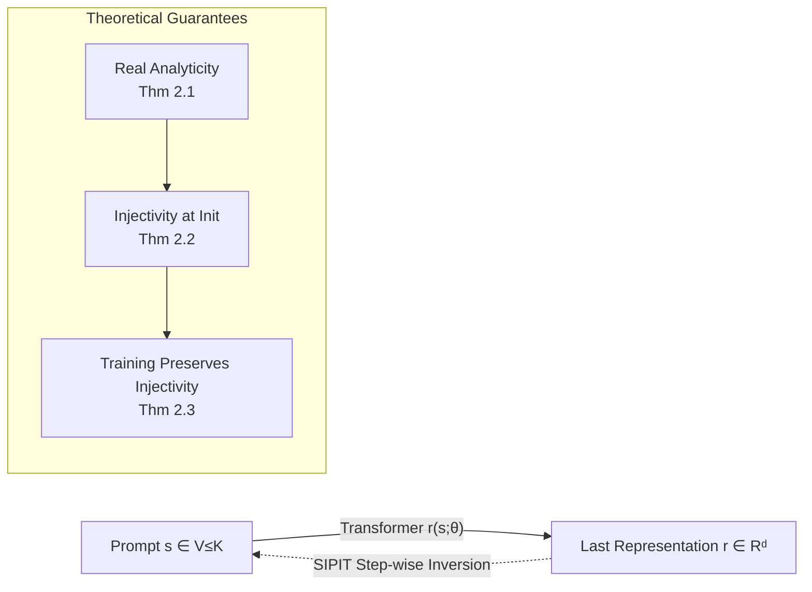

# Language Models are Injective and Hence Invertible

**Conference**: ICLR 2026  
**arXiv**: TBD (OpenReview: [0kHbD6ad07](https://openreview.net/forum?id=0kHbD6ad07))  
**Code**: [github.com/giorgosnikolaou/SIPIT](https://github.com/giorgosnikolaou/SIPIT)  
**Area**: Interpretability / Transformer Theory  
**Keywords**: Injectivity, Invertibility, Real Analytic Functions, Prompt Inversion, SIPIT, Hidden States  

## TL;DR
This paper mathematically proves that decoder-only Transformer language models are almost surely **injective** (different prompts produce different last-token representations). Based on this, the authors propose the SIPIT algorithm, which can **precisely** reconstruct input text from hidden states in linear time.

## Background & Motivation
- **Background**: It is widely assumed that Transformers are "lossy" because they rely on non-linear activations, LayerNorm (which normalizes along sample statistics), and many-to-one attention mechanisms. Intuitively, these components discard information, potentially collapsing different inputs into the same hidden state.
- **Limitations of Prior Work**: This "lossy" intuition raises concerns regarding transparency, robustness, and safe deployment. If the mapping between text and representations is inherently lossy, precise recovery of input from internal states becomes impossible, undermining the foundation of interpretability and probing analysis.
- **Key Challenge**: Individual components (LayerNorm, residual cancellation, attention rank collapse) are indeed non-injective. However, is the **overall "discrete prompt → continuous representation" mapping** also non-injective? This question has remained unanswered rigorously and was treated as an axiom rather than a theorem.
- **Goal**: To replace this "long-held assumption" with a "rigorous theorem" and transform it from theory into an actionable tool (a precise inversion algorithm).
- **Core Idea**: **"Holistic Perspective + Real Analyticity"**—instead of looking at individual components, the entire Transformer is viewed as a real analytic function of parameter $\theta$. The zero set of a real analytic function is either zero everywhere or has measure zero. As long as one set of parameters exists that prevents two prompts from colliding, the collision set must have measure zero, making the mapping injective almost everywhere.

## Method

### Overall Architecture
The paper follows a two-step approach: first, using real analysis tools to prove that "Transformers are almost surely injective" (holds at initialization and is maintained during training); second, converting this existence result into a constructive algorithm, SIPIT, which leverages the **causal structure** of the Transformer to precisely invert the original prompt token by token.

### Key Designs

**1. Foundations in Real Analyticity: Compressing Collision Sets to Zero Measure.** The foundation of the proof is Theorem 2.1: after fixing the embedding dimension $d$ and context length $K$, the mapping $(s,\theta)\mapsto r(s;\theta)\in\mathbb{R}^d$ is **real analytic** with respect to parameter $\theta$. This is because every building block is real analytic: embeddings and projections are polynomials, the softmax in attention consists of exponential functions, LayerNorm with $\varepsilon>0$ uses inverse square roots, and MLPs use analytic activations (tanh/GELU). Real analytic functions are closed under addition, multiplication, division, and composition. The power of this step lies in the "dichotomy" of real analytic functions: they are either identically zero or their zero set has Lebesgue measure zero. Consequently, "collisions" (different prompts producing identical representations) can only occur on a parameter set of measure zero.

**2. Almost Sure Injectivity at Initialization: Only One Counterexample Needed.** Theorem 2.2 establishes injectivity at initialization. For any two different prompts $s\neq s'$, define $h(\theta)=\|r(s;\theta)-r(s';\theta)\|_2^2$, which is real analytic. To exclude the pathological case $h\equiv0$, one only needs to **construct a single set of parameters** where $r(s)\neq r(s')$. If $s,s'$ differ at the last position, the network can be frozen to reduce the last state to "embedding + position," separating them by choosing different rows. If they differ first at an earlier position $i^\star$, an attention head can be tuned to focus almost entirely on $i^\star$, encoding its token into the value, forcing different outputs. Since $h\not\equiv0$, the collision set $\{\theta:h(\theta)=0\}$ has measure zero. Standard initializations (Gaussian/uniform/Xavier) have density, making the probability of sampling such parameters zero.

**3. Training Preserves Injectivity: Gradient Descent as a Volume-Preserving Change of Variables.** Theorem 2.3 shows that training does not destroy injectivity. A single step of GD is a mapping $\phi(\theta)=\theta-\eta\nabla L(\theta)$. Since the network and softmax cross-entropy loss are both real analytic, $\phi$ is real analytic, and its Jacobian determinant $\det D\phi(\theta)$ is real analytic and not identically zero, making $\{\det D\phi=0\}$ measure zero. Elsewhere, by the Inverse Function Theorem, $\phi$ is a locally invertible smooth change of variables—it can stretch or bend the space but **cannot collapse a positive volume region into a lower-dimensional set**. Thus, pushing forward an absolutely continuous distribution through $\phi$ results in another absolutely continuous distribution. By composition, any finite number of GD steps preserves the absolute continuity of the parameter distribution, maintaining injectivity "with probability 1." Corollaries further cover SGD, mini-batches, and pairwise distinguishability of finite prompt sets.

**4. SIPIT: Turning Injectivity into Linear-Time Inversion via Causal Structure.** Injectivity only guarantees that an inverse exists; SIPIT (Sequential Inverse Prompt via ITerative updates) answers how to find it. It leverages the **causality** of the Transformer: the hidden state at position $t$ only depends on the prefix $\langle s_1,\dots,s_{t-1}\rangle$ and the current token $s_t$. When the prefix is known, the observed $\hat h_t$ uniquely determines $s_t$. By appending each candidate token $v_j$ to the prefix and calculating $h_t(\pi\oplus v_j)$, the correct token is the one falling within an $\varepsilon$-ball of the observed state. Iterating token by token (using random or gradient-guided candidate strategies) reconstructs the entire sequence. Theorem 3.1 guarantees precise recovery in at most $T|V|$ steps with probability 1 (linear time). Theorem 3.2 provides **robustness**: as long as the perturbation per step satisfies $\|e_t\|_2<\Delta_{\pi_t,t}/2$ (where $\Delta$ is the minimum distance between adjacent candidate representations), precise recovery remains possible, explaining robustness to quantization noise.

## Key Experimental Results

### Main Results: Searching for Collisions (§4.1)
Sampling 100,000 prompts from wikipedia-en / C4 / The Pile / python-github-code highlights, approximately **5 billion** pairwise comparisons across 6 SOTA models and all layers **failed to find any collisions**. The minimum $\ell_2$ distance of the last-token representation was significantly higher than the collision threshold $10^{-6}$:

| Model | layer 1 | layer L/2 | layer L |
|---|---|---|---|
| Llama-3.1-8B | 0.001 | 0.129 | 0.620 |
| Mistral-7B-v0.1 | 0.002 | 0.187 | 1.274 |
| Phi-4-mini-instruct | 0.014 | 1.336 | 9.020 |
| TinyStories-33M | 0.029 | 1.434 | 2.793 |

Distance increases with depth. Exhaustive collision tests on the "10 closest prefixes" involving over **343 billion** candidate pairs per model still yielded no collisions.

### Main Results: Inversion Experiments (§4.2, GPT-2 Small, 20 tokens per sequence)

| Method | Avg Time (s) | Accuracy |
|---|---|---|
| HARDPROMPTS | 6132.59 ± 104.61 | 0.00 |
| BRUTEFORCE (Ours) | 3889.61 ± 691.17 | 1.00 |
| **SIPIT (Ours)** | **28.01 ± 35.87** | **1.00** |

### Robustness and Vocabulary Scaling (FP4 Quantized Models)

| Model | Vocab | Accuracy | Explored Vocab % |
|---|---|---|---|
| Mistral-7B-v0.1 | 32000 | 100% | 0.19 ± 0.08 % |
| Llama-3.1-8B | 128255 | 100% | 0.21 ± 0.10 % |

### Key Findings
- **Quantization does not destroy injectivity; it widens the gap**: The minimum distance in FP4/INT8 quantization is more than double that of FP32, and large models (14B/70B) maintain clear margins.
- SIPIT achieves 100% recovery by exploring **<0.22%** of the vocabulary on average. This ratio remains nearly constant across vocabulary sizes, empirically confirming linear scaling.
- Inversion time increases only slightly with layer depth (shallower layers require more iterations, while deeper layers have richer information; the two effects cancel out).

## Highlights & Insights
- **Debunking Intuition**: Using a simple real analysis dichotomy (measure-zero zero sets of real analytic functions), the authors replace the long-held assumption that "Transformers are lossy" with a theorem stating they are "almost everywhere lossless." This holds for **finite width, finite depth, and finite training steps**, rather than just asymptotic idealizations.
- **Existence → Constructivity**: Injectivity proofs only guarantee that an inverse is possible. This paper goes further by using causal structures to introduce SIPIT, turning abstract invertibility into a runnable, provable, linear-time tool.
- **Pinpointing Potential Collisions**: The theory characterizes how one might "deliberately" create collisions—through quantization, weight tying (shared embeddings for two tokens), or non-analytic activations—implying that in standard pipelines, the collision probability is zero.
- **Author order was decided by Mario Kart**, a rare easter egg in the paper.

## Limitations & Future Work
- **Incomplete Threat Model**: SIPIT assumes access to hidden states at **all positions** of a layer (e.g., leaked KV-caches, shared inference pipelines, or APIs exposing intermediate representations). Efficient inversion from only a single final embedding is theoretically possible but left for future work.
- **Artificially Constructible Failure Cases**: An adversary could manually create collisions by assigning identical embeddings to two tokens or making positional encodings exactly equal while suppressing other signals. Injectivity is "almost sure," not "absolute."
- **Exhaustive Search is Infeasible**: Since the number of prompts grows exponentially with sequence length, a true full-space search is impossible. Experiments use controlled exhaustive approximations.
- **Privacy Double-Edged Sword**: While invertibility is good for interpretability, it implies that leaked hidden states are equivalent to leaked plaintext, imposing new requirements for secure deployment.

## Related Work & Insights
- **Non-injectivity of Transformer Components**: LayerNorm collapses along sample statistics (Ba 2016), pure attention stacks suffer from rank collapse (Dong 2021), and softmax creates bottlenecks (Yang 2018). The key pivot in this work is shifting the perspective from "component functions on $\mathbb{R}^d$" to the "discrete prompt → continuous representation" mapping, which is the true object of injectivity.
- **Language Model Inversion**: HARDPROMPTS (Wen 2023) uses gradients for approximate prompt discovery. Morris 2023 and Nazir 2025 train auxiliary inverters using logprob/logit sequences under black-box settings, providing approximate outputs without precision guarantees. SIPIT is complementary: **white-box, training-agnostic, and capable of precise inversion from hidden states**.
- **Insight**: Real analyticity + the zero-set dichotomy are powerful tools for analyzing neural network structural properties. This framework could potentially be extended to questions like "Are encoder Transformers injective?" or "Are diffusion model latent spaces invertible?"

## Rating
- **Novelty**: ⭐⭐⭐⭐⭐ Completely debunks the default "lossiness" axiom and replaces it with a rigorous theorem. The shift in perspective (component vs. holistic, $\mathbb{R}^d$ vs. discrete-to-continuous) is elegant.
- **Experimental Thoroughness**: ⭐⭐⭐⭐ Includes 6 models and over 5 billion (with 343 billion exhaustive) pairwise comparisons. Covers quantization and large models well. Slightly limited by only using GPT-2 Small for the systematic SIPIT inversion breakdown.
- **Writing Quality**: ⭐⭐⭐⭐⭐ Follows a logical progression from theorem to proof sketch to intuitive explanation. Figures (real analytic zero sets, collision box plots) are clear and highly readable.
- **Value**: ⭐⭐⭐⭐⭐ Provides a solid foundation of "lossless representations" for interpretability, probing, and causal analysis while sounding a serious alarm for privacy and security. High theoretical and engineering impact.

<!-- RELATED:START -->

## Related Papers

- [\[ICLR 2026\] Inducing Dyslexia in Vision Language Models](inducing_dyslexia_in_vision_language_models.md)
- [\[ICLR 2026\] On the Predictive Power of Representation Dispersion in Language Models](on_the_predictive_power_of_representation_dispersion_in_language_models.md)
- [\[ICLR 2026\] Learning to Interpret Weight Differences in Language Models](learning_to_interpret_weight_differences_in_language_models.md)
- [\[ICLR 2026\] Latent Concept Disentanglement in Transformer-based Language Models](latent_concept_disentanglement_in_transformer-based_language_models.md)
- [\[ICLR 2026\] Language Models Use Lookbacks to Track Beliefs](language_models_use_lookbacks_to_track_beliefs.md)

<!-- RELATED:END -->
