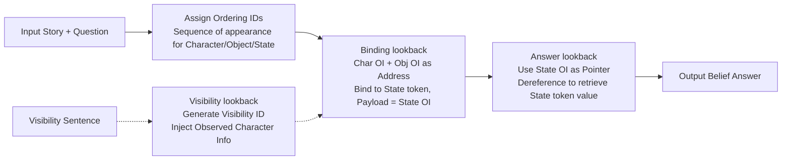

# Language Models Use Lookbacks to Track Beliefs

**Conference**: ICLR 2026  
**OpenReview**: [https://openreview.net/forum?id=6gO6KTRMpG](https://openreview.net/forum?id=6gO6KTRMpG)  
**Code**: [https://belief.baulab.info](https://belief.baulab.info)  
**Area**: Mechanistic Interpretability / Theory of Mind  
**Keywords**: Belief Tracking, Theory of Mind, Mechanistic Interpretability, Causal Mediation Analysis, Causal Abstraction, Variable Binding, Lookback Mechanism  

## TL;DR
Using causal mediation and causal abstraction, this paper reverse-engineers a universal "lookback mechanism" that large language models (LLMs) rely on to track character beliefs (Theory of Mind). The model copies reference information into "pointers" and "addresses" at different tokens, retrieving "payloads" via QK-attention lookbacks to achieve character-object-state binding, belief retrieval, and visibility updates.

## Background & Motivation
- **Background**: Numerous studies have shown that LMs perform well on certain Theory of Mind (ToM) tasks (e.g., the Sally-Anne false belief test). However, most research remains at the **behavioral level**, evaluating accuracy without revealing the internal computations used to represent and manipulate "mental states."
- **Limitations of Prior Work**: Existing ToM datasets are designed for behavioral testing and lack the **counterfactual pairs** necessary for causal analysis (e.g., activation patching to locate information flow). Furthermore, interpretability work has often stopped at showing that beliefs can be decoded via linear probes without providing an end-to-end **mechanism**.
- **Key Challenge**: Does the model learn a **systematic, generalizable algorithm** to track conflicting beliefs, or does it rely on surface statistical associations? Behavioral evaluation cannot answer this.
- **Goal**: Reverse-engineer the internal computations of Llama-3-70B / Llama-3.1-405B / Qwen2.5-14B when tracking character beliefs and verify the existence of a high-level algorithm confirmed by causal intervention.
- **Core Idea**: **[Mechanism Discovery]** Propose and verify a recurring computational pattern—the **lookback mechanism**. Source reference information is copied into an "address" and a "pointer." The address is placed at an earlier "recalled token," while the pointer is at a later "lookback token." The latter uses QK-attention to look back at the former, dereferencing the pointer to retrieve a "payload." Belief tracking is completed by a cascade of three lookbacks (Binding / Answer / Visibility).

## Method

### Overall Architecture
The authors first construct the **CausalToM** dataset for causal analysis (two characters acting on objects with variable mutual visibility). They use **causal mediation analysis** for coarse-grained localization of information flow, then propose a high-level causal model independent of Transformer details via **causal abstraction**. Finally, through **targeted interchange interventions**, they align variables of the causal model to specific tokens and layers in the LM residual stream, quantifying the alignment with IIA (Interchange Intervention Accuracy). The mechanism consists of three chained lookbacks.

### Key Designs

**1. Lookback Mechanism: Conditional retrieval using "Pointer-Address-Payload" rather than direct transport.** This is the core abstraction and differenciates lookback from induction heads. Source reference information is copied via attention into two parts: an **address** remaining in the residual stream of an earlier **recalled token** (alongside a **payload**), and a **pointer** moved to the residual stream of a later **lookback token**. When the model needs this information, the pointer forms the Query vector at the lookback token, and the address forms the Key vector at the recalled token. Their dot product is high after $W_Q$ and $W_K$ transformations, establishing a QK-circuit bridge. The model moves the payload via the OV-circuit to the lookback token. Pointers and addresses **need not be exact copies** of the source; they only need high alignment after transformation. This differs from induction heads, which only pass information to the immediate next token without copying. The intuition is that LMs, processing text sequentially without knowing future questions, "pre-address" key information so that pointers can later dereference it.

**2. Binding Lookback: Linking character-object-state triplets via Ordering IDs.** The model assigns an **Ordering ID (OI)**—a low-rank subspace representation indicating sequence (e.g., Bob=OI₁, Carla=OI₂)—to each character/object/state. It then moves **address copies** of the Character OI and Object OI to the residual stream of the corresponding **state token**, co-locating them with the State OI (payload). This binds the triplet. When a question asks about a belief, the model constructs **pointer copies** of the character and object OIs at the final token, dereferencing them to retrieve the correct **State OI**. Causal experiments show: swapping addresses and payloads at state tokens (layers 33–38) flips the output; swapping source references at character/object tokens while freezing state tokens (layers 20–34) also flips the output.

**3. Answer Lookback: Using State OI as a pointer to retrieve the actual state word.** The binding lookback retrieves a state "index" (State OI), not the answer text. The answer lookback treats the State OI as a pointer: the **address copy** of State OI stays at the state token (bound to the **state word itself** as payload), while its **pointer copy** moves to the final token via the binding lookback. The model dereferences this pointer to retrieve the word value (e.g., "coffee"). A strong counter-intuitive proof: injecting a counterfactual "answer pointer" (layers 34–52) produces a **third value** (e.g., "beer") that is neither the original nor the counterfactual, confirming the model "retrieves via pointer" rather than "copying word values." Swapping the "answer payload" (after layer 56) directly outputs the counterfactual answer. This locates the answer lookback at layers 52–56.

**4. Visibility Lookback: Injecting observed character info into the observer's belief via Visibility ID.** When a story states whether "Character A can/cannot see Character B," the model generates a **Visibility ID** at that sentence. Its address copy stays in the visibility sentence residual stream, and its pointer copy moves to subsequent tokens. The model dereferences this pointer via a QK-circuit to retrieve a payload (preliminary evidence suggests the payload is the **observed character's OI**), merging the observed's knowledge into the observer's belief state. Causal experiments using visibility-flip counterfactuals align the source reference (layers 10–23), the payload (after layer 31), and simultaneous address+pointer interventions (significant alignment only at layers 24–31, as single-end intervention causes mismatch).

## Key Experimental Results

### Main Results: Layer Localization of Causal Model Variables (IIA)

| Lookback / Variable | Token Location | Layer Range | Key Phenomenon |
|---|---|---|---|
| Answer Payload (Word Value) | Final token ":" | After Layer 56 | Swap payload → Counterfactual answer (tea) |
| Answer Pointer (State OI) | Final token ":" | Layers 34–52 | Swap pointer → Third value (beer, neither original nor counterfactual) |
| Binding Address + Payload | State token | Layers 33–38 | Swap → Output flips to other state |
| Binding Source Reference | Char/Obj token | Layers 20–34 | Swap with state tokens frozen → Output flips |
| Visibility Source (Visibility ID)| Visibility sentence| Layers 10–23 | Flip visibility → "unknown" becomes visible answer |
| Visibility Address + Pointer | Sentence + Q&A token| Layers 24–31 | Significant alignment only when both ends are intervened |

Experiments were conducted on **n = 80** samples where the model answered correctly. IIA reports results for both "full residual stream" and "identified low-rank subspace" interventions, with subspace dimensions as low as 14–167 sufficient to carry the variables.

### Key Findings
- **End-to-End Timeline**: Belief tracking starts at layers 20–34 (OI encoding) → Layers 33–38 (OI transfer to state token) → Layer 34 (Pointer copy to final token and dereferencing for State OI) → Layers 34–52 State OI residence → Layers 52–56 dereferencing for answer word.
- **Subspace Localization**: Each high-level variable can be mapped to a low-dimensional subspace (using sparse binary masks learned via Desiderata-based Component Masking), suggesting these algorithmic variables are **linearly separable** real representations rather than imposed interpretations.
- **Cross-Model/Dataset Generalization**: The same lookback mechanism is replicated in Qwen2.5-14B and Llama-3.1-405B (Appendix N) and generalizes to the BigToM dataset (Appendix M).
- **Mechanism Generalizability**: Lookbacks serve more than just ToM; they appear to be a foundational universal computation for **in-context reasoning and variable binding**.

## Highlights & Insights
- **Reducing "Belief" to Intervenable Algorithms**: Moves beyond "beliefs can be decoded" to providing a complete algorithmic path from input to output that is counterfactually verifiable.
- **"Third Value" Evidence**: The phenomenon where swapping the answer pointer produces a value that is neither the original nor the counterfactual is strong causal evidence for "retrieval by pointer," which is much more robust than simple probe correlation.
- **Clear Distinction from Induction Heads**: Explicitly defines the difference (bi-directional copying of information), identifying lookback as a distinct mechanism.
- **Methodological Model**: The progression of causal mediation (locating "where"), causal abstraction (locating "what"), and subspace masking (locating "which direction") provides a reusable paradigm for studying variable binding.

## Limitations & Future Work
- **Highly Controlled Tasks**: CausalToM is simplified (2 characters, 2 objects, single-level visibility). Whether lookbacks organize more complex ToM (multi-character, nested beliefs) remains to be verified.
- **Visibility Payload Semantics**: In a two-character setup, the exact semantics of the visibility lookback payload are hard to determine; "payload ≈ observed character OI" is only preliminary evidence.
- **Dependence on Correct Samples**: Analysis is based on 80 samples where the model succeeded; the mechanisms behind **failure cases** (why the model miscalculates beliefs) are not characterized.
- **Prospects**: Using lookback as a general primitive for in-context reasoning to explain broader tasks like entity tracking and multi-hop reasoning, and investigating how this mechanism emerges during training (echoing segmented emergence of variable binding in Wu et al. 2025).

## Related Work & Insights
- **ToM Behavioral Evaluation** (Kosinski 2024, Strachan 2024): Established benchmarks for "Can LMs do ToM?" but lacked mechanism. This paper uses CausalToM to provide the "how."
- **Entity Tracking / Variable Binding**: Li et al. 2021 (decodable entity states), Prakash et al. 2024 (attribute tracking by position), Feng & Steinhardt 2023 (Binding ID), and Dai et al. 2024 (Ordering ID) form the technical foundation. This paper chains these primitives into end-to-end ToM.
- **Mechanistic ToM Interpretability**: Zhu et al. 2024, Herrmann & Levinstein 2024, and Bortoletto et al. 2024 showed beliefs are linear and intervenable but did not reveal how they are used to solve tasks.
- **Insight**: The "pre-addressing and on-demand dereferencing" logic of lookbacks can be applied to any task requiring information storage and retrieval, offering a powerful lens for studying the internal addressing of in-context learning.

## Rating
- **Novelty**: ⭐⭐⭐⭐⭐ First to reduce ToM belief tracking to a causally verifiable universal lookback algorithm, distinctly separated from induction heads.
- **Experimental Thoroughness**: ⭐⭐⭐⭐ Solid three-tier causal localization, cross-model/dataset generalization, and subspace validation; however, task simplification and lack of failure analysis leave some room.
- **Writing Quality**: ⭐⭐⭐⭐⭐ Clear abstractions (pointer/address/payload), excellent diagrams, and compelling explanations of evidence like the "third value."
- **Value**: ⭐⭐⭐⭐⭐ Deepens ToM understanding and extracts a fundamental mechanism for in-context reasoning with reusable methodologies.

<!-- RELATED:START -->

## Related Papers

- [\[ICLR 2026\] Mixing Mechanisms: How Language Models Retrieve Bound Entities In-Context](mixing_mechanisms_how_language_models_retrieve_bound_entities_in-context.md)
- [\[ICLR 2026\] Latent Concept Disentanglement in Transformer-based Language Models](latent_concept_disentanglement_in_transformer-based_language_models.md)
- [\[ICLR 2026\] Linear Mechanisms for Spatiotemporal Reasoning in Vision Language Models](linear_mechanisms_for_spatiotemporal_reasoning_in_vision_language_models.md)
- [\[ICLR 2026\] Medical Interpretability and Knowledge Maps of Large Language Models](medical_interpretability_and_knowledge_maps_of_large_language_models.md)
- [\[ICLR 2026\] Inducing Dyslexia in Vision Language Models](inducing_dyslexia_in_vision_language_models.md)

<!-- RELATED:END -->
