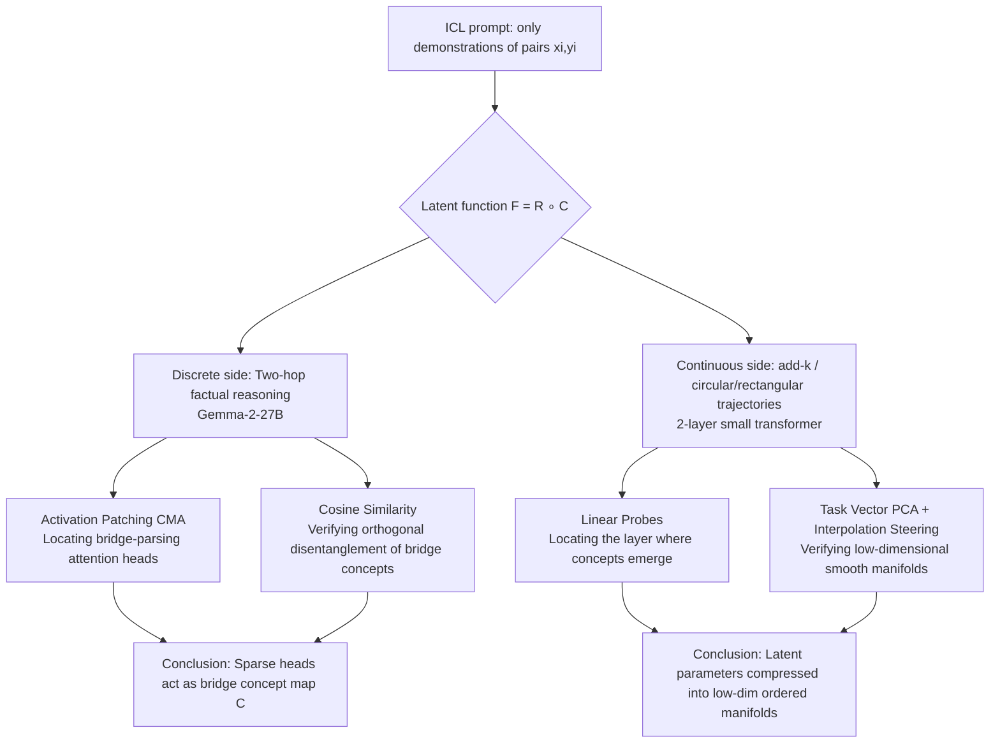

# Latent Concept Disentanglement in Transformer-based Language Models

**Conference**: ICLR 2026  
**OpenReview**: [https://openreview.net/forum?id=k3SEVOW2Dg](https://openreview.net/forum?id=k3SEVOW2Dg)  
**Code**: Not released  
**Area**: Interpretability / Mechanistic Interpretability  
**Keywords**: in-context learning, mechanistic interpretability, latent variables, task vectors, activation patching, concept composition  

## TL;DR
This paper uses mechanistic interpretability methods to demonstrate that transformers explicitly disentangle latent "concepts" within demonstrations during in-context learning. In discrete world-knowledge tasks, a small cluster of attention heads first parses a hidden "bridge entity" before composing the answer. In continuous numerical tasks, latent parameters are compressed onto low-dimensional smooth manifolds that are susceptible to linear interpolation and causal intervention.

## Background & Motivation
**Background**: LLMs generalize across new tasks with just a few demonstrations (in-context learning, ICL), suggesting they internally infer "latent concepts/rules" not explicitly stated in the prompt. Prior work (task vectors, function vectors, Linear Representation Hypothesis - LRH) found that input-output relations in ICL could be compressed into sparse vector directions, but most studies focused on single-step, simple tasks (Country→Capital, antonyms, capitalization) and only the "existence" of high-level task vectors.

**Limitations of Prior Work**: When tasks involve more complex latent structures—such as multi-hop reasoning or continuous numerical latent variables—it remains unclear whether transformers take "shortcuts" directly from input to output or actually construct and compose intermediate concepts within hidden activations. Mechanistic evidence regarding "whether models disentangle latent concepts" and "what these concepts look like in the representation space" is currently lacking.

**Key Challenge**: High accuracy can stem from either shortcut-style memory mapping or structured concept composition; accuracy alone cannot distinguish between the two. Locating concepts, verifying their reusability, and characterizing their geometric structure in real large models requires an experimental design that is controllable enough for causal experiments while reflecting real-world phenomena.

**Goal**: To mechanistically answer if and how transformers represent and utilize latent concepts using a set of clean and controllable ICL tasks, covering both "discrete world knowledge" and "continuous numerical parameters."

**Core Idea**: Explicitly decompose the latent function as $F = R \circ C$ — where $C$ maps inputs to a low-dimensional "concept space" and $R$ refines these concepts into outputs. Then, use a four-part toolkit of **activation patching + correlation analysis + linear probes + task vector interpolation** to locate $C$ and test its transferability and geometry on pretrained Gemma-2 and small transformers trained from scratch.

## Method

### Overall Architecture
The paper does not propose a new model but uses a unified "latent concept map $C$" perspective to design two types of ICL probing tasks, providing both causal and correlational evidence for each. For discrete tasks, pretrained Gemma-2-27B is used for two-hop factual reasoning, with activation patching locating attention heads responsible for parsing "bridge entities." For continuous tasks, 2-layer 1-head small transformers are trained for tasks like add-k, circular trajectories, and rectangular trajectories, with linear probes, task vector PCA, and interpolation steering revealing the low-dimensional geometry of latent parameters.

### Key Designs

**1. Two-hop "Source→Target" tasks + Bridge hypothesis collision: Turning "Shortcut vs. True Two-Hop" into a falsifiable problem.** The paper constructs factual ICL puzzles $\{(S_i, r_1, B_i, r_2, T_i)\}$, such as "Sydney, Canberra. Nantes, Paris. Oshawa," where the bridge entity (the country) never appears in the prompt. This pits two hypotheses against each other: Hypothesis 1 (Shortcut theory) suggests the model maps input directly to answer, while Hypothesis 2 (Latent Two-Hop theory) suggests it first resolves a bridge concept (e.g., "Canada") before refining it into the output ("Capital of Canada"). A "type-correction" evaluation is designed: pairing a normal prompt [City→Capital] with an alternative prompt [Landmark→Calling Code]. If a component represents the abstract bridge concept map $C$, its activation should **transfer across source/target types**. Patching it should cause the answer to shift from Washington to Beijing (changing the bridge from USA to China while maintaining the output type as Capital), rather than degrading to the literal alternative answer "86."

**2. Causal Mediation Analysis (CMA / Activation Patching) to locate sparse "bridge-parsing heads."** Formally, given normal/alternative prompts, attention head activations $(a^{(\text{norm})}_{\ell,h}, a^{(\text{alt})}_{\ell,h})$ are cached. In a normal forward pass, specific activations are replaced with alternative ones to measure causal effects on logit difference and answer rank. For Gemma-2-27B's grouped-query attention, patching heads in groups of 2 proved more effective. Results show that group (24,30;31) has a dominant causal effect: in [University, Code]→[City, Capital] experiments, patching this group moved type-corrected answers into the top 10 for over 73% of samples and top 1 for over 40% (where the original rank was in the hundreds or thousands). This localizes "bridge parsing" to specific sparse heads.

**3. Cosine similarity to verify orthogonal disentanglement of bridge concepts.** Causal evidence is supplemented by visualizing output embeddings of head group (24,30;31) at the last token. Using 120 prompts across 12 bridge-source-target combinations, embeddings showed strong clustering by bridge value and near-orthogonality across different bridges, regardless of source/target types. This confirms that bridge concept representations are cohesive and low-dimensional, marking the latent concept map $C$. The paper also notes that more ICL examples strengthen disentanglement and causal importance, and that 2B models exhibit a "noisy" version of this mechanism compared to 27B.

**4. Task vector geometry + Interpolation steering for numerical tasks.** For small transformers trained from scratch, linear probes detect where concepts emerge. In add-k tasks, the task type is disentangled at layer-2 attention, while outputs are computed in the layer-2 MLP. PCA on these task vectors reveals that add-k vectors lie on a 1D line (PC1 explaining >99.9% variance), with offset $k$ ordered linearly. Circular trajectory tasks lie on a 2D smooth manifold (PC1-2 explaining 93–97% variance) with radius order. Critically, causal interpolation—steering the model with $(1-\beta)t_1 + \beta t_K$—accurately moves the output toward the interpolated target offset $(1-\beta)k_1 + \beta k_K$ (target top-3 accuracy ≈ 100%). This proves layer-2 attention heads serve as concept map $C$, preserving the geometry and ordering of latent variables.

## Key Experimental Results

### Main Results (Discrete Two-Hop, Gemma-2-27B)

| Experiment | Setup | Key Result |
|-----------|-------|------------|
| Baseline Accuracy | Source→Target 2-hop ICL | Harder than 1-hop; requires more examples; high accuracy at 20-shot |
| Bridge Head Patching | [University,Code]→[City,Capital] | Patching (24,30;31) moves ≥73% samples to top-10, >40% to top-1 |
| Bridge Orthogonality | 120 prompts × 12 combinations | Embeddings cluster by bridge; orthogonal across bridges; type-agnostic |

### Numerical Tasks (2-layer 1-head Small Transformer)

| Task | Task Vector Geometry | Variance Explained | Steering Results |
|------|----------------------|--------------------|------------------|
| add-k | 1D Line, ordered k | PC1 >99.9% | Interpolation target top-3 ≈ 100% |
| Circular-Trajectory | 2D Smooth Manifold, ordered radius | PC 1-2 93.68%–97.05% | Lowest MSE for target radius |
| Rectangular-Trajectory| 2D Manifold (orthogonal lengths) | PC 1-2 dominant | Smooth interpolation of shapes |

### Key Findings
- **Scale determines disentanglement**: The 2B model possesses only a noisy version of the 27B bridge-parsing circuit; larger models show stronger disentanglement/composition.
- **More examples strengthen disentanglement**: Increasing ICL examples improves both the causal importance of bridge heads and the angular separability of bridge embeddings.
- **Natural prompt transfer**: Injecting learned concept embeddings into open-ended generation coherently steers results toward target countries/entities while maintaining fluency.
- **Two-stage circuit division**: Shallow attention heads parse intermediate bridge concepts, while deeper heads and MLPs ground abstract bridges into concrete outputs, validating the $F=R\circ C$ hierarchy.
- **Cross-dataset reuse**: The bridge-parsing mechanism appears in different datasets (e.g., "Company" names), and the driving attention heads overlap, showing this is not a dataset-specific artifact.
- **Isomorphism between task types**: Whether latent concepts are discrete world entities or continuous numerical parameters, models favor sparse components and low-dimensional ordered representations.

## Highlights & Insights
- **Turning "Shortcut vs. Real Reasoning" into a falsifiable causal experiment**: The "type-corrected answer" metric cleanly isolates intermediate concepts from literal answers, avoiding the ambiguity of simple logit difference measurements.
- **Triple evidence chain**: Combining causal patching, correlation similarity, and geometric PCA/interpolation provides a much more robust conclusion than any single method.
- **New evidence for the Linear Representation Hypothesis (LRH)**: While prior LRH work focused on discrete directions, this work demonstrates that latent parameters are encoded continuously and orderly, advancing LRH into a continuous spectrum.
- **Clean causation in controlled models**: Training from scratch proves that the geometric structure of task vectors originates purely from task requirements rather than pretraining noise.
- **Balanced task design**: The tasks are controlled enough for circuit-level analysis yet evocative of the general hypothesis that models internalize and utilize latent task structures.

## Limitations & Future Work
- **Highly controlled and simple tasks**: Geographical, company, and numerical puzzles are synthetic; verifying whether these findings extrapolate to complex real-world multi-hop reasoning is necessary.
- **Preliminary evidence for natural prompt transfer**: Steering open-ended generation was only tested on a small scale without comprehensive quantitative evaluation.
- **Empirical localization**: The findings regarding specific sparse heads or layer emergence are specific to the tested models and datasets.
- **Lack of theoretical characterization**: The paper does not provide a formal proof for why low-dimensional manifolds form or how scale quantitatively affects disentanglement.
- **Engineering trade-offs in patching**: Intervening on head groups due to grouped-query attention limits the granularity of single-head attribution.

## Related Work & Insights
- **Mechanistic Interpretability of ICL** (Olsson's induction heads, Todd/Hendel's task/function vectors): This work advances the field from single-step tasks to two-hop bridge tasks and continuous parametrization.
- **Linear Representation Hypothesis (LRH)** (Park et al.): Adds evidence for smooth, interpolatable encoding of continuous latent parameters alongside discrete concept directions.
- **Task/Function Vectors** (Liu, Merullo, Hu et al.): Goes beyond the existence of task vectors to decompose how models disentangle and compose sub-concepts for execution.
- **Multi-hop Fact Recall**: This provides a systematized ICL version of multi-hop recall where relations are inferred on-the-fly from demonstrations rather than hard-coded knowledge.
- **Rating**: 
    - Novelty: ⭐⭐⭐⭐ (Decomposition of $F=R\circ C$ and evidence for continuous manifolds).
    - Experimental Thoroughness: ⭐⭐⭐⭐ (Coverage across scales and task types, multi-modal verification).
    - Writing Quality: ⭐⭐⭐⭐ (Clear hypothesis testing and logical flow).
    - Value: ⭐⭐⭐⭐ (Provides a reusable paradigm for studying complex reasoning mechanisms).

<!-- RELATED:START -->

## Related Papers

- [\[ICLR 2026\] Hedonic Neurons: A Mechanistic Mapping of Latent Coalitions in Transformer MLPs](hedonic_neurons_a_mechanistic_mapping_of_latent_coalitions_in_transformer_mlps.md)
- [\[ICLR 2026\] Noise Stability of Transformer Models](noise_stability_of_transformer_models.md)
- [\[ICLR 2026\] Latent Thinking Optimization: Your Latent Reasoning Language Model Secretly Encodes Reward Signals in Its Latent Thoughts](latent_thinking_optimization_your_latent_reasoning_language_model_secretly_encod.md)
- [\[ICLR 2026\] Emotions Where Art Thou: Understanding and Characterizing the Emotional Latent Space of Large Language Models](emotions_where_art_thou_understanding_and_characterizing_the_emotional_latent_sp.md)
- [\[ICLR 2026\] Medical Interpretability and Knowledge Maps of Large Language Models](medical_interpretability_and_knowledge_maps_of_large_language_models.md)

<!-- RELATED:END -->
